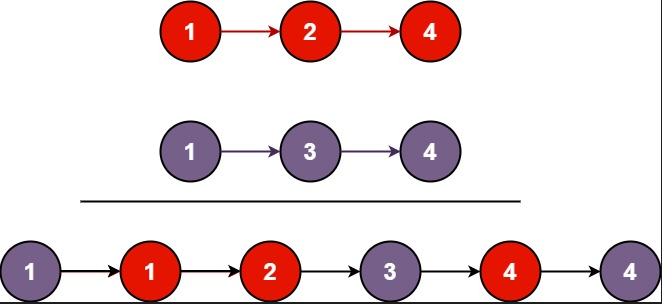
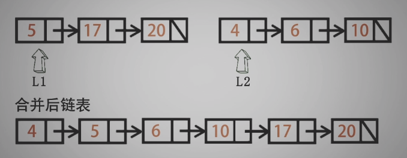
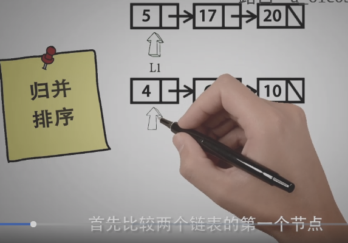
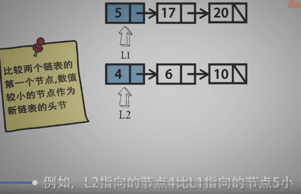
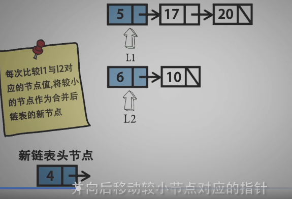
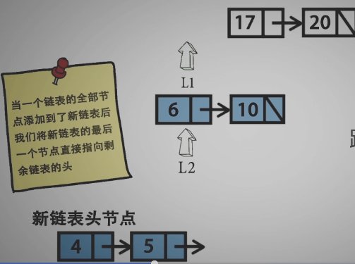
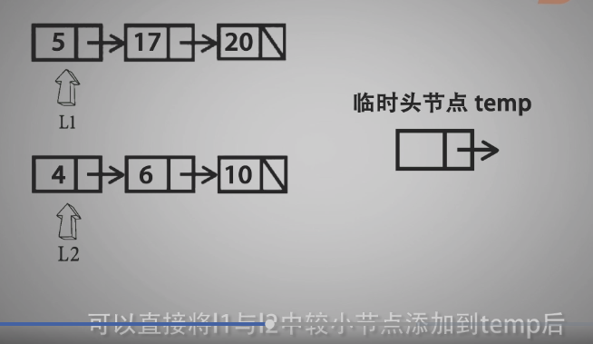
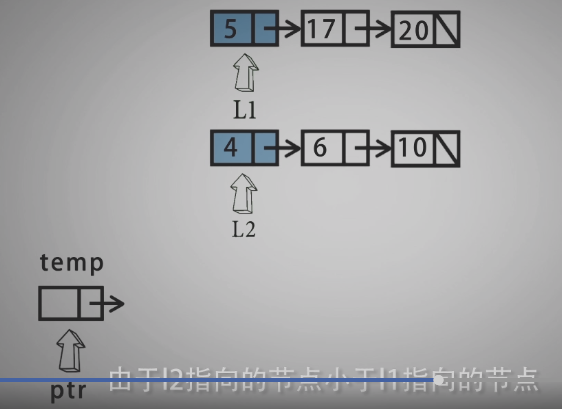

<!--
 * @Date: 2021-12-22 14:45:56
 * @Author: bFeng
-->
合并两个有序链表  
Category	Difficulty	Likes	Dislikes  
algorithms	Easy (66.70%)	2106	-  
Tags  
Companies  
将两个升序链表合并为一个新的 升序 链表并返回。新链表是通过拼接给定的两个链表的所有节点组成的。   

 

示例 1：  

  


输入：l1 = [1,2,4], l2 = [1,3,4]  
输出：[1,1,2,3,4,4]  
示例 2：  

输入：l1 = [], l2 = []  
输出：[]  
示例 3：  

输入：l1 = [], l2 = [0]  
输出：[0]  
 

提示：

两个链表的节点数目范围是 [0, 50]  
-100 <= Node.val <= 100  
l1 和 l2 均按 非递减顺序 排列  
Discussion | Solution  

------------------------------------




- 归并排序














```c
/*
 * @Date: 2021-12-22 14:45:03
 * @Author: bFeng
 */
/*
 * @lc app=leetcode.cn id=21 lang=cpp
 *
 * [21] 合并两个有序链表
 */

// @lc code=start
/**
 * Definition for singly-linked list.
 * struct ListNode {
 *     int val;
 *     ListNode *next;
 *     ListNode() : val(0), next(nullptr) {}
 *     ListNode(int x) : val(x), next(nullptr) {}
 *     ListNode(int x, ListNode *next) : val(x), next(next) {}
 * };
 */
class Solution {
public:
    ListNode* mergeTwoLists(ListNode* list1, ListNode* list2) {
        if(list1 == nullptr) return list2;
        if(list2 == nullptr) return list1;

        ListNode res; // 使用临时节点
        ListNode* res_ptr = &res;

        while(list1 || list2){
            // 遍历完其中一个，另一个直接交管
            if(list1 == nullptr){
                res_ptr->next = list2;
                return res.next;
            }
            if(list2 == nullptr){
                res_ptr->next = list1;
                return res.next;
            }
            // 对每一个比较大小， 进行赋值
            if(list1->val < list2->val){
                res_ptr->next = list1;
                list1 = list1->next;
                res_ptr = res_ptr->next;
            }else{
                res_ptr->next = list2;
                list2 = list2->next;
                res_ptr = res_ptr->next;
            }
        }
    return res.next;
    }
};
// @lc code=end


```