<!--
 * @Date: 2021-12-27 15:36:59
 * @Author: bFeng
-->
移掉 K 位数字  
Category	Difficulty	Likes	Dislikes  
algorithms	Medium (32.66%)	705	-  
Tags  
Companies  
给你一个以字符串表示的非负整数 num 和一个整数 k ，移除这个数中的 k 位数字，使得剩下的数字最小。请你以字符串形式返回这个最小的数字。  

 
示例 1 ：

输入：num = "1432219", k = 3  
输出："1219"  
解释：移除掉三个数字 4, 3, 和 2 形成一个新的最小的数字 1219 。  

示例 2 ：

输入：num = "10200", k = 1    
输出："200"  
解释：移掉首位的 1 剩下的数字为 200. 注意输出不能有任何前导零。  

示例 3 ：

输入：num = "10", k = 2  
输出："0"  
解释：从原数字移除所有的数字，剩余为空就是 0 。  
 

提示：

1 <= k <= num.length <= 105  
num 仅由若干位数字（0 - 9）组成  
除了 0 本身之外，num 不含任何前导零  
Discussion | Solution  

-------------------------------

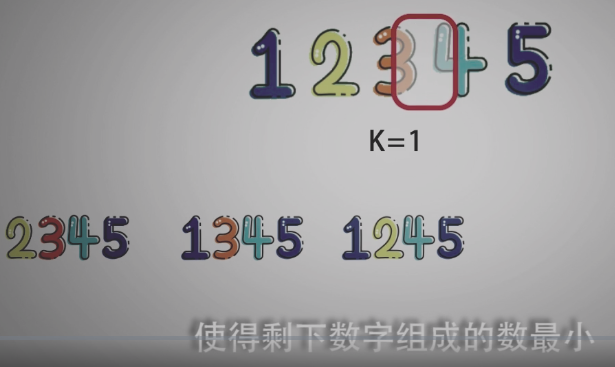

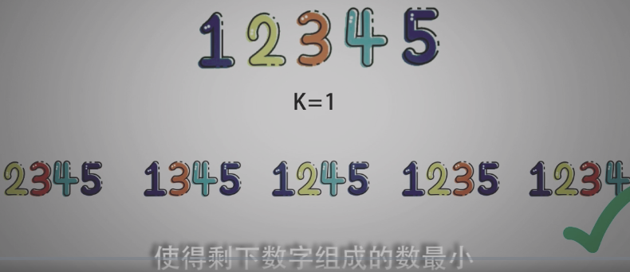

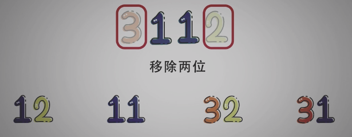

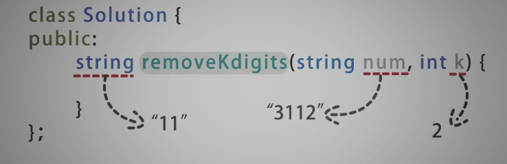

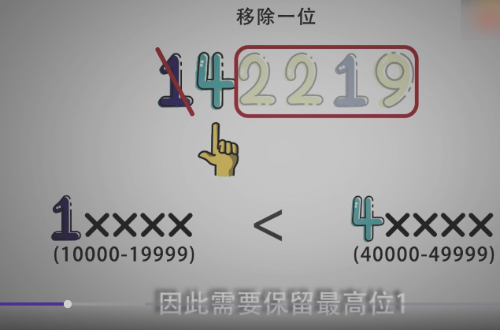

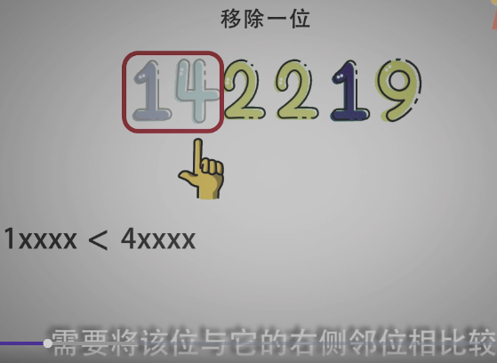

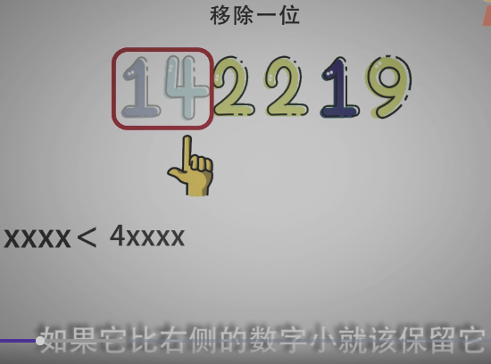

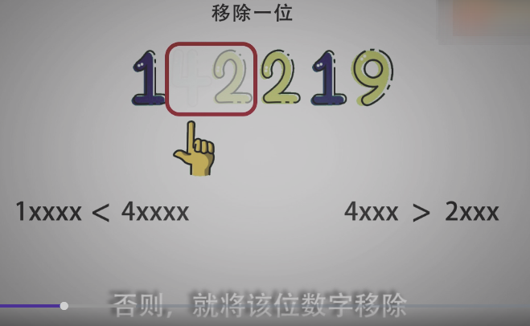

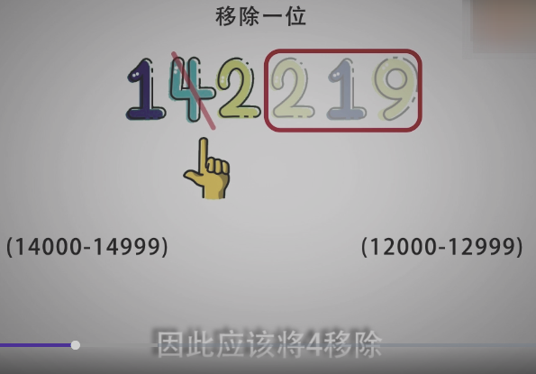

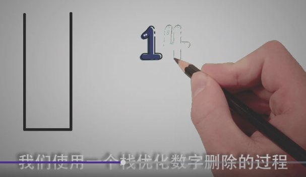

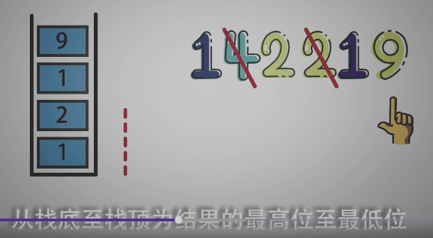

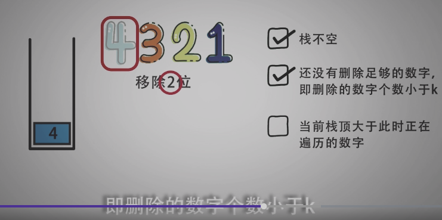

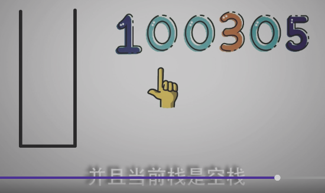

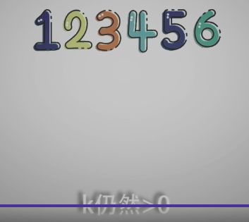

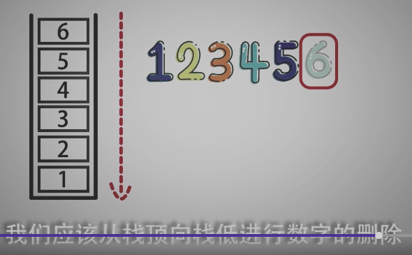

-----------------------


```c
/*
 * @Date: 2021-12-27 15:35:52
 * @Author: bFeng
 */
/*
 * @lc app=leetcode.cn id=402 lang=cpp
 *
 * [402] 移掉 K 位数字
 */

// @lc code=start
// 使用栈保存处理结果
class Solution {
public:
     std::string removeKdigits(std::string num, int k) {
        if(num == "" || k==0) return num;
        std::stack<char> res_inv;//高位在下
        // res_inv.push(num[0]);
        for(int i=0; i<num.size(); i++){
            // 删除数字的条件
            while(!res_inv.empty() && k>0 && res_inv.top()>num[i]){
                res_inv.pop();
                k--;
            }
            // 处理数字开头为 0 的情况， 0 不入栈
            if(res_inv.empty() && num[i]=='0'){
                continue;
            }
            res_inv.push(num[i]);
        }

        // 若遍历完还没删完，就从栈顶开始删除
        while(k-- && !res_inv.empty()){
            res_inv.pop();
        }

        // 处理空的情况
        if(res_inv.empty()) return "0";

        // 构造字符串，进行输出
        std::string res;

        while(!res_inv.empty()){
            res += res_inv.top();
            res_inv.pop();
        }
        // 反转字符串
        reverse(res.begin(), res.end());
        return res;
    }


};
// @lc code=end


```

