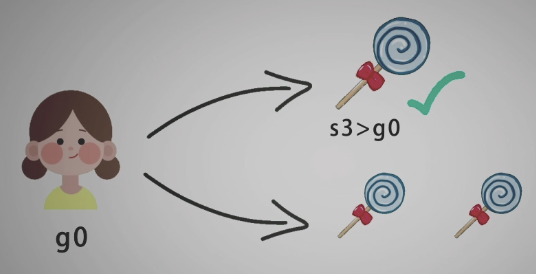
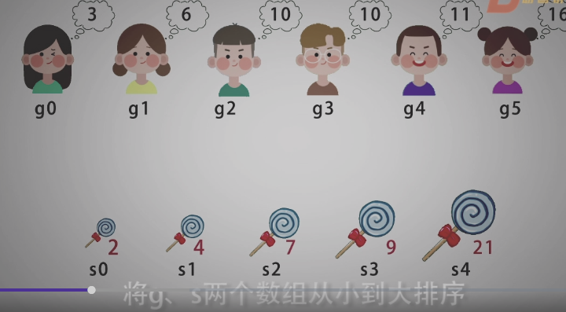
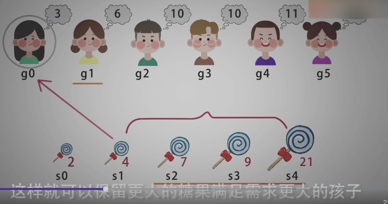

<!--
 * @Date: 2021-12-26 22:37:57
 * @Author: bFeng
-->

分发饼干  
Category	Difficulty	Likes	Dislikes  
algorithms	Easy (57.58%)	421	-  
Tags  
Companies  
假设你是一位很棒的家长，想要给你的孩子们一些小饼干。但是，每个孩子最多只能给一块饼干。  

对每个孩子 i，都有一个胃口值 g[i]，这是能让孩子们满足胃口的饼干的最小尺寸；并且每块饼干 j，都有一个尺寸 s[j] 。如果 s[j] >= g[i]，我们可以将这个饼干 j 分配给孩子 i ，这个孩子会得到满足。你的目标是尽可能满足越多数量的孩子，并输出这个最大数值。  

 
示例 1:

输入: g = [1,2,3], s = [1,1]  
输出: 1  
解释:   
你有三个孩子和两块小饼干，3个孩子的胃口值分别是：1,2,3。  
虽然你有两块小饼干，由于他们的尺寸都是1，你只能让胃口值是1的孩子满足。  
所以你应该输出1。  


示例 2:

输入: g = [1,2], s = [1,2,3]  
输出: 2  
解释:   
你有两个孩子和三块小饼干，2个孩子的胃口值分别是1,2。  
你拥有的饼干数量和尺寸都足以让所有孩子满足。  
所以你应该输出2.  
 

提示：

1 <= g.length <= 3 * 104  
0 <= s.length <= 3 * 104  
1 <= g[i], s[j] <= 231 - 1  
Discussion | Solution  

-----------------------------------------








```c
/*
 * @Date: 2021-12-26 22:39:19
 * @Author: bFeng
 */
/*
 * @lc app=leetcode.cn id=455 lang=cpp
 *
 * [455] 分发饼干
 */

// @lc code=start

//  容器求解
class Solution {
public:
    int findContentChildren(vector<int>& g, vector<int>& s) {
        // 首先对两组元素进行排序
        sort(g.begin(), g.end(), [&](const int& a, const int& b){
            return a < b;
        });
        sort(s.begin(), s.end(), [&](const int& a, const int& b){
            return a < b;
        });

        int res = 0;
        std::vector<int>::iterator s_itr = s.begin();
        for(std::vector<int>::iterator g_itr = g.begin(); g_itr != g.end(); ){
            // 注意++ 时要判断是否到尾部
            while(s_itr != s.end() && g_itr != g.end() &&*g_itr <= *s_itr){//如果得到满足
                s_itr ++;
                g_itr ++;
                res ++;
            }
            if(s_itr == s.end()) break;
            s_itr ++;//没得到满足
        }
        
        return res;
    }
};


// 数组求解
class Solution {
public:
    int findContentChildren(vector<int>& g, vector<int>& s) {

        sort(g.begin(), g.end());
        sort(s.begin(), s.end());

        int child = 0;// child s下标
        int candy = 0;// candy g下标

        while(child < g.size() && candy < s.size()){
            if(s[candy] >= g[child]){// 满足当前孩子
                child ++;
            }
            candy ++;
        }

        return child;//孩子满足的个数
    }
};

// @lc code=end


```