<!--
 * @Date: 2021-12-27 21:09:05
 * @Author: bFeng
-->
跳跃游戏  
Category	Difficulty	Likes	Dislikes  
algorithms	Medium (43.39%)	1551	-  
Tags  
Companies  
给定一个非负整数数组 nums ，你最初位于数组的 第一个下标 。  

数组中的每个元素代表你在该位置可以跳跃的最大长度。  

判断你是否能够到达最后一个下标。  

 

示例 1：  

输入：nums = [2,3,1,1,4]  
输出：true  
解释：可以先跳 1 步，从下标 0 到达下标 1, 然后再从下标 1 跳 3 步到达最后一个下标。  


示例 2：

输入：nums = [3,2,1,0,4]  
输出：false  
解释：无论怎样，总会到达下标为 3 的位置。但该下标的最大跳跃长度是 0 ， 所以永远不可能到达最后一个下标。  
 

提示：  

1 <= nums.length <= 3 * 104  
0 <= nums[i] <= 105  
Discussion | Solution  

Code Now

-------------------------------------


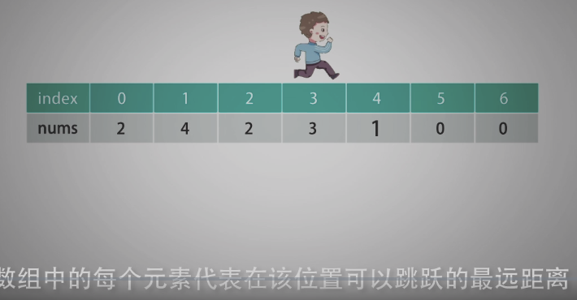

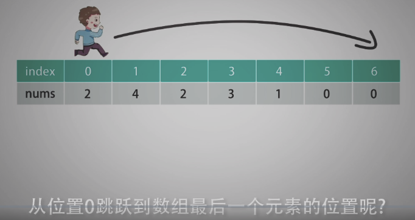

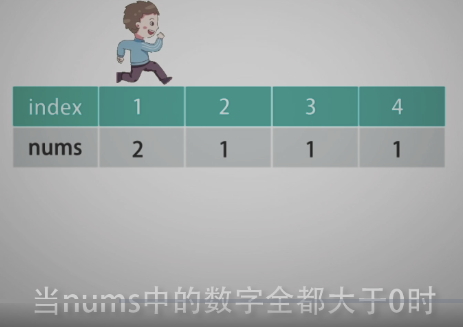

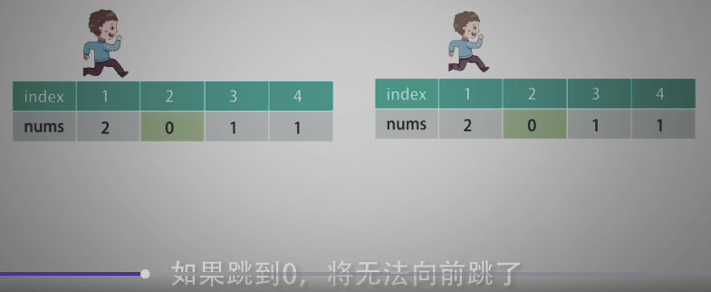

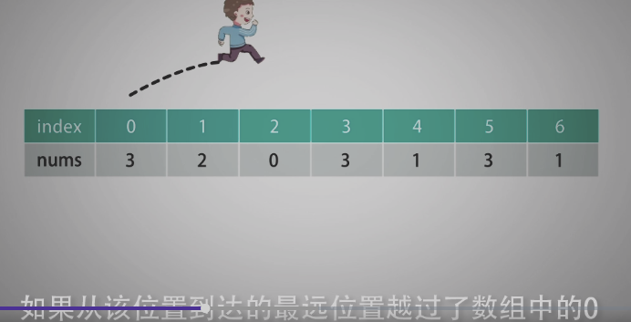

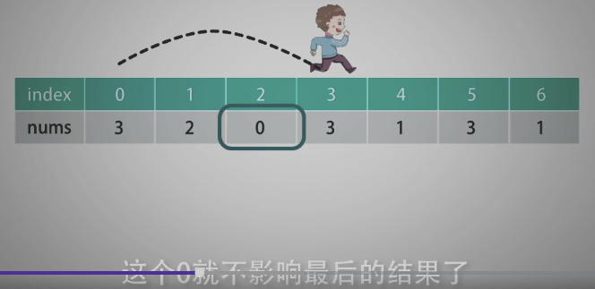

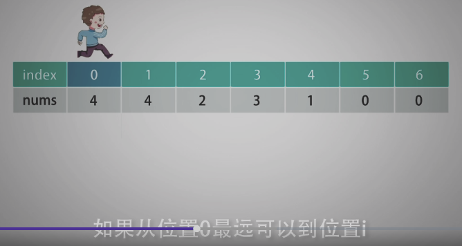

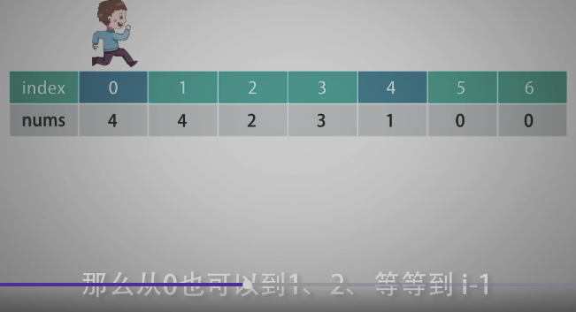

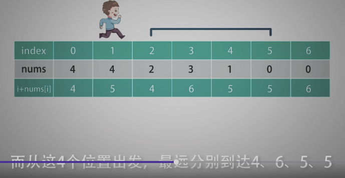

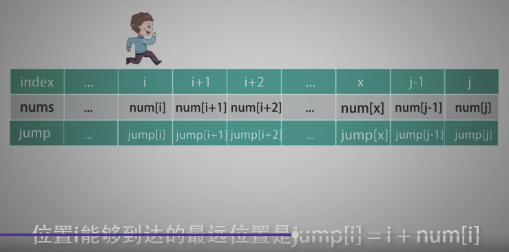

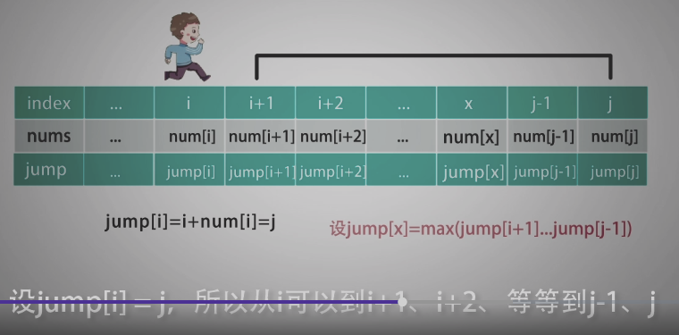

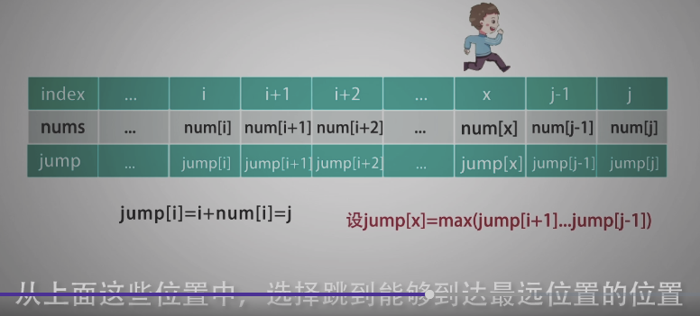

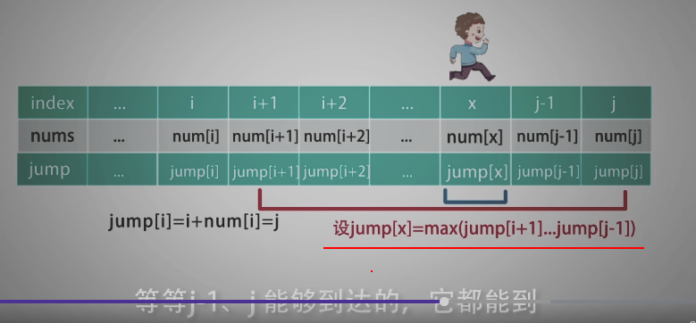

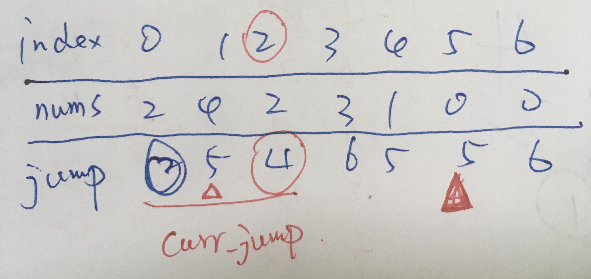

--------------------------------------


```c

/*
 * @Date: 2021-12-27 21:09:52
 * @Author: bFeng
 */
/*
 * @lc app=leetcode.cn id=55 lang=cpp
 *
 * [55] 跳跃游戏
 */

// @lc code=start
// 参考解法 
class Solution {
public:
    bool canJump(std::vector<int>& nums) {
        std::vector<int> jump;
        for(int i=0; i<nums.size(); i++){
            jump.push_back(i + nums[i]);
        }

        int curr = 0;// 当前所在index
        int max_jump = jump[0];// 存储当前可以到达的最远位置
        while(curr < nums.size() && curr <= max_jump){
            if(max_jump < jump[curr]){
                max_jump = jump[curr];
            }
            curr ++;//这样才会在jump[]相同的时候，往前走
        }

        if(curr == nums.size()) return true;
        else return false;
    }
};
// @lc code=end

------------------------------
    // 自己的解法： 未通过全部案例测试：
    // index 0 1 2 3 4
    // nums  3 2 1 0 4
    // jump  3 3 3 3 4
    // 这种情况，当jump都为 3 3 3 3，相同时，无法通过测试
    bool canJump(std::vector<int>& nums) {
        std::vector<int> jump;
        for(int i=0; i<nums.size(); i++){
            jump.push_back(i + nums[i]);
        }

        int curr = 0;
        while(curr < nums.size()-1){
            // 使用 map 来记录 index
            std::map<int,int> curr_jump;
            for(int i=curr; i<=jump[curr]; i++){
                curr_jump[i] = jump[i];
            }

            int max_jump = 0;
            int record_idx = -1;
            for(const auto& itr : curr_jump){
                if(max_jump < itr.second){
                    max_jump = itr.second;
                    record_idx = itr.first;
                }
            }

            curr = record_idx;
            if(0 == nums[curr]) break;
        }

        if(jump[curr] >= nums.size()-1) return true;
        else return false;
    }
```