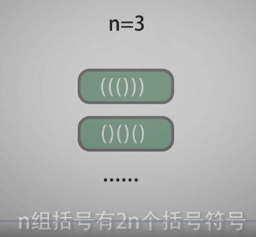
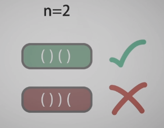
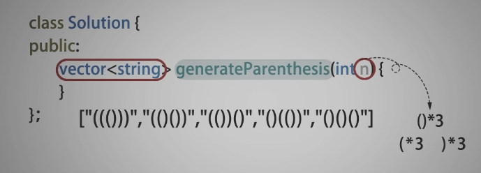
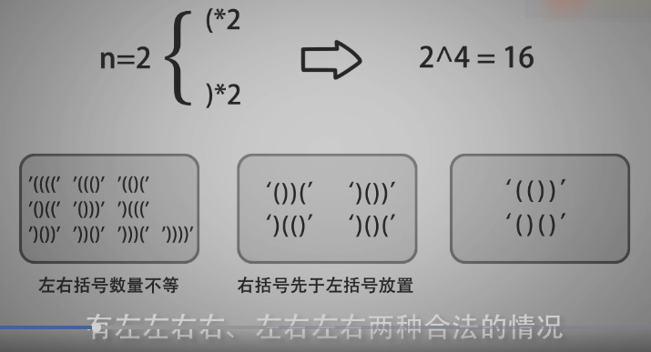
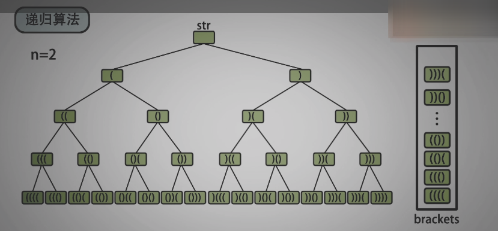
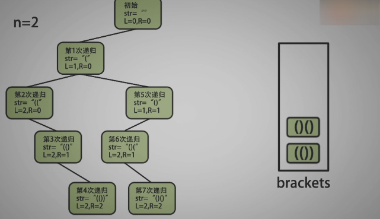
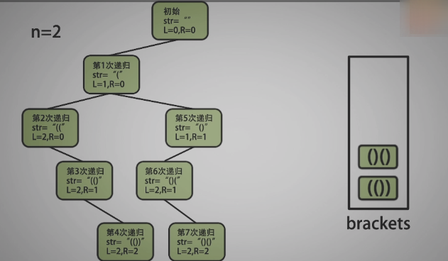

<!--
 * @Date: 2021-12-28 16:16:38
 * @Author: bFeng
-->

括号生成  
括号生成  
Category	Difficulty	Likes	Dislikes  
algorithms	Medium (77.30%)	2241	-  
Tags  
string | backtracking  

Companies  
google | uber | zenefits  

数字 n 代表生成括号的对数，请你设计一个函数，用于能够生成所有可能的并且 有效的 括号组合。

 

示例 1：

输入：n = 3  
输出：["((()))","(()())","(())()","()(())","()()()"]  


示例 2：  

输入：n = 1  
输出：["()"]  
 

提示：

1 <= n <= 8  
Discussion | Solution


---------------------------















---------------------------

```c
/*
 * @Date: 2021-12-28 16:15:31
 * @Author: bFeng
 */
/*
 * @lc app=leetcode.cn id=22 lang=cpp
 *
 * [22] 括号生成
 */

// @lc code=start
class Solution {
public:
    std::vector<std::string> generateParenthesis(int n) {
        std::vector<std::string> brackets;
        std::string sub_brackets;
        // Step 1 递归生成所有的括号组合
        backtrack(n, sub_brackets, brackets);
        std::vector<std::string> res;
        // Step 2 判断合法的括号组合
        for(int i=0; i<brackets.size(); i++){
            if(bracketsLegalJudge(brackets[i])){
                res.push_back(brackets[i]);
            }
        }
        return res;
    }

private:
    void backtrack(int n, 
                   std::string sub_brackets, 
                   std::vector<std::string>& brackets){
        if(sub_brackets.size() == 2*n){// 生成四个括号后就返回，相当于只取树的叶子节点
            brackets.push_back(sub_brackets);
            return;
        }
        backtrack(n, sub_brackets + "(", brackets);
        backtrack(n, sub_brackets + ")", brackets);
    }

    bool bracketsLegalJudge(std::string& bracket){
        std::stack<char> data;
        for(int i=0; i<bracket.size(); i++){
            if(bracket[i] == '('){
                data.push('(');
            }else if(bracket[i] == ')' && !data.empty()){
                data.pop();
            }else{
                return false;
            }
        }
        if(data.empty()) return true;
        return false;
    }
};
// @lc code=end
//----------------------------
// @lc code=start
// 直接在递归的时候进行筛选合法的组合
class Solution {
public:
    std::vector<std::string> generateParenthesis(int n) {
        std::vector<std::string> brackets;
        std::string sub_brackets;
        int left = 0; int right = 0;
        backtrack(n, left, right, sub_brackets, brackets);
        std::vector<std::string> res;
        return brackets;
    }

private:
    void backtrack(int n, int left, int right, 
                   std::string sub_brackets, 
                   std::vector<std::string>& brackets){
        if(sub_brackets.size() == 2*n){// 生成四个括号后就返回，相当于只取树的叶子节点
            brackets.push_back(sub_brackets);
            return;
        }
        if(left < n){// 保证左括号数量不大于2
            backtrack(n, left+1, right, sub_brackets + "(", brackets);
        }
        if(right < left){// 保证左括号 先于 右括号放置
            backtrack(n, left, right+1, sub_brackets + ")", brackets);
        }
    }
};

```