<!--
 * @Date: 2021-12-28 22:06:12
 * @Author: bFeng
-->

火柴拼正方形  
Category	Difficulty	Likes	Dislikes  
algorithms	Medium (42.12%)	232	-  
Tags  
Companies  
还记得童话《卖火柴的小女孩》吗？现在，你知道小女孩有多少根火柴，请找出一种能使用所有火柴拼成一个正方形的方法。不能折断火柴，可以把火柴连接起来，并且每根火柴都要用到。  
  
输入为小女孩拥有火柴的数目，每根火柴用其长度表示。输出即为是否能用所有的火柴拼成正方形。  

示例 1:

输入: [1,1,2,2,2]  
输出: true

解释: 能拼成一个边长为2的正方形，每边两根火柴。  


示例 2:

输入: [3,3,3,3,4]  
输出: false


解释: 不能用所有火柴拼成一个正方形。  
注意:

给定的火柴长度和在 0 到 10^9之间。
火柴数组的长度不超过15。
Discussion | Solution

--------------------------------

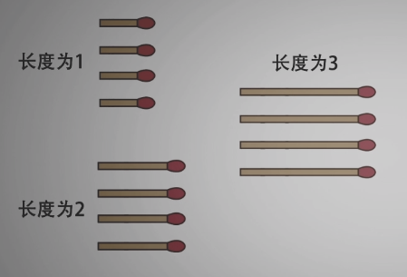

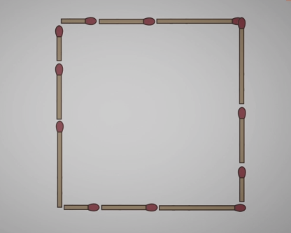

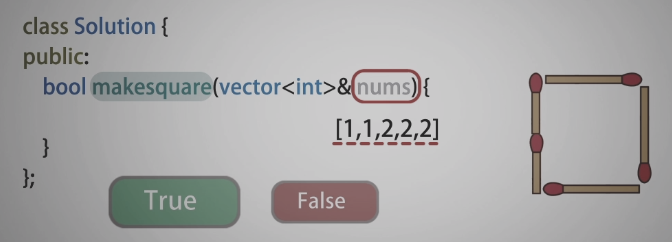

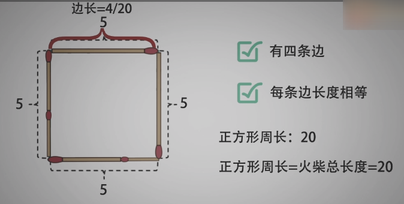

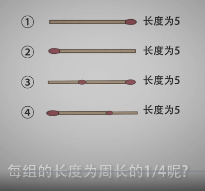

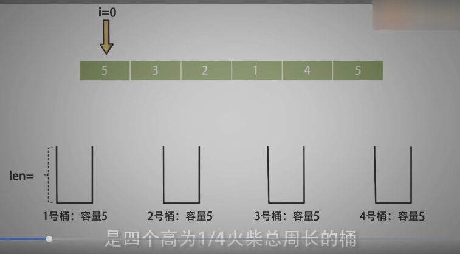

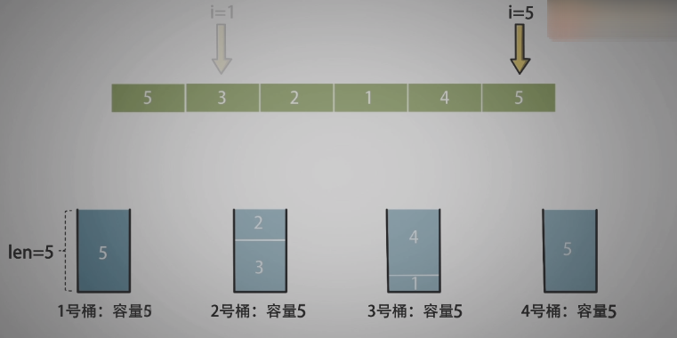

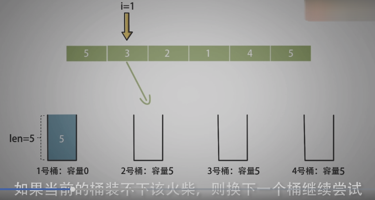

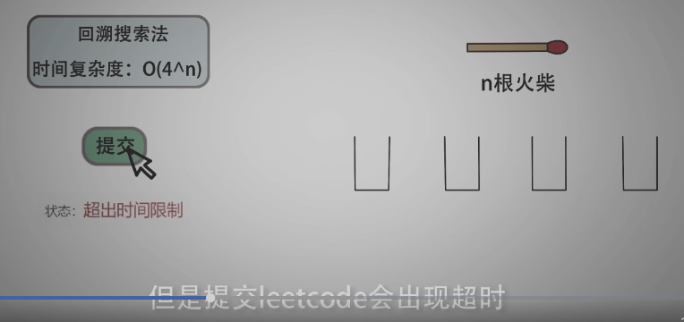

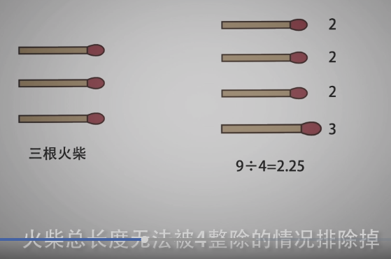

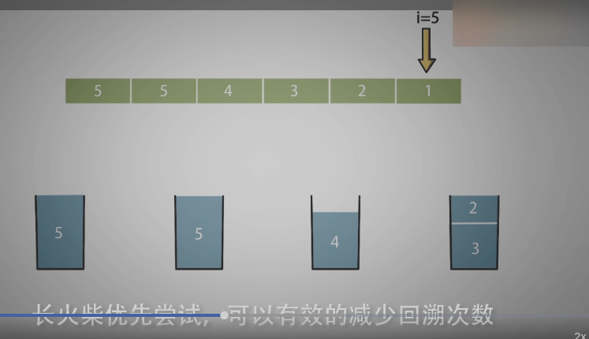


-----------------------------

```c
/*
 * @Date: 2021-12-28 22:07:39
 * @Author: bFeng
 */
/*
 * @lc app=leetcode.cn id=473 lang=cpp
 *
 * [473] 火柴拼正方形
 */
//--------------自己尝试：未能通过所有测试，主要是回溯部分有问题-----------------
// @lc code=start
class Solution {
public:
    bool makesquare(std::vector<int>& matchsticks) {
        if(matchsticks.size() < 4) return false;
        int perimeter = 0;// 周长
        for(const auto& i : matchsticks){
            perimeter += i;
        }
        if( perimeter%4 != 0) return false;
        int side_len = perimeter/4;

        // 排序  大到小
        sort(matchsticks.begin(), matchsticks.end(), [&](const auto& a, const auto& b){
            return a > b;
        });
        bool res = true;
        std::vector<int> bucket = {side_len, side_len, side_len, side_len};

        backtrack(res, 0, matchsticks, bucket);

        return res;
    }

private:
    void backtrack(bool& res,
                   int i,// 第 i 根火柴
                   std::vector<int>& matchsticks,
                   std::vector<int>& bucket){
        if(i >= matchsticks.size()){
            for(const auto& i : bucket){
                res &= (~(bool)i);
            }
            return;
        }

        // std::vector<int> backup_mat = matchsticks;//备份
        std::vector<int> backup_buc = bucket;

        for(int j=0; j<bucket.size(); j++){// 遍历四个桶
            if(matchsticks[i] <= bucket[j]){//如果可以放进去
                // std::vector<int>::iterator to_del = matchsticks.begin() + i;
                // matchsticks.erase(to_del);
                bucket[j] -= matchsticks[i]; // 更新容量
                break;
            }
        }

        // 放下一根火柴
        backtrack(res, i+1, matchsticks, bucket);

        // matchsticks = backup_mat;
        bucket = backup_buc;
    }
};
// @lc code=end


//-------------参考实现：超时，应该是 bucket 复制耗时过多---------------------
/*
 * @Date: 2021-12-28 22:07:39
 * @Author: bFeng
 */
/*
 * @lc app=leetcode.cn id=473 lang=cpp
 *
 * [473] 火柴拼正方形
 */

// @lc code=start
class Solution {
public:
    bool makesquare(std::vector<int>& matchsticks) {
        if(matchsticks.size() < 4) return false;
        int perimeter = 0;// 周长
        for(const auto& i : matchsticks){
            perimeter += i;
        }
        if( perimeter%4 != 0) return false;
        int side_len = perimeter/4;

        // 排序  大到小
        sort(matchsticks.begin(), matchsticks.end(), [&](const auto& a, const auto& b){
            return a > b;
        });

        std::vector<int> bucket = {side_len, side_len, side_len, side_len};
        return backtrack(0, matchsticks, bucket);
    }


private:
    bool backtrack(int i,// 第 i 根火柴
                   std::vector<int>& matchsticks,
                   std::vector<int>& bucket){
        if(i >= matchsticks.size()){
            return true;
        }

        for(int j=0; j<bucket.size(); j++){// 遍历四个桶
            std::vector<int> backup_buc = bucket;
            if(matchsticks[i] > bucket[j]){//如果放不进去
                continue;
            }
            bucket[j] -= matchsticks[i]; // 如果可以放进去，更新容量
            if(backtrack(i+1, matchsticks, bucket)){//放下一根火柴
                return true;
            }
            bucket = backup_buc;//回溯，恢复
        }
        return false;
    }
};
// @lc code=end


//-------------------参考实现： 通过---------------------------
/*
 * @Date: 2021-12-28 22:07:39
 * @Author: bFeng
 */
/*
 * @lc app=leetcode.cn id=473 lang=cpp
 *
 * [473] 火柴拼正方形
 */

// @lc code=start
class Solution {
public:
    bool makesquare(std::vector<int>& matchsticks) {
        if(matchsticks.size() < 4) return false;
        int perimeter = 0;// 周长
        for(const auto& i : matchsticks){
            perimeter += i;
        }
        if( perimeter%4 != 0) return false;
        int side_len = perimeter/4;

        // 排序  大到小
        sort(matchsticks.begin(), matchsticks.end(), [&](const auto& a, const auto& b){
            return a > b;
        });

        int bucket[] = {side_len, side_len, side_len, side_len};
        return backtrack(0, matchsticks, bucket);
    }


private:
    bool backtrack(int i,// 第 i 根火柴
                   std::vector<int>& matchsticks,
                   int bucket[]){// 会被退化为指针，深拷贝
        if(i >= matchsticks.size()){
            return true;
        }

        for(int j=0; j<4; j++){// 遍历四个桶
            if(matchsticks[i] > bucket[j]){//如果放不进去
                continue;
            }
            bucket[j] -= matchsticks[i]; // 如果可以放进去，更新容量
            if(backtrack(i+1, matchsticks, bucket)){//放下一根火柴
                return true;
            }
            bucket[j] += matchsticks[i]; // 回溯，恢复
        }
        return false;
    }
};
// @lc code=end

```