<!--
 * @Date: 2021-12-28 19:58:20
 * @Author: bFeng
-->
N 皇后  
Category	Difficulty	Likes	Dislikes  
algorithms	Hard (73.80%)	1134	-  
Tags
Companies  
n 皇后问题 研究的是如何将 n 个皇后放置在 n×n 的棋盘上，并且使皇后彼此之间不能相互攻击。

给你一个整数 n ，返回所有不同的 n 皇后问题 的解决方案。

每一种解法包含一个不同的 n 皇后问题 的棋子放置方案，该方案中 'Q' 和 '.' 分别代表了皇后和空位。

 

示例 1：


输入：n = 4  
输出：\[[".Q..","...Q","Q...","..Q."],["..Q.","Q...","...Q",".Q.."]]  
解释：如上图所示，4 皇后问题存在两个不同的解法。    


示例 2：

输入：n = 1  
输出：\[["Q"]]  
 

提示：  

1 <= n <= 9  
Discussion | Solution  

----------------------------------


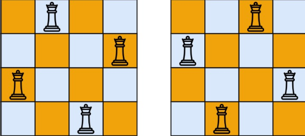

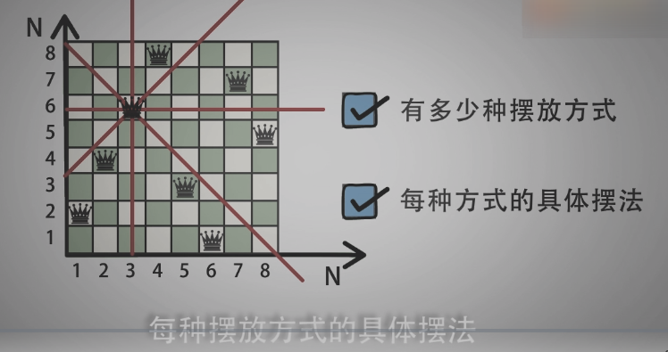

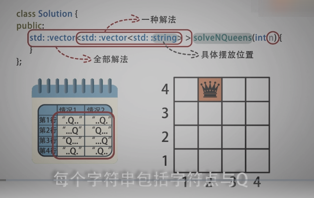

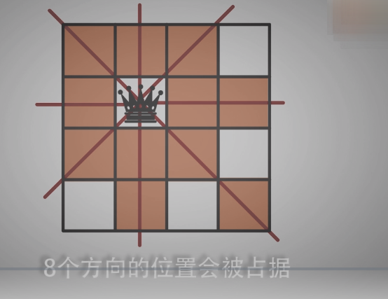

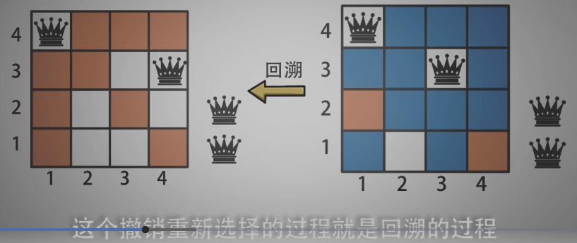

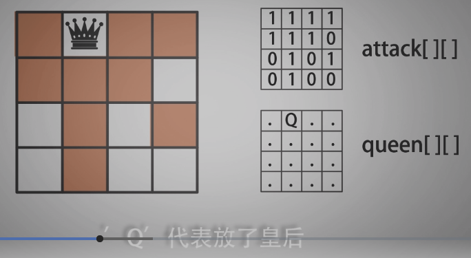

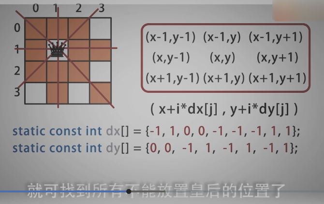

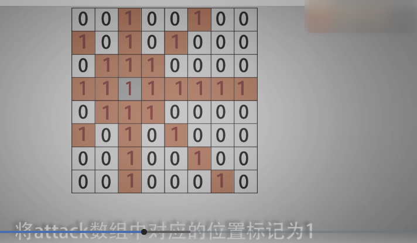

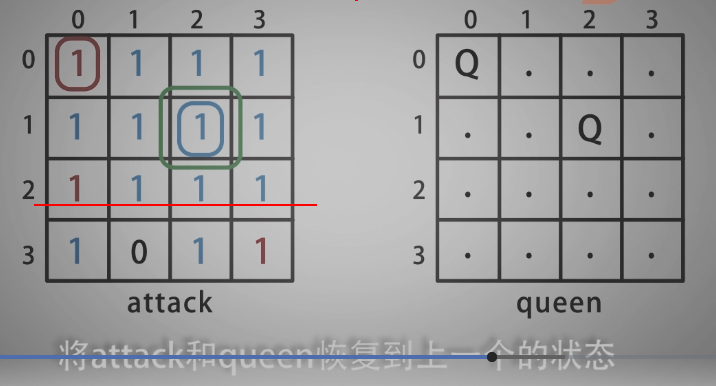

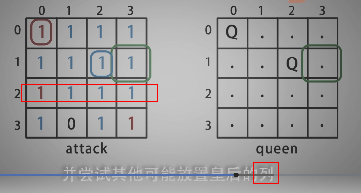

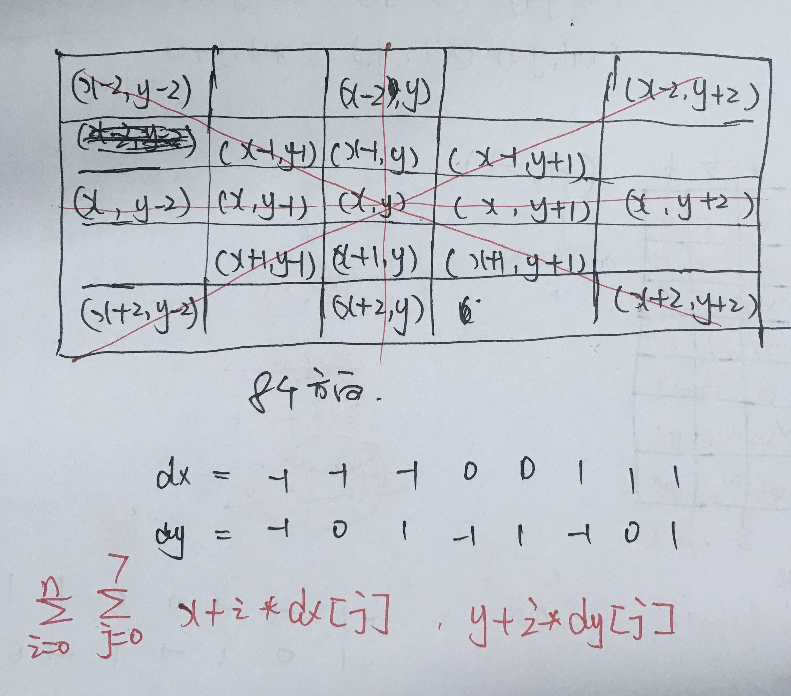


----------------------------------

```c
/*
 * @Date: 2021-12-28 20:00:06
 * @Author: bFeng
 */
/*
 * @lc app=leetcode.cn id=51 lang=cpp
 *
 * [51] N 皇后
 */

// @lc code=start
class Solution {
public:
    vector<vector<string>> solveNQueens(int n) {
        std::vector<string> queen; // 存储皇后的位置
        std::vector<std::vector<int>> attack; // attack标记皇后攻击的位置
        std::vector<std::vector<string>> res;// 最后的结果

        for(int i=0; i<n; i++){
            attack.push_back(std::vector<int>());//少定义一个变量
            for(int j=0; j<n; j++){
                attack[i].push_back(0);
            }
            queen.push_back("");
            queen[i].append(n,'.');
        }

        backtrack(0, n, queen, attack, res);
        return res;
    }

private:

    void put_queen(int x, int y, std::vector<std::vector<int>>& attack){
        static const int dx[] = {-1, -1, -1, 0, 0, 1, 1, 1};//八个方向
        static const int dy[] = {-1, 0, 1, -1, 1, -1, 0, 1};
        attack[x][y] = 1;
        int n = attack[0].size();
        for(int i=0; i<n; i++){
            for(int j=0; j<8; j++){
                int tmp_x = x + i*dx[j];
                int tmp_y = y + i*dy[j];
                if( 0<=tmp_x && tmp_x< n && 0<=tmp_y && tmp_y<n){//坐标在棋盘内
                    attack[tmp_x][tmp_y] = 1;
                } 
            }
        }
    }

    // 大的递归是按行进行
    void backtrack(int k, // 当前处理的行
                   int n, // N皇后中的N
                   std::vector<string>& queen, // 存储皇后的位置
                   std::vector<std::vector<int>>& attack, // attack标记皇后攻击的位置
                   std::vector<std::vector<string>>& res){ // 存储N皇后的全部解法
        if(k==n){// 找到一组解
            res.push_back(queen);
            return;
        }
        // 遍历 0 至 n-1 列，在循环中，回溯试探皇后可以放置的位置
        for(int i=0; i<n; i++){
            if(attack[k][i]==0){// 判断是否可以放皇后， 如果k行所有列都满了，backtrack执行完由栈递归返回
                std::vector<std::vector<int>> tmp = attack;// 备份attack数组
                queen[k][i] = 'Q'; // 标记皇后位置
                put_queen(k, i, attack);// 更新attack
                
                backtrack(k+1, n, queen, attack, res);// 递归试探 k+1 行的皇后放置位置
                // 回溯回来， 恢复状态
                attack = tmp;// 恢复attack数组
                queen[k][i] = '.';// 恢复queen数组
            }
        }
    }


};
// @lc code=end


```