<!--
 * @Date: 2021-12-29 21:44:25
 * @Author: bFeng
-->
二叉树展开为链表  
Category	Difficulty	Likes	Dislikes  
algorithms	Medium (72.69%)	1016	-  
Tags  
tree | depth-first-search  

Companies  
microsoft  

给你二叉树的根结点 root ，请你将它展开为一个单链表：  

展开后的单链表应该同样使用 TreeNode ，其中 right 子指针指向链表中下一个结点，而左子指针始终为 null 。  
展开后的单链表应该与二叉树 先序遍历 顺序相同。  
 

示例 1：  

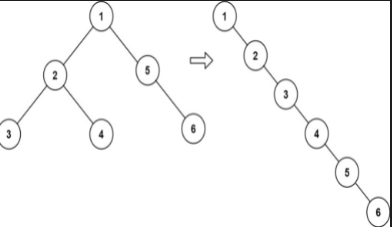

输入：root = [1,2,5,3,4,null,6]  
输出：[1,null,2,null,3,null,4,null,5,null,6]  


示例 2：

输入：root = []  
输出：[]  
示例 3：  

输入：root = [0]  
输出：[0]  
 

提示：

树中结点数在范围 [0, 2000] 内  
-100 <= Node.val <= 100  
 

进阶：你可以使用原地算法（O(1) 额外空间）展开这棵树吗？  

Discussion | Solution  

-----------------------------


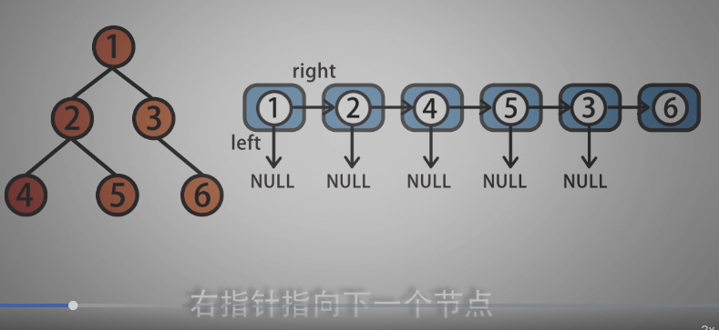

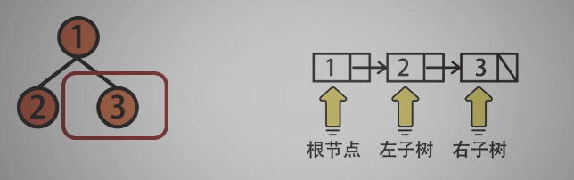

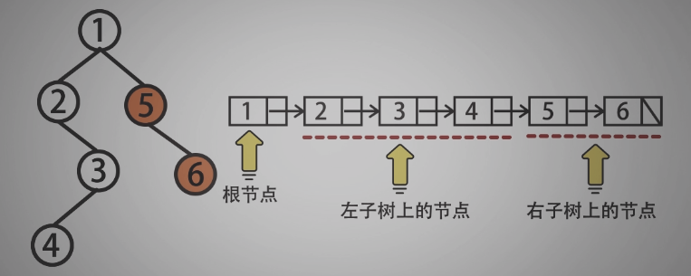

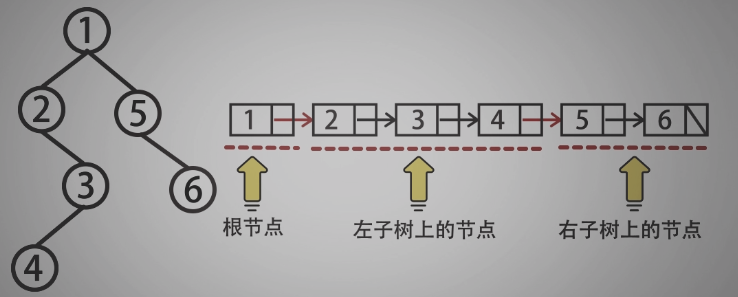

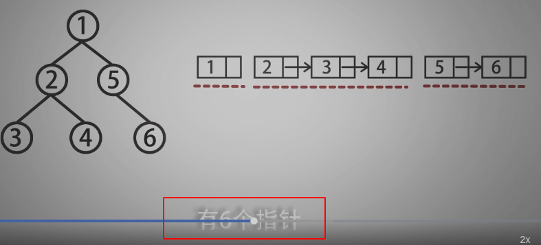

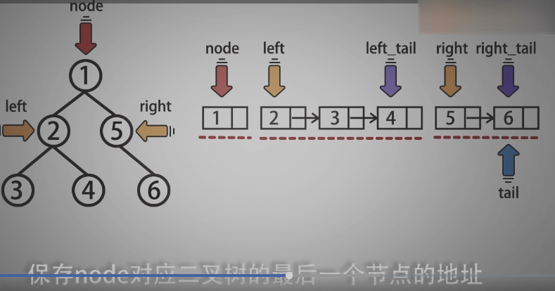

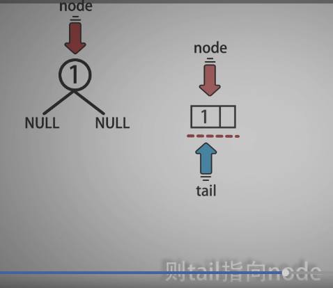

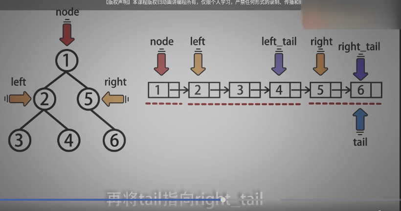

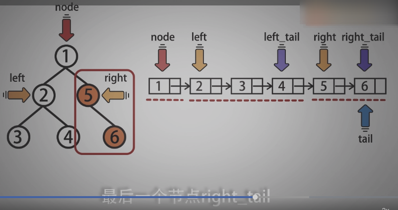

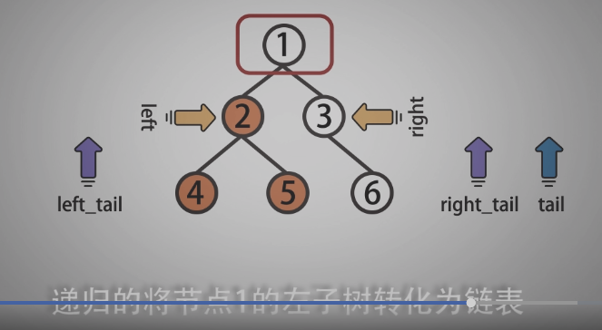

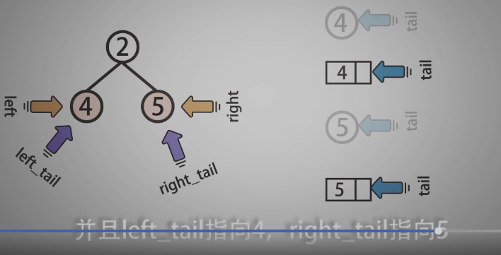

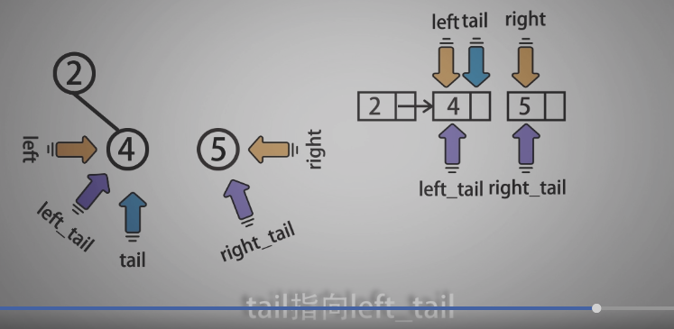

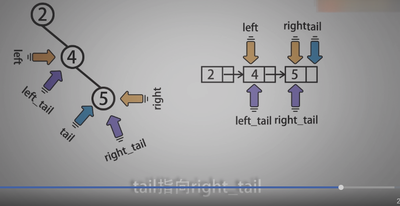

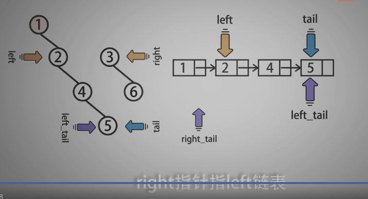

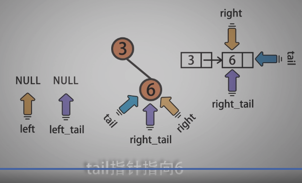


-------------------------------

```c
/*
 * @Date: 2021-12-29 21:46:30
 * @Author: bFeng
 */
/*
 * @lc app=leetcode.cn id=114 lang=cpp
 *
 * [114] 二叉树展开为链表
 */

// @lc code=start
/**
 * Definition for a binary tree node.
 * struct TreeNode {
 *     int val;
 *     TreeNode *left;
 *     TreeNode *right;
 *     TreeNode() : val(0), left(nullptr), right(nullptr) {}
 *     TreeNode(int x) : val(x), left(nullptr), right(nullptr) {}
 *     TreeNode(int x, TreeNode *left, TreeNode *right) : val(x), left(left), right(right) {}
 * };
 */
class Solution {
public:
    void flatten(TreeNode* root) {
        if(!root) return;
        std::vector<TreeNode*> res;
        DFS(root, res);
        TreeNode* curr = root;
        for(int i=1; i<res.size(); i++){
            curr->right = res[i];//可以直接使用res[i-1]代替curr
            curr->left = nullptr;
            curr = curr->right;
        }
        curr->left = nullptr;
        curr->right = nullptr;
        return;
    }

private:
    // 前序遍历即可
    void DFS(TreeNode* root,
        std::vector<TreeNode*>& res){
        if(!root) return;
        res.push_back(root);
        DFS(root->left, res);
        DFS(root->right,res);
    }
};


//------------------原地实现是真的绕啊------------------
class Solution {
public:
    void flatten(TreeNode* root) {
        backtrack(root);
    }

private:
    TreeNode* backtrack(TreeNode* root){
        if(!root) return nullptr;
        if(!root->left && !root->right){// root 为叶子节点
            return root;// 返回 root
        }
        TreeNode* left = root->left;// 指向 root 的左子树
        TreeNode* right = root->right;// 指向 root 的右子树
        TreeNode* left_tail = nullptr;//
        TreeNode* right_tail = nullptr;//
        TreeNode* tail = nullptr;// 将指向root二叉树的最后一个节点
        root->left = nullptr;// 将 root 的做指针置空

        if(left){// 当 left 不为空时
            // 递归的将左子树转为链表， left_tail 指向左子树最后一个节点
            left_tail = backtrack(left);
            root->right = left;
            tail = left_tail;
        }

        if(right){
            right_tail = backtrack(right);
            if(left){
                left_tail->right = right;
            }
            tail = right_tail;
        }
        return tail;
    }
};
// @lc code=end


```


