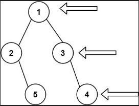
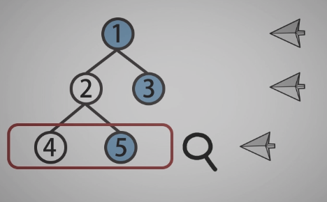
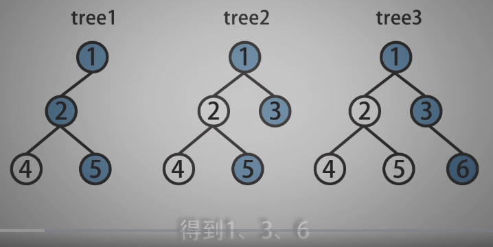
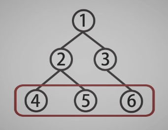
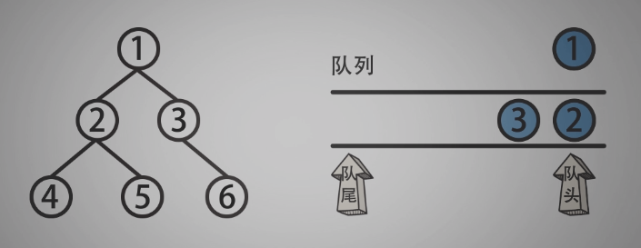

<!--
 * @Date: 2021-12-30 10:12:07
 * @Author: bFeng
-->


二叉树的右视图  
Category	Difficulty	Likes	Dislikes  
algorithms	Medium (65.27%)	592	-  
Tags  
tree | depth-first-search | breadth-first-search  

Companies  
给定一个二叉树的 根节点 root，想象自己站在它的右侧，按照从顶部到底部的顺序，返回从右侧所能看到的节点值。  

 

示例 1:  



输入: [1,2,3,null,5,null,4]  
输出: [1,3,4]  


示例 2:

输入: [1,null,3]  
输出: [1,3]  


示例 3:

输入: []  
输出: []  
 

提示:  

二叉树的节点个数的范围是 [0,100]  
-100 <= Node.val <= 100   
Discussion | Solution  


----------------------------------------------











---------------------------------------------

```c
/*
 * @Date: 2021-12-30 10:19:47
 * @Author: bFeng
 */
/*
 * @lc app=leetcode.cn id=199 lang=cpp
 *
 * [199] 二叉树的右视图
 */

// @lc code=start
/**
 * Definition for a binary tree node.
 * struct TreeNode {
 *     int val;
 *     TreeNode *left;
 *     TreeNode *right;
 *     TreeNode() : val(0), left(nullptr), right(nullptr) {}
 *     TreeNode(int x) : val(x), left(nullptr), right(nullptr) {}
 *     TreeNode(int x, TreeNode *left, TreeNode *right) : val(x), left(left), right(right) {}
 * };
 */
// -----------------自己尝试： 使用队列实现BFS--------------
class Solution {
public:
    vector<int> rightSideView(TreeNode* root) {
        std::vector<int> res;
        if(!root) return res;
        std::queue<TreeNode*> que;que.push(root);
        int num = 1;
        res.push_back(root->val);
        BFS(root, que, num, res);
        return res;
    }

private:
    void BFS(TreeNode* curr,// 除了外部调用，其余时刻当做tmp_ptr在使用
             std::queue<TreeNode*>& que,// 传入下一层的queue
             int& num,// 统计该层的节点数传入下一层
             std::vector<int>& res){
        if(!curr) return;
        // if(!curr->left && !curr->right) return;
        // if(que.empty() && num == 0){//根节点处理
        //     que.push(curr);
        //     num += 1;
        //     res.push_back(curr->val);
        // }
        if(que.empty() && num == 0) return;
        while(num--){
            curr = que.front();
            if(curr->left){
                que.push(curr->left);
            }
            if(curr->right){
                que.push(curr->right);
            }
            que.pop();
        }
        num = que.size();
        if(!que.empty()){
            curr = que.back();// 最后入队列的节点，就是最右边的节点
            res.push_back(curr->val);
        }
        BFS(curr, que, num, res);
    }

};
// @lc code=end


```