<!--
 * @Date: 2021-12-29 19:28:33
 * @Author: bFeng
-->


二叉树的最近公共祖先  
Category	Difficulty	Likes	Dislikes  
algorithms	Medium (68.32%)	1455	-  
Tags  
Companies  
给定一个二叉树, 找到该树中两个指定节点的最近公共祖先。  

百度百科中最近公共祖先的定义为：“对于有根树 T 的两个节点 p、q，最近公共祖先表示为一个节点 x，满足 x 是 p、q 的祖先且 x 的深度尽可能大（一个节点也可以是它自己的祖先）。”  

 

示例 1：  
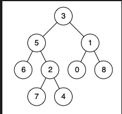

输入：root = [3,5,1,6,2,0,8,null,null,7,4], p = 5, q = 1  
输出：3  
解释：节点 5 和节点 1 的最近公共祖先是节点 3 。 


示例 2：  
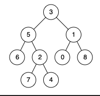

输入：root = [3,5,1,6,2,0,8,null,null,7,4], p = 5, q = 4  
输出：5  
解释：节点 5 和节点 4 的最近公共祖先是节点 5 。因为根据定义最近公共祖先节点可以为节点本身。  


示例 3：

输入：root = [1,2], p = 1, q = 2  
输出：1  
 

提示：  

树中节点数目在范围 [2, 105] 内。  
-109 <= Node.val <= 109  
所有 Node.val 互不相同 。  
p != q  
p 和 q 均存在于给定的二叉树中。  
Discussion | Solution  

----------------------------------------------------------

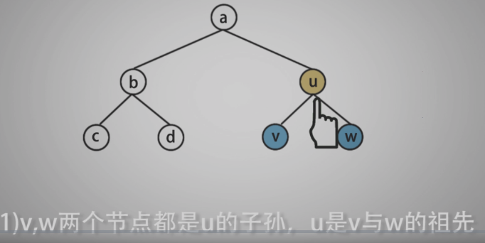

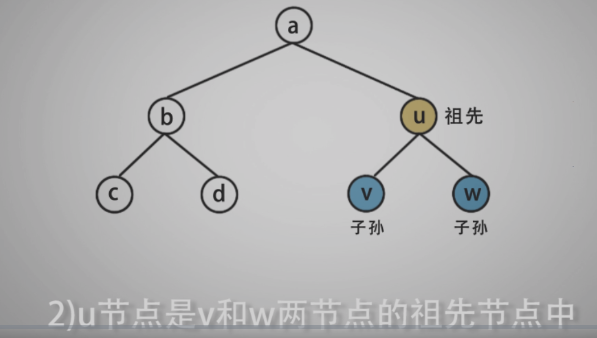

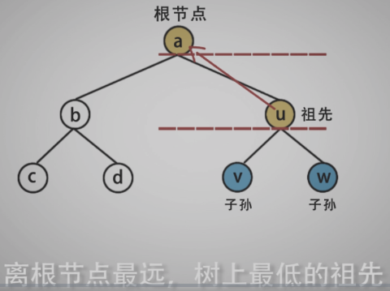

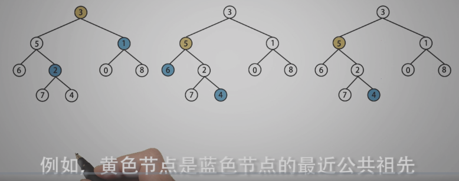

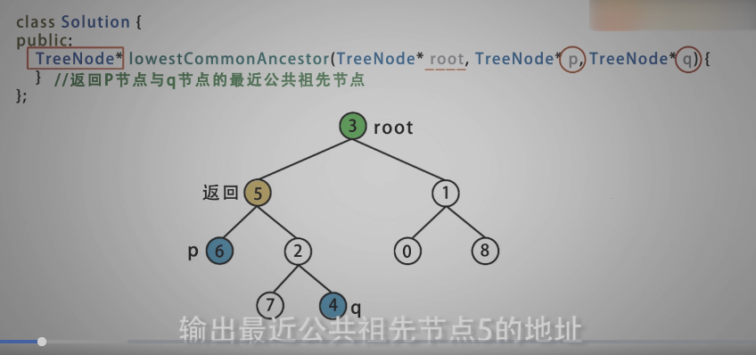

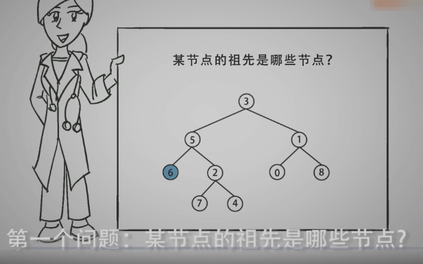

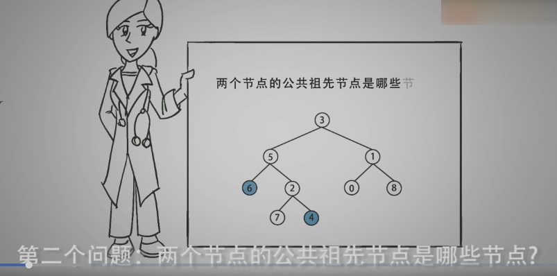

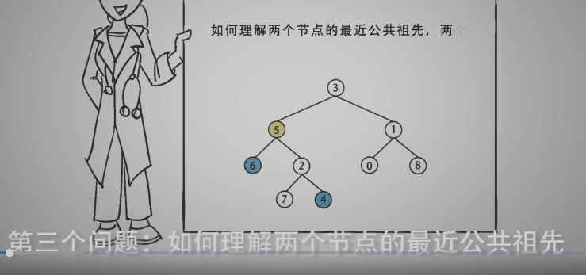

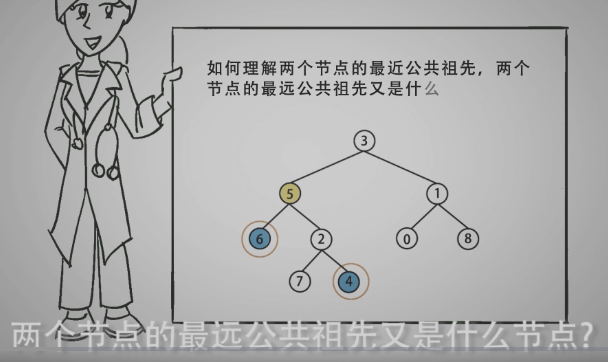

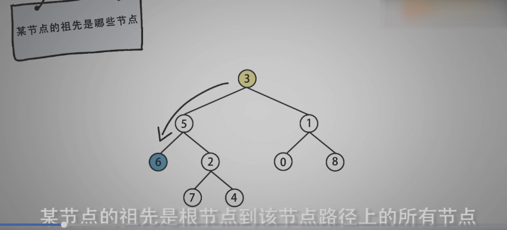

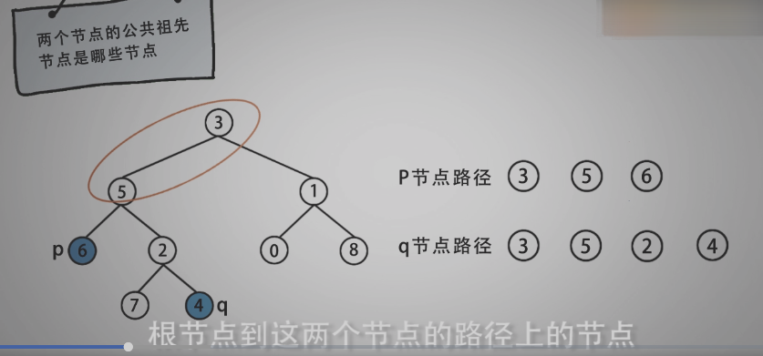

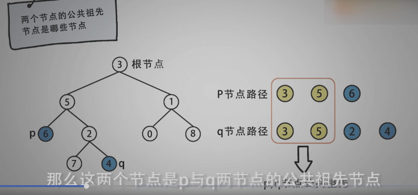

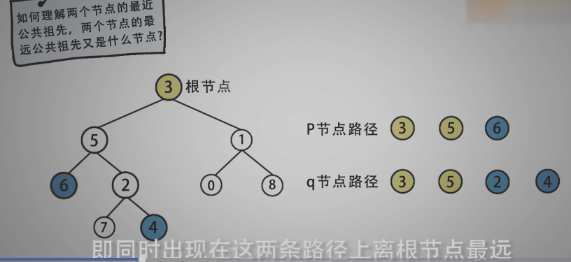

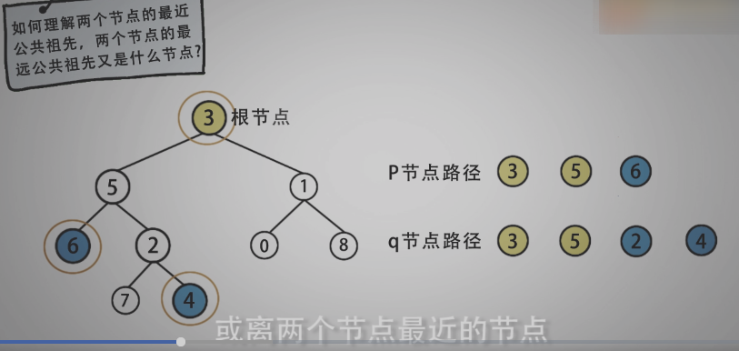

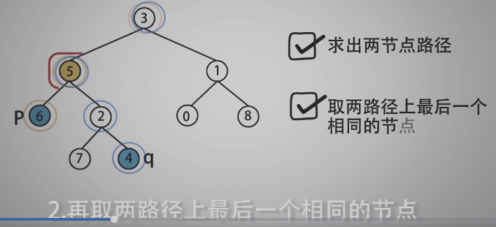


- 1.找路径
- 2.找共同路径
- 3.找离根节点最远的共同节点
-----------------------------------------------------------

```c

/*
 * @lc app=leetcode.cn id=236 lang=cpp
 *
 * [236] 二叉树的最近公共祖先
 */

// @lc code=start
/**
 * Definition for a binary tree node.
 * struct TreeNode {
 *     int val;
 *     TreeNode *left;
 *     TreeNode *right;
 *     TreeNode(int x) : val(x), left(NULL), right(NULL) {}
 * };
 */
class Solution {
public:
    TreeNode* lowestCommonAncestor(TreeNode* root, TreeNode* p, TreeNode* q) {
        if(!root) return root;
        std::vector<TreeNode*> path_p;//存储节点路径，模拟栈
        std::vector<TreeNode*> path_q;
        DFS(root, p, path_p);
        DFS(root, q, path_q);

        std::stack<TreeNode*> res;
        int sz = path_p.size()<path_q.size() ? path_p.size() : path_q.size();
        for(int i=0; i<sz; i++){
            if(path_p[i] == path_q[i]){
                res.push(path_p[i]);
            }
        }
        
        return res.top();// 离根节点最远的那个节点
    }

private:
    bool DFS(TreeNode* root,
             TreeNode* target_node,
             std::vector<TreeNode*>& path){
        if(!root) return false;
        path.push_back(root);//前序
        if(target_node == root) return true;
        if(DFS(root->left, target_node, path)) return true;
        if(DFS(root->right, target_node, path)) return true;
        path.pop_back();// 回溯，恢复
        return false;
    }
};
// @lc code=end


```
