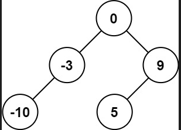
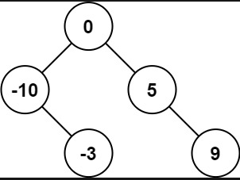
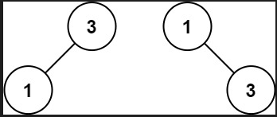

<!--
 * @Date: 2021-12-30 14:04:33
 * @Author: bFeng
-->
将有序数组转换为二叉搜索树
Category	Difficulty	Likes	Dislikes  
algorithms	Easy (76.17%)	900	-  
Tags  
tree | depth-first-search  

Companies  
给你一个整数数组 nums ，其中元素已经按 升序 排列，请你将其转换为一棵 高度平衡 二叉搜索树。  

高度平衡 二叉树是一棵满足「每个节点的左右两个子树的高度差的绝对值不超过 1 」的二叉树。  

 

示例 1：  



输入：nums = [-10,-3,0,5,9]  
输出：[0,-3,9,-10,null,5]  
解释：[0,-10,5,null,-3,null,9] 也将被视为正确  
答案：  




示例 2：  



输入：nums = [1,3]  
输出：[3,1]  
解释：[1,3] 和 [3,1] 都是高度平衡二叉搜索树。  
 

提示：  

1 <= nums.length <= 104    
-104 <= nums[i] <= 104  
nums 按 严格递增 顺序排列  
Discussion | Solution  

----------------------------------------

```c
/*
 * @Date: 2021-12-30 14:23:03
 * @Author: bFeng
 */
/*
 * @lc app=leetcode.cn id=108 lang=cpp
 *
 * [108] 将有序数组转换为二叉搜索树
 */

// @lc code=start
/**
 * Definition for a binary tree node.
 * struct TreeNode {
 *     int val;
 *     TreeNode *left;
 *     TreeNode *right;
 *     TreeNode() : val(0), left(nullptr), right(nullptr) {}
 *     TreeNode(int x) : val(x), left(nullptr), right(nullptr) {}
 *     TreeNode(int x, TreeNode *left, TreeNode *right) : val(x), left(left), right(right) {}
 * };
 */
 //---------我不太明白。为什么地址没传出去： TreeNode*&要传指针的引用！！！-------------
class Solution {
public:
    TreeNode* sortedArrayToBST(vector<int>& nums) {
        if(nums.empty()) return nullptr;
        TreeNode* root = nullptr;
        DFS(root, nums, 0, nums.size()-1);
        return root;
    }

private:
    void DFS(TreeNode*& node,
             std::vector<int>& nums,
             int begin, int end){
        if(begin > end) return;
        int mid = begin + (end - begin)/2;
        node = new TreeNode(nums[mid]);
        std::cout<<node->val<<std::endl;
        DFS(node->left, nums, begin, mid-1);
        DFS(node->right, nums, mid+1, end); 
    }
};
// @lc code=end

//--------------参考实现-----------------
class Solution {
public:
    TreeNode* sortedArrayToBST(vector<int>& nums) {
        if(nums.empty()) return nullptr;
        return DFS(nums, 0, nums.size()-1);
    }

private:
    TreeNode* DFS(std::vector<int>& nums,
                  int begin, int end){
        if(begin > end) return nullptr;
        int mid = begin + (end - begin)/2;
        TreeNode* node = new TreeNode(nums[mid]);
        // std::cout<<node->val<<std::endl;
        node->left = DFS(nums, begin, mid-1);
        node->right = DFS(nums, mid+1, end); 
        return node;
    }
};

```


----------------------------------------