<!--
 * @Date: 2021-12-30 16:44:09
 * @Author: bFeng
-->
删除二叉搜索树中的节点  
Category	Difficulty	Likes	Dislikes 
algorithms	Medium (49.03%)	606	-  
Tags  
Companies  
给定一个二叉搜索树的根节点 root 和一个值 key，删除二叉搜索树中的 key 对应的节点，并保证二叉搜索树的性质不变。返回二叉搜索树（有可能被更新）的根节点的引用。  

一般来说，删除节点可分为两个步骤：  

1.首先找到需要删除的节点；  
2.如果找到了，删除它。  
 

示例 1:  

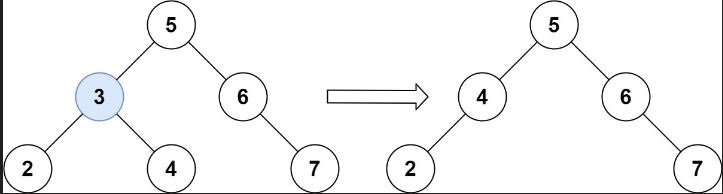

输入：root = [5,3,6,2,4,null,7], key = 3  
输出：[5,4,6,2,null,null,7]  
解释：给定需要删除的节点值是 3，所以我们首先找到 3 这个节点，然后删除它。  
一个正确的答案是 [5,4,6,2,null,null,7], 如下图所示。  
另一个正确答案是 [5,2,6,null,4,null,7]。  


示例 2:  

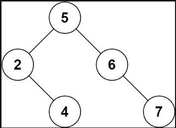

输入: root = [5,3,6,2,4,null,7], key = 0  
输出: [5,3,6,2,4,null,7]  
解释: 二叉树不包含值为 0 的节点  


示例 3:  

输入: root = [], key = 0  
输出: []  
 

提示:  

节点数的范围 [0, 104].  
-105 <= Node.val <= 105  
节点值唯一  
root 是合法的二叉搜索树  
-105 <= key <= 105  
 

进阶： 要求算法时间复杂度为 O(h)，h 为树的高度。  

Discussion | Solution  

---------------


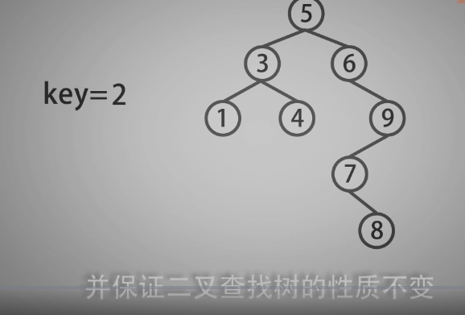

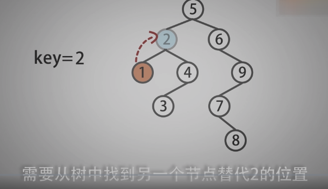

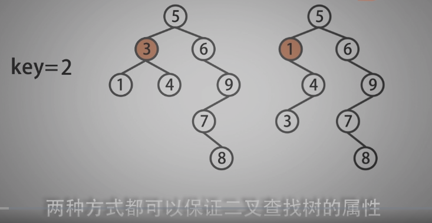

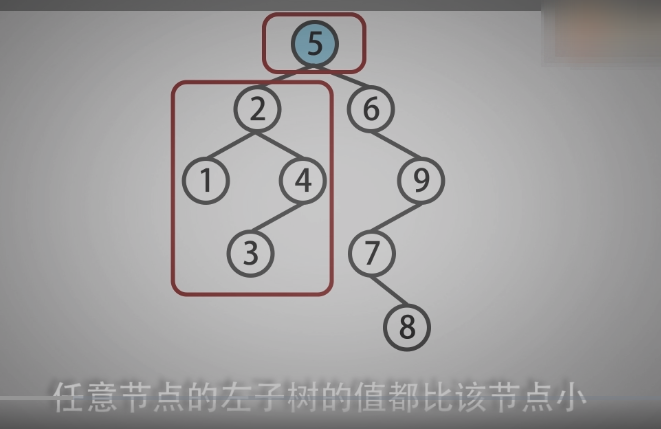

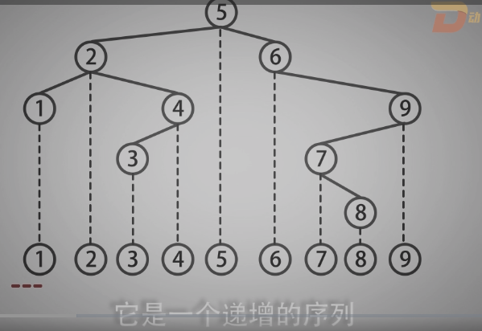

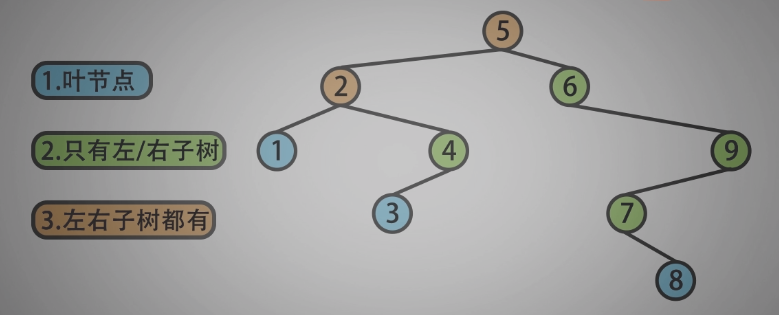

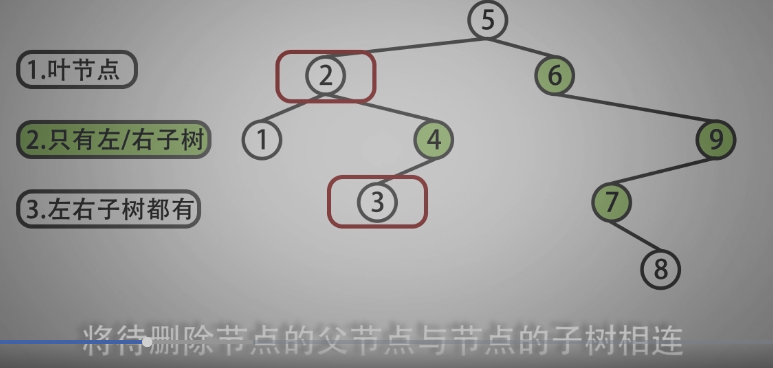

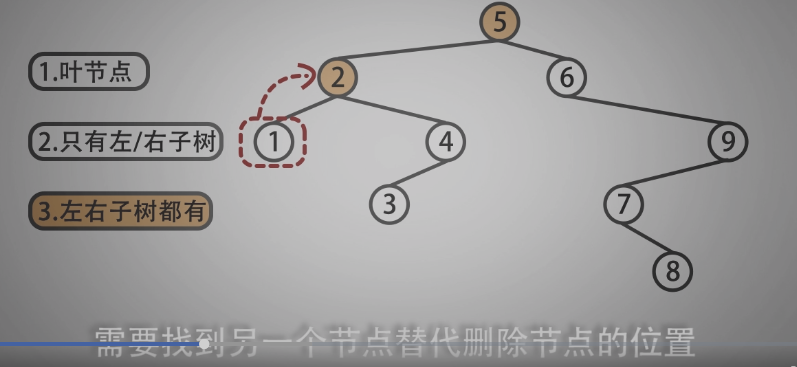

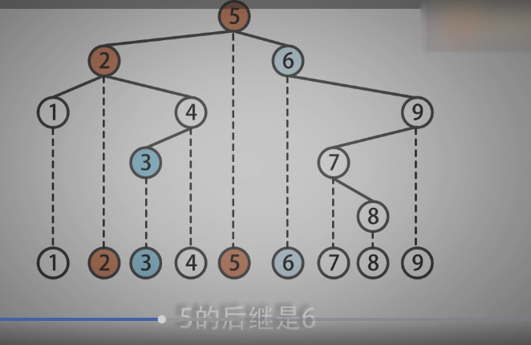

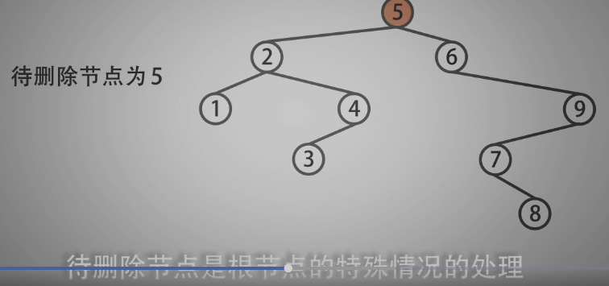

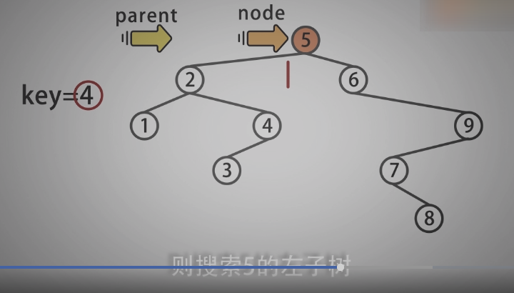

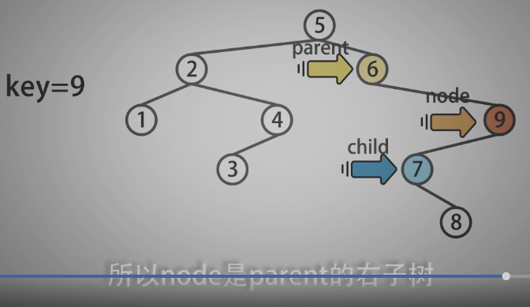

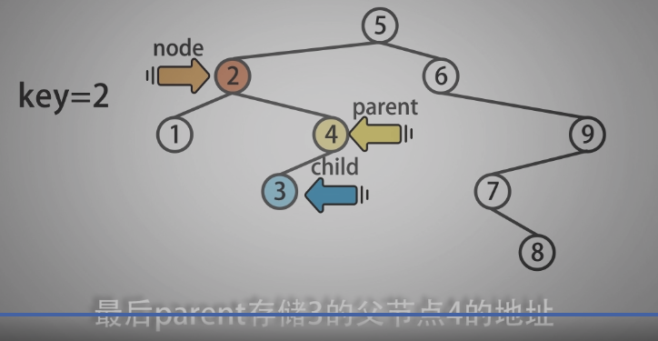

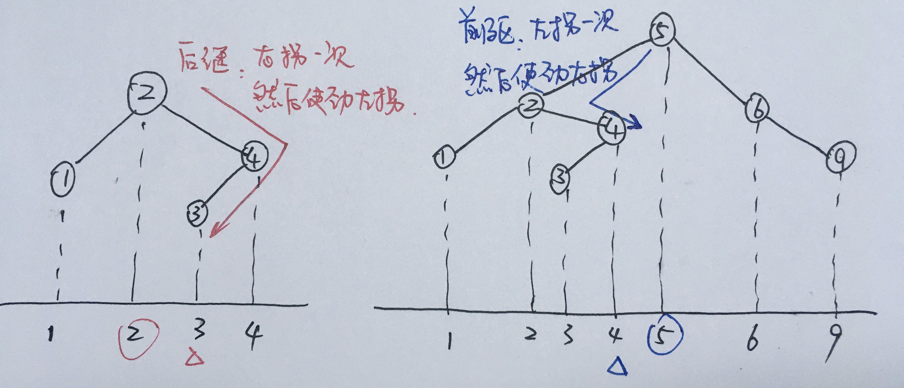


-------------------------


```c
/*
 * @Date: 2021-12-30 16:50:03
 * @Author: bFeng
 */
/*
 * @lc app=leetcode.cn id=450 lang=cpp
 *
 * [450] 删除二叉搜索树中的节点
 */

// @lc code=start
/**
 * Definition for a binary tree node.
 * struct TreeNode {
 *     int val;
 *     TreeNode *left;
 *     TreeNode *right;
 *     TreeNode() : val(0), left(nullptr), right(nullptr) {}
 *     TreeNode(int x) : val(x), left(nullptr), right(nullptr) {}
 *     TreeNode(int x, TreeNode *left, TreeNode *right) : val(x), left(left), right(right) {}
 * };
 */
// 待删除的节点为：
//  1.叶子节点--直接删除
//  2.只有左子树或只有右子树--父->子
//  3.左右子树都有--找前驱或后继进行替换
class Solution
{
public:
    TreeNode *deleteNode(TreeNode *root, int key){
        if (!root) return root;
        TreeNode* parent = nullptr;

        // Step 1 查找待删除节点
        TreeNode* node = NodeKSearch(root, key, parent);
        if(!node) return root;  // 没找到
        // Step 2 删除case 3 
        if(node->left && node->right){
            TreeNode* successor = findSuccessor(node, parent);
            NodeKDelete(successor, parent);// 删除后继节点
            node->val = successor->val;
            return root;
        }
        // Step 3 删除case 1 2 
        if(parent){// node非根节点
            NodeKDelete(node,parent);
        }else{     // node为根节点
            // 将 root 设置为左子树或有子树就行
            if(node->left){
                root = node->left;
            }else{
                root = node->right;
            }
        }
        return root;
    }

private:

    /**
     * @description: 查找值为key的节点
     * @param {*} 函数传入待搜索二叉树的根节点 node 与 key 值
     * @return {*} 函数返回值为 key 的节点地址与它的父节点地址
     */    
    TreeNode* NodeKSearch(TreeNode* node, int key,
                          TreeNode*& parent)
    { //注意parent这里是指针的引用，不然传不出去
        while (node){
            if (node->val == key){
                break;
            }
            parent = node;
            if (key < node->val){ // 利用树的性质查找
                node = node->left;
            }else{
                node = node->right;
            }
        }
        return node; //需要return
    }


    /**
     * @description: 删除节点 case 1 只有左子树或只有右子树
     *                       case 2 待删节点为叶子节点
     * @param {TreeNode} *node  待删除节点
     * @param {TreeNode} *parent 待删除节点父节点
     */    
    void NodeKDelete(TreeNode* node, TreeNode* parent){
        TreeNode *child = nullptr;
        // case 1 只有左子树或只有右子树--父->子
        if (node->left && !node->right){
            child = node->left;
        }else if (!node->left && node->right){
            child = node->right;
        }
        // 注意这里还隐含了case 2
        // case 2 待删节点为叶子节点，此时child就是nullptr，赋值给parent就行
        if (node->val < parent->val){// 左孩子
            parent->left = child;
        }else if (node->val > parent->val){
            parent->right = child;
        }
    }


    /**
     * @description:  供 case 3 当node有左右子树 时调用
     *                node 的后继与后继的父节点查找
     * @param {TreeNode*} node  待删除节点
     * @param {TreeNode*&} parent  node 后继节点的父节点，通过引用返回
     * @return {*} node 的后继者
     */
    TreeNode* findSuccessor(TreeNode* node, TreeNode*& parent){
        TreeNode* child = node->right;// 右拐一次
        parent = node;
        while(child -> left){// 然后使劲左拐
            parent = child;
            child = child->left;
        }
        return child;
    }
};
// @lc code=end

```