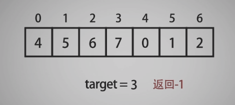
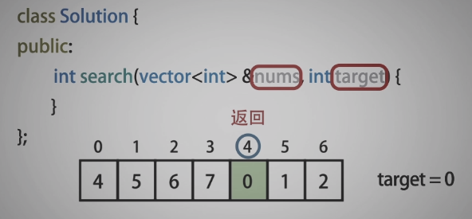
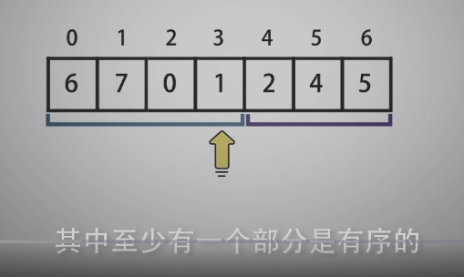
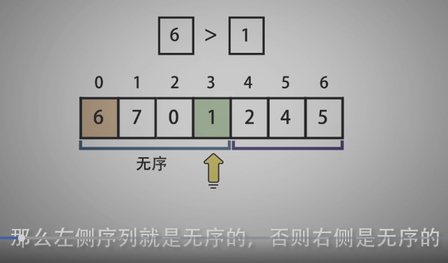
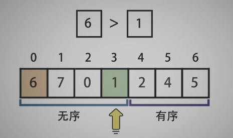
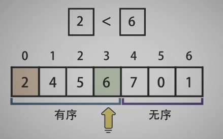
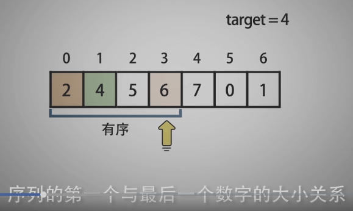
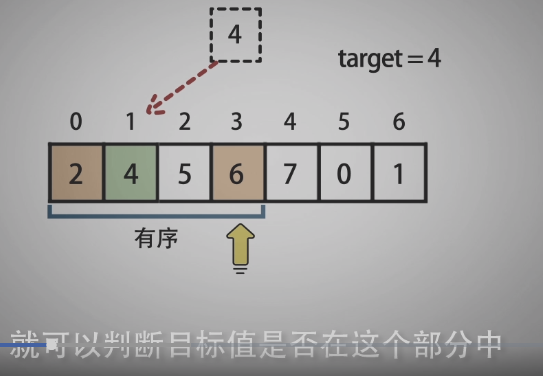
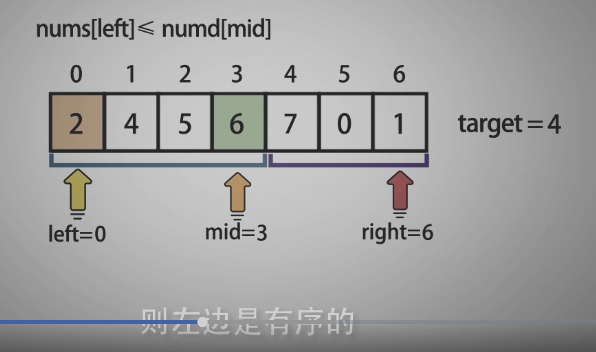
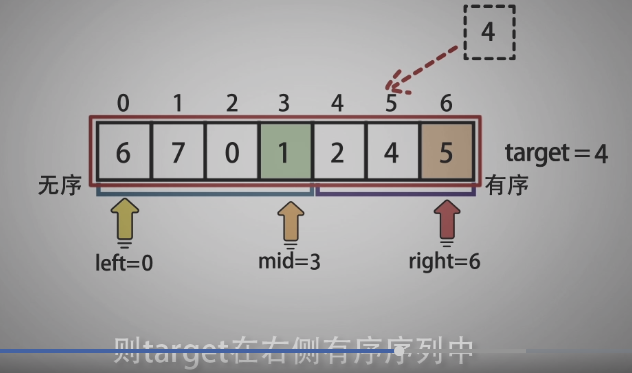

<!--
 * @Date: 2021-12-31 14:57:38
 * @Author: bFeng
-->
搜索旋转排序数组  
Category	Difficulty	Likes	Dislikes  
algorithms	Medium (43.01%)	1749	-  
Tags  
array | binary-search  

Companies  
整数数组 nums 按升序排列，数组中的值 互不相同 。  

在传递给函数之前，nums 在预先未知的某个下标 k（0 <= k < nums.length）上进行了 旋转，使数组变为 [nums[k], nums[k+1], ..., nums[n-1], nums[0], nums[1], ..., nums[k-1]]（下标 从 0 开始 计数）。例如， [0,1,2,4,5,6,7] 在下标 3 处经旋转后可能变为 [4,5,6,7,0,1,2] 。  

给你 旋转后 的数组 nums 和一个整数 target ，如果 nums 中存在这个目标值 target ，则返回它的下标，否则返回 -1 。  

 

示例 1：  
输入：nums = [4,5,6,7,0,1,2], target = 0  
输出：4 


示例 2：
输入：nums = [4,5,6,7,0,1,2], target = 3  
输出：-1  


示例 3：  
输入：nums = [1], target = 0  
输出：-1  
 

提示：  

1 <= nums.length <= 5000  
-10^4 <= nums[i] <= 10^4  
nums 中的每个值都 独一无二  
题目数据保证 nums 在预先未知的某个下标上进行了旋转  
-10^4 <= target <= 10^4  
 

进阶：你可以设计一个时间复杂度为 O(log n) 的解决方案吗？  

Discussion | Solution

--------------------------------------------






















-------------------------------------------
```c
/*
 * @lc app=leetcode.cn id=33 lang=cpp
 *
 * [33] 搜索旋转排序数组
 */
 //------------------自己实现：无序部分递归调用自己-------------------------
// 对旋转数组， 二分法分为两个部分以后， 其中有一部分是有序的，另一部分的是无序的
// @lc code=start
class Solution {
public:
    int search(vector<int>& nums, int target) {
        int res;
        recursion(nums, target, 0, nums.size()-1, res);
        return res;
    }

private:

    bool recursion(std::vector<int>& nums,
                   int& target,
                   int left, int right, int& mid){// mid 为引用只是保存结果的作用
        if(left == right){
            if(nums[left] == target){
                mid = left;
                return true;
            }else{
                mid = -1;
                return false;
            }
        }

        mid = left + (right-left)/2;
        if(target == nums[mid]) return true;

        if(nums[left] <= nums[mid] ){// 左部分有序 
            if(target<nums[mid] && target>=nums[left]){//且 目标值在区间里面
                // 在有序区间里使用二分查找
                return binSearch(nums, target, left, mid - 1, mid);
            }else{// 目标值在右边无序里面
                return recursion(nums, target, mid+1, right, mid);
            }
        }else{// 右部分有序
            if(target>nums[mid] && target<=nums[right]){//且 目标值在区间里面
                // 在有序区间里使用二分查找
                return binSearch(nums, target, mid + 1, right, mid);
            }else{// 目标值在左边无序里面
                return recursion(nums, target, left, mid-1, mid);
            }
        }
        mid = -1;
        return false;
    } 

    bool binSearch(std::vector<int>& nums, int& target, int left, 
                   int right, int& mid){// mid只是传结果出去
        while(left <= right){
            mid = left + (right-left)/2;
            if(target == nums[mid]) return true;
            if(target < nums[mid]){
                right = mid - 1;
            }else if(target > nums[mid]){
                left = mid + 1;
            }
        }
        // while 没找到 mid = -1
        mid = -1;
        return false;
    }


//---------------参考实现----------------------
//--------啊啊啊啊是我把事情想复杂了------------------
    int search(vector<int>& nums, int target) {
        int left = 0;
        int right = nums.size() - 1;

        while(left <= right){
            int mid = left + (right-left)/2;
            if(nums[mid] == target) return mid;
            
            if(nums[left] <= nums[mid]){// 左边有序 右边无序
                // target 在有序序列中
                if(target>=nums[left] && target<nums[mid]){
                    right = mid - 1;
                }else{// target 在右边无序列中
                    left = mid + 1;
                }
            }else{// 左边无序 右边有序
                // target 在有序序列中
                if(target<=nums[right] && target>nums[mid]){
                    left = mid + 1;
                }else{// target 在右边无序列中
                    right = mid - 1;
                }
            }
        }
        return -1;
    }

};
// @lc code=end


```