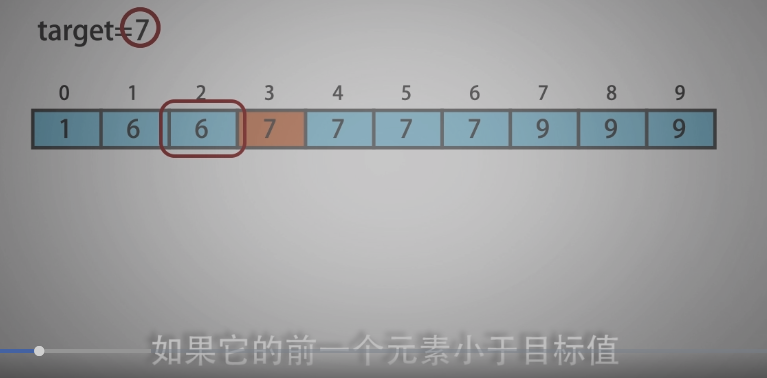

<!--
 * @Date: 2021-12-30 21:41:46
 * @Author: bFeng
-->
在排序数组中查找元素的第一个和最后一个位置  
Category	Difficulty	Likes	Dislikes  
algorithms	Medium (42.27%)	1363	-  
Tags  
array | binary-search  

Companies  
给定一个按照升序排列的整数数组 nums，和一个目标值 target。找出给定目标值在数组中的开始位置和结束位置。  

如果数组中不存在目标值 target，返回 [-1, -1]。  

进阶：  

你可以设计并实现时间复杂度为 O(log n) 的算法解决此问题吗？  
 

示例 1：  
输入：nums = [5,7,7,8,8,10], target = 8  
输出：[3,4] 

示例 2：  
输入：nums = [5,7,7,8,8,10], target = 6  
输出：[-1,-1]  

示例 3：  
输入：nums = [], target = 0  
输出：[-1,-1]  
 

提示：  

0 <= nums.length <= 105  
-109 <= nums[i] <= 109  
nums 是一个非递减数组  
-109 <= target <= 109  
Discussion | Solution   

-------------------------------

- 两次二分查找，分别查找 起始 和 终止 位置

- 观察起始 和 终止 位置的性质。  

 
 