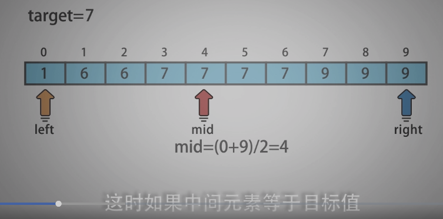
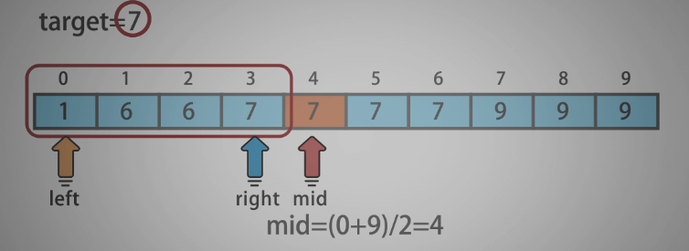
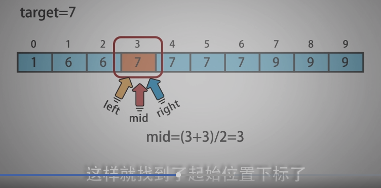
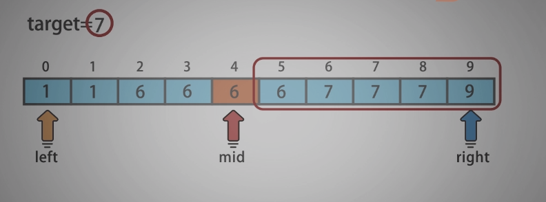
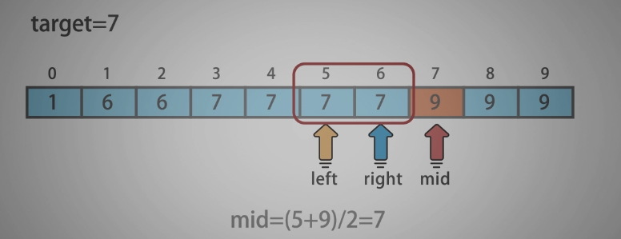
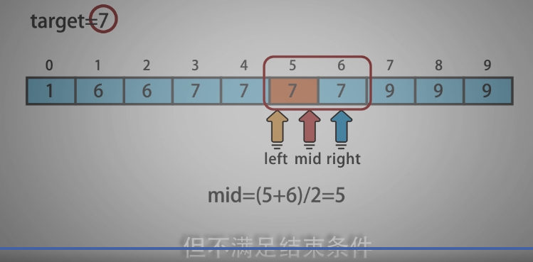

<!--
 * @Date: 2021-12-30 21:41:46
 * @Author: bFeng
-->
在排序数组中查找元素的第一个和最后一个位置  
Category	Difficulty	Likes	Dislikes  
algorithms	Medium (42.27%)	1363	-  
Tags  
array | binary-search  

Companies  
给定一个按照升序排列的整数数组 nums，和一个目标值 target。找出给定目标值在数组中的开始位置和结束位置。  

如果数组中不存在目标值 target，返回 [-1, -1]。  

进阶：  

你可以设计并实现时间复杂度为 O(log n) 的算法解决此问题吗？  
 

示例 1：  
输入：nums = [5,7,7,8,8,10], target = 8  
输出：[3,4] 


示例 2：  
输入：nums = [5,7,7,8,8,10], target = 6  
输出：[-1,-1]  


示例 3：  
输入：nums = [], target = 0  
输出：[-1,-1]  
 

提示：  

0 <= nums.length <= 105  
-109 <= nums[i] <= 109  
nums 是一个非递减数组  
-109 <= target <= 109  
Discussion | Solution   

-------------------------------

- 两次二分查找，分别查找 起始 和 终止 位置

- 观察起始 和 终止 位置的性质。  

 














 ----------------------------

 ```c
/*
 * @lc app=leetcode.cn id=34 lang=cpp
 *
 * [34] 在排序数组中查找元素的第一个和最后一个位置
 */

// @lc code=start
class Solution {
public:
    vector<int> searchRange(vector<int>& nums, int target) {
        std::vector<int> res{-1,-1};
        int left = 0;
        int right = nums.size() - 1;
        int mid;
        // 左端点
        while(left <= right){
            mid = left + (right - left)/2;
            if(target == nums[mid]){//中间元素等于目标元素
                // 左端点性质， 注意左端点可能为第一位
                // 结束条件： target == nums[mid] && nums[mid-1] < target
                // mid==0 要写在前面， 利用 ||  短路逻辑， 当只有一个元素的时候 mid-1 不会报错
                if(mid==0 || nums[mid-1]<target){
                    res[0] = mid;
                    break;
                }
                right = mid - 1;//重复（多个元素等于target）等于target 左移找左端点
            }else if(target < nums[mid]){
                right = mid - 1;
            }else if(target > nums[mid]){
                left = mid + 1;
            }
        }

        // 重置数组指针
        left = 0;
        right = nums.size() - 1;

        // 右端点
        while(left <= right){
            mid = left + (right - left)/2;
            if(target == nums[mid]){//中间元素等于目标元素
                // 右端点性质， 注意右端点可能为最后一位
                // 结束条件： target == nums[mid] && nums[mid+1] > target
                // mid == nums.size()-1 要写在前面， 利用 ||  短路逻辑， 当只有一个元素的时候 mid-1 不会报错
                if(mid == nums.size()-1 || nums[mid+1]>target ){
                    res[1] = mid;
                    break;
                }
                left = mid + 1;// 重复（多个元素等于target）等于target 右移 找右端点
            }else if(target < nums[mid]){
                right = mid - 1;
            }else if(target > nums[mid]){
                left = mid + 1;
            }
        }

        return res;
    }
};
// @lc code=end


 ```