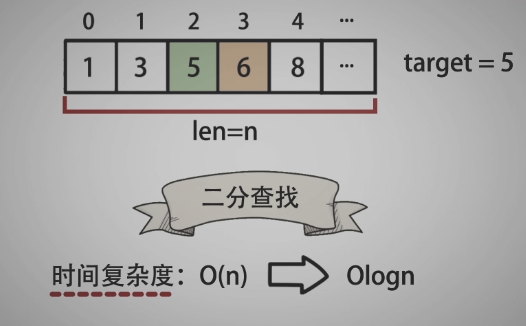
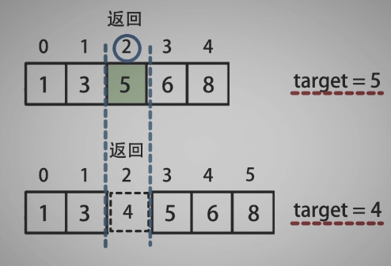
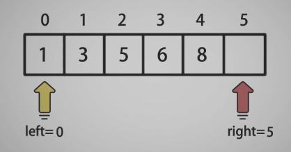
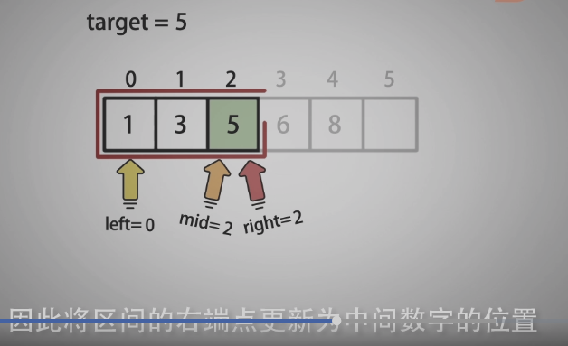
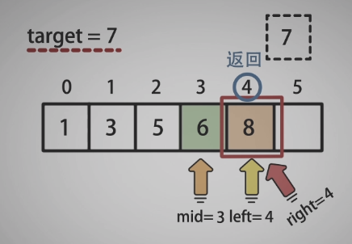

<!--
 * @Date: 2021-12-30 20:59:30
 * @Author: bFeng
-->

 
搜索插入位置  
Category	Difficulty	Likes	Dislikes  
algorithms	Easy (45.94%)	1248	-  
Tags  
array | binary-search  

Companies  
给定一个排序数组和一个目标值，在数组中找到目标值，并返回其索引。如果目标值不存在于数组中，返回它将会被按顺序插入的位置。  

请必须使用时间复杂度为 O(log n) 的算法。  

 

示例 1:
输入: nums = [1,3,5,6], target = 5    
输出: 2    


  
示例 2:   
输入: nums = [1,3,5,6], target = 2  
输出: 1  


示例 3:  
输入: nums = [1,3,5,6], target = 7  
输出: 4  


示例 4:  
输入: nums = [1,3,5,6], target = 0  
输出: 0  


示例 5:  
输入: nums = [1], target = 0  
输出: 0  
 

提示:

1 <= nums.length <= 104  
-104 <= nums[i] <= 104  
nums 为无重复元素的升序排列数组  
-104 <= target <= 104  
Discussion | Solution  

------------------------------











----------------------------------
```c
/*
 * @lc app=leetcode.cn id=35 lang=cpp
 *
 * [35] 搜索插入位置
 */

// @lc code=start
//  ------------时间复杂度 O(n)----------------
class Solution {
public:
    int searchInsert(vector<int>& nums, int target) {
        if(nums.empty()) return 0;
        int res;
        for(int i=0; i<nums.size(); i++){
            if(nums[i] == target || nums[i]>target){
                res = i;
                break;
            }
        }
        return res;
    }

    // ------------------时间复杂度 O(logn)------------
    int searchInsert(vector<int>& nums, int target) {
        if(nums.empty()) return 0;
        int left = 0;
        int right = nums.size();
        while(left != right){
            int mid = left + (right - left)/2;
            if(nums[mid] >= target){// >=
                right = mid;
            }else{
                left = mid + 1;
            }
        }
        return left;
    }
};
// @lc code=end


```