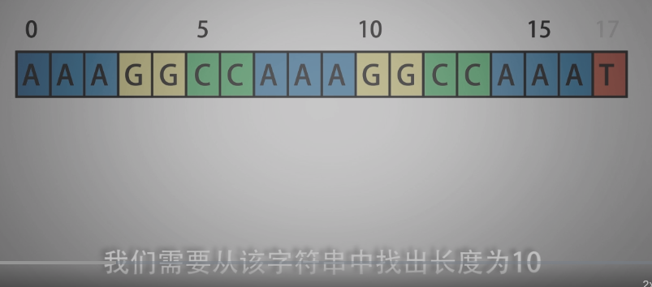
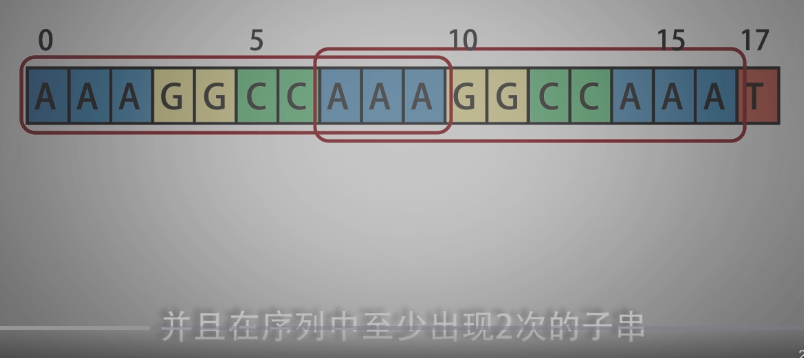
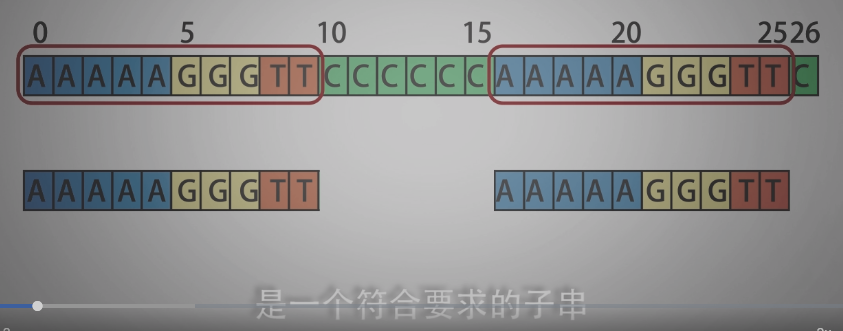
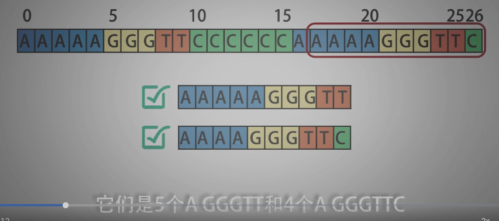
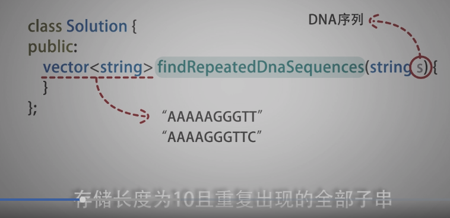
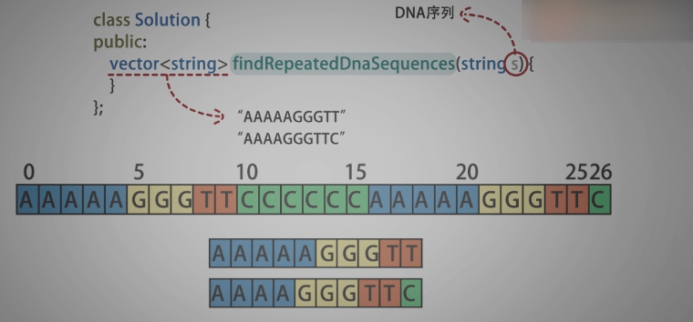
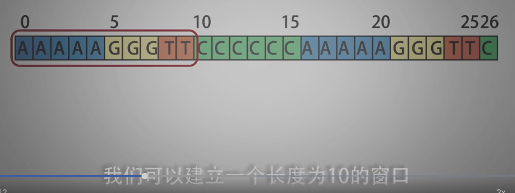

<!--
 * @Date: 2022-01-02 22:56:22
 * @Author: bFeng
-->
重复的DNA序列  
Category	Difficulty	Likes	Dislikes  
algorithms	Medium (52.20%)	318	-  
Tags  
Companies  
所有 DNA 都由一系列缩写为 'A'，'C'，'G' 和 'T' 的核苷酸组成，例如："ACGAATTCCG"。在研究 DNA 时，识别 DNA 中的重复序列有时会对研究非常有帮助。  

编写一个函数来找出所有目标子串，目标子串的长度为 10，且在 DNA 字符串 s 中出现次数超过一次。  

 

示例 1：  
输入：s = "AAAAACCCCCAAAAACCCCCCAAAAAGGGTTT"  
输出：["AAAAACCCCC","CCCCCAAAAA"]  

示例 2：  
输入：s = "AAAAAAAAAAAAA"  
输出：["AAAAAAAAAA"]  
 

提示：  

0 <= s.length <= 105  
s[i] 为 'A'、'C'、'G' 或 'T'  
Discussion | Solution  

Code Now


------------------------------
















---------------------------------


```c
/*
 * @lc app=leetcode.cn id=187 lang=cpp
 *
 * [187] 重复的DNA序列
 */

// @lc code=start
// ------------主要思想在于滑动窗口----------
class Solution {
public:
    vector<string> findRepeatedDnaSequences(string s) {
        const int WIN_LEN = 10;
        std::vector<std::string> all_str;
        std::vector<std::string> res_str;

        for(int i=0; i<s.size(); i++){
            if( i+WIN_LEN > s.size()) break;
            all_str.push_back(s.substr(i, WIN_LEN));
        }

        std::map<std::string, int> map_cnt;
        std::set<std::string> res_set;//利用set去重
        for(int i=0; i<all_str.size(); i++){
            if(map_cnt.find(all_str[i]) != map_cnt.end()){
                res_set.insert(all_str[i]);
            }
            map_cnt[all_str[i]] ++;
        }

        for(const auto& str : res_set){
            res_str.push_back(str);
        }
        return res_str;
    }
};
// @lc code=end


// -------------参考： 不需使用set去重，考察map的值就行, all_str也可以简化---------------
class Solution {
public:
    vector<string> findRepeatedDnaSequences(string s) {
        const int WIN_LEN = 10;
        std::vector<std::string> res_str;
        std::map<std::string, int> map_cnt;

        for(int i=0; i<s.size(); i++){
            if( i+WIN_LEN > s.size()) break;
            map_cnt[s.substr(i, WIN_LEN)] ++;
        }

        for(const auto& str : map_cnt){
            if(str.second > 1){
                res_str.push_back(str.first);
            }
        }
        return res_str;
    }
};

```