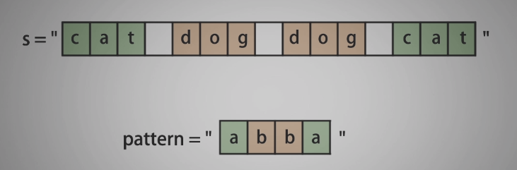
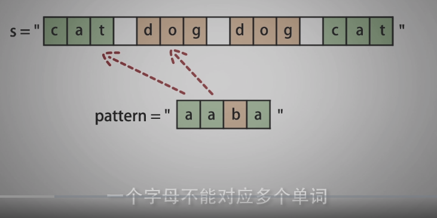
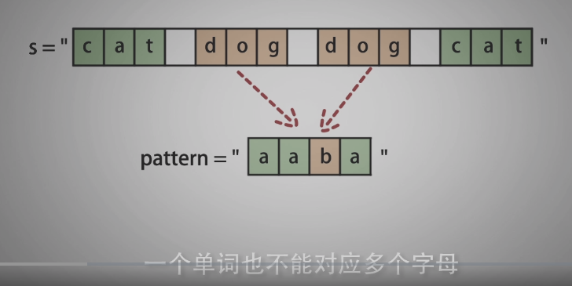
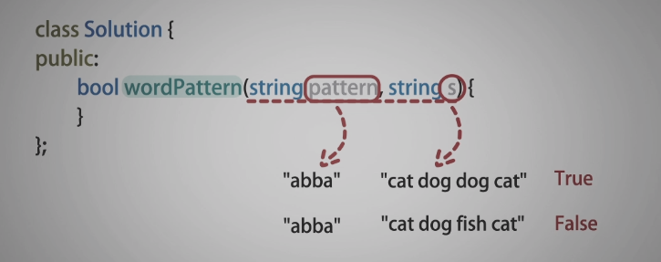
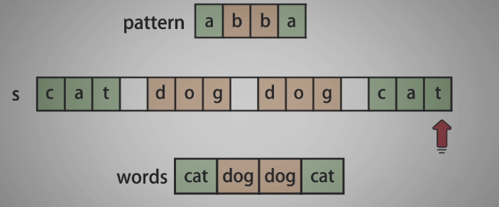
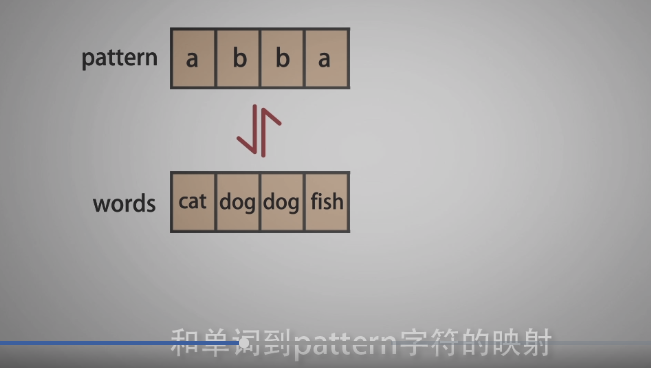
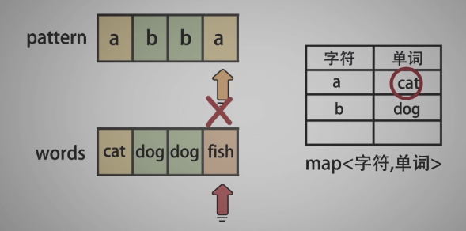
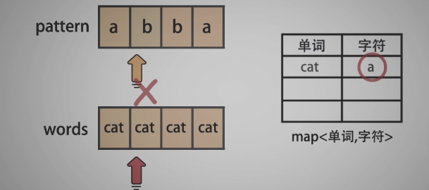
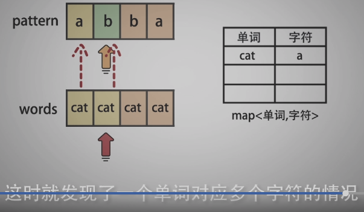

<!--
 * @Date: 2022-01-02 21:33:40
 * @Author: bFeng
-->
单词规律  
Category	Difficulty	Likes	Dislikes  
algorithms	Easy (45.56%)	415	-  
Tags  
Companies  
给定一种规律 pattern 和一个字符串 str ，判断 str 是否遵循相同的规律。  

这里的 遵循 指完全匹配，例如， pattern 里的每个字母和字符串 str 中的每个非空单词之间存在着双向连接的对应规律。

示例1:  
输入: pattern = "abba", str = "dog cat cat dog"  
输出: true  


示例 2:  
输入:pattern = "abba", str = "dog cat cat fish"  
输出: false  

示例 3:  
输入: pattern = "aaaa", str = "dog cat cat dog"  
输出: false

示例 4:  
输入: pattern = "abba", str = "dog dog dog dog"  
输出: false  


说明:  
你可以假设 pattern 只包含小写字母， str 包含了由单个空格分隔的小写字母。      

Discussion | Solution  

-------------------------




















-------------------------


```c
/*
 * @lc app=leetcode.cn id=290 lang=cpp
 *
 * [290] 单词规律
 */

// @lc code=start
class Solution {
public:
    bool wordPattern(string pattern, string s) {
        std::vector<std::string> words;
        str2word(s, words);
        if(pattern.size() != words.size()) return false;
        // 双向检查，一个字母不能对应多个单词，一个单词也不能对应多个字母
        std::map<char, std::string> map_pw;
        std::map<std::string, char> map_wp;

        for(int i=0; i<pattern.size(); i++){
            if(map_pw.find(pattern[i]) != map_pw.end() 
                    && map_pw[pattern[i]] != words[i]){
                return false;
            }
            if(map_wp.find(words[i]) != map_wp.end() 
                    && map_wp[words[i]] != pattern[i]){
                return false;
            }

            map_pw[pattern[i]] = words[i];
            map_wp[words[i]] = pattern[i];
        }

    return true;
    }

private:
    void str2word(const std::string& str, std::vector<std::string>& words){
        if(str==""){
            words.push_back(str);
            return;
        }
        std::string word = "";
        for(const auto& ch : str){
            if(ch == ' ' && word != ""){
                words.push_back(word);
                word = "";
                continue;
            }
            word += ch;
        }
        words.push_back(word);// 注意保存最后一个单词
        // for debug
        for(const auto& str : words){
            std::cout<<str<<std::endl;
        }
        std::cout<<words.size()<<std::endl;
    }
};
// @lc code=end

```