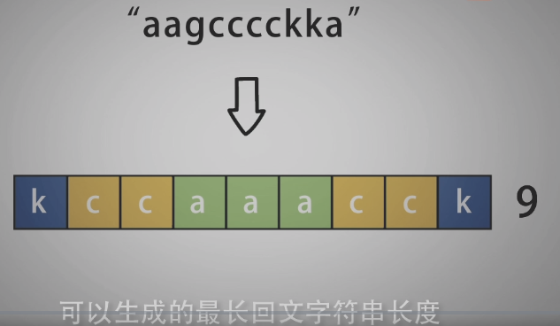
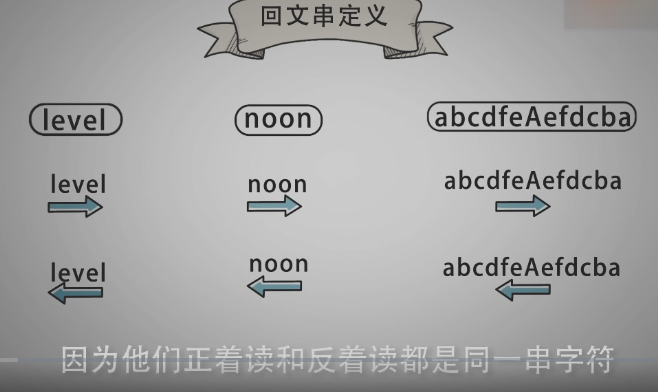
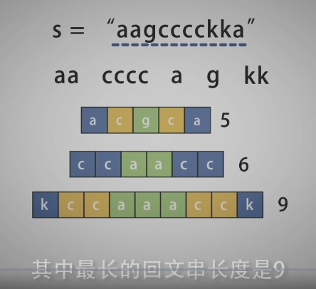
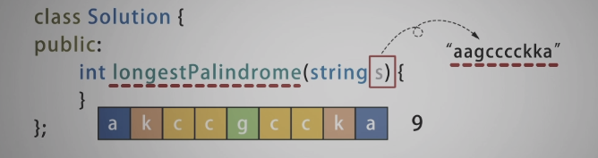
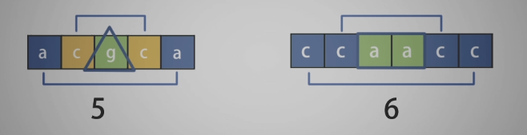
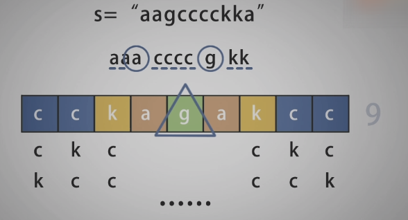
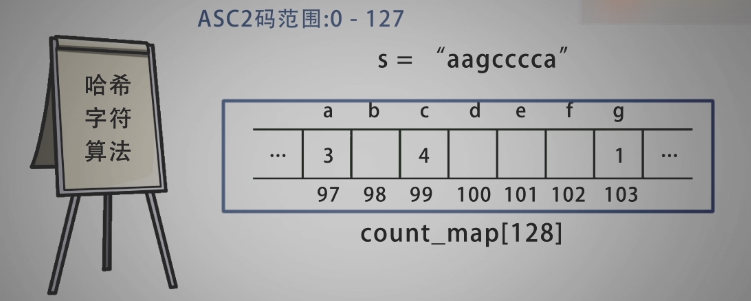

<!--
 * @Date: 2021-12-31 17:01:48
 * @Author: bFeng
-->


最长回文串  
Category	Difficulty	Likes	Dislikes  
algorithms	Easy (55.58%)	367	-  
Tags  
hash-table  

Companies  
google  

给定一个包含大写字母和小写字母的字符串，找到通过这些字母构造成的最长的回文串。  

在构造过程中，请注意区分大小写。比如 "Aa" 不能当做一个回文字符串。  

注意:  
假设字符串的长度不会超过 1010。  

示例 1:  

输入:  
"abccccdd"  

输出:  
7  

解释:    
我们可以构造的最长的回文串是"dccaccd", 它的长度是 7。  
Discussion | Solution  

-----------------------------------
















```c
/*
 * @lc app=leetcode.cn id=409 lang=cpp
 *
 * [409] 最长回文串
 */

// @lc code=start
//-------------自己实现--------
class Solution {
public:
    int longestPalindrome(std::string s) {
        int cnt_map[128] = {0};
        for (const auto& i : s){
            cnt_map[i] ++;
        }
        bool hasOdd = false;
        int res = 0;
        for(int i=0; i<128; i++){
            if(cnt_map[i]%2){//奇数
                hasOdd = true;
                res += (cnt_map[i]-1);
            }else{
                res += cnt_map[i];
            }
        }
        if(hasOdd) return res+1;
        return res;
    }
};
// @lc code=end


```