<!--
 * @Date: 2022-01-03 00:50:43
 * @Author: bFeng
-->


三角形最小路径和  
Category	Difficulty	Likes	Dislikes  
algorithms	Medium (68.30%)	925	-  
Tags  
array | dynamic-programming  

Companies  
给定一个三角形 triangle ，找出自顶向下的最小路径和。  

每一步只能移动到下一行中相邻的结点上。相邻的结点 在这里指的是 下标 与 上一层结点下标 相同或者等于 上一层结点下标 + 1 的两个结点。也就是说，如果正位于当前行的下标 i ，那么下一步可以移动到下一行的下标 i 或 i + 1 。  


示例 1：  
输入：triangle = \[[2],[3,4],[6,5,7],[4,1,8,3]]  
输出：11  
解释：如下面简图所示：  
```
   2  
  3 4  
 6 5 7  
4 1 8 3  
```
自顶向下的最小路径和为 11（即，2 + 3 + 5 + 1 = 11）。  

示例 2：  
输入：triangle = \[[-10]]  
输出：-10  
 

提示：  

1 <= triangle.length <= 200  
triangle[0].length == 1  
triangle[i].length == triangle[i - 1].length + 1  
-104 <= triangle[i][j] <= 104  
 

进阶：  

你可以只使用 O(n) 的额外空间（n 为三角形的总行数）来解决这个问题吗？  
Discussion | Solution  

----------------------------------

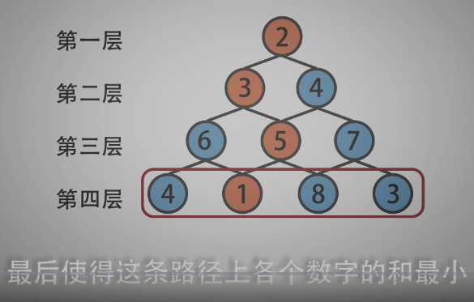

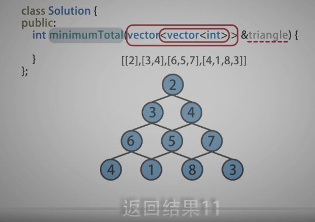

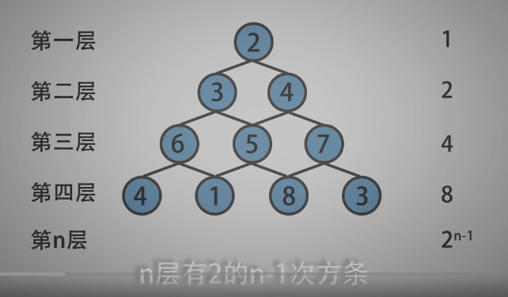

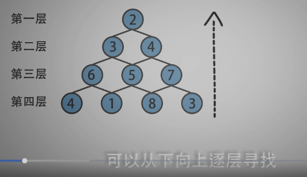

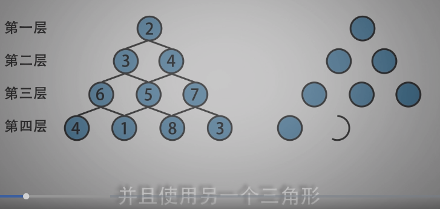

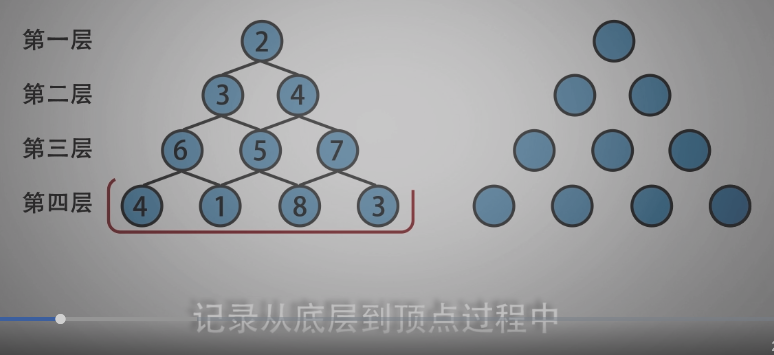

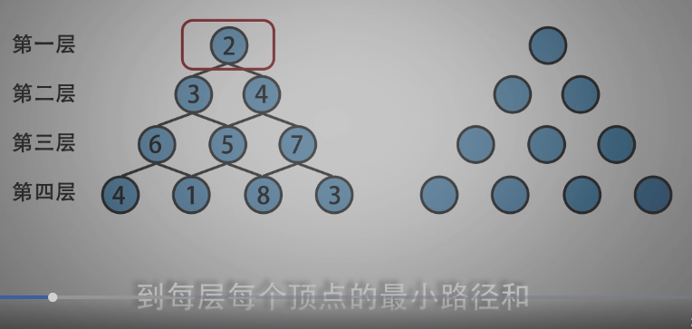

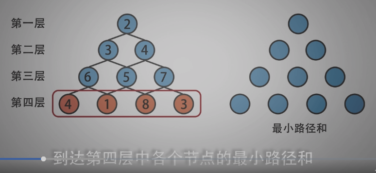

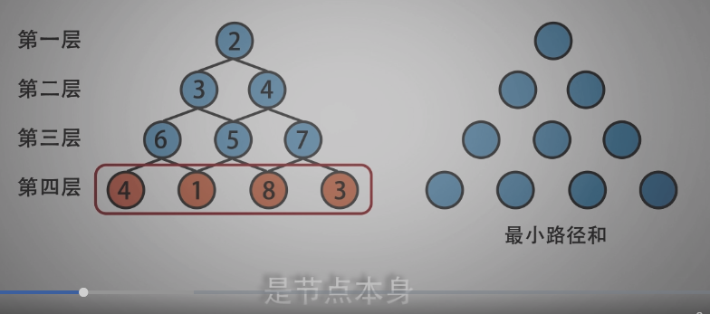

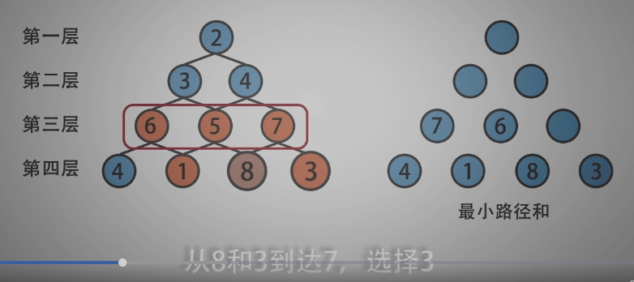

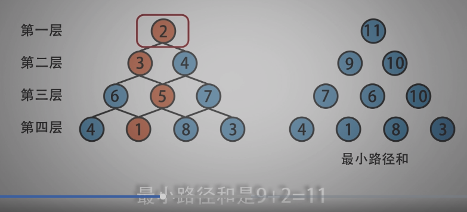

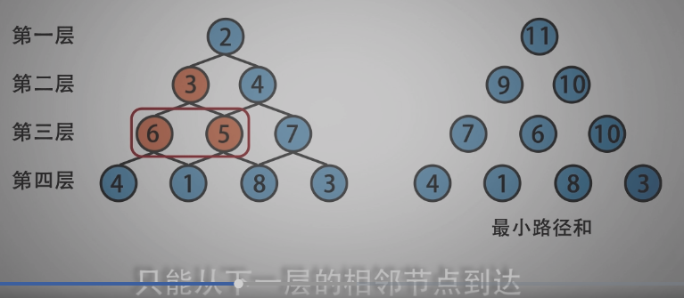

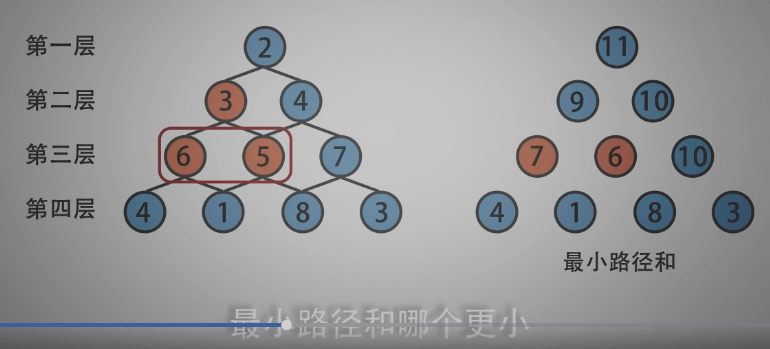

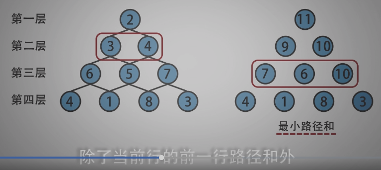

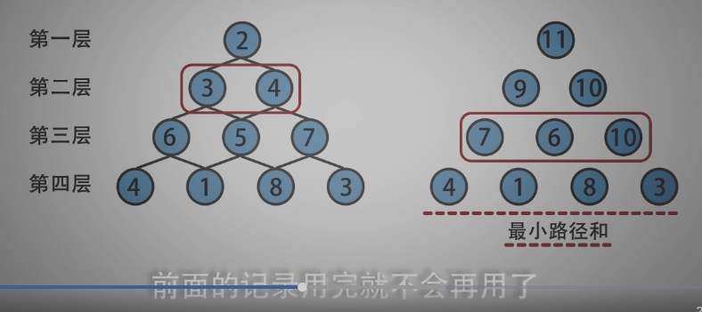

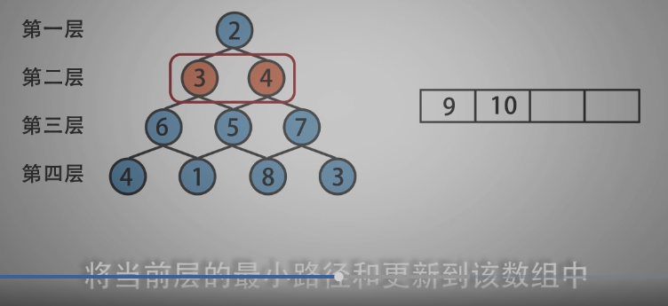

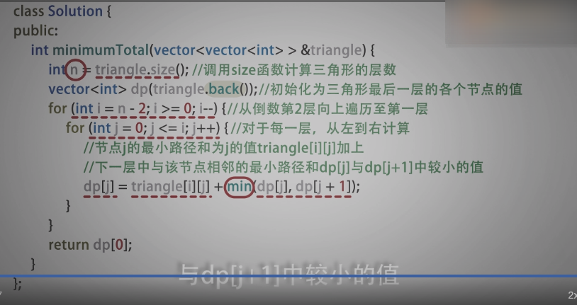

-----------------------------------

```c
/*
 * @lc app=leetcode.cn id=120 lang=cpp
 *
 * [120] 三角形最小路径和
 * 重点思想在：倒着看！
 */
/*
*/
// @lc code=start
class Solution {
public:
    int minimumTotal(vector<vector<int>>& triangle) {
        if(triangle.empty()) return 0;
        if(triangle.size() == 1) return triangle[0][0];

        std::vector<std::vector<int>> tri = triangle;
        for(int i=tri.size()-2; i>=0; i--){
            for(int j=0; j<tri[i].size(); j++){
                // 转移方程
                tri[i][j] += tri[i+1][j]<tri[i+1][j+1] ? tri[i+1][j] : tri[i+1][j+1];
            }
        }
        return tri[0][0];
    }
};

//-------参考实现：倒着计算时，实际上只和上一状态的值有关，所有只申请一个一维数组就行----

// @lc code=start
class Solution {
public:
    int minimumTotal(vector<vector<int>>& triangle) {
        if(triangle.empty()) return 0;
        if(triangle.size() == 1) return triangle[0][0];

        std::vector<int> tri = triangle[triangle.size()-1];
        for(int i=triangle.size()-2; i>=0; i--){
            for(int j=0; j<triangle[i].size(); j++){
                tri[j] = triangle[i][j] + (tri[j]<tri[j+1] ? tri[j] : tri[j+1]);
            }
        }
        return tri[0];
    }

};


```


