<!--
 * @Date: 2022-01-03 11:42:26
 * @Author: bFeng
-->
零钱兑换  
Category	Difficulty	Likes	Dislikes  
algorithms	Medium (44.78%)	1630	-  
Tags  
dynamic-programming 

Companies   
给你一个整数数组 coins ，表示不同面额的硬币；以及一个整数 amount ，表示总金额。  

计算并返回可以凑成总金额所需的 最少的硬币个数 。如果没有任何一种硬币组合能组成总金额，返回 -1 。  

你可以认为每种硬币的数量是无限的。  

 

示例 1：  
输入：coins = [1, 2, 5], amount = 11  
输出：3   
解释：11 = 5 + 5 + 1  

示例 2：  
输入：coins = [2], amount = 3  
输出：-1  


示例 3：  
输入：coins = [1], amount = 0  
输出：0  

示例 4：  
输入：coins = [1], amount = 1  
输出：1  

示例 5：  
输入：coins = [1], amount = 2  
输出：2  
 

提示：  

1 <= coins.length <= 12  
1 <= coins[i] <= 231 - 1  
0 <= amount <= 104  
Discussion | Solution  

--------------------------------------------------

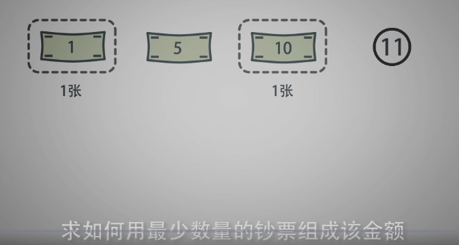

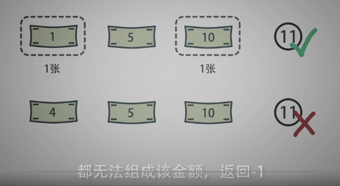

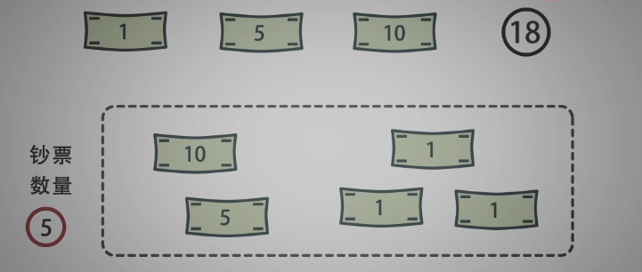

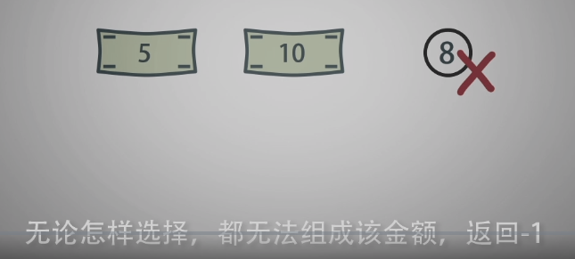

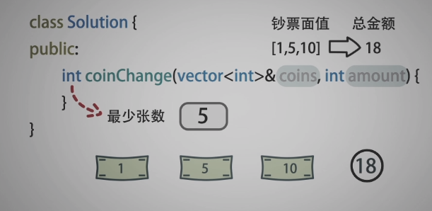

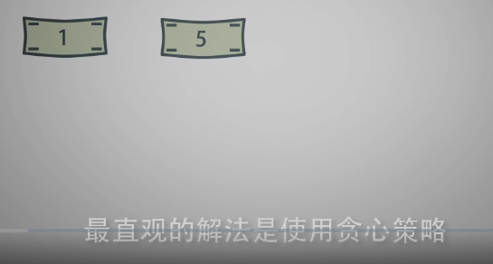

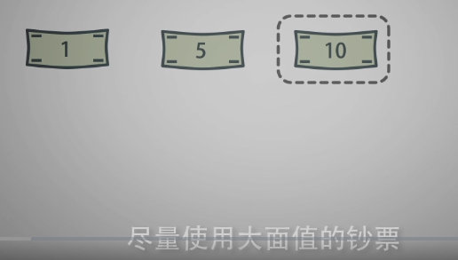

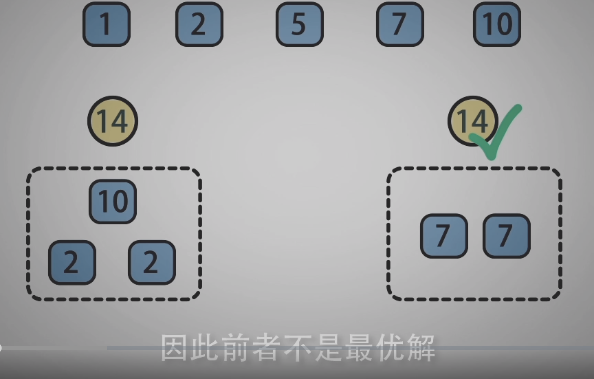

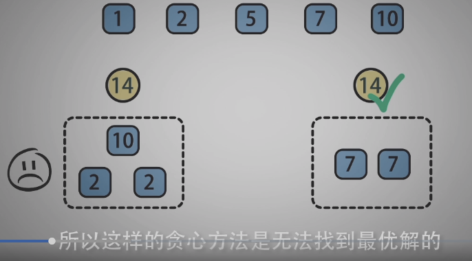

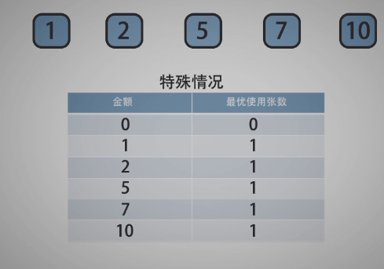

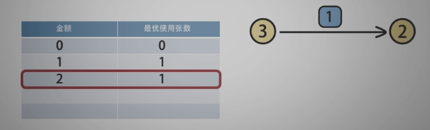

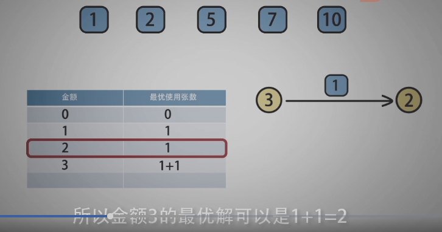

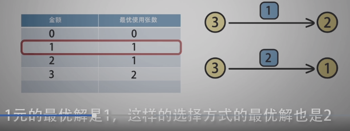

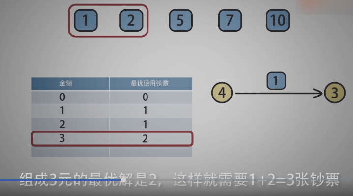

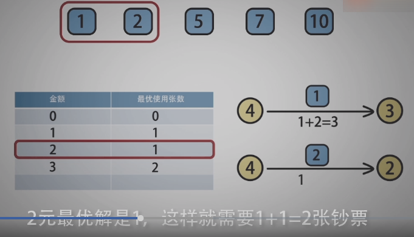

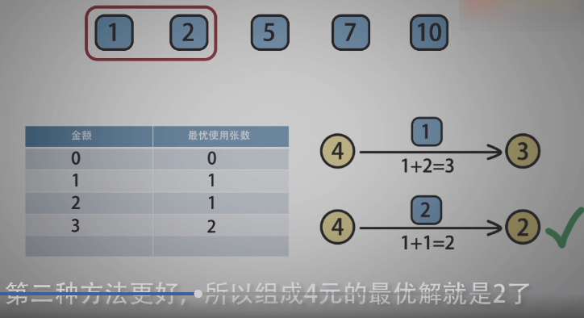

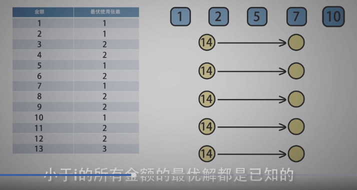

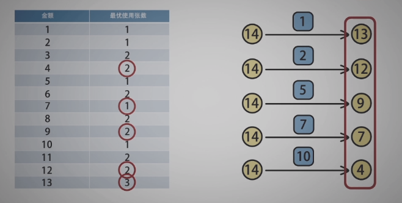

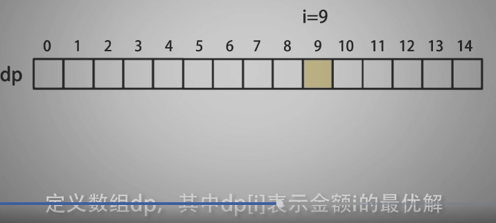

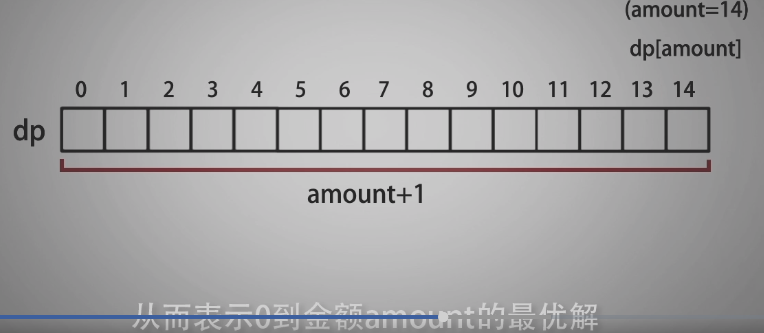

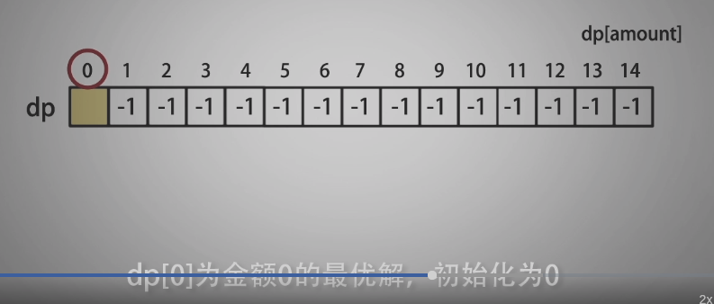

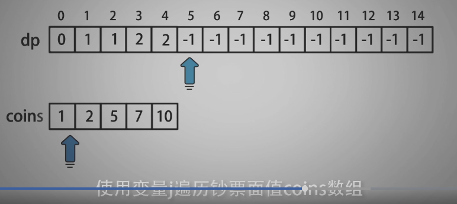

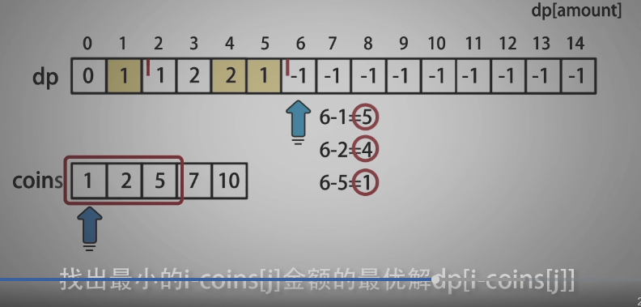

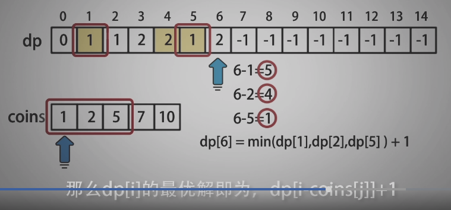

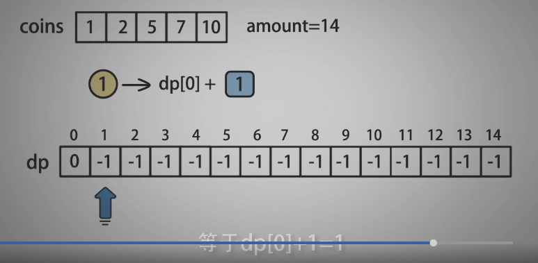


--------------------------------------------------

```c
/*
 * @lc app=leetcode.cn id=322 lang=cpp
 *
 * [322] 零钱兑换
 */

// @lc code=start
class Solution {
public:
    int coinChange(vector<int>& coins, int amount) {
        // 索引为amount  值为最优解
        std::vector<int> opt_nums(amount+1, -1);
        opt_nums[0] = 0;

        // 索引 i 为 amount 金额
        for(int i=1; i<= amount; i++){
            // 对于每个金额 i ，使用变量 j 遍历面值 coins 数组
            for(int j=0; j<coins.size(); j++){
                // 所有小于等于 i 的面值 coins[j]
                // 如果金额 i-coins[j] 有最优解
                if(coins[j]<=i && opt_nums[i-coins[j]] !=-1){
                    // 如果，当前金额还未计算
                    // 或者 opt_nums[i] 比正在计算的最优解大
                    if(opt_nums[i]==-1 || opt_nums[i] > opt_nums[i-coins[j]]+1){
                        opt_nums[i] = opt_nums[i-coins[j]] + 1;// 更新opt_nums[i]
                    }
                }
            }
        }

        return opt_nums[amount];
    }

};
// @lc code=end
```