<!--
 * @Date: 2022-01-03 02:54:27
 * @Author: bFeng
-->


最大子数组和  
Category	Difficulty	Likes	Dislikes  
algorithms	Easy (55.28%)	4160	-  
Tags  
array | divide-and-conquer | dynamic-programming  

Companies  
bloomberg | linkedin | microsoft  

给你一个整数数组 nums ，请你找出一个具有最大和的连续子数组（子数组最少包含一个元素），返回其最大和。  

子数组 是数组中的一个连续部分。  

 

示例 1：  
输入：nums = \[-2,1,-3,4,-1,2,1,-5,4]  
输出：6  
解释：连续子数组 [4,-1,2,1] 的和最大，为 6 。


示例 2：  
输入：nums = [1]  
输出：1  

示例 3：  
输入：nums = [5,4,-1,7,8]  
输出：23  
 

提示：  
1 <= nums.length <= 105  
-104 <= nums[i] <= 104   
 

进阶：如果你已经实现复杂度为 O(n) 的解法，尝试使用更为精妙的 分治法 求解。  

Discussion | Solution  

--------------------------------
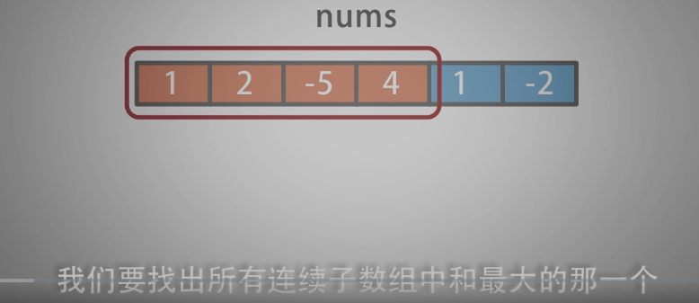

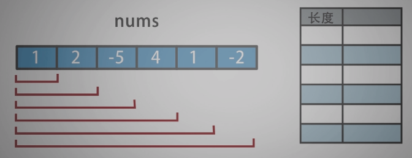

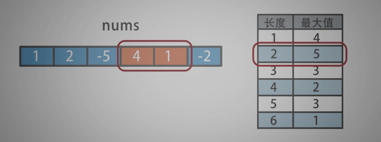

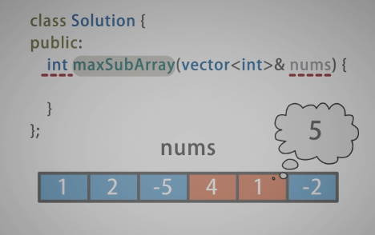

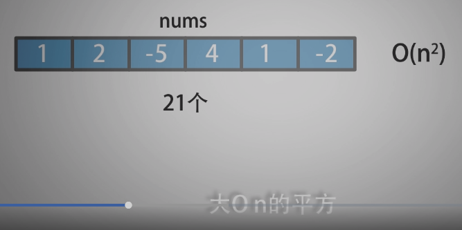

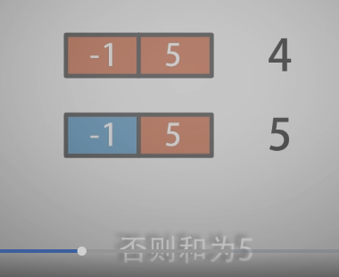

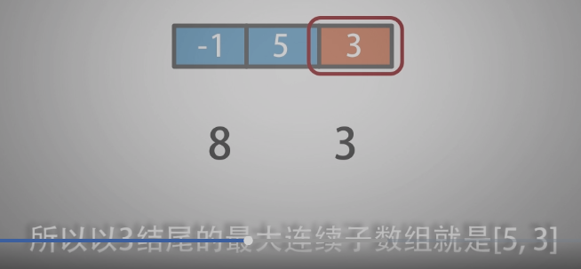

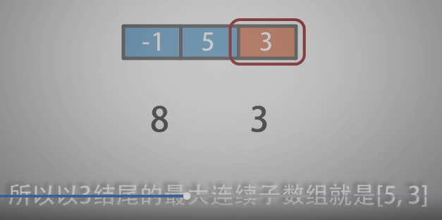

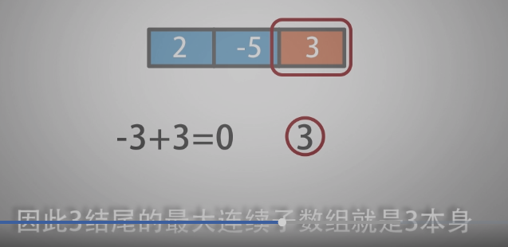

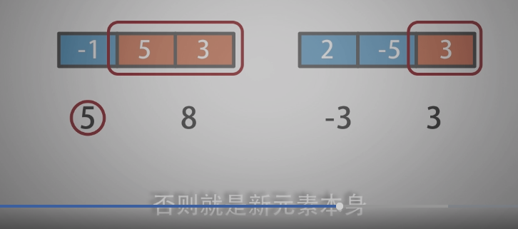

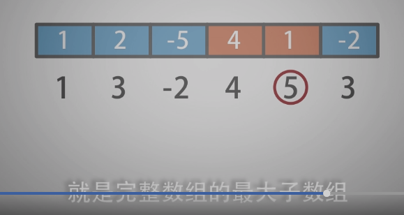

--------------------------------


采用分治的方法实现，先把数组用中点分为左右两个子数组，这样最大和子数组存在三种情况：

（1）在左边的子数组；  
（2）在右边的子数组；  
（3）跨过中点，左边子数组的右半部分（也可能是全部）和右边数组的左半部分（也可能是全部）。


对于前两种情况，无论哪一种，直接递归下去，而第三种情况，可以根据中点继续分成左半部分和右半部分，左边从中点向左求出最大和，右边从中点向右求出最大和，然后相加。这样三种情况就都可以处理了，每次取处理后的最大值就可以了。


---------------------------------

```c
/*
 * @lc app=leetcode.cn id=53 lang=cpp
 *
 * [53] 最大子数组和
 */
// ------------------暴力法：O(n^2)  超时-------------------
// @lc code=start
class Solution {
public:
    int maxSubArray(vector<int>& nums) {
        std::vector<int> sub_sum;
        subArray(nums, sub_sum);
        sort(sub_sum.begin(), sub_sum.end(), [&](const auto& a, const auto& b){
            return a > b;
        });    
        return sub_sum[0];    
    }

private:
    void subArray(const std::vector<int>& nums, 
                  std::vector<int>& sub_sum){
        std::vector<std::vector<int>> sub_array;
        for(int win_len=1; win_len<=nums.size(); win_len++){
            for(int j=0; j<=nums.size(); j++){
                if(j+win_len>nums.size()) break;
                std::vector<int> tmp(nums.begin()+j, nums.begin()+j+win_len);
                sub_array.push_back(tmp);
                tmp.clear();
            }
        }

        for(int i=0; i<sub_array.size(); i++){
            sub_sum.push_back(accumulate(sub_array[i].begin(), sub_array[i].end(), 0));
        }
    }

};
// @lc code=end

//------------------动态规划思想：时间复杂度： O(n)--------------------
// @lc code=start
class Solution {
public:
    int maxSubArray(vector<int>& nums) {
        std::vector<int> sub_sum;
        // 注意没定义数组大小时，不要 index 访问
        sub_sum.push_back(nums[0]);
        for(int i=1; i<nums.size(); i++){
            if(sub_sum[i-1]>0){
                sub_sum.push_back(sub_sum[i-1] + nums[i]);
            }else{
            // 如果前面的都小于 0 了，没必要考虑它了，没利用价值了，嗐，没了价值，数组都会被抛弃
                sub_sum.push_back(nums[i]);
            }
        }
        sort(sub_sum.begin(), sub_sum.end(), [&](const auto& a, const auto& b){
            return a > b;
        });    
        return sub_sum[0];    
    }
};
// @lc code=end

```