<!--
 * @Date: 2022-01-03 21:35:30
 * @Author: bFeng
-->
单词接龙
Category	Difficulty	Likes	Dislikes  
algorithms	Hard (47.13%)	926	-  
Tags  
breadth-first-search  

Companies  
amazon | facebook | linkedin | snapchat | yelp  

字典 wordList 中从单词 beginWord 和 endWord 的 转换序列 是一个按下述规格形成的序列：  

序列中第一个单词是 beginWord 。  
序列中最后一个单词是 endWord 。   
每次转换只能改变一个字母。  
转换过程中的中间单词必须是字典 wordList 中的单词。  
给你两个单词 beginWord 和 endWord 和一个字典 wordList ，找到从 beginWord 到 endWord 的 最短转换序列 中的 单词数目 。  如果不存在这样的转换序列，返回 0。  

 
示例 1：  
输入：beginWord = "hit", endWord = "cog", wordList = \["hot","dot","dog","lot","log","cog"]  
输出：5  
解释：一个最短转换序列是 "hit" -> "hot" -> "dot" -> "dog" -> "cog", 返回它的长度 5。  


示例 2：  
输入：beginWord = "hit", endWord = "cog", wordList = \["hot","dot","dog","lot","log"]  
输出：0  
解释：endWord "cog" 不在字典中，所以无法进行转换。  
 

提示：  

1 <= beginWord.length <= 10  
endWord.length == beginWord.length  
1 <= wordList.length <= 5000  
wordList[i].length == beginWord.length  
beginWord、endWord 和 wordList[i] 由小写英文字母组成  
beginWord != endWord  
wordList 中的所有字符串 互不相同  
Discussion | Solution  

--------------------------------------

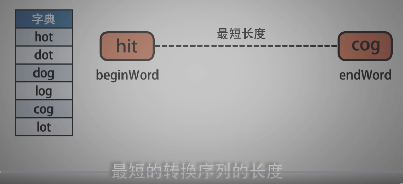

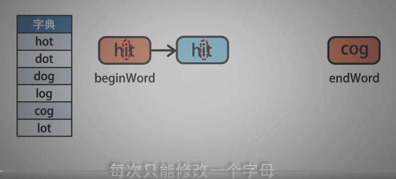

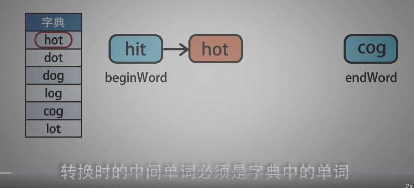

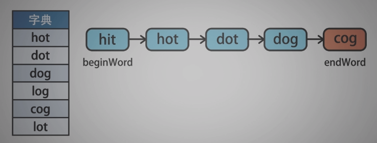

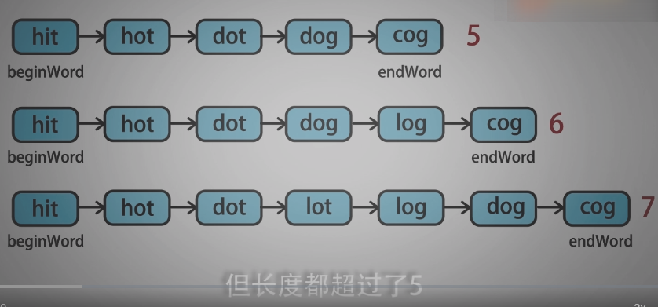

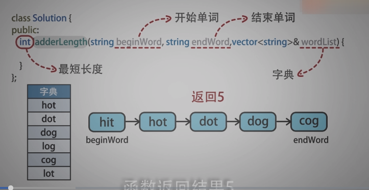

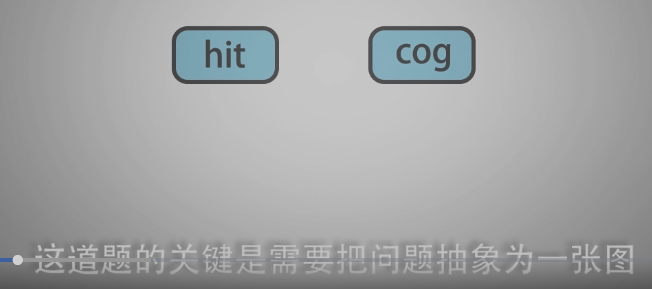

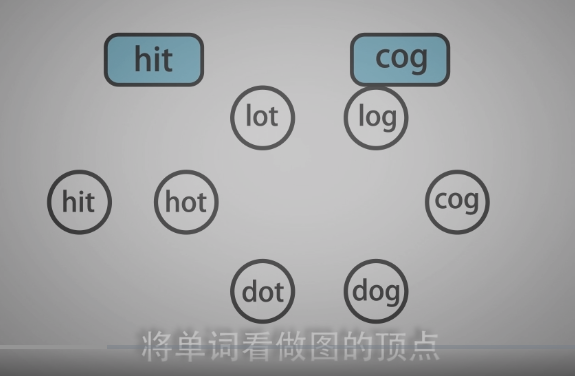

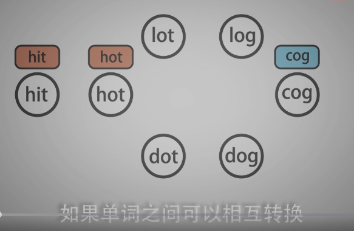

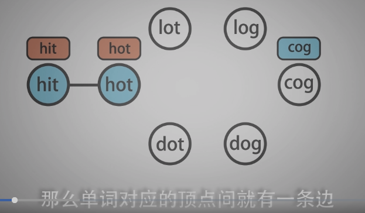

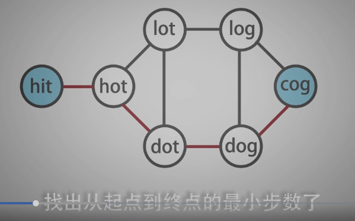

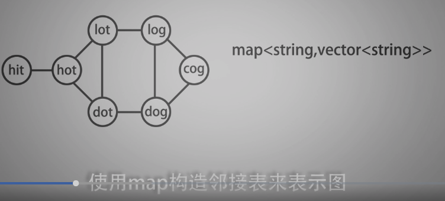

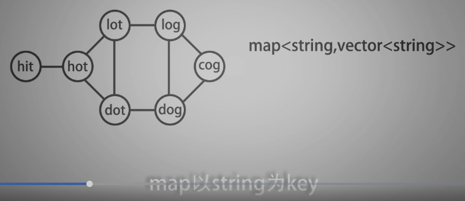

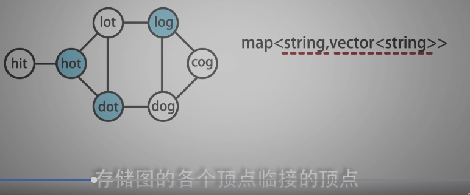

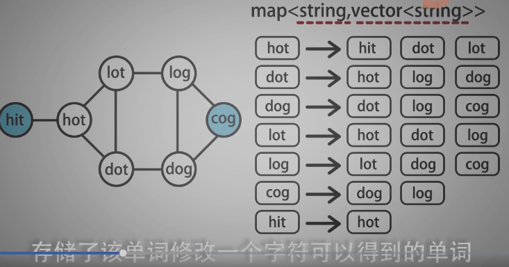


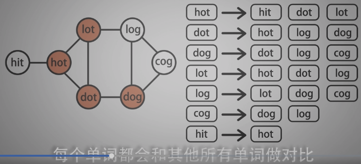

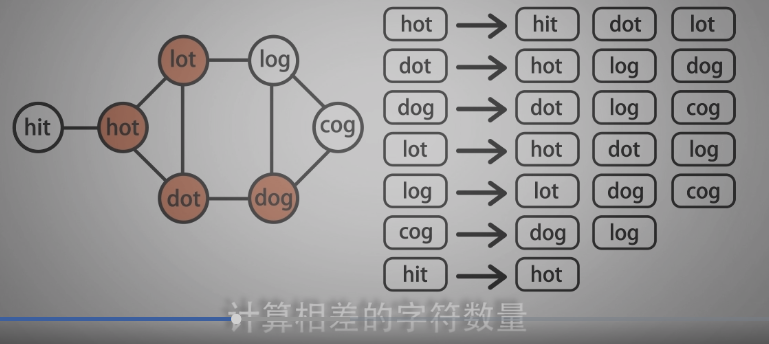

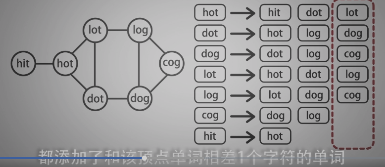

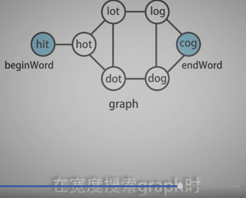

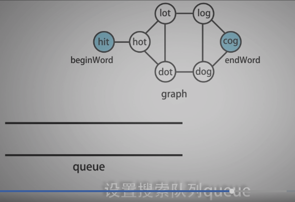

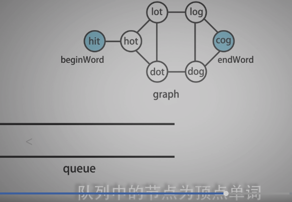

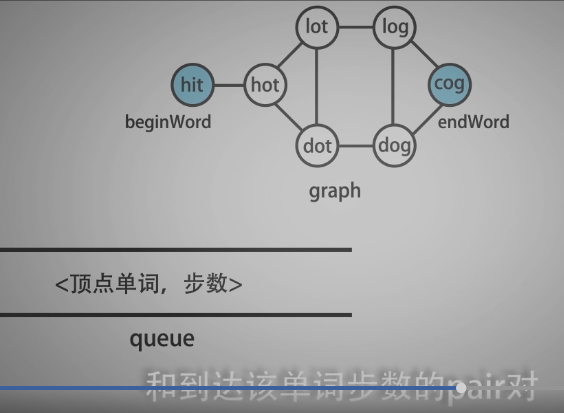

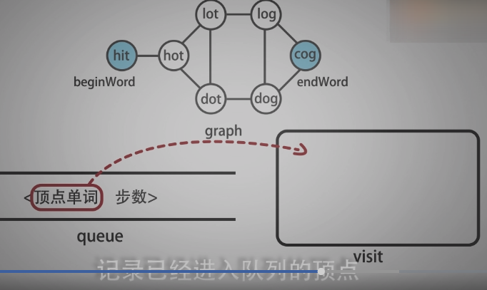

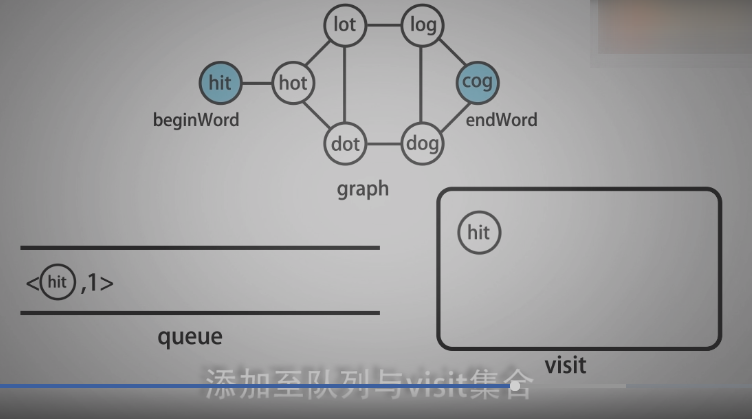

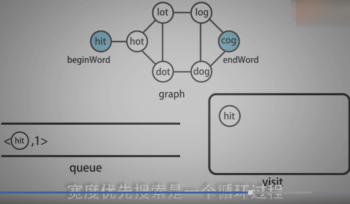

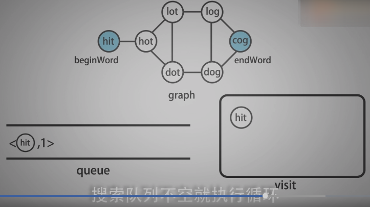

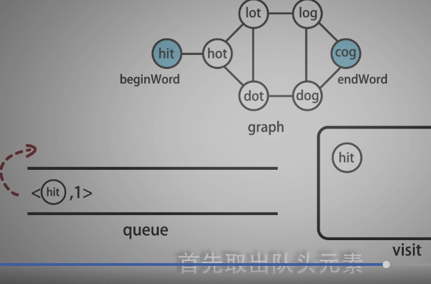

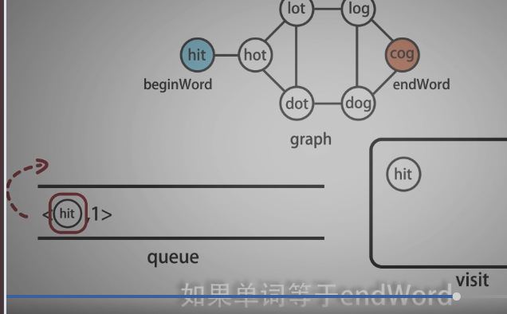

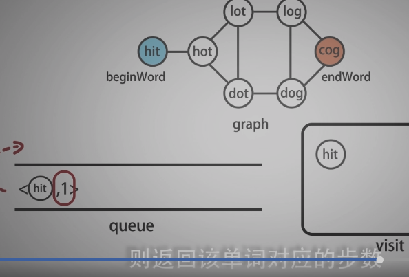

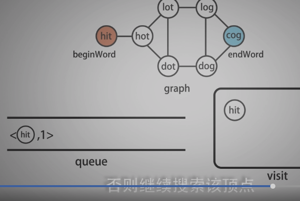

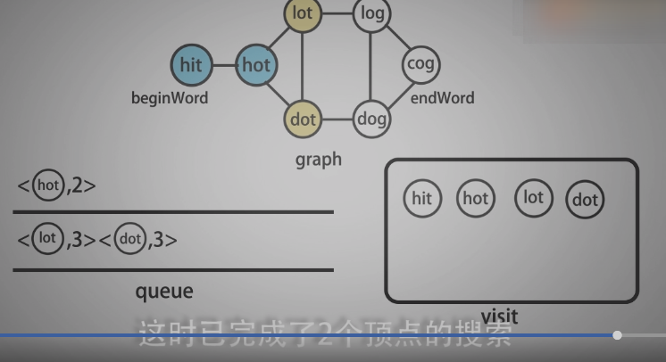

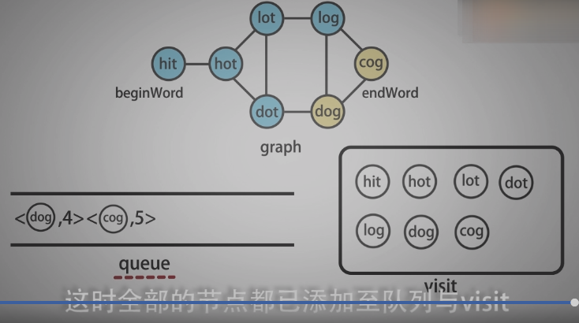


--------------------------------------

```c
/*
 * @lc app=leetcode.cn id=127 lang=cpp
 *
 * [127] 单词接龙
 */

// @lc code=start
class Solution {
public:
    int ladderLength(string beginWord, string endWord, vector<string>& wordList) {
        map<string, vector<string>> graph;
        build_graph(beginWord, wordList, graph);
        return BFS_graph(beginWord, endWord, graph);
    }

private:
    bool connect(const string& w1, const string& w2){
        int count = 0;// 单词相差的字母个数
        for(int i=0; i<w1.length(); i++){
            if(w1[i] != w2[i]){
                count ++;
            }
        }
        return count == 1;
    }
    /**
     * @description:  建图
     * @param {begin} 其实单词
     * @param {wordList} 存储字典单词列表
     * @return {graph} 图邻接表
     */    
    void build_graph(std::string& begin,
                std::vector<std::string>& wordList,
                std::map<string, std::vector<string>>& graph){
        wordList.push_back(begin);// 将起始节点添加到wordList中
        // 通过循环，将每个顶点单词对应一个空的vector，构建一个空的图
        for(int i=0; i<wordList.size(); i++){
            graph[wordList[i]] = std::vector<string>();
        }
        // 遍历图中每一个顶点单词
        for(int i=0; i<wordList.size(); i++){
            // 对于每个单词都和其他单词计算相差的字符数
            for(int j=0; j<wordList.size(); j++){
                if(connect(wordList[i], wordList[j])){
                    // 建立边
                    graph[wordList[i]].push_back(wordList[j]);
                    graph[wordList[j]].push_back(wordList[i]);
                }
            }
        }
    }
    /**
     * @description: BFS
     * @param {begin, end} 起始节点与终止节点
     * @param {graph} 图的邻接表
     * @return {*}
     */
    int BFS_graph(string& begin, string &end,
        map<string,vector<string>>& graph){
            // 存储顶点单词与到达不熟的pair对
            queue<pair<string,int>> Q;
            set<string> visit;// 标记已进入队列的顶点单词
            Q.push(make_pair(begin,1));
            visit.insert(begin);
            while(!Q.empty()){//只要队列不空，就循环搜索
                // 取出待搜索单词word与到达待搜索单词的不熟step
                string word = Q.front().first;
                int step = Q.front().second;
                Q.pop();

                // 如果word与结束单词end相同
                if(word == end){
                    return step;
                }
                // 获取与word对应的邻接表
                const vector<string>& neighbors = graph[word];
                // 遍历邻接表中的单词
                for(int i=0; i<neighbors.size(); i++){
                    // 如果单词没有在visit中
                    if(visit.find(neighbors[i]) == visit.end() ){
                        Q.push(make_pair(neighbors[i], step+1));
                        visit.insert(neighbors[i]);                   
                    }
                }
            }
            return 0;
        }
};
// @lc code=end


```