<!--
 * @Date: 2022-01-03 23:04:05
 * @Author: bFeng
-->


岛屿数量   
Category	Difficulty	Likes	Dislikes   
algorithms	Medium (56.35%)	1480	-   
Tags   
depth-first-search | breadth-first-search | union-find   

Companies   
amazon | facebook | google | microsoft | zenefits   

给你一个由 '1'（陆地）和 '0'（水）组成的的二维网格，请你计算网格中岛屿的数量。   

岛屿总是被水包围，并且每座岛屿只能由水平方向和/或竖直方向上相邻的陆地连接形成。   

此外，你可以假设该网格的四条边均被水包围。   

 
```
示例 1：

输入：grid = [
  ["1","1","1","1","0"],
  ["1","1","0","1","0"],
  ["1","1","0","0","0"],
  ["0","0","0","0","0"]
]
输出：1
示例 2：

输入：grid = [
  ["1","1","0","0","0"],
  ["1","1","0","0","0"],
  ["0","0","1","0","0"],
  ["0","0","0","1","1"]
]
输出：3
 

提示：

m == grid.length
n == grid[i].length
1 <= m, n <= 300
grid[i][j] 的值为 '0' 或 '1'
Discussion | Solution

Code Now
```

----------------------------


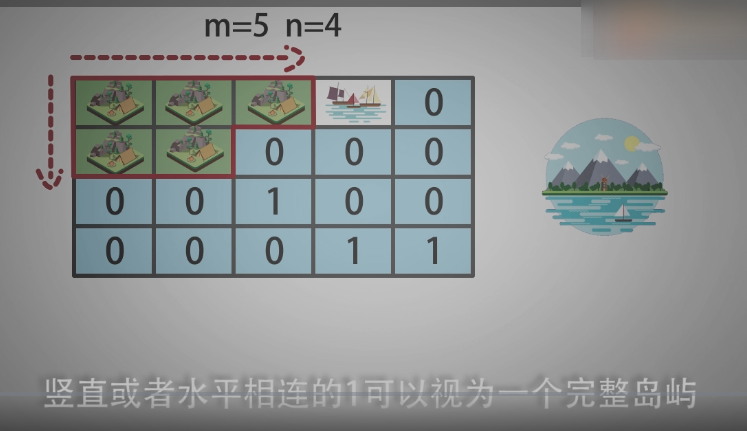

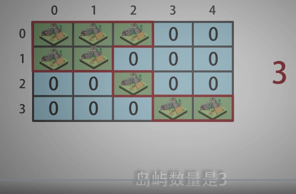

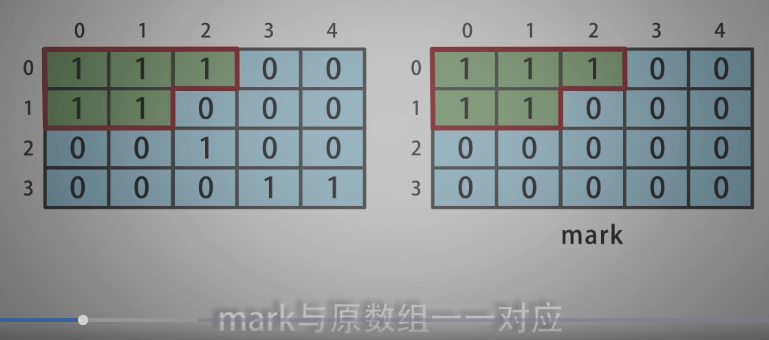

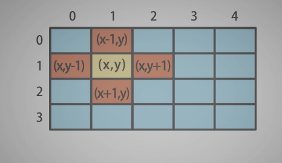

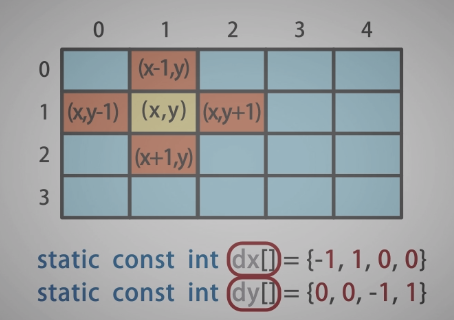

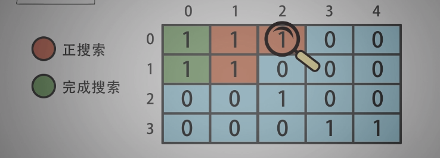

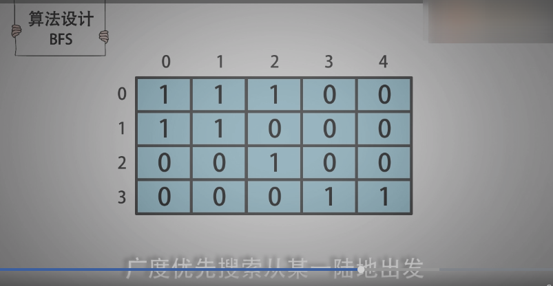

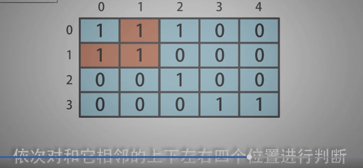

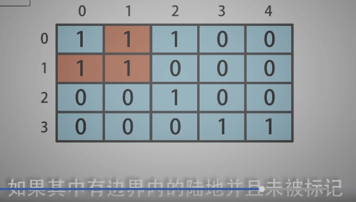

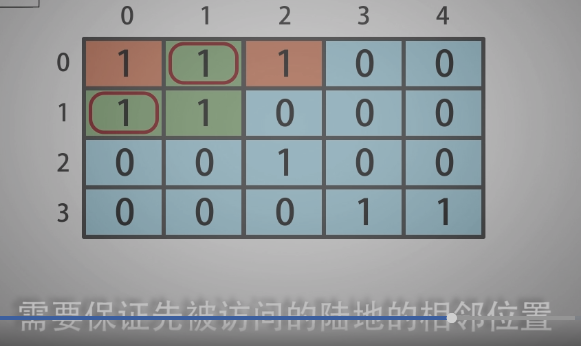

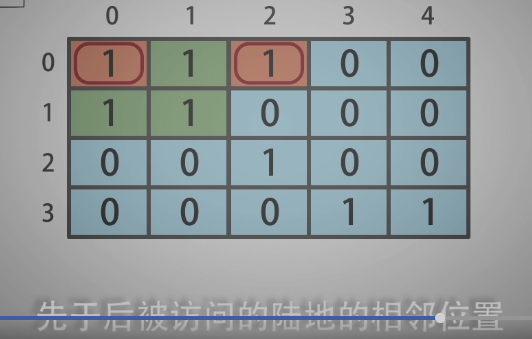

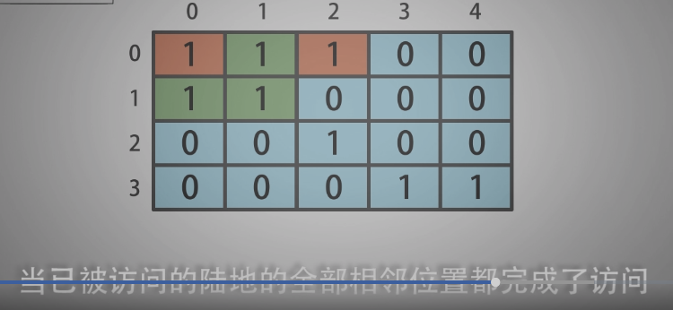

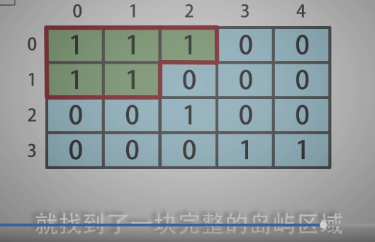

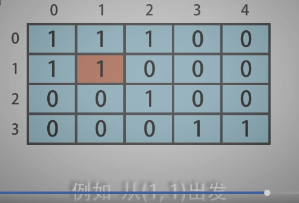

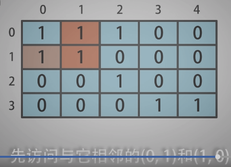

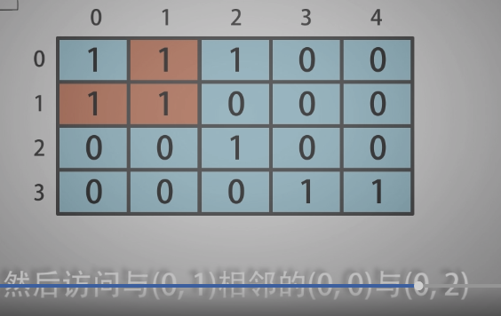


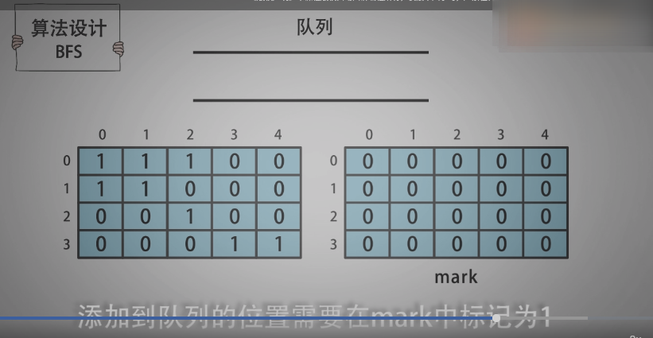

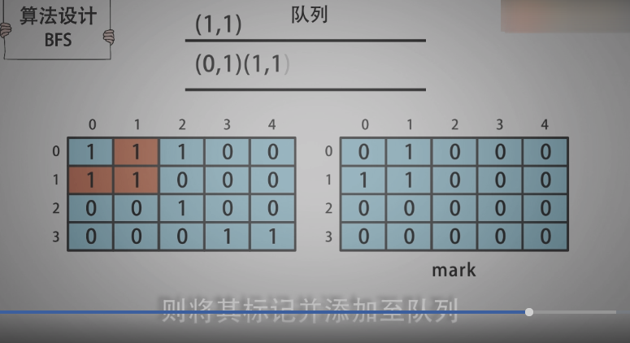

----------------------------


```c
/*
 * @lc app=leetcode.cn id=200 lang=cpp
 *
 * [200] 岛屿数量
 */

// @lc code=start
class Solution {
public:
    int numIslands(vector<vector<char>>& grid) {
        std::vector<int> visit_col(grid[0].size(), 0);
        std::vector<std::vector<int>> visit(grid.size(), visit_col);

        int res;

        for(int i=0; i<grid.size(); i++){
            for(int j=0; j<grid[i].size(); j++){
                if(visit[i][j]) continue;// 如果已访问
                if(grid[i][j]=='1' && visit[i][j]==0){
                    // DFS(grid, i, j, visit);
                    BFS(grid, i, j, visit);
                    res ++;
                }
            }
        }

        return res;
    }
private:
    void DFS(vector<vector<char>>& grid, // 在grid中与x,y相连的位置进行标记
             int x, int y,// 遍历的当前位置
             vector<vector<int>>& visit){
        visit[x][y] = 1;
        static const int dx[] = {-1, 1, 0, 0};
        static const int dy[] = {0, 0, -1, 1};
        for(int i=0; i<4; i++){
            int newx = dx[i] + x;
            int newy = dy[i] + y;
            // 越界判断
            if(newx<0 || newx>=visit.size() ||
               newy<0 || newy>=visit[newx].size()){
                continue;
            }
            // 未访问 且 为陆地
            if(visit[newx][newy]==0 && grid[newx][newy]=='1'){
                DFS(grid, newx, newy, visit);
            }
        }
    }

    void BFS(vector<vector<char>>& grid,
             int x, int y,
             vector<vector<int>>& visit){

        static const int dx[] = {-1, 1, 0, 0};
        static const int dy[] = {0, 0, -1, 1};
        
        std::queue<pair<int,int>> Q;
        Q.push(make_pair(x,y));
        visit[x][y] = 1;

        while(!Q.empty()){
            x = Q.front().first;
            y = Q.front().second;
            Q.pop();

            for(int i=0; i<4; i++){
                int newx = dx[i] + x;
                int newy = dy[i] + y;
                // 越界判断
                if(newx<0 || newx>=visit.size() ||
                newy<0 || newy>=visit[newx].size()){
                    continue;
                }
                // 未访问 且 为陆地
                if(visit[newx][newy]==0 && grid[newx][newy]=='1'){
                    Q.push(make_pair(newx, newy));
                    visit[newx][newy] = 1;
                }
            }
        }

    }
};
// @lc code=end


```