<!--
 * @Date: 2022-01-03 16:56:05
 * @Author: bFeng
-->
课程表   
Category	Difficulty	Likes	Dislikes   
algorithms	Medium (54.08%)	1069	-   
Tags   
depth-first-search | breadth-first-search | graph | topological-sort   

Companies   
apple | uber | yelp | zenefits   

你这个学期必须选修 numCourses 门课程，记为 0 到 numCourses - 1 。   

在选修某些课程之前需要一些先修课程。 先修课程按数组 prerequisites 给出，其中 prerequisites[i] = [ai, bi] ，表示如果要学习课程 ai 则 必须 先学习课程  bi 。   

例如，先修课程对 [0, 1] 表示：想要学习课程 0 ，你需要先完成课程 1 。   
请你判断是否可能完成所有课程的学习？如果可以，返回 true ；否则，返回 false 。    

 

示例 1：  
输入：numCourses = 2, prerequisites = \[[1,0]]  
输出：true   
解释：总共有 2 门课程。学习课程 1 之前，你需要完成课程 0 。这是可能的。   


示例 2：  
输入：numCourses = 2, prerequisites = \[[1,0],[0,1]]  
输出：false   
解释：总共有 2 门课程。学习课程 1 之前，你需要先完成​课程 0 ；并且学习课程 0 之前，你还应先完成课程 1 。这是不可能的。   
 

提示：   

1 <= numCourses <= 105   
0 <= prerequisites.length <= 5000   
prerequisites[i].length == 2   
0 <= ai, bi < numCourses   
prerequisites[i] 中的所有课程对 互不相同   
Discussion | Solution   

----------------------------------------------------


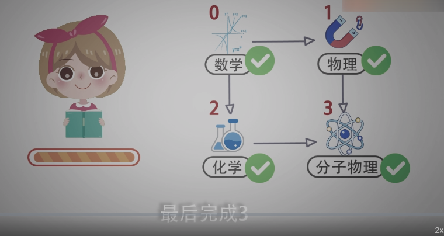

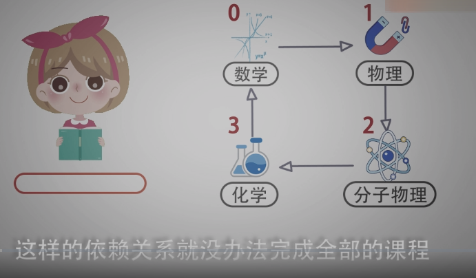

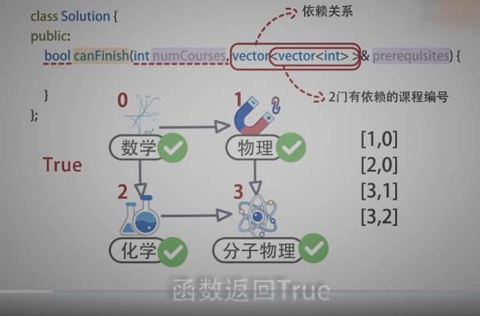

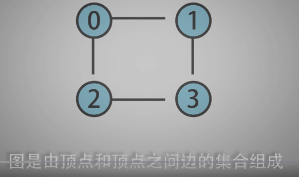

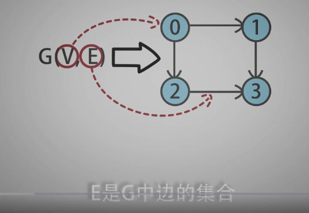

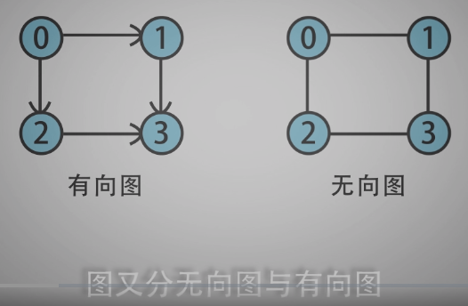

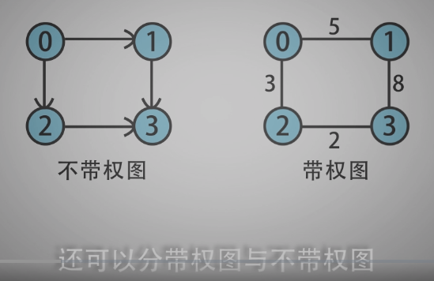

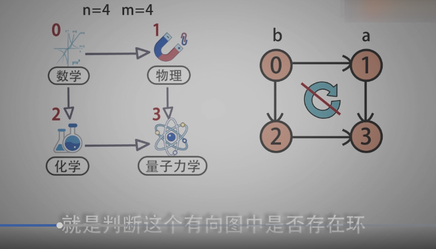

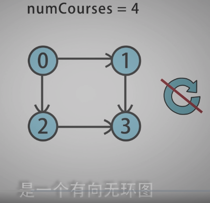

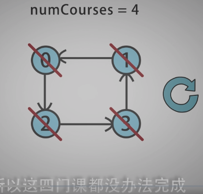

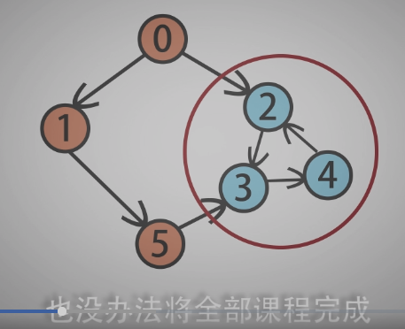

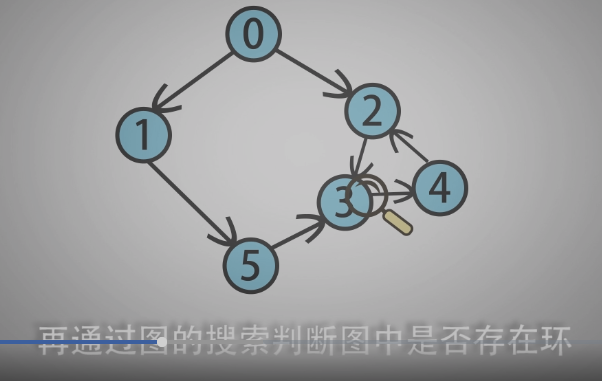

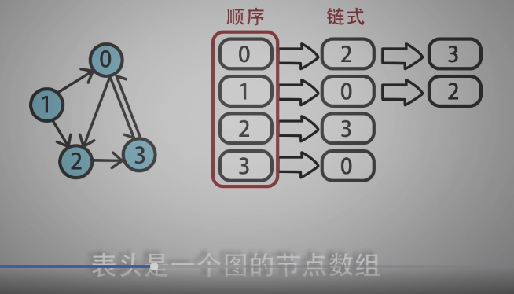

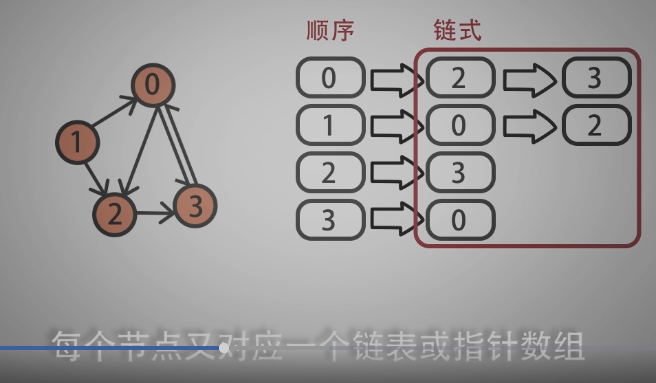

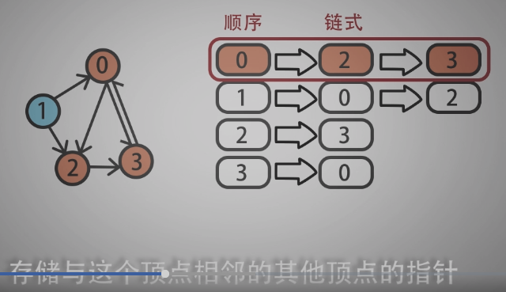

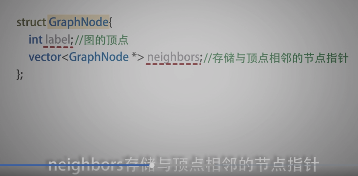

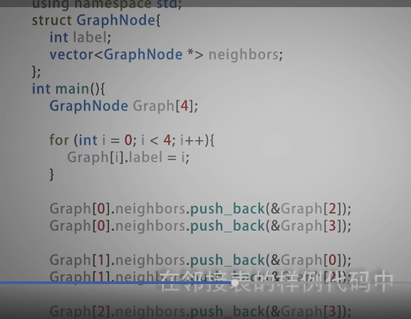

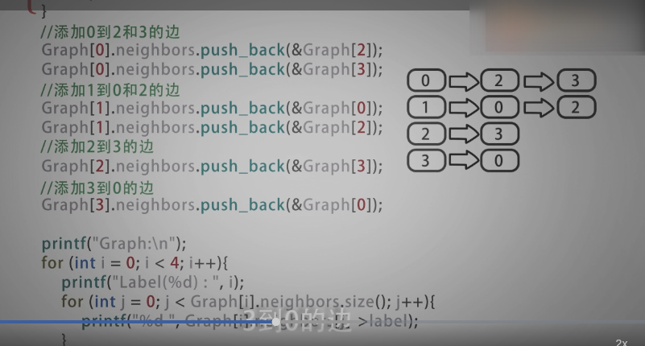

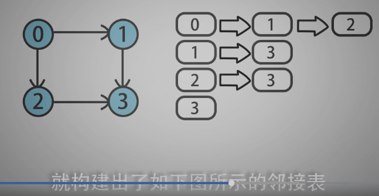

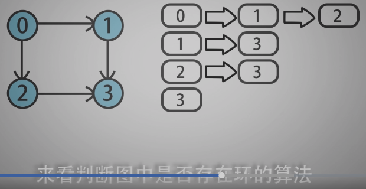

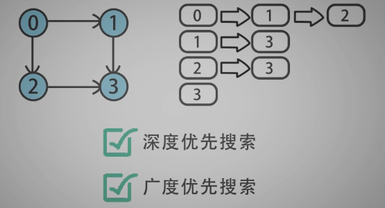

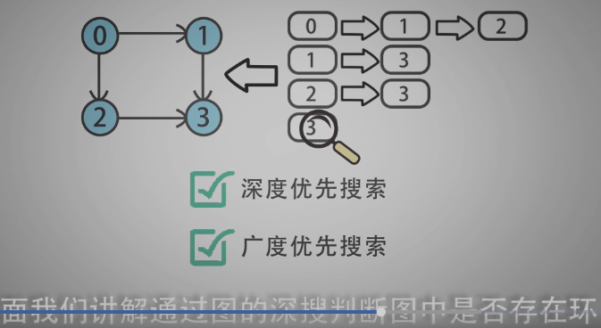

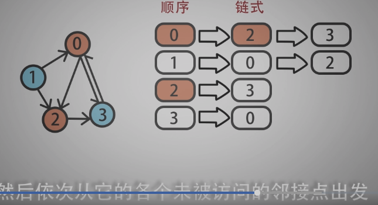

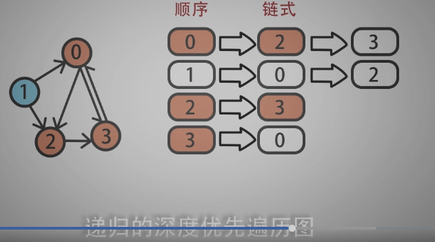

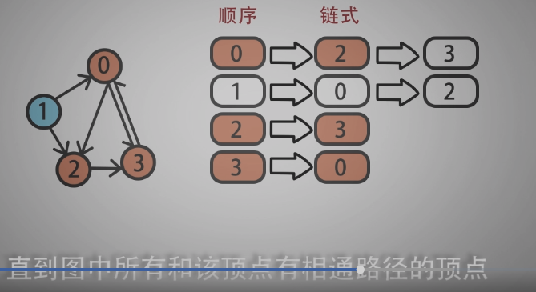

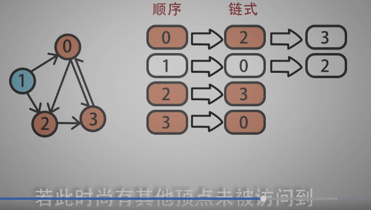

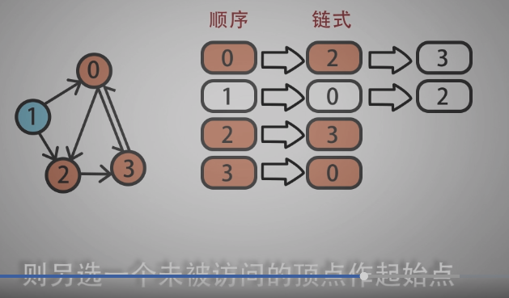

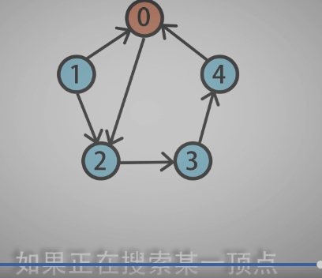

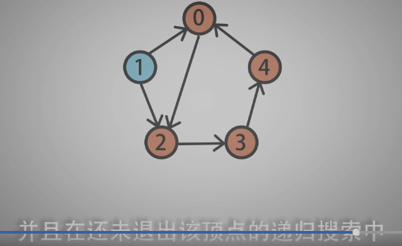

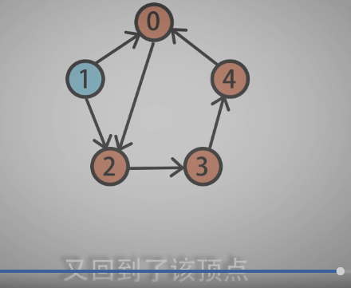

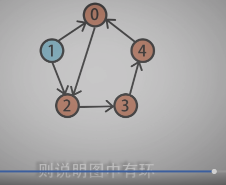

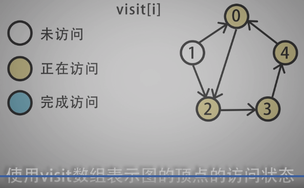

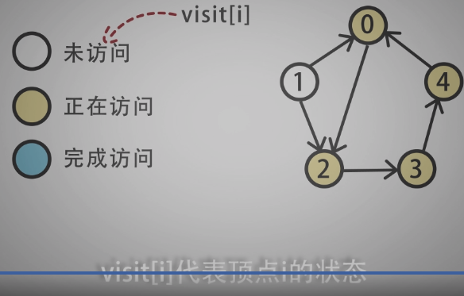

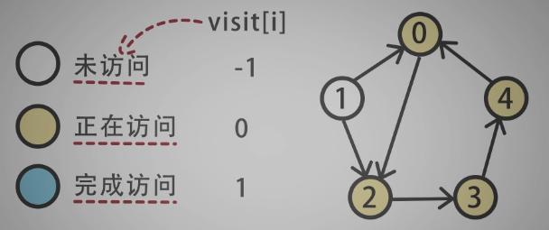

----------------------------------------------------

```c
/*
 * @lc app=leetcode.cn id=207 lang=cpp
 *
 * [207] 课程表
 */

// @lc code=start
class Solution {
public:
    bool canFinish(int numCourses, vector<vector<int>>& prerequisites) {
        std::vector<GraphNode> graph = create_graph(numCourses, prerequisites);
        std::vector<int> visit(numCourses, -1);// 全部初始化为-1， 未访问
        for(int i=0; i<graph.size(); i++){
            // 当前node未访问，则开始访问并判断是否有环
            if(visit[i]==-1 && graph_has_circle(&graph[i],visit)){
                return false;// 有环，无法修完全部课程
            }
        }
        return true; // 无环，可以修完所有课程
    }

private:
    struct GraphNode{
        int label;
        std::vector<GraphNode*> neighbors;
    };
    /**
     * @description: 构建图 邻接表方式
     * @param {prereguisites}  
     *          [1, 0]  课程1 依赖 课程0
     *          [2, 0]  课程2 依赖 课程0
     *          [3, 1]  课程3 依赖 课程1
     *          [3, 2]  课程3 依赖 课程2
     */
    std::vector<GraphNode> create_graph(int numCourses,
                const std::vector<std::vector<int>>& prerequisites){
        std::vector<GraphNode> graph;
        // 初始化长度为课程数的表头
        for(int i=0; i<numCourses; i++){
            graph.push_back(GraphNode());
            graph[i].label = i;
        }
        /*
        * @return std::vector<GraphNode>
        * vector:   GraphNode_0-->GraphNode_1-->GraphNode_2
        * vector:   GraphNode_1-->GraphNode_3
        * vector:   GraphNode_2-->GraphNode_3
        * vector:   GraphNode_3
        */
        for(int i=0; i<prerequisites.size(); i++){
            // prerequisites[i] 只有二维
            // 边起始节点指针begin, 注意是 [i][1]-->[i][0]
            GraphNode* begin = &graph[prerequisites[i][1]];
            // 边结束节点指针end
            GraphNode* end = &graph[prerequisites[i][0]];
            begin->neighbors.push_back(end);
        }
        return graph;
    }

    /**
     * @description: 
     * @param {GraphNode*} node 
     * visit[]  -1 未访问 0 正在访问  1 已完成访问 
     * @return {*}
     */    
    bool graph_has_circle(GraphNode* node, std::vector<int>& visit){
        visit[node->label] = 0;// 正在访问的节点状态标记为0
        // 遍历与 node 相邻的节点
        for(int i=0; i<node->neighbors.size(); i++){
            // 如果相邻的节点还未访问
            if(visit[node->neighbors[i]->label] == -1){
                // 则递归搜索该节点，如果递归结果返回true，说明后面遇到了环
                if(graph_has_circle(node->neighbors[i], visit)){
                    return true;//则当前的函数也返回true
                }
            // 如果相邻的节点状态是正在访问，说明此时遇到了环，返回true
            }else if(visit[node->neighbors[i]->label] == 0){
                return true;
            }
        }
        // 如果node节点全部完成了访问没有遇到环，则将状态置为 1 ，返回false
        visit[node->label] = 1;
        return false;
    }

};
// @lc code=end

```