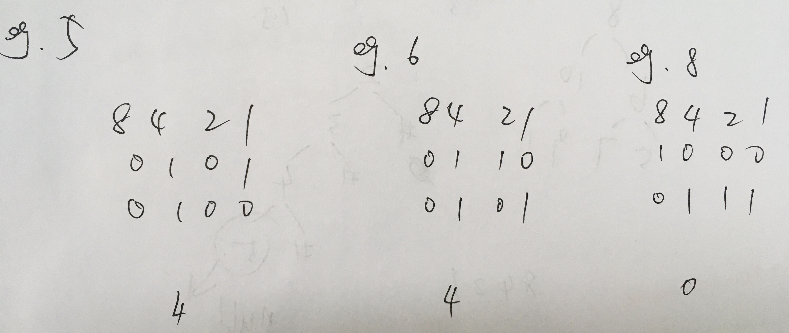

<!--
 * @Date: 2022-03-03 11:32:09
 * @Author: bFeng
-->

给你一个整数 n，请你判断该整数是否是 2 的幂次方。如果是，返回 true ；否则，返回 false 。

如果存在一个整数 x 使得 n == 2x ，则认为 n 是 2 的幂次方。


你能够不使用循环/递归解决此问题吗？




```c
class Solution {
public:
    bool isPowerOfTwo(int n) {
         return (n > 0 && (n & (n - 1)) == 0);
    }
};
```