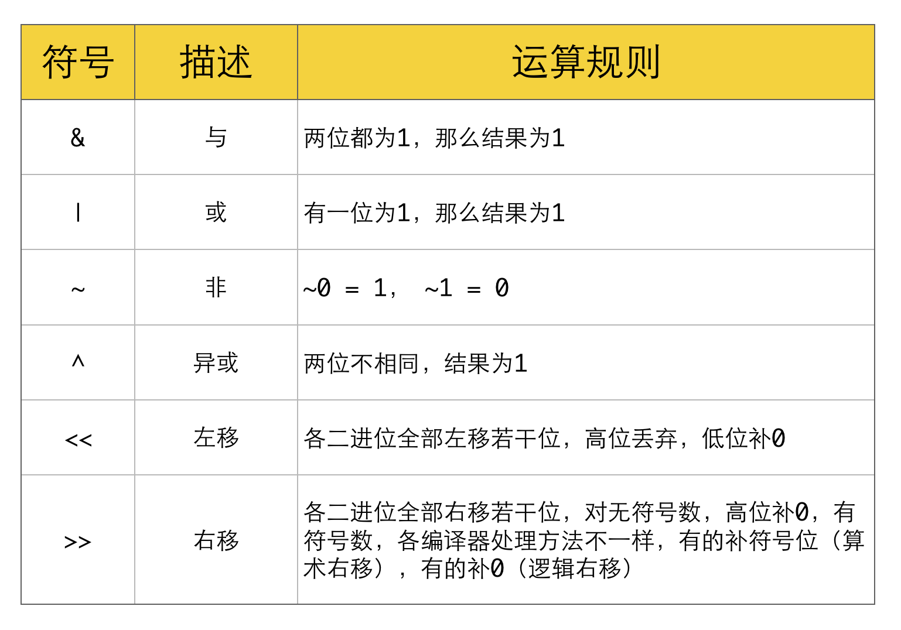
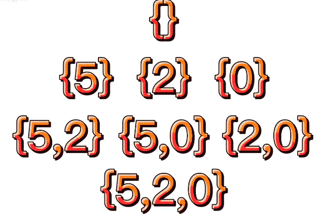
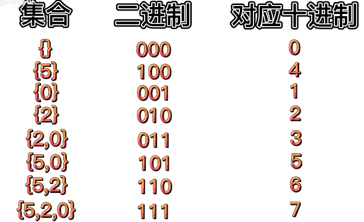
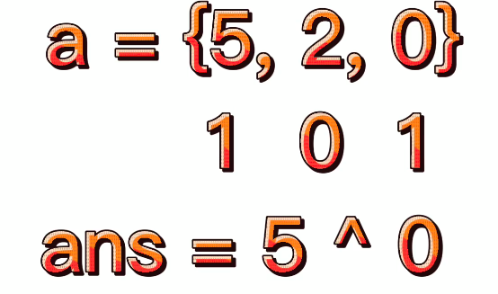
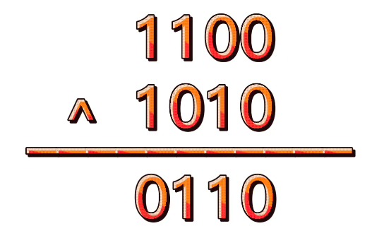
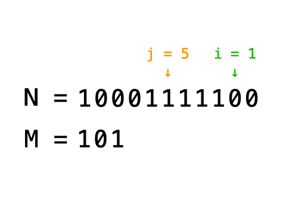

<!--
 * @Date: 2022-03-03 14:16:24
 * @Author: bFeng
-->


##  0.位运算概述

位运算分为两类：

- 逻辑位运算符

- 位移运算符




###  0.1.常用操作


- 判断奇偶  
  (x & 1) == 1 ---等价---> (x % 2 == 1)  
  (x & 1) == 0 ---等价---> (x % 2 == 0)  
- x / 2 ---等价---> x >> 1
- x &= (x - 1) ------> 把x最低位的二进制1给去掉
- x & -x -----> 得到最低位的1
- x & ~x -----> 0

###  0.2.指定位置的位运算

- 将X最右边的n位清零：x & (~0 << n)
- 获取x的第n位值：(x >> n) & 1
- 获取x的第n位的幂值：x & (1 << n)
- 仅将第n位置为1：x | (1 << n)
- 仅将第n位置为0：x & (~(1 << n))
- 将x最高位至第n位（含）清零：x & ((1 << n) - 1)
- 将第n位至第0位（含）清零：x & (~((1 << (n + 1)) - 1))


###  0.3.异或结合律

```
x ^ 0 = x, x ^ x = 0
x ^ (~0) = ~x, x ^ (~x) = ~0
a ^ b = c, a ^ c = b, b ^ c = a

(有没有点乘法结合律的意思)
字母表示：(a ^ b) ^ c = a ^ (b ^ c)
图形表示：(☆ ^ ◇) ^ △ = ☆ ^ (◇ ^ △)
```

### 0.4.大小字母位运算技巧

- 大写变小写、小写变大写：字符 ^= 32 （大写 ^= 32 相当于 +32，小写 ^= 32 相当于 -32）
- 大写变小写、小写变小写：字符 |= 32 （大写 |= 32 就相当于+32，小写 |= 32 不变）
- 大写变大写、小写变大写：字符 &= -33 （大写 ^= -33 不变，小写 ^= -33 相当于 -32）


##  1.题集

##  1.1.2的幂


直接利用上面掉到的常用方法 n & (n - 1) 去除最低位的1。 如果 n 的二进行里面只有一个1 (只有一个1就是标准的$2^x$)，那么去掉最低位的1，就只可能是0，要么非0.

```c
class Solution {
public:
    bool isPowerOfTwo(int n) {
        return (n > 0 && (n & (n - 1)) == 0);
    }
};
```
##  1.2.4的幂

- $4^{x} \rightarrow 2^{2 x}$  ： 4的幂一定是2的幂
- $2^{x} \neq 4^{?}$ ： 2的幂不一定是4的幂

由数学归纳法有：

- $2^{2 x} \bmod 3=1$ --> $4^{x} \bmod 3=1$
- $2^{2 x+1} \bmod 3=2$


因此，只要满足：

- $n=2^{x}$
- $n \bmod 3=1$

则为 4 的幂。


```c
class Solution {
public:
    bool isPowerOfFour(int n) {
        return n > 0 && (n & (n - 1)) == 0 && n % 3 == 1;
    }
};
```
##  1.3.位 1 的个数

同样利用 n & (n - 1) 去除最低位的 1 这个性质进行处理。把数字里面的所有 1 挨个移出去，并统计就是答案。

```c
class Solution {
public:
int hammingWeight(int n) {
    int ans = 0;
    while (n) {
        n &= (n - 1);
        ans ++;
    }
    return ans;
}
};
```
##  1.4.交换数字
```
利用这是由异或的性质 0^a = a; a^a = 0
同时满足交换律与结合律  a^b = b^a  (a^b)^c = a^(b^c)  

a = a^b;
b = a^b;  a^b^b = a^0 = a
a = a^b;  a^b^a = b^a^a = b^0 = b
```
```c
int* swapNumbers(int* a, int aSize, int* returnSize) {
  a[0] = a[0] ^ a[1];
  a[1] = a[0] ^ a[1];
  a[0] = a[0] ^ a[1];
  *returnSize = 2;
  return a; 
}
```

##  1.5.只出现一次的数字

给出的数组，某元素只出现一次或两次。

```
利用这是由异或的性质 0^a = a; a^a = 0
同时满足交换律与结合律  a^b = b^a  (a^b)^c = a^(b^c)  
```
因此对数组每个元素进行异或，出现两次的元素就会被异或为 0 （a^a = 0），剩下那个只出现一次的元素 （a^0 = a）。


```c
int singleNumber(int* nums, int numsSize) {
  int res = 0;
  for(int i=0; i<numsSize; ++i) {
    res = res ^ nums[i];
  }
  return res;
}
```

通用解法：


```c
class Solution {
public:
    int singleNumber(vector<int>& nums) {
        map<int, int> hash_map;
        for (int x : nums) {
            hash_map[x] ++;
        }
        for (const auto& itr : hash_map) {
            if (itr.second == 1) 
            return itr.first;
        }
        return -1;
    }
};
```


##  1.6.汉明距离

两个整数之间的 汉明距离 指的是这两个数字对应二进制位不同的位置的数目。

利用异或的概念，问题转换为： 对 `x^y` 的结果统计 1 的个数


```c
class Solution {
public:
    int hammingDistance(int x, int y) {
        int num = x^y;
        int res = 0;
        while(num) {
            num &= (num-1);
            res ++;
        }
        return res;
    }
};
```

###  1.7.交替位二进制

例： 01010101010101

检查给定二进制数是否为交替位二进制


思路：  从最低位开始检查是否有 `00 = 0`和`11 = 3`的模式， 只需要与 `11 = 3` 相与即可，若某一位结果为 0 或3则不满足条件。


```c
bool hasAlternatingBits(int n) {
  while(n) {
    if((n&3) == 3 || (n&3) == 0) {
      return false;
    } 
    n >>= 1;
  }
  return true;
}
```


###  1.8.子集的异或总和再求和 


一个数组的 异或总和 定义为数组中所有元素按位 XOR 的结果；如果数组为 空 ，则异或总和为 0 。

例如，数组 [2,5,6] 的 异或总和 为 2 XOR 5 XOR 6 = 1 。
给你一个数组 nums ，请你求出 nums 中每个 子集 的 异或总和 ，计算并返回这些值相加之 和 。

注意：在本题中，元素 相同 的不同子集应 多次 计数。

数组 a 是数组 b 的一个 子集 的前提条件是：从 b 删除几个（也可能不删除）元素能够得到 a 。


 

示例 1：  
```
输入：nums = [1,3]
输出：6
解释：[1,3] 共有 4 个子集：
- 空子集的异或总和是 0 。
- [1] 的异或总和为 1 。
- [3] 的异或总和为 3 。
- [1,3] 的异或总和为 1 XOR 3 = 2 。
0 + 1 + 3 + 2 = 6
```





- i&(1<<j) : i这个数字中第j位是否为1




```c
class Solution {
public:
    int subsetXORSum(vector<int>& nums) {
  int ans, sum = 0;
  // 枚举子集  有 2^nums.size() 个子集
  for(int i = 0; i < (1 << nums.size()) ; ++i) {
    ans = 0;
    for(int j = 0; j < nums.size(); ++j) {
      if(i & (1<<j)) { // 选中某个子集的元素
        ans ^= nums[j];
      }
    }
    sum += ans;
  }
  return sum;
    }
};
```
###  1.9.两整数之和


a+b可以转换为 「不带进位的加法运算」+ 「带进位的加法运算」



不带进位：  


带进位：  

  
  


使用递归运算，递归出口：


```
- a=0,  a^b + (a&b)<<1 = 0^b + 0 = b
- b=0,  a^b + (a&b)<<1 = a^0 + 0 = a
- 所以出口可以直接定义为 
  b == 0; return a; 
  b != 0; return a^b + (a&b)<<1;
```


```c
int getSum(int a, int b) {
  return b == 0 ? a : getSum(a^b, (unsigned int)(a&b)<<1);
}
```


###  1.10.插入


给定两个整型数字 N 与 M，以及表示比特位置的 i 与 j（i <= j，且从 0 位开始计算）。

编写一种方法，使 M 对应的二进制数字插入 N 对应的二进制数字的第 i ~ j 位区域，不足之处用 0 补齐。具体插入过程如图所示。


题目保证从 i 位到 j 位足以容纳 M， 例如： M = 10011，则 i～j 区域至少可容纳 5 位。

 


示例1:
 输入：N = 1024(10000000000), M = 19(10011), i = 2, j = 6  
 输出：N = 1100(10001001100)  


示例2:  
 输入： N = 0, M = 31(11111), i = 0, j = 4  
 输出：N = 31(11111)  


```c
class Solution {
public:
    int insertBits(int N, int M, int i, int j) {
      for(int k = i; k <= j; ++k) {
        N &= ~((long long)1<<k); // 将 i~j 对应的位全部置0
      }
      return N | (M<<i);// 将M移过去就OK
    }
};
```