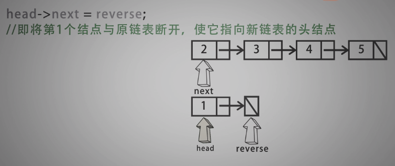
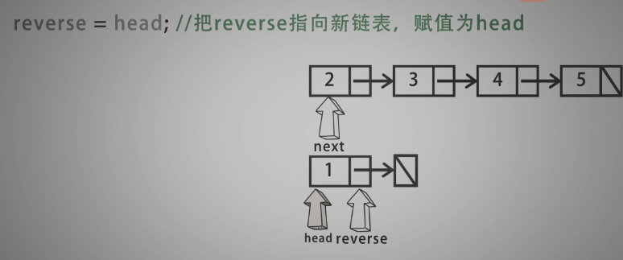

# [前言](readme.md)

# 01-链表

## [206-链表逆序](./01-链表/doc/206-链表逆序.md)

给你单链表的头节点 head ，请你反转链表，并返回反转后的链表。


示例 1：

<div align = center>

<div align = left>


输入：head = [1,2,3,4,5]
输出：[5,4,3,2,1]
示例 2：

<div align = center>

<div align = left>


输入：head = [1,2]
输出：[2,1]
示例 3：

输入：head = []
输出：[]


提示：

链表中节点的数目范围是 [0, 5000]
-5000 <= Node.val <= 5000


- 头插法


<div align = center>

<div align = left>

<div align = center>

<div align = left>

<div align = center>

<div align = left>

<div align = center>

<div align = left>


----------------------------------------

- 直接逆序法


<div align = center>

<div align = left>

<div align = center>

<div align = left>

<div align = center>

<div align = left>

<div align = center>

<div align = left>

<div align = center>

<div align = left>


```c
/*
 * @Date: 2021-12-22 09:59:14
 * @Author: bFeng
 */
/*
 * @lc app=leetcode.cn id=206 lang=cpp
 *
 * [206] 反转链表
 */

// @lc code=start
/**
 * Definition for singly-linked list.
 * struct ListNode {
 *     int val;
 *     ListNode *next;
 *     ListNode() : val(0), next(nullptr) {}
 *     ListNode(int x) : val(x), next(nullptr) {}
 *     ListNode(int x, ListNode *next) : val(x), next(next) {}
 * };
 */

class Solution {
public:
    ListNode* reverseList(ListNode* head) {//直接逆序法
        if(head == nullptr){
            return nullptr;
        }
        ListNode* reverse = nullptr;
        ListNode* next = nullptr;
        while(head != nullptr){
            next = head->next;
            head->next = reverse;
            reverse = head;
            head = next;
        }
        return reverse;
    }
};


class Solution {
public:
    ListNode* reverseList(ListNode* head) {//头插法
        if(head == nullptr){
            return nullptr;
        }
        ListNode tmp = ListNode();
        ListNode* next = nullptr;
        while(head != nullptr){
            next = head->next;
            head->next = tmp.next;
            tmp.next = head;
            head = next;
        }
        return tmp.next;//注意返回的是next
    }
};
// @lc code=end


```


## [160-链表求交点](./01-链表/doc/160-链表求交点.md)

<!--
 * @Date: 2021-12-22 11:45:55
 * @Author: bFeng
-->
相交链表  
Category	Difficulty	Likes	Dislikes  
algorithms	Easy (61.81%)	1472	-  
Tags  
Companies  
给你两个单链表的头节点 headA 和 headB ，请你找出并返回两个单链表相交的起始节点。如果两个链表不存在相交节点，返回 null 。   

图示两个链表在节点 c1 开始相交：  

<div align = center>

<div align = left>
  

题目数据 保证 整个链式结构中不存在环。  

注意，函数返回结果后，链表必须 保持其原始结构 。

自定义评测：

评测系统 的输入如下（你设计的程序 不适用 此输入）：  

intersectVal - 相交的起始节点的值。如果不存在相交节点，这一值为 0  
listA - 第一个链表  
listB - 第二个链表  
skipA - 在 listA 中（从头节点开始）跳到交叉节点的节点数  
skipB - 在 listB 中（从头节点开始）跳到交叉节点的节点数  
评测系统将根据这些输入创建链式数据结构，并将两个头节点 headA 和 headB 传递给你的程序。  如果程序能够正确返回相交节点，那么你的解决方案将被 视作正确答案 。  

 

示例 1：

<div align = center>

<div align = left>


输入：intersectVal = 8, listA = [4,1,8,4,5], listB = [5,6,1,8,4,5], skipA = 2, skipB = 3  
输出：Intersected at '8'  
解释：相交节点的值为 8 （注意，如果两个链表相交则不能为 0）。  
从各自的表头开始算起，链表 A 为 [4,1,8,4,5]，链表 B 为 [5,6,1,8,4,5]。  
在 A 中，相交节点前有 2 个节点；在 B 中，相交节点前有 3 个节点。  

示例 2：

<div align = center>

<div align = left>


输入：intersectVal = 2, listA = [1,9,1,2,4], listB = [3,2,4], skipA = 3, skipB = 1  
输出：Intersected at '2'  
解释：相交节点的值为 2 （注意，如果两个链表相交则不能为 0）。  
从各自的表头开始算起，链表 A 为 [1,9,1,2,4]，链表 B 为 [3,2,4]。  
在 A 中，相交节点前有 3 个节点；在 B 中，相交节点前有 1 个节点。  

示例 3：

<div align = center>

<div align = left>


输入：intersectVal = 0, listA = [2,6,4], listB = [1,5], skipA = 3, skipB = 2
输出：null  
解释：从各自的表头开始算起，链表 A 为 [2,6,4]，链表 B 为 [1,5]。  
由于这两个链表不相交，所以 intersectVal 必须为 0，而 skipA 和 skipB 可以是任意值。  
这两个链表不相交，因此返回 null 。  


提示：

listA 中节点数目为 m  
listB 中节点数目为 n  
1 <= m, n <= 3 * 104  
1 <= Node.val <= 105  
0 <= skipA <= m  
0 <= skipB <= n  
如果 listA 和 listB 没有交点，intersectVal 为 0  
如果 listA 和 listB 有交点，intersectVal == listA[skipA] == listB[skipB]  


进阶：你能否设计一个时间复杂度 O(m + n) 、仅用 O(1) 内存的解决方案？

Discussion | Solution

-----------------------------------------------
- 两层循环遍历


<div align = center>

<div align = left>


<div align = center>

<div align = left>


---------------------------------------------

- set优化

<div align = center>

<div align = left>


--------------------------------------------

- 双指针法


<div align = center>

<div align = left>


<div align = center>

<div align = left>


<div align = center>

<div align = left>


<div align = center>

<div align = left>


<div align = center>

<div align = left>


1.统计链表长度

2.删除长链表

3.同时遍历


```c
/*
 * @Date: 2021-12-22 11:45:07
 * @Author: bFeng
 */
/*
 * @lc app=leetcode.cn id=160 lang=cpp
 *
 * [160] 相交链表
 */

// @lc code=start
/**
 * Definition for singly-linked list.
 * struct ListNode {
 *     int val;
 *     ListNode *next;
 *     ListNode(int x) : val(x), next(NULL) {}
 * };
 */
class Solution {// 使用set优化  O(nlogn)
public:
    ListNode *getIntersectionNode(ListNode *headA, ListNode *headB) {
        if(headA == nullptr|| headB == nullptr){
            return nullptr;
        }
        std::set<ListNode*> check_set;
        ListNode* tmp = headA;
        while(tmp){
            check_set.insert(tmp);
            tmp = tmp->next;
        }
        tmp = headB;
        while(tmp){
            if(check_set.find(tmp) != check_set.end())
            return tmp;
            tmp = tmp->next;
        }
        return nullptr;
    }
};


class Solution {// 双指针  O(n)
public:
    ListNode *getIntersectionNode(ListNode *headA, ListNode *headB) {
        if(headA == nullptr|| headB == nullptr){
            return nullptr;
        }
        int countA = 0; int countB = 0;
        ListNode* traverse_ptrA = headA;
        ListNode* traverse_ptrB = headB;
        while(traverse_ptrA){
            countA ++;
            traverse_ptrA = traverse_ptrA->next;
        }
        while(traverse_ptrB){
            countB ++;
            traverse_ptrB = traverse_ptrB->next;
        }

        traverse_ptrA = headA;
        traverse_ptrB = headB;
        if(countA > countB){
            int sub = countA - countB;
            while(sub--){
                traverse_ptrA = traverse_ptrA->next;
            }
        }else if(countA < countB){
            int sub = countB - countA;
            while(sub--){
                traverse_ptrB = traverse_ptrB->next;
            }
        }

        while(traverse_ptrA&&traverse_ptrB){
            if(traverse_ptrA == traverse_ptrB)
                return traverse_ptrA;
            traverse_ptrA = traverse_ptrA->next;
            traverse_ptrB = traverse_ptrB->next;
        }

        return nullptr;
    }
};
// @lc code=end


```

## [21-合并两个有序链表](./01-链表/doc/21-合并两个有序链表.md)

<!--
 * @Date: 2021-12-22 14:45:56
 * @Author: bFeng
-->
合并两个有序链表  
Category	Difficulty	Likes	Dislikes  
algorithms	Easy (66.70%)	2106	-  
Tags  
Companies  
将两个升序链表合并为一个新的 升序 链表并返回。新链表是通过拼接给定的两个链表的所有节点组成的。   

 

示例 1：  

<div align = center>

<div align = left>
  


输入：l1 = [1,2,4], l2 = [1,3,4]  
输出：[1,1,2,3,4,4]  
示例 2：  

输入：l1 = [], l2 = []  
输出：[]  
示例 3：  

输入：l1 = [], l2 = [0]  
输出：[0]  


提示：

两个链表的节点数目范围是 [0, 50]  
-100 <= Node.val <= 100  
l1 和 l2 均按 非递减顺序 排列  
Discussion | Solution  

------------------------------------

<div align = center>

<div align = left>


- 归并排序

<div align = center>

<div align = left>


<div align = center>

<div align = left>


<div align = center>

<div align = left>


<div align = center>

<div align = left>


<div align = center>

<div align = left>


<div align = center>

<div align = left>


```c
/*
 * @Date: 2021-12-22 14:45:03
 * @Author: bFeng
 */
/*
 * @lc app=leetcode.cn id=21 lang=cpp
 *
 * [21] 合并两个有序链表
 */

// @lc code=start
/**
 * Definition for singly-linked list.
 * struct ListNode {
 *     int val;
 *     ListNode *next;
 *     ListNode() : val(0), next(nullptr) {}
 *     ListNode(int x) : val(x), next(nullptr) {}
 *     ListNode(int x, ListNode *next) : val(x), next(next) {}
 * };
 */
class Solution {
public:
    ListNode* mergeTwoLists(ListNode* list1, ListNode* list2) {
        if(list1 == nullptr) return list2;
        if(list2 == nullptr) return list1;

        ListNode res; // 使用临时节点
        ListNode* res_ptr = &res;

        while(list1 || list2){
            // 遍历完其中一个，另一个直接交管
            if(list1 == nullptr){
                res_ptr->next = list2;
                return res.next;
            }
            if(list2 == nullptr){
                res_ptr->next = list1;
                return res.next;
            }
            // 对每一个比较大小， 进行赋值
            if(list1->val < list2->val){
                res_ptr->next = list1;
                list1 = list1->next;
                res_ptr = res_ptr->next;
            }else{
                res_ptr->next = list2;
                list2 = list2->next;
                res_ptr = res_ptr->next;
            }
        }
    return res.next;
    }
};
// @lc code=end


```

## [86-分隔链表](./01-链表/doc/86-分隔链表.md)

<!--
 * @Date: 2021-12-22 19:09:20
 * @Author: bFeng
-->
分隔链表  
Category	Difficulty	Likes	Dislikes  
algorithms	Medium (63.25%)	498	-  
Tags  
Companies  
给你一个链表的头节点 head 和一个特定值 x ，请你对链表进行分隔，使得所有 小于 x 的节点都出现在 大于或等于 x 的节点之前。  

你应当 保留 两个分区中每个节点的初始相对位置。  

 

示例 1：


<div align = center>

<div align = left>


输入：head = [1,4,3,2,5,2], x = 3  
输出：[1,2,2,4,3,5]  


示例 2：

输入：head = [2,1], x = 2  
输出：[1,2]  


提示：

链表中节点的数目在范围 [0, 200] 内  
-100 <= Node.val <= 100  
-200 <= x <= 200  
Discussion | Solution  

---------------------------------


<div align = center>

<div align = left>


<div align = center>

<div align = left>


<div align = center>

<div align = left>


<div align = center>

<div align = left>


<div align = center>

<div align = left>


<div align = center>

<div align = left>


<div align = center>

<div align = left>


<div align = center>

<div align = left>


<div align = center>

<div align = left>


<div align = center>

<div align = left>


```c

/*
 * @lc app=leetcode.cn id=86 lang=cpp
 *
 * [86] 分隔链表
 */

// @lc code=start
/**
 * Definition for singly-linked list.
 * struct ListNode {
 *     int val;
 *     ListNode *next;
 *     ListNode() : val(0), next(nullptr) {}
 *     ListNode(int x) : val(x), next(nullptr) {}
 *     ListNode(int x, ListNode *next) : val(x), next(next) {}
 * };
 */
class Solution {
public: //[1,4,3,2,5,2]
    ListNode* partition(ListNode* head, int x) {
        ListNode smaller = ListNode();
        ListNode greater = ListNode();
        ListNode* st = &smaller;
        ListNode* gt = &greater;

        while(head){
            // 为什么非得备份？
            ListNode* backup = head->next;
            if(head->val < x){
                st->next = head;
                st = st->next;
                // head = head->next;
            }else{
                gt->next = head;
                gt = gt->next;
                // head = head->next;
            }
            head->next = nullptr;
            head = backup;
        }
        st->next = greater.next;
        return smaller.next;
    }
};


class Solution {
public: //[1,4,3,2,5,2]
    ListNode* partition(ListNode* head, int x) {
        ListNode smaller = ListNode();
        ListNode greater = ListNode();
        ListNode* st = &smaller;
        ListNode* gt = &greater;

        while(head){
            // 为什么非得备份？
            // ListNode* backup = head->next;
            if(head->val < x){
                st->next = head;
                st = st->next;
                head = head->next;
            }else{
                gt->next = head;
                gt = gt->next;
                head = head->next;
            }
            // head->next = nullptr;
            // head = backup;
        }
        gt->next = nullptr;//如果不考虑备份的方式，则需要注意最后一个节点的next要置空
        st->next = greater.next;
        return smaller.next;
    }
};

```

## [142-环形链表II](./01-链表/142-环形链表II.md)

<!--
 * @Date: 2021-12-23 21:33:22
 * @Author: bFeng
-->
环形链表 II  
Category	Difficulty	Likes	Dislikes  
algorithms	Medium (55.44%)	1291	-  
Tags  
Companies  
给定一个链表，返回链表开始入环的第一个节点。 如果链表无环，则返回 null。  

如果链表中有某个节点，可以通过连续跟踪 next 指针再次到达，则链表中存在环。 为了表示给定链表中的环，评测系统内部使用整数 pos 来表示链表尾连接到链表中的位置（索引从 0 开始）。如果 pos 是 -1，则在该链表中没有环。注意：pos 不作为参数进行传递，仅仅是为了标识链表的实际情况。  

不允许修改 链表。  

 

示例 1：

<div align = center>

<div align = left>


输入：head = [3,2,0,-4], pos = 1  
输出：返回索引为 1 的链表节点  
解释：链表中有一个环，其尾部连接到第二个节点。  


示例 2：

<div align = center>

<div align = left>


输入：head = [1,2], pos = 0  
输出：返回索引为 0 的链表节点  
解释：链表中有一个环，其尾部连接到第一个节点。  


示例 3：

<div align = center>

<div align = left>
  

输入：head = [1], pos = -1  
输出：返回 null  
解释：链表中没有环。  


提示：

链表中节点的数目范围在范围 [0, 104] 内  
-105 <= Node.val <= 105  
pos 的值为 -1 或者链表中的一个有效索引  


进阶：你是否可以使用 O(1) 空间解决此题？  

Discussion | Solution

-----------------------------------

- set优化法

<div align = center>

<div align = left>


<div align = center>

<div align = left>


<div align = center>

<div align = left>


----------------------------------------

- 快慢指针法

<div align = center>

<div align = left>


<div align = center>

<div align = left>


<div align = center>

<div align = left>


<div align = center>

<div align = left>


----------------------------

```c
/*
 * @lc app=leetcode.cn id=142 lang=cpp
 *
 * [142] 环形链表 II
 */

// @lc code=start
/**
 * Definition for singly-linked list.
 * struct ListNode {
 *     int val;
 *     ListNode *next;
 *     ListNode(int x) : val(x), next(NULL) {}
 * };
 */
class Solution {
public:
    ListNode *detectCycle(ListNode *head) {
        // 使用 set 解题
        std::set<ListNode*> check_node;
        while(head){
            check_node.insert(head);
            head = head->next;
            if(check_node.find(head) != check_node.end()){
                return head;
            }
        }
        return nullptr;
    }
};


// 快慢指针法
class Solution {
public:
    ListNode *detectCycle(ListNode *head) {
        ListNode* slow = head;
        ListNode* fast = head;
        while(fast){
            if(fast->next == nullptr) return nullptr;//只有一个node的情况
            if(fast->next->next == nullptr) return nullptr;
            slow = slow->next;
            fast = fast->next->next;//两倍速度
            if(slow == fast){//meet
                break;
            }
        }
        while(head){
            if(head == fast){
                return head;
            }
            head = head->next;
            fast = fast->next;
        }
        return nullptr;
    }
};


```


# 02-栈与队列

## [232-用栈实现队列](./02-栈与队列/doc/232-用栈实现队列.md)

<!--
 * @Date: 2021-12-24 11:17:32
 * @Author: bFeng
-->
用栈实现队列  
Category	Difficulty	Likes	Dislikes  
algorithms	Easy (68.97%)	523	-  
Tags  
Companies  
请你仅使用两个栈实现先入先出队列。队列应当支持一般队列支持的所有操作（push、pop、peek、empty）：  

实现 MyQueue 类：  

void push(int x) 将元素 x 推到队列的末尾  
int pop() 从队列的开头移除并返回元素  
int peek() 返回队列开头的元素  
boolean empty() 如果队列为空，返回 true ；否则，返回 false  


说明：  

你只能使用标准的栈操作 —— 也就是只有 push to top, peek/pop from top, size, 和 is empty 操作是合法的。  
你所使用的语言也许不支持栈。你可以使用 list 或者 deque（双端队列）来模拟一个栈，只要是标准的栈操作即可。  


进阶：  

你能否实现每个操作均摊时间复杂度为 O(1) 的队列？换句话说，执行 n 个操作的总时间复杂度为 O(n) ，即使其中一个操作可能花费较长时间。  


示例：  

输入：  
\["MyQueue", "push", "push", "peek", "pop", "empty"]  
\[[], [1], [2], [], [], []]  
输出：  
\[null, null, null, 1, 1, false] 

解释：  
MyQueue myQueue = new MyQueue();  
myQueue.push(1); // queue is: [1]  
myQueue.push(2); // queue is: [1, 2] (leftmost is front of the queue)  
myQueue.peek(); // return 1  
myQueue.pop(); // return 1, queue is [2]  
myQueue.empty(); // return false  


提示：  

1 <= x <= 9  
最多调用 100 次 push、pop、peek 和 empty  
假设所有操作都是有效的 （例如，一个空的队列不会调用 pop 或者 peek 操作）  
Discussion | Solution  

Code Now


- 临时栈法

<div align = center>

<div align = left>


<div align = center>

<div align = left>


<div align = center>

<div align = left>


<div align = center>

<div align = left>


<div align = center>

<div align = left>


<div align = center>

<div align = left>


<div align = center>

<div align = left>


------------------------------------

- 双栈法


<div align = center>

<div align = left>


<div align = center>

<div align = left>


<div align = center>

<div align = left>


<div align = center>

<div align = left>


```c
/*
 * @Date: 2021-12-24 11:17:48
 * @Author: bFeng
 */
/*
 * @lc app=leetcode.cn id=232 lang=cpp
 *
 * [232] 用栈实现队列
 */

// @lc code=start
//  method 1: 临时栈法
class MyQueue {
public:
    MyQueue() {
        // data_stack_.clear();
        // tmp_stack_.clear();
    }
    
    void push(int x) {
        data_stack_.push(x);
    }
    
    int pop() {
        // 照理来说应该判断一下
        // if(data_stack_.empty()){
        //     return ;
        // }

        int res;
        while(!data_stack_.empty()){
            tmp_stack_.push( data_stack_.top() );//top只读
            data_stack_.pop();//pop只出
        }

        res = tmp_stack_.top();
        tmp_stack_.pop();

        while(!tmp_stack_.empty()){
            data_stack_.push( tmp_stack_.top() );
            tmp_stack_.pop();
        }
        return res;
    }
    
    int peek() {
        // if(data_stack_.empty()){
        //     return ;
        // }

        int res;
        while(!data_stack_.empty()){
            tmp_stack_.push( data_stack_.top() );
            data_stack_.pop();
        }

        res = tmp_stack_.top();

        while(!tmp_stack_.empty()){
            data_stack_.push( tmp_stack_.top() );
            tmp_stack_.pop();
        }
        return res;
    }
    
    bool empty() {
        return data_stack_.empty();
    }
private:
    std::stack<int> data_stack_;
    std::stack<int> tmp_stack_;
};

/**
 * Your MyQueue object will be instantiated and called as such:
 * MyQueue* obj = new MyQueue();
 * obj->push(x);
 * int param_2 = obj->pop();
 * int param_3 = obj->peek();
 * bool param_4 = obj->empty();
 */
// @lc code=end


```

## [155-最小栈](./02-栈与队列/doc/155-最小栈.md)

<!--
 * @Date: 2021-12-24 15:39:33
 * @Author: bFeng
-->
最小栈  
Category	Difficulty	Likes	Dislikes  
algorithms	Easy (57.52%)	1120	-  
Tags  
Companies  
设计一个支持 push ，pop ，top 操作，并能在常数时间内检索到最小元素的栈。  

push(x) —— 将元素 x 推入栈中。   
pop() —— 删除栈顶的元素。 
top() —— 获取栈顶元素。  
getMin() —— 检索栈中的最小元素。  


示例:  

输入：  
\["MinStack","push","push","push","getMin","pop","top","getMin"]  
\[[],[-2],[0],[-3],[],[],[],[]]  

输出：  
\[null,null,null,null,-3,null,0,-2]  

解释：  
MinStack minStack = new MinStack();  
minStack.push(-2);  
minStack.push(0);  
minStack.push(-3);  
minStack.getMin();   --> 返回 -3.  
minStack.pop();  
minStack.top();      --> 返回 0.  
minStack.getMin();   --> 返回 -2.  


提示：  

pop、top 和 getMin 操作总是在 非空栈 上调用。  
Discussion | Solution  

-----------------------

- 栈 + 变量 min 进行实现

<div align = center>

<div align = left>


<div align = center>

<div align = left>


<div align = center>

<div align = left>


--------------------

<div align = center>

<div align = left>


```c
/*
 * @Date: 2021-12-24 15:38:47
 * @Author: bFeng
 */
/*
 * @lc app=leetcode.cn id=155 lang=cpp
 *
 * [155] 最小栈
 */

// @lc code=start
// 栈 + 变量 min_
class MinStack {
public:
    MinStack() {

    }
    
    void push(int val) {
        if(data_.empty()){
            min_ = val;
        }
        if(min_ > val){
            min_ = val;
        }
        data_.push(val);
    }
    
    void pop() {
        if(data_.top() == min_){
            data_.pop();
            std::stack<int> tmp_stack;

            while( !data_.empty() ){ //把剩下的倒出来
                tmp_stack.push( data_.top());
                data_.pop();
            }

            while ( !tmp_stack.empty() ){ //再调用自己的函数，装回去
                this->push(tmp_stack.top());
                tmp_stack.pop();
            }
        }else{
            data_.pop();
        }
    }
    
    int top() {
        return data_.top();
    }
    
    int getMin() {
        return min_;
    }
private:
    std::stack<int> data_;
    int min_ ;
};


// 栈 + 栈 min_
class MinStack {
public:
    MinStack() {

    }
    
    void push(int val) {
        data_.push(val);
        if(!min_.empty() && val > min_.top()){
            val = min_.top();
        }
        min_.push(val);//如果min_为空就直接添加进去
    }
    
    void pop() {
        data_.pop();
        min_.pop();
    }
    
    int top() {
        return data_.top();
    }
    
    int getMin() {
        return min_.top();
    }
private:
    std::stack<int> data_;
    std::stack<int> min_;
};


/**
 * Your MinStack object will be instantiated and called as such:
 * MinStack* obj = new MinStack();
 * obj->push(val);
 * obj->pop();
 * int param_3 = obj->top();
 * int param_4 = obj->getMin();
 */
// @lc code=end


```

## [946-验证栈序列](./02-栈与队列/946-验证栈序列.md)

<!--
 * @Date: 2021-12-24 23:56:09
 * @Author: bFeng
-->
验证栈序列  
Category	Difficulty	Likes	Dislikes  
algorithms	Medium (62.78%)	213	-  
Tags  
Companies  
给定 pushed 和 popped 两个序列，每个序列中的 值都不重复，只有当它们可能是在最初空栈上进行的推入 push 和弹出 pop 操作序列的结果时，返回 true；否则，返回 false 。  

 

示例 1：  

输入：pushed = [1,2,3,4,5], popped = [4,5,3,2,1]  
输出：true  
解释：我们可以按以下顺序执行：  
push(1), push(2), push(3), push(4), pop() -> 4,  
push(5), pop() -> 5, pop() -> 3, pop() -> 2, pop() -> 1  
示例 2：  

输入：pushed = [1,2,3,4,5], popped = [4,3,5,1,2]  
输出：false  
解释：1 不能在 2 之前弹出。  


提示：  

1 <= pushed.length <= 1000  
0 <= pushed[i] <= 1000  
pushed 的所有元素 互不相同  
popped.length == pushed.length  
popped 是 pushed 的一个排列  
Discussion | Solution  

--------------------------------


- 栈 +  队列  进行解题


<div align = center>

<div align = left>


<div align = center>

<div align = left>


<div align = center>

<div align = left>


<div align = center>

<div align = left>


<div align = center>

<div align = left>


<div align = center>

<div align = left>


<div align = center>

<div align = left>


<div align = center>

<div align = left>


<div align = center>

<div align = left>


<div align = center>

<div align = left>


-----------------------
```c
/*
 * @Date: 2021-12-24 23:55:17
 * @Author: bFeng
 */
/*
 * @lc app=leetcode.cn id=946 lang=cpp
 *
 * [946] 验证栈序列
 */

// @lc code=start
class Solution {
public:
    bool validateStackSequences(vector<int>& pushed, vector<int>& popped) {
        std::stack<int> data_stack;
        std::queue<int> data_queue;

        for(const auto& itr : popped){
            data_queue.push(itr);
        }

        for(auto& itr : pushed){
            data_stack.push(itr);
            // 特别注意 pop之前一定要判断是否为空 不然会段错误
            while(!data_stack.empty()&&!data_queue.empty() &&data_queue.front() == data_stack.top()){
                data_stack.pop();
                data_queue.pop();
            }
        }

        if( data_queue.empty() && data_stack.empty() ){
            return true;
        }
        return false;

    }
};
// @lc code=end


```


# 03-贪心算法

## [455-分发饼干](./03-贪心算法/doc/455-分发饼干.md)

<!--
 * @Date: 2021-12-26 22:37:57
 * @Author: bFeng
-->

分发饼干  
Category	Difficulty	Likes	Dislikes  
algorithms	Easy (57.58%)	421	-  
Tags  
Companies  
假设你是一位很棒的家长，想要给你的孩子们一些小饼干。但是，每个孩子最多只能给一块饼干。  

对每个孩子 i，都有一个胃口值 g[i]，这是能让孩子们满足胃口的饼干的最小尺寸；并且每块饼干 j，都有一个尺寸 s[j] 。如果 s[j] >= g[i]，我们可以将这个饼干 j 分配给孩子 i ，这个孩子会得到满足。你的目标是尽可能满足越多数量的孩子，并输出这个最大数值。  


示例 1:

输入: g = [1,2,3], s = [1,1]  
输出: 1  
解释:   
你有三个孩子和两块小饼干，3个孩子的胃口值分别是：1,2,3。  
虽然你有两块小饼干，由于他们的尺寸都是1，你只能让胃口值是1的孩子满足。  
所以你应该输出1。  


示例 2:

输入: g = [1,2], s = [1,2,3]  
输出: 2  
解释:   
你有两个孩子和三块小饼干，2个孩子的胃口值分别是1,2。  
你拥有的饼干数量和尺寸都足以让所有孩子满足。  
所以你应该输出2.  


提示：

1 <= g.length <= 3 * 104  
0 <= s.length <= 3 * 104  
1 <= g[i], s[j] <= 231 - 1  
Discussion | Solution  

-----------------------------------------


<div align = center>

<div align = left>


<div align = center>

<div align = left>


<div align = center>

<div align = left>


```c
/*
 * @Date: 2021-12-26 22:39:19
 * @Author: bFeng
 */
/*
 * @lc app=leetcode.cn id=455 lang=cpp
 *
 * [455] 分发饼干
 */

// @lc code=start

//  容器求解
class Solution {
public:
    int findContentChildren(vector<int>& g, vector<int>& s) {
        // 首先对两组元素进行排序
        sort(g.begin(), g.end(), [&](const int& a, const int& b){
            return a < b;
        });
        sort(s.begin(), s.end(), [&](const int& a, const int& b){
            return a < b;
        });

        int res = 0;
        std::vector<int>::iterator s_itr = s.begin();
        for(std::vector<int>::iterator g_itr = g.begin(); g_itr != g.end(); ){
            // 注意++ 时要判断是否到尾部
            while(s_itr != s.end() && g_itr != g.end() &&*g_itr <= *s_itr){//如果得到满足
                s_itr ++;
                g_itr ++;
                res ++;
            }
            if(s_itr == s.end()) break;
            s_itr ++;//没得到满足
        }
        
        return res;
    }
};


// 数组求解
class Solution {
public:
    int findContentChildren(vector<int>& g, vector<int>& s) {

        sort(g.begin(), g.end());
        sort(s.begin(), s.end());

        int child = 0;// child s下标
        int candy = 0;// candy g下标

        while(child < g.size() && candy < s.size()){
            if(s[candy] >= g[child]){// 满足当前孩子
                child ++;
            }
            candy ++;
        }

        return child;//孩子满足的个数
    }
};

// @lc code=end


```

## [452-射击气球](./03-贪心算法/doc/452-用最少数量的箭引爆气球.md)

<!--
 * @Date: 2021-12-27 00:05:04
 * @Author: bFeng
-->
用最少数量的箭引爆气球  
Category	Difficulty	Likes	Dislikes  
algorithms	Medium (50.78%)	496	-  
Tags  
Companies  
在二维空间中有许多球形的气球。对于每个气球，提供的输入是水平方向上，气球直径的开始和结束坐标。由于它是水平的，所以纵坐标并不重要，因此只要知道开始和结束的横坐标就足够了。开始坐标总是小于结束坐标。  

一支弓箭可以沿着 x 轴从不同点完全垂直地射出。在坐标 x 处射出一支箭，若有一个气球的直径的开始和结束坐标为 xstart，xend， 且满足  xstart ≤ x ≤ xend，则该气球会被引爆。可以射出的弓箭的数量没有限制。 弓箭一旦被射出之后，可以无限地前进。我们想找到使得所有气球全部被引爆，所需的弓箭的最小数量。  

给你一个数组 points ，其中 points [i] = [xstart,xend] ，返回引爆所有气球所必须射出的最小弓箭数。  


示例 1：

输入：points = [[10,16],[2,8],[1,6],[7,12]]  
输出：2  
解释：对于该样例，x = 6 可以射爆 [2,8],[1,6] 两个气球，以及 x = 11 射爆另外两个气球  

示例 2：

输入：points = [[1,2],[3,4],[5,6],[7,8]]  
输出：4  
示例 3：  

输入：points = [[1,2],[2,3],[3,4],[4,5]]  
输出：2  

示例 4：  

输入：points = [[1,2]]  
输出：1  

示例 5：

输入：points = [[2,3],[2,3]]  
输出：1


提示：

1 <= points.length <= 104  
points[i].length == 2  
-231 <= xstart < xend <= 231 - 1   
Discussion | Solution  

----------------------------------


<div align = center>

<div align = left>


<div align = center>

<div align = left>


<div align = center>

<div align = left>


<div align = center>

<div align = left>


<div align = center>

<div align = left>


<div align = center>

<div align = left>


<div align = center>

<div align = left>


<div align = center>

<div align = left>


<div align = center>

<div align = left>


```c
/*
 * @Date: 2021-12-27 00:04:33
 * @Author: bFeng
 */
/*
 * @lc app=leetcode.cn id=452 lang=cpp
 *
 * [452] 用最少数量的箭引爆气球
 */

// @lc code=start

// 按左端点进行排序
class Solution {
public:
    int findMinArrowShots(vector<vector<int>>& points) {
        if(points.empty()) return 0;
        // 排序时需要注意，右坐标相等的情况
        sort(points.begin(), points.end(), [&](const auto& a, const auto& b){
            if(a[0] == b[0]){
                return a[1] < b[1];
            }
            return a[0] < b[0];
        });

        std::vector<int> left;
        std::vector<int> right;
        for(const auto& itr : points){
            left.push_back(itr[0]);
            right.push_back(itr[1]);
        }

        int left_idx = 0;
        int right_idx = 0;
        int res = 1;//由于最后跳出while循环的那个区间统计不到，所以从1开始
        int min_right = right[right_idx];
        while(left_idx<points.size() && right_idx<points.size()){
            if(min_right > right[right_idx]){//注意是和右边最小的那个值比较，想象一下，公有部分
                min_right = right[right_idx];
            }
            // if(left[left_idx] <= right[right_idx]){
            if(left[left_idx] <= min_right){//小于这个区间段的最小值
                left_idx ++;
                right_idx ++;
                continue;
            }
            res ++;
            min_right = right[right_idx];//新的一个区间段，注意更新min_right
        }
        return res;
    }
};
// @lc code=end


// 通过维护射击区间进行计算
class Solution {
public:
    int findMinArrowShots(std::vector<std::vector<int>>& points) {
        if(points.empty()) return 0;
        // 排序时需要注意，右坐标相等的情况
        sort(points.begin(), points.end(), [&](const auto& a, const auto& b){
            if(a[0] == b[0]){
                return a[1] < b[1];
            }
            return a[0] < b[0];
        });

        // 维护射击的范围，夹在中间
        int shoot_range[2] = {points[0][0], points[0][1]};

        int res = 1;
        for(const auto& pt : points ){
            if(pt[0] > shoot_range[0]){//更新射击范围左边界
                shoot_range[0] = pt[0];
            }
            if(pt[1] < shoot_range[1]){//更新射击范围右边界
                shoot_range[1] = pt[1];
            }
            if(shoot_range[0] <= shoot_range[1]){//判断射击范围是否合法
                continue;
            }
            res ++;
            shoot_range[0] = pt[0];//重启射击范围
            shoot_range[1] = pt[1];
        }
        return res;
    }

};
```

## [402-移掉k位数字](./03-贪心算法/doc/402-移掉k位数字.md)

<!--
 * @Date: 2021-12-27 15:36:59
 * @Author: bFeng
-->
移掉 K 位数字  
Category	Difficulty	Likes	Dislikes  
algorithms	Medium (32.66%)	705	-  
Tags  
Companies  
给你一个以字符串表示的非负整数 num 和一个整数 k ，移除这个数中的 k 位数字，使得剩下的数字最小。请你以字符串形式返回这个最小的数字。  


示例 1 ：

输入：num = "1432219", k = 3  
输出："1219"  
解释：移除掉三个数字 4, 3, 和 2 形成一个新的最小的数字 1219 。  

示例 2 ：

输入：num = "10200", k = 1    
输出："200"  
解释：移掉首位的 1 剩下的数字为 200. 注意输出不能有任何前导零。  

示例 3 ：

输入：num = "10", k = 2  
输出："0"  
解释：从原数字移除所有的数字，剩余为空就是 0 。  


提示：

1 <= k <= num.length <= 105  
num 仅由若干位数字（0 - 9）组成  
除了 0 本身之外，num 不含任何前导零  
Discussion | Solution  

-------------------------------

<div align = center>

<div align = left>


<div align = center>

<div align = left>


<div align = center>

<div align = left>


<div align = center>

<div align = left>


<div align = center>

<div align = left>


<div align = center>

<div align = left>


<div align = center>

<div align = left>


<div align = center>

<div align = left>


<div align = center>

<div align = left>


<div align = center>

<div align = left>


<div align = center>

<div align = left>


<div align = center>

<div align = left>


<div align = center>

<div align = left>


<div align = center>

<div align = left>


<div align = center>

<div align = left>


-----------------------


```c
/*
 * @Date: 2021-12-27 15:35:52
 * @Author: bFeng
 */
/*
 * @lc app=leetcode.cn id=402 lang=cpp
 *
 * [402] 移掉 K 位数字
 */

// @lc code=start
// 使用栈保存处理结果
class Solution {
public:
     std::string removeKdigits(std::string num, int k) {
        if(num == "" || k==0) return num;
        std::stack<char> res_inv;//高位在下
        // res_inv.push(num[0]);
        for(int i=0; i<num.size(); i++){
            // 删除数字的条件
            while(!res_inv.empty() && k>0 && res_inv.top()>num[i]){
                res_inv.pop();
                k--;
            }
            // 处理数字开头为 0 的情况， 0 不入栈
            if(res_inv.empty() && num[i]=='0'){
                continue;
            }
            res_inv.push(num[i]);
        }

        // 若遍历完还没删完，就从栈顶开始删除
        while(k-- && !res_inv.empty()){
            res_inv.pop();
        }

        // 处理空的情况
        if(res_inv.empty()) return "0";

        // 构造字符串，进行输出
        std::string res;

        while(!res_inv.empty()){
            res += res_inv.top();
            res_inv.pop();
        }
        // 反转字符串
        reverse(res.begin(), res.end());
        return res;
    }


};
// @lc code=end


```


## [55-跳跃游戏](./03-贪心算法/doc/55-跳跃游戏.md)

<!--
 * @Date: 2021-12-27 21:09:05
 * @Author: bFeng
-->
跳跃游戏  
Category	Difficulty	Likes	Dislikes  
algorithms	Medium (43.39%)	1551	-  
Tags  
Companies  
给定一个非负整数数组 nums ，你最初位于数组的 第一个下标 。  

数组中的每个元素代表你在该位置可以跳跃的最大长度。  

判断你是否能够到达最后一个下标。  

 

示例 1：  

输入：nums = [2,3,1,1,4]  
输出：true  
解释：可以先跳 1 步，从下标 0 到达下标 1, 然后再从下标 1 跳 3 步到达最后一个下标。  


示例 2：

输入：nums = [3,2,1,0,4]  
输出：false  
解释：无论怎样，总会到达下标为 3 的位置。但该下标的最大跳跃长度是 0 ， 所以永远不可能到达最后一个下标。  


提示：  

1 <= nums.length <= 3 * 104  
0 <= nums[i] <= 105  
Discussion | Solution  

Code Now

-------------------------------------


<div align = center>

<div align = left>


<div align = center>

<div align = left>


<div align = center>

<div align = left>


<div align = center>

<div align = left>


<div align = center>

<div align = left>


<div align = center>

<div align = left>


<div align = center>

<div align = left>


<div align = center>

<div align = left>


<div align = center>

<div align = left>


<div align = center>

<div align = left>


<div align = center>

<div align = left>


<div align = center>

<div align = left>


<div align = center>

<div align = left>


<div align = center>

<div align = left>


--------------------------------------


```c

/*
 * @Date: 2021-12-27 21:09:52
 * @Author: bFeng
 */
/*
 * @lc app=leetcode.cn id=55 lang=cpp
 *
 * [55] 跳跃游戏
 */

// @lc code=start
// 参考解法 
class Solution {
public:
    bool canJump(std::vector<int>& nums) {
        std::vector<int> jump;
        for(int i=0; i<nums.size(); i++){
            jump.push_back(i + nums[i]);
        }

        int curr = 0;// 当前所在index
        int max_jump = jump[0];// 存储当前可以到达的最远位置
        while(curr < nums.size() && curr <= max_jump){
            if(max_jump < jump[curr]){
                max_jump = jump[curr];
            }
            curr ++;//这样才会在jump[]相同的时候，往前走
        }

        if(curr == nums.size()) return true;
        else return false;
    }
};
// @lc code=end

------------------------------
    // 自己的解法： 未通过全部案例测试：
    // index 0 1 2 3 4
    // nums  3 2 1 0 4
    // jump  3 3 3 3 4
    // 这种情况，当jump都为 3 3 3 3，相同时，无法通过测试
    bool canJump(std::vector<int>& nums) {
        std::vector<int> jump;
        for(int i=0; i<nums.size(); i++){
            jump.push_back(i + nums[i]);
        }

        int curr = 0;
        while(curr < nums.size()-1){
            // 使用 map 来记录 index
            std::map<int,int> curr_jump;
            for(int i=curr; i<=jump[curr]; i++){
                curr_jump[i] = jump[i];
            }

            int max_jump = 0;
            int record_idx = -1;
            for(const auto& itr : curr_jump){
                if(max_jump < itr.second){
                    max_jump = itr.second;
                    record_idx = itr.first;
                }
            }

            curr = record_idx;
            if(0 == nums[curr]) break;
        }

        if(jump[curr] >= nums.size()-1) return true;
        else return false;
    }
```


# 04-递归与回溯

## [00-递归与回溯readme](./04-递归与回溯/doc/递归与回溯readme.md)

<!--
 * @Date: 2021-12-30 17:42:06
 * @Author: bFeng
-->


-  **心得：DFS需要终止遍历时，函数就定义为 bool 型**

## [78-求子集](./04-递归与回溯/doc/78-求子集.md)

<!--
 * @Date: 2021-12-28 11:21:35
 * @Author: bFeng
-->
子集  
Category	Difficulty	Likes	Dislikes  
algorithms	Medium (80.22%)	1428	-  
Tags  
Companies  
给你一个整数数组 nums ，数组中的元素 互不相同 。返回该数组所有可能的子集（幂集）。  

解集 不能 包含重复的子集。你可以按 任意顺序 返回解集。  

 

示例 1：  

输入：nums = [1,2,3]  
输出：\[[],[1],[2],[1,2],[3],[1,3],[2,3],[1,2,3]]  

示例 2：

输入：nums = [0]  
输出：\[[],[0]]  


提示：  

1 <= nums.length <= 10  
-10 <= nums[i] <= 10  
nums 中的所有元素 互不相同  
Discussion | Solution  

------------------------------

<div align = center>

<div align = left>


- 循环算法： 例如集合 [1,2,3]，他的子集可以通过是否选 [1] ，是否选 [2]， 是否选 [3] 进行产生。三个不同元素组成的集合有 $2^3 = 8$  种可能。 $n$ 各元素则有 $2^n$ 个子集。


<div align = center>

<div align = left>


- 递归算法：和循环算法一样，只能生成 [1], [1,2], [1,2,3]


<div align = center>

<div align = left>


<div align = center>

<div align = left>


<div align = center>

<div align = left>


- 回溯算法：生成全部子集

---------------------------------------------

<div align = center>

<div align = left>


<div align = center>

<div align = left>


<div align = center>

<div align = left>


<div align = center>

<div align = left>


<div align = center>

<div align = left>


<div align = center>

<div align = left>


<div align = center>

<div align = left>


<div align = center>

<div align = left>


<div align = center>

<div align = left>


<div align = center>

<div align = left>


<div align = center>

<div align = left>


<div align = center>

<div align = left>


<div align = center>

<div align = left>


<div align = center>

<div align = left>


<div align = center>

<div align = left>


<div align = center>

<div align = left>


<div align = center>

<div align = left>


<div align = center>

<div align = left>


<div align = center>

<div align = left>


<div align = center>

<div align = left>


<div align = center>

<div align = left>


<div align = center>

<div align = left>


<div align = center>

<div align = left>


<div align = center>

<div align = left>


<div align = center>

<div align = left>


<div align = center>

<div align = left>


<div align = center>

<div align = left>


------------------------------------

```c
/*
 * @Date: 2021-12-28 11:50:53
 * @Author: bFeng
 */
/*
 * @lc app=leetcode.cn id=78 lang=cpp
 *
 * [78] 子集
 */
//  
// @lc code=start
class Solution {
public:
    vector<vector<int>> subsets(vector<int>& nums) {
        std::vector<int> subset;
        std::vector<std::vector<int>> set;
        set.push_back(subset);// 空集情况
        backtrack(0, nums, subset, set);//回溯算法
        return set;
    }
private:
    void backtrack(int i,
                   std::vector<int>& nums,
                   std::vector<int>& subset,
                   std::vector<std::vector<int>>& set){
        if(i >= nums.size()) return;// 递归结束
        // 选择第 i 个元素的情况下，进行后面元素的递归选择
        subset.push_back(nums[i]);// 理解：这里是推入的一个数
        set.push_back(subset);
        backtrack(i+1, nums, subset, set);//递归
        // 第一次递归回溯到这里后，再次进行操作
        // 取消选择第 i 个元素，再次进行递归
        subset.pop_back(); // 从subset中剔除第 i 个元素的选择
        backtrack(i+1, nums, subset, set);
    }
};
// @lc code=end
```

## [22-括号生成](./04-递归与回溯/doc/22-括号生成.md)

<!--
 * @Date: 2021-12-28 16:16:38
 * @Author: bFeng
-->

括号生成  
括号生成  
Category	Difficulty	Likes	Dislikes  
algorithms	Medium (77.30%)	2241	-  
Tags  
string | backtracking  

Companies  
google | uber | zenefits  

数字 n 代表生成括号的对数，请你设计一个函数，用于能够生成所有可能的并且 有效的 括号组合。

 

示例 1：

输入：n = 3  
输出：["((()))","(()())","(())()","()(())","()()()"]  


示例 2：  

输入：n = 1  
输出：["()"]  


提示：

1 <= n <= 8  
Discussion | Solution


---------------------------

<div align = center>

<div align = left>


<div align = center>

<div align = left>


<div align = center>

<div align = left>


<div align = center>

<div align = left>


<div align = center>

<div align = left>


<div align = center>

<div align = left>


<div align = center>

<div align = left>


---------------------------

```c
/*
 * @Date: 2021-12-28 16:15:31
 * @Author: bFeng
 */
/*
 * @lc app=leetcode.cn id=22 lang=cpp
 *
 * [22] 括号生成
 */

// @lc code=start
class Solution {
public:
    std::vector<std::string> generateParenthesis(int n) {
        std::vector<std::string> brackets;
        std::string sub_brackets;
        // Step 1 递归生成所有的括号组合
        backtrack(n, sub_brackets, brackets);
        std::vector<std::string> res;
        // Step 2 判断合法的括号组合
        for(int i=0; i<brackets.size(); i++){
            if(bracketsLegalJudge(brackets[i])){
                res.push_back(brackets[i]);
            }
        }
        return res;
    }

private:
    void backtrack(int n, 
                   std::string sub_brackets, 
                   std::vector<std::string>& brackets){
        if(sub_brackets.size() == 2*n){// 生成四个括号后就返回，相当于只取树的叶子节点
            brackets.push_back(sub_brackets);
            return;
        }
        backtrack(n, sub_brackets + "(", brackets);
        backtrack(n, sub_brackets + ")", brackets);
    }

    bool bracketsLegalJudge(std::string& bracket){
        std::stack<char> data;
        for(int i=0; i<bracket.size(); i++){
            if(bracket[i] == '('){
                data.push('(');
            }else if(bracket[i] == ')' && !data.empty()){
                data.pop();
            }else{
                return false;
            }
        }
        if(data.empty()) return true;
        return false;
    }
};
// @lc code=end
//----------------------------
// @lc code=start
// 直接在递归的时候进行筛选合法的组合
class Solution {
public:
    std::vector<std::string> generateParenthesis(int n) {
        std::vector<std::string> brackets;
        std::string sub_brackets;
        int left = 0; int right = 0;
        backtrack(n, left, right, sub_brackets, brackets);
        std::vector<std::string> res;
        return brackets;
    }

private:
    void backtrack(int n, int left, int right, 
                   std::string sub_brackets, 
                   std::vector<std::string>& brackets){
        if(sub_brackets.size() == 2*n){// 生成四个括号后就返回，相当于只取树的叶子节点
            brackets.push_back(sub_brackets);
            return;
        }
        if(left < n){// 保证左括号数量不大于2
            backtrack(n, left+1, right, sub_brackets + "(", brackets);
        }
        if(right < left){// 保证左括号 先于 右括号放置
            backtrack(n, left, right+1, sub_brackets + ")", brackets);
        }
    }
};

```

## [51-N皇后](./04-递归与回溯/doc/51-N皇后.md)

<!--
 * @Date: 2021-12-28 19:58:20
 * @Author: bFeng
-->
N 皇后  
Category	Difficulty	Likes	Dislikes  
algorithms	Hard (73.80%)	1134	-  
Tags
Companies  
n 皇后问题 研究的是如何将 n 个皇后放置在 n×n 的棋盘上，并且使皇后彼此之间不能相互攻击。

给你一个整数 n ，返回所有不同的 n 皇后问题 的解决方案。

每一种解法包含一个不同的 n 皇后问题 的棋子放置方案，该方案中 'Q' 和 '.' 分别代表了皇后和空位。

 

示例 1：


输入：n = 4  
输出：\[[".Q..","...Q","Q...","..Q."],["..Q.","Q...","...Q",".Q.."]]  
解释：如上图所示，4 皇后问题存在两个不同的解法。    


示例 2：

输入：n = 1  
输出：\[["Q"]]  


提示：  

1 <= n <= 9  
Discussion | Solution  

----------------------------------


<div align = center>

<div align = left>


<div align = center>

<div align = left>


<div align = center>

<div align = left>


<div align = center>

<div align = left>


<div align = center>

<div align = left>


<div align = center>

<div align = left>


<div align = center>

<div align = left>


<div align = center>

<div align = left>


<div align = center>

<div align = left>


<div align = center>

<div align = left>


<div align = center>

<div align = left>


----------------------------------

```c
/*
 * @Date: 2021-12-28 20:00:06
 * @Author: bFeng
 */
/*
 * @lc app=leetcode.cn id=51 lang=cpp
 *
 * [51] N 皇后
 */

// @lc code=start
class Solution {
public:
    vector<vector<string>> solveNQueens(int n) {
        std::vector<string> queen; // 存储皇后的位置
        std::vector<std::vector<int>> attack; // attack标记皇后攻击的位置
        std::vector<std::vector<string>> res;// 最后的结果

        for(int i=0; i<n; i++){
            attack.push_back(std::vector<int>());//少定义一个变量
            for(int j=0; j<n; j++){
                attack[i].push_back(0);
            }
            queen.push_back("");
            queen[i].append(n,'.');
        }

        backtrack(0, n, queen, attack, res);
        return res;
    }

private:

    void put_queen(int x, int y, std::vector<std::vector<int>>& attack){
        static const int dx[] = {-1, -1, -1, 0, 0, 1, 1, 1};//八个方向
        static const int dy[] = {-1, 0, 1, -1, 1, -1, 0, 1};
        attack[x][y] = 1;
        int n = attack[0].size();
        for(int i=0; i<n; i++){
            for(int j=0; j<8; j++){
                int tmp_x = x + i*dx[j];
                int tmp_y = y + i*dy[j];
                if( 0<=tmp_x && tmp_x< n && 0<=tmp_y && tmp_y<n){//坐标在棋盘内
                    attack[tmp_x][tmp_y] = 1;
                } 
            }
        }
    }

    // 大的递归是按行进行
    void backtrack(int k, // 当前处理的行
                   int n, // N皇后中的N
                   std::vector<string>& queen, // 存储皇后的位置
                   std::vector<std::vector<int>>& attack, // attack标记皇后攻击的位置
                   std::vector<std::vector<string>>& res){ // 存储N皇后的全部解法
        if(k==n){// 找到一组解
            res.push_back(queen);
            return;
        }
        // 遍历 0 至 n-1 列，在循环中，回溯试探皇后可以放置的位置
        for(int i=0; i<n; i++){
            if(attack[k][i]==0){// 判断是否可以放皇后， 如果k行所有列都满了，backtrack执行完由栈递归返回
                std::vector<std::vector<int>> tmp = attack;// 备份attack数组
                queen[k][i] = 'Q'; // 标记皇后位置
                put_queen(k, i, attack);// 更新attack
                
                backtrack(k+1, n, queen, attack, res);// 递归试探 k+1 行的皇后放置位置
                // 回溯回来， 恢复状态
                attack = tmp;// 恢复attack数组
                queen[k][i] = '.';// 恢复queen数组
            }
        }
    }


};
// @lc code=end


```

## [473-火柴拼正方形](./04-递归与回溯/doc/473-火柴拼正方形.md)

<!--
 * @Date: 2021-12-28 22:06:12
 * @Author: bFeng
-->

火柴拼正方形  
Category	Difficulty	Likes	Dislikes  
algorithms	Medium (42.12%)	232	-  
Tags  
Companies  
还记得童话《卖火柴的小女孩》吗？现在，你知道小女孩有多少根火柴，请找出一种能使用所有火柴拼成一个正方形的方法。不能折断火柴，可以把火柴连接起来，并且每根火柴都要用到。  

输入为小女孩拥有火柴的数目，每根火柴用其长度表示。输出即为是否能用所有的火柴拼成正方形。  

示例 1:

输入: [1,1,2,2,2]  
输出: true

解释: 能拼成一个边长为2的正方形，每边两根火柴。  


示例 2:

输入: [3,3,3,3,4]  
输出: false


解释: 不能用所有火柴拼成一个正方形。  
注意:

给定的火柴长度和在 0 到 10^9之间。
火柴数组的长度不超过15。
Discussion | Solution

--------------------------------

<div align = center>

<div align = left>


<div align = center>

<div align = left>


<div align = center>

<div align = left>


<div align = center>

<div align = left>


<div align = center>

<div align = left>


<div align = center>

<div align = left>


<div align = center>

<div align = left>


<div align = center>

<div align = left>


<div align = center>

<div align = left>


<div align = center>

<div align = left>


<div align = center>

<div align = left>


-----------------------------

```c
/*
 * @Date: 2021-12-28 22:07:39
 * @Author: bFeng
 */
/*
 * @lc app=leetcode.cn id=473 lang=cpp
 *
 * [473] 火柴拼正方形
 */
//--------------自己尝试：未能通过所有测试，主要是回溯部分有问题-----------------
// @lc code=start
class Solution {
public:
    bool makesquare(std::vector<int>& matchsticks) {
        if(matchsticks.size() < 4) return false;
        int perimeter = 0;// 周长
        for(const auto& i : matchsticks){
            perimeter += i;
        }
        if( perimeter%4 != 0) return false;
        int side_len = perimeter/4;

        // 排序  大到小
        sort(matchsticks.begin(), matchsticks.end(), [&](const auto& a, const auto& b){
            return a > b;
        });
        bool res = true;
        std::vector<int> bucket = {side_len, side_len, side_len, side_len};

        backtrack(res, 0, matchsticks, bucket);

        return res;
    }

private:
    void backtrack(bool& res,
                   int i,// 第 i 根火柴
                   std::vector<int>& matchsticks,
                   std::vector<int>& bucket){
        if(i >= matchsticks.size()){
            for(const auto& i : bucket){
                res &= (~(bool)i);
            }
            return;
        }

        // std::vector<int> backup_mat = matchsticks;//备份
        std::vector<int> backup_buc = bucket;

        for(int j=0; j<bucket.size(); j++){// 遍历四个桶
            if(matchsticks[i] <= bucket[j]){//如果可以放进去
                // std::vector<int>::iterator to_del = matchsticks.begin() + i;
                // matchsticks.erase(to_del);
                bucket[j] -= matchsticks[i]; // 更新容量
                break;
            }
        }

        // 放下一根火柴
        backtrack(res, i+1, matchsticks, bucket);

        // matchsticks = backup_mat;
        bucket = backup_buc;
    }
};
// @lc code=end


//-------------参考实现：超时，应该是 bucket 复制耗时过多---------------------
/*
 * @Date: 2021-12-28 22:07:39
 * @Author: bFeng
 */
/*
 * @lc app=leetcode.cn id=473 lang=cpp
 *
 * [473] 火柴拼正方形
 */

// @lc code=start
class Solution {
public:
    bool makesquare(std::vector<int>& matchsticks) {
        if(matchsticks.size() < 4) return false;
        int perimeter = 0;// 周长
        for(const auto& i : matchsticks){
            perimeter += i;
        }
        if( perimeter%4 != 0) return false;
        int side_len = perimeter/4;

        // 排序  大到小
        sort(matchsticks.begin(), matchsticks.end(), [&](const auto& a, const auto& b){
            return a > b;
        });

        std::vector<int> bucket = {side_len, side_len, side_len, side_len};
        return backtrack(0, matchsticks, bucket);
    }


private:
    bool backtrack(int i,// 第 i 根火柴
                   std::vector<int>& matchsticks,
                   std::vector<int>& bucket){
        if(i >= matchsticks.size()){
            return true;
        }

        for(int j=0; j<bucket.size(); j++){// 遍历四个桶
            std::vector<int> backup_buc = bucket;
            if(matchsticks[i] > bucket[j]){//如果放不进去
                continue;
            }
            bucket[j] -= matchsticks[i]; // 如果可以放进去，更新容量
            if(backtrack(i+1, matchsticks, bucket)){//放下一根火柴
                return true;
            }
            bucket = backup_buc;//回溯，恢复
        }
        return false;
    }
};
// @lc code=end


//-------------------参考实现： 通过---------------------------
/*
 * @Date: 2021-12-28 22:07:39
 * @Author: bFeng
 */
/*
 * @lc app=leetcode.cn id=473 lang=cpp
 *
 * [473] 火柴拼正方形
 */

// @lc code=start
class Solution {
public:
    bool makesquare(std::vector<int>& matchsticks) {
        if(matchsticks.size() < 4) return false;
        int perimeter = 0;// 周长
        for(const auto& i : matchsticks){
            perimeter += i;
        }
        if( perimeter%4 != 0) return false;
        int side_len = perimeter/4;

        // 排序  大到小
        sort(matchsticks.begin(), matchsticks.end(), [&](const auto& a, const auto& b){
            return a > b;
        });

        int bucket[] = {side_len, side_len, side_len, side_len};
        return backtrack(0, matchsticks, bucket);
    }


private:
    bool backtrack(int i,// 第 i 根火柴
                   std::vector<int>& matchsticks,
                   int bucket[]){// 会被退化为指针，深拷贝
        if(i >= matchsticks.size()){
            return true;
        }

        for(int j=0; j<4; j++){// 遍历四个桶
            if(matchsticks[i] > bucket[j]){//如果放不进去
                continue;
            }
            bucket[j] -= matchsticks[i]; // 如果可以放进去，更新容量
            if(backtrack(i+1, matchsticks, bucket)){//放下一根火柴
                return true;
            }
            bucket[j] += matchsticks[i]; // 回溯，恢复
        }
        return false;
    }
};
// @lc code=end

```


# 05-二叉树

## [00-二叉树readme](05-二叉树/doc/二叉树readme.md)

<!--
 * @Date: 2021-12-29 20:23:11
 * @Author: bFeng
-->


- <font color = red>二叉树的相关题目，通常和 '递归与回溯' , '栈' 等相结合。</font>

-  **心得：DFS需要终止遍历时，函数就定义为 bool 型**


#  二叉树


树的大部分操作的平均运行时间为O(logN).


- root, parent, child, edge, leaf,  ancestor祖先， descendant后裔， proper ancestor真祖先， proper descendant真后裔
- path:n1->nkd的路径上边的条数，k-1.


对任意节点：

-  深度：该节点到root的路径长 （root的深为0）
-  高度：该节点到最远leaf的路径长（leaf 的高为0）
-  树的深度：最深leaf的深度
-  度Degree：节点拥有子树数，度为0 的节点称为叶节点leaf


每个节点不能多于两个儿子。$T_L$ 和 $T_R$ 均可能为空。

**二叉树性质：**

-  1.二叉树平均深度要比N小得多.平均深度为O(sqrt(N))
-  2.在二叉树的第 $i$ 层至多有 $2^{(i-1)}$ 个节点.（某层的节点数）
-  3.深度为 $k$ 的二叉树至多有 $(2^k)-1$ 个节点.（整个树的节点数）
-  4.对任何一颗二叉树 $T$ ，如果其终端节点数为 $n_0$ ,度为 2 的节点数为 $n_2$ ,则 $n_0 = n_2+1$.


**表达式树**

用于记录运算式子的二叉树.


- 表达式树的树叶leaf是操作数（0123456789），比如常量或变量，而其他节点称之为操作符（+-*/）.
- 中序遍历inorder traversal：左+节点+右. 的顺序遍历.-->中缀表达式
- 后序遍历postorder traversal: 左+右+节点. 的遍历顺序.-->后缀表达式
- 先序遍历preorder traversal：节点+右+左. 的遍历顺序.-->前缀表达式（不常用）
- 层序遍历：顾名思义，从根节点开始，每层从左到右依次遍历.

记忆：先中后表节点的位置，这样就好记多了！


注：  
数据结构与算法描述中，先序遍历为：节点+右+左  
大话数据结构中，先序遍历为：节点+左+右


## [113-路径之和](./05-二叉树/doc/113-路径之和2.md)

<!--
 * @Date: 2021-12-29 16:38:26
 * @Author: bFeng
-->


路径总和 II  
Category	Difficulty	Likes	Dislikes  
algorithms	Medium (62.79%)	641	-  
Tags  
tree | depth-first-search  

Companies 
bloomberg  

给你二叉树的根节点 root 和一个整数目标和 targetSum ，找出所有 从根节点到叶子节点 路径总和等于给定目标和的路径。  

叶子节点 是指没有子节点的节点。  

 

示例 1：  
<div align = center>

<div align = left>


输入：root = [5,4,8,11,null,13,4,7,2,null,null,5,1], targetSum = 22  
输出：\[[5,4,11,2],[5,8,4,5]]  


示例 2：  
<div align = center>

<div align = left>


输入：root = [1,2,3], targetSum = 5  
输出：[]  


示例 3：  

输入：root = [1,2], targetSum = 0  
输出：[]


提示：

树中节点总数在范围 [0, 5000] 内  
-1000 <= Node.val <= 1000  
-1000 <= targetSum <= 1000  
Discussion | Solution  

-----------------------------------

- 虽然是二叉树的题目，用到的也是递归的思想


<div align = center>

<div align = left>


<div align = center>

<div align = left>
 

<div align = center>

<div align = left>


<div align = center>

<div align = left>


<div align = center>

<div align = left>


<div align = center>

<div align = left>


<div align = center>

<div align = left>


---------------------------------

```c

/*
 * @lc app=leetcode.cn id=113 lang=cpp
 *
 * [113] 路径总和 II
 */

// @lc code=start
/**
 * Definition for a binary tree node.
 * struct TreeNode {
 *     int val;
 *     TreeNode *left;
 *     TreeNode *right;
 *     TreeNode() : val(0), left(nullptr), right(nullptr) {}
 *     TreeNode(int x) : val(x), left(nullptr), right(nullptr) {}
 *     TreeNode(int x, TreeNode *left, TreeNode *right) : val(x), left(left), right(right) {}
 * };
 */
 //-----------------自己尝试：未通过-----------------------------
class Solution {
public:
    vector<vector<int>> pathSum(TreeNode* root, int targetSum) {
        std::vector<std::vector<int>> path;
        if(root == nullptr) return path;
        std::stack<int> path_stack;//用栈好像在复制的时候是浅拷贝
        int path_cost = 0;
        DFS(root, path_cost, path_stack, path, targetSum);
        return path;
    }


private:
    void DFS(TreeNode* root,// 节点
             int& path_cost,// 顾名思义
             std::stack<int>& path_stack,// 记录一条path
             std::vector<std::vector<int>>& path,// 总的path
             int& tar){

        path_cost += root->val;
        path_stack.push(root->val);
        if(root->left){
            DFS(root->left, path_cost, path_stack, path, tar);
        }
        if(root->right){
            DFS(root->right, path_cost, path_stack, path, tar);
        }

        if(root->left == nullptr && root->right == nullptr && path_cost == tar){
            std::vector<int> tmp;
            std::stack<int> backup_stack = path_stack;
            while(path_stack.empty()){
                tmp.insert(tmp.begin(), path_stack.top());
                path_stack.pop();
            }
            path.push_back(tmp);
            path_stack = backup_stack;
            return;
        }
        path_cost -= root->val;
        path_stack.pop();
    }
};
// @lc code=end

//-------------参考实现-------------------------

class Solution {
public:
    vector<vector<int>> pathSum(TreeNode* root, int targetSum) {
        std::vector<std::vector<int>> path;
        if(root == nullptr) return path;
        std::vector<int> path_stack;// 模拟栈的操作
        int path_cost = 0;
        DFS(root, path_cost, path_stack, path, targetSum);
        return path;
    }

private:
    void DFS(TreeNode* root,// 当前节点
             int& path_cost,// 顾名思义
             std::vector<int>& path_stack,// 记录一条path
             std::vector<std::vector<int>>& path,// 总的path
             int& tar){// 目标和
        if(!root) return;// 传入的是空指针，说明到底了！
        path_cost += root->val;
        path_stack.push_back(root->val);//--------前序------------
        if(root->left == nullptr && root->right == nullptr && path_cost == tar){
            path.push_back(path_stack);
        }

        if(root->left){
            DFS(root->left, path_cost, path_stack, path, tar);
        }
        if(root->right){
            DFS(root->right, path_cost, path_stack, path, tar);
        }

        path_cost -= root->val;// 回溯，恢复
        path_stack.pop_back();
    }
};


```

## [236-二叉树的最近公共祖先](./05-二叉树/doc/236-二叉树的最近公共祖先.md)

<!--
 * @Date: 2021-12-29 19:28:33
 * @Author: bFeng
-->


二叉树的最近公共祖先  
Category	Difficulty	Likes	Dislikes  
algorithms	Medium (68.32%)	1455	-  
Tags  
Companies  
给定一个二叉树, 找到该树中两个指定节点的最近公共祖先。  

百度百科中最近公共祖先的定义为：“对于有根树 T 的两个节点 p、q，最近公共祖先表示为一个节点 x，满足 x 是 p、q 的祖先且 x 的深度尽可能大（一个节点也可以是它自己的祖先）。”  

 

示例 1：  
<div align = center>

<div align = left>


输入：root = [3,5,1,6,2,0,8,null,null,7,4], p = 5, q = 1  
输出：3  
解释：节点 5 和节点 1 的最近公共祖先是节点 3 。 


示例 2：  
<div align = center>

<div align = left>


输入：root = [3,5,1,6,2,0,8,null,null,7,4], p = 5, q = 4  
输出：5  
解释：节点 5 和节点 4 的最近公共祖先是节点 5 。因为根据定义最近公共祖先节点可以为节点本身。  


示例 3：

输入：root = [1,2], p = 1, q = 2  
输出：1  


提示：  

树中节点数目在范围 [2, 105] 内。  
-109 <= Node.val <= 109  
所有 Node.val 互不相同 。  
p != q  
p 和 q 均存在于给定的二叉树中。  
Discussion | Solution  

----------------------------------------------------------

<div align = center>

<div align = left>


<div align = center>

<div align = left>


<div align = center>

<div align = left>


<div align = center>

<div align = left>


<div align = center>

<div align = left>


<div align = center>

<div align = left>


<div align = center>

<div align = left>


<div align = center>

<div align = left>


<div align = center>

<div align = left>


<div align = center>

<div align = left>


<div align = center>

<div align = left>


<div align = center>

<div align = left>


<div align = center>

<div align = left>


<div align = center>

<div align = left>


<div align = center>

<div align = left>


- 1.找路径
- 2.找共同路径
- 3.找离根节点最远的共同节点
-----------------------------------------------------------

```c

/*
 * @lc app=leetcode.cn id=236 lang=cpp
 *
 * [236] 二叉树的最近公共祖先
 */

// @lc code=start
/**
 * Definition for a binary tree node.
 * struct TreeNode {
 *     int val;
 *     TreeNode *left;
 *     TreeNode *right;
 *     TreeNode(int x) : val(x), left(NULL), right(NULL) {}
 * };
 */
class Solution {
public:
    TreeNode* lowestCommonAncestor(TreeNode* root, TreeNode* p, TreeNode* q) {
        if(!root) return root;
        std::vector<TreeNode*> path_p;//存储节点路径，模拟栈
        std::vector<TreeNode*> path_q;
        DFS(root, p, path_p);
        DFS(root, q, path_q);

        std::stack<TreeNode*> res;
        int sz = path_p.size()<path_q.size() ? path_p.size() : path_q.size();
        for(int i=0; i<sz; i++){
            if(path_p[i] == path_q[i]){
                res.push(path_p[i]);
            }
        }
        
        return res.top();// 离根节点最远的那个节点
    }

private:
    bool DFS(TreeNode* root,
             TreeNode* target_node,
             std::vector<TreeNode*>& path){
        if(!root) return false;
        path.push_back(root);//前序
        if(target_node == root) return true;
        if(DFS(root->left, target_node, path)) return true;
        if(DFS(root->right, target_node, path)) return true;
        path.pop_back();// 回溯，恢复
        return false;
    }
};
// @lc code=end


```


## [114-二叉树展开为链表](./05-二叉树/doc/114-二叉树展开为链表.md)

<!--
 * @Date: 2021-12-29 21:44:25
 * @Author: bFeng
-->
二叉树展开为链表  
Category	Difficulty	Likes	Dislikes  
algorithms	Medium (72.69%)	1016	-  
Tags  
tree | depth-first-search  

Companies  
microsoft  

给你二叉树的根结点 root ，请你将它展开为一个单链表：  

展开后的单链表应该同样使用 TreeNode ，其中 right 子指针指向链表中下一个结点，而左子指针始终为 null 。  
展开后的单链表应该与二叉树 先序遍历 顺序相同。  


示例 1：  

<div align = center>

<div align = left>


输入：root = [1,2,5,3,4,null,6]  
输出：[1,null,2,null,3,null,4,null,5,null,6]  


示例 2：

输入：root = []  
输出：[]  
示例 3：  

输入：root = [0]  
输出：[0]  


提示：

树中结点数在范围 [0, 2000] 内  
-100 <= Node.val <= 100  


进阶：你可以使用原地算法（O(1) 额外空间）展开这棵树吗？  

Discussion | Solution  

-----------------------------


<div align = center>

<div align = left>


<div align = center>

<div align = left>


<div align = center>

<div align = left>


<div align = center>

<div align = left>


<div align = center>

<div align = left>


<div align = center>

<div align = left>


<div align = center>

<div align = left>


<div align = center>

<div align = left>


<div align = center>

<div align = left>


<div align = center>

<div align = left>


<div align = center>

<div align = left>


<div align = center>

<div align = left>


<div align = center>

<div align = left>


<div align = center>

<div align = left>


<div align = center>

<div align = left>


-------------------------------

```c
/*
 * @Date: 2021-12-29 21:46:30
 * @Author: bFeng
 */
/*
 * @lc app=leetcode.cn id=114 lang=cpp
 *
 * [114] 二叉树展开为链表
 */

// @lc code=start
/**
 * Definition for a binary tree node.
 * struct TreeNode {
 *     int val;
 *     TreeNode *left;
 *     TreeNode *right;
 *     TreeNode() : val(0), left(nullptr), right(nullptr) {}
 *     TreeNode(int x) : val(x), left(nullptr), right(nullptr) {}
 *     TreeNode(int x, TreeNode *left, TreeNode *right) : val(x), left(left), right(right) {}
 * };
 */
class Solution {
public:
    void flatten(TreeNode* root) {
        if(!root) return;
        std::vector<TreeNode*> res;
        DFS(root, res);
        TreeNode* curr = root;
        for(int i=1; i<res.size(); i++){
            curr->right = res[i];//可以直接使用res[i-1]代替curr
            curr->left = nullptr;
            curr = curr->right;
        }
        curr->left = nullptr;
        curr->right = nullptr;
        return;
    }

private:
    // 前序遍历即可
    void DFS(TreeNode* root,
        std::vector<TreeNode*>& res){
        if(!root) return;
        res.push_back(root);
        DFS(root->left, res);
        DFS(root->right,res);
    }
};


//------------------原地实现是真的绕啊------------------
class Solution {
public:
    void flatten(TreeNode* root) {
        backtrack(root);
    }

private:
    TreeNode* backtrack(TreeNode* root){
        if(!root) return nullptr;
        if(!root->left && !root->right){// root 为叶子节点
            return root;// 返回 root
        }
        TreeNode* left = root->left;// 指向 root 的左子树
        TreeNode* right = root->right;// 指向 root 的右子树
        TreeNode* left_tail = nullptr;//
        TreeNode* right_tail = nullptr;//
        TreeNode* tail = nullptr;// 将指向root二叉树的最后一个节点
        root->left = nullptr;// 将 root 的做指针置空

        if(left){// 当 left 不为空时
            // 递归的将左子树转为链表， left_tail 指向左子树最后一个节点
            left_tail = backtrack(left);
            root->right = left;
            tail = left_tail;
        }

        if(right){
            right_tail = backtrack(right);
            if(left){
                left_tail->right = right;
            }
            tail = right_tail;
        }
        return tail;
    }
};
// @lc code=end


```


## [199-二叉树的右视图](./05-二叉树/doc/199-二叉树的右视图.md)

<!--
 * @Date: 2021-12-30 10:12:07
 * @Author: bFeng
-->


二叉树的右视图  
Category	Difficulty	Likes	Dislikes  
algorithms	Medium (65.27%)	592	-  
Tags  
tree | depth-first-search | breadth-first-search  

Companies  
给定一个二叉树的 根节点 root，想象自己站在它的右侧，按照从顶部到底部的顺序，返回从右侧所能看到的节点值。  

 

示例 1:  

<div align = center>

<div align = left>


输入: [1,2,3,null,5,null,4]  
输出: [1,3,4]  


示例 2:

输入: [1,null,3]  
输出: [1,3]  


示例 3:

输入: []  
输出: []  


提示:  

二叉树的节点个数的范围是 [0,100]  
-100 <= Node.val <= 100   
Discussion | Solution  


----------------------------------------------


<div align = center>

<div align = left>


<div align = center>

<div align = left>


<div align = center>

<div align = left>


<div align = center>

<div align = left>


---------------------------------------------

```c
/*
 * @Date: 2021-12-30 10:19:47
 * @Author: bFeng
 */
/*
 * @lc app=leetcode.cn id=199 lang=cpp
 *
 * [199] 二叉树的右视图
 */

// @lc code=start
/**
 * Definition for a binary tree node.
 * struct TreeNode {
 *     int val;
 *     TreeNode *left;
 *     TreeNode *right;
 *     TreeNode() : val(0), left(nullptr), right(nullptr) {}
 *     TreeNode(int x) : val(x), left(nullptr), right(nullptr) {}
 *     TreeNode(int x, TreeNode *left, TreeNode *right) : val(x), left(left), right(right) {}
 * };
 */
// -----------------自己尝试： 使用队列实现BFS--------------
class Solution {
public:
    vector<int> rightSideView(TreeNode* root) {
        std::vector<int> res;
        if(!root) return res;
        std::queue<TreeNode*> que;que.push(root);
        int num = 1;
        res.push_back(root->val);
        BFS(root, que, num, res);
        return res;
    }

private:
    void BFS(TreeNode* curr,// 除了外部调用，其余时刻当做tmp_ptr在使用
             std::queue<TreeNode*>& que,// 传入下一层的queue
             int& num,// 统计该层的节点数传入下一层
             std::vector<int>& res){
        if(!curr) return;
        // if(!curr->left && !curr->right) return;
        // if(que.empty() && num == 0){//根节点处理
        //     que.push(curr);
        //     num += 1;
        //     res.push_back(curr->val);
        // }
        if(que.empty() && num == 0) return;
        while(num--){
            curr = que.front();
            if(curr->left){
                que.push(curr->left);
            }
            if(curr->right){
                que.push(curr->right);
            }
            que.pop();
        }
        num = que.size();
        if(!que.empty()){
            curr = que.back();// 最后入队列的节点，就是最右边的节点
            res.push_back(curr->val);
        }
        BFS(curr, que, num, res);
    }

};
// @lc code=end


```


# 06-二叉查找树

## [00-二叉搜索树readme](06-二叉查找树/doc/二叉搜索树readme.md)

<!--
 * @Date: 2021-12-30 14:09:39
 * @Author: bFeng
-->


-  **心得：DFS需要终止遍历时，函数就定义为 bool 型**

二分搜索树（英语：Binary Search Tree），也称为 二叉查找树 、二叉搜索树 、有序二叉树或排序二叉树。满足以下几个条件：

- 若它的左子树不为空，左子树上所有节点的值都小于它的根节点。

* 若它的右子树不为空，右子树上所有的节点的值都大于它的根节点。
- 它的左、右子树也都是二分搜索树。


<div align = center>

<div align = left>


<font color = red> 中序遍历即是从小到大的排序。</font>

## [108-将有序数组转换为二叉搜索树](06-二叉查找树/doc/108-将有序数组转换为二叉搜索树.md)

<!--
 * @Date: 2021-12-30 14:04:33
 * @Author: bFeng
-->
将有序数组转换为二叉搜索树
Category	Difficulty	Likes	Dislikes  
algorithms	Easy (76.17%)	900	-  
Tags  
tree | depth-first-search  

Companies  
给你一个整数数组 nums ，其中元素已经按 升序 排列，请你将其转换为一棵 高度平衡 二叉搜索树。  

高度平衡 二叉树是一棵满足「每个节点的左右两个子树的高度差的绝对值不超过 1 」的二叉树。  

 

示例 1：  
<div align = center>

<div align = left>


输入：nums = [-10,-3,0,5,9]  
输出：[0,-3,9,-10,null,5]  
解释：[0,-10,5,null,-3,null,9] 也将被视为正确  
答案：  

<div align = center>

<div align = left>


示例 2：  
<div align = center>

<div align = left>


输入：nums = [1,3]  
输出：[3,1]  
解释：[1,3] 和 [3,1] 都是高度平衡二叉搜索树。  


提示：  

1 <= nums.length <= 104    
-104 <= nums[i] <= 104  
nums 按 严格递增 顺序排列  
Discussion | Solution  

----------------------------------------

```c
/*
 * @Date: 2021-12-30 14:23:03
 * @Author: bFeng
 */
/*
 * @lc app=leetcode.cn id=108 lang=cpp
 *
 * [108] 将有序数组转换为二叉搜索树
 */

// @lc code=start
/**
 * Definition for a binary tree node.
 * struct TreeNode {
 *     int val;
 *     TreeNode *left;
 *     TreeNode *right;
 *     TreeNode() : val(0), left(nullptr), right(nullptr) {}
 *     TreeNode(int x) : val(x), left(nullptr), right(nullptr) {}
 *     TreeNode(int x, TreeNode *left, TreeNode *right) : val(x), left(left), right(right) {}
 * };
 */
 //---------我不太明白。为什么地址没传出去： TreeNode*&要传指针的引用！！！-------------
class Solution {
public:
    TreeNode* sortedArrayToBST(vector<int>& nums) {
        if(nums.empty()) return nullptr;
        TreeNode* root = nullptr;
        DFS(root, nums, 0, nums.size()-1);
        return root;
    }

private:
    void DFS(TreeNode*& node,
             std::vector<int>& nums,
             int begin, int end){
        if(begin > end) return;
        int mid = begin + (end - begin)/2;
        node = new TreeNode(nums[mid]);
        std::cout<<node->val<<std::endl;
        DFS(node->left, nums, begin, mid-1);
        DFS(node->right, nums, mid+1, end); 
    }
};
// @lc code=end

//--------------参考实现-----------------
class Solution {
public:
    TreeNode* sortedArrayToBST(vector<int>& nums) {
        if(nums.empty()) return nullptr;
        return DFS(nums, 0, nums.size()-1);
    }

private:
    TreeNode* DFS(std::vector<int>& nums,
                  int begin, int end){
        if(begin > end) return nullptr;
        int mid = begin + (end - begin)/2;
        TreeNode* node = new TreeNode(nums[mid]);
        // std::cout<<node->val<<std::endl;
        node->left = DFS(nums, begin, mid-1);
        node->right = DFS(nums, mid+1, end); 
        return node;
    }
};

```

----------------------------------------

## [538-把二叉搜索树转换为累加树](06-二叉查找树/doc/538-把二叉搜索树转换为累加树.md)

<!--
 * @Date: 2021-12-30 16:04:58
 * @Author: bFeng
-->
把二叉搜索树转换为累加树  
Category	Difficulty	Likes	Dislikes  
algorithms	Medium (71.05%)	624	-  
Tags  
tree  

Companies  
给出二叉 搜索 树的根节点，该树的节点值各不相同，请你将其转换为累加树（Greater Sum Tree），使每个节点 node 的新值等于原树中大于或等于 node.val 的值之和。  

提醒一下，二叉搜索树满足下列约束条件：  

节点的左子树仅包含键 小于 节点键的节点。  
节点的右子树仅包含键 大于 节点键的节点。  
左右子树也必须是二叉搜索树。  
注意：本题和 1038: https://leetcode-cn.com/problems/  binary-search-tree-to-greater-sum-tree/ 相同  

 

示例 1：  
<div align = center>

<div align = left>


输入：[4,1,6,0,2,5,7,null,null,null,3,null,null,null,8]  
输出：[30,36,21,36,35,26,15,null,null,null,33,null,null,null,8]  


示例 2：

输入：root = [0,null,1]  
输出：[1,null,1]  


示例 3：

输入：root = [1,0,2]  
输出：[3,3,2]  


示例 4：

输入：root = [3,2,4,1]  
输出：[7,9,4,10]  


提示：

树中的节点数介于 0 和 104 之间。  
每个节点的值介于 -104 和 104 之间。  
树中的所有值 互不相同 。  
给定的树为二叉搜索树。  
Discussion | Solution  

-----------------------------------

<div align = center>

<div align = left>


<div align = center>

<div align = left>


<div align = center>

<div align = left>


```c
/*
 * @Date: 2021-12-30 16:17:41
 * @Author: bFeng
 */
/*
 * @lc app=leetcode.cn id=538 lang=cpp
 *
 * [538] 把二叉搜索树转换为累加树
 */

// @lc code=start
/**
 * Definition for a binary tree node.
 * struct TreeNode {
 *     int val;
 *     TreeNode *left;
 *     TreeNode *right;
 *     TreeNode() : val(0), left(nullptr), right(nullptr) {}
 *     TreeNode(int x) : val(x), left(nullptr), right(nullptr) {}
 *     TreeNode(int x, TreeNode *left, TreeNode *right) : val(x), left(left), right(right) {}
 * };
 */
 // ----遍历顺序： 右中左------------
class Solution {
public:
    TreeNode* convertBST(TreeNode* root) {
        int sum = 0;
        DFS(root, sum);
        return root;
    }

private:
    void DFS(TreeNode* node,
            int& sum){
        if(!node) return;
        DFS(node->right, sum);
        node->val += sum;
        sum = node->val;
        DFS(node->left, sum);
    }
};
// @lc code=end
```

## [450-删除二叉搜索树中的节点](06-二叉查找树/doc/450-删除二叉搜索树中的节点.md)

<!--
 * @Date: 2021-12-30 16:44:09
 * @Author: bFeng
-->
删除二叉搜索树中的节点  
Category	Difficulty	Likes	Dislikes 
algorithms	Medium (49.03%)	606	-  
Tags  
Companies  
给定一个二叉搜索树的根节点 root 和一个值 key，删除二叉搜索树中的 key 对应的节点，并保证二叉搜索树的性质不变。返回二叉搜索树（有可能被更新）的根节点的引用。  

一般来说，删除节点可分为两个步骤：  

1.首先找到需要删除的节点；  
2.如果找到了，删除它。  


示例 1:  

<div align = center>

<div align = left>


输入：root = [5,3,6,2,4,null,7], key = 3  
输出：[5,4,6,2,null,null,7]  
解释：给定需要删除的节点值是 3，所以我们首先找到 3 这个节点，然后删除它。  
一个正确的答案是 [5,4,6,2,null,null,7], 如下图所示。  
另一个正确答案是 [5,2,6,null,4,null,7]。  


示例 2:  

<div align = center>

<div align = left>


输入: root = [5,3,6,2,4,null,7], key = 0  
输出: [5,3,6,2,4,null,7]  
解释: 二叉树不包含值为 0 的节点  


示例 3:  

输入: root = [], key = 0  
输出: []  


提示:  

节点数的范围 [0, 104].  
-105 <= Node.val <= 105  
节点值唯一  
root 是合法的二叉搜索树  
-105 <= key <= 105  


进阶： 要求算法时间复杂度为 O(h)，h 为树的高度。  

Discussion | Solution  

---------------


<div align = center>

<div align = left>


<div align = center>

<div align = left>


<div align = center>

<div align = left>


<div align = center>

<div align = left>


<div align = center>

<div align = left>


<div align = center>

<div align = left>


<div align = center>

<div align = left>


<div align = center>

<div align = left>


<div align = center>

<div align = left>


<div align = center>

<div align = left>


<div align = center>

<div align = left>


<div align = center>

<div align = left>


<div align = center>

<div align = left>


<div align = center>

<div align = left>


-------------------------


```c
/*
 * @Date: 2021-12-30 16:50:03
 * @Author: bFeng
 */
/*
 * @lc app=leetcode.cn id=450 lang=cpp
 *
 * [450] 删除二叉搜索树中的节点
 */

// @lc code=start
/**
 * Definition for a binary tree node.
 * struct TreeNode {
 *     int val;
 *     TreeNode *left;
 *     TreeNode *right;
 *     TreeNode() : val(0), left(nullptr), right(nullptr) {}
 *     TreeNode(int x) : val(x), left(nullptr), right(nullptr) {}
 *     TreeNode(int x, TreeNode *left, TreeNode *right) : val(x), left(left), right(right) {}
 * };
 */
// 待删除的节点为：
//  1.叶子节点--直接删除
//  2.只有左子树或只有右子树--父->子
//  3.左右子树都有--找前驱或后继进行替换
class Solution
{
public:
    TreeNode *deleteNode(TreeNode *root, int key){
        if (!root) return root;
        TreeNode* parent = nullptr;

        // Step 1 查找待删除节点
        TreeNode* node = NodeKSearch(root, key, parent);
        if(!node) return root;  // 没找到
        // Step 2 删除case 3 
        if(node->left && node->right){
            TreeNode* successor = findSuccessor(node, parent);
            NodeKDelete(successor, parent);// 删除后继节点
            node->val = successor->val;
            return root;
        }
        // Step 3 删除case 1 2 
        if(parent){// node非根节点
            NodeKDelete(node,parent);
        }else{     // node为根节点
            // 将 root 设置为左子树或有子树就行
            if(node->left){
                root = node->left;
            }else{
                root = node->right;
            }
        }
        return root;
    }

private:

    /**
     * @description: 查找值为key的节点
     * @param {*} 函数传入待搜索二叉树的根节点 node 与 key 值
     * @return {*} 函数返回值为 key 的节点地址与它的父节点地址
     */    
    TreeNode* NodeKSearch(TreeNode* node, int key,
                          TreeNode*& parent)
    { //注意parent这里是指针的引用，不然传不出去
        while (node){
            if (node->val == key){
                break;
            }
            parent = node;
            if (key < node->val){ // 利用树的性质查找
                node = node->left;
            }else{
                node = node->right;
            }
        }
        return node; //需要return
    }


    /**
     * @description: 删除节点 case 1 只有左子树或只有右子树
     *                       case 2 待删节点为叶子节点
     * @param {TreeNode} *node  待删除节点
     * @param {TreeNode} *parent 待删除节点父节点
     */    
    void NodeKDelete(TreeNode* node, TreeNode* parent){
        TreeNode *child = nullptr;
        // case 1 只有左子树或只有右子树--父->子
        if (node->left && !node->right){
            child = node->left;
        }else if (!node->left && node->right){
            child = node->right;
        }
        // 注意这里还隐含了case 2
        // case 2 待删节点为叶子节点，此时child就是nullptr，赋值给parent就行
        if (node->val < parent->val){// 左孩子
            parent->left = child;
        }else if (node->val > parent->val){
            parent->right = child;
        }
    }


    /**
     * @description:  供 case 3 当node有左右子树 时调用
     *                node 的后继与后继的父节点查找
     * @param {TreeNode*} node  待删除节点
     * @param {TreeNode*&} parent  node 后继节点的父节点，通过引用返回
     * @return {*} node 的后继者
     */
    TreeNode* findSuccessor(TreeNode* node, TreeNode*& parent){
        TreeNode* child = node->right;// 右拐一次
        parent = node;
        while(child -> left){// 然后使劲左拐
            parent = child;
            child = child->left;
        }
        return child;
    }
};
// @lc code=end

```


# 07-二分查找

## [35-搜索插入位置](07-二分查找/doc/35-搜索插入位置.md)

<!--
 * @Date: 2021-12-30 20:59:30
 * @Author: bFeng
-->


搜索插入位置  
Category	Difficulty	Likes	Dislikes  
algorithms	Easy (45.94%)	1248	-  
Tags  
array | binary-search  

Companies  
给定一个排序数组和一个目标值，在数组中找到目标值，并返回其索引。如果目标值不存在于数组中，返回它将会被按顺序插入的位置。  

请必须使用时间复杂度为 O(log n) 的算法。  

 

示例 1:
输入: nums = [1,3,5,6], target = 5    
输出: 2    


示例 2:   
输入: nums = [1,3,5,6], target = 2  
输出: 1  


示例 3:  
输入: nums = [1,3,5,6], target = 7  
输出: 4  


示例 4:  
输入: nums = [1,3,5,6], target = 0  
输出: 0  


示例 5:  
输入: nums = [1], target = 0  
输出: 0  


提示:

1 <= nums.length <= 104  
-104 <= nums[i] <= 104  
nums 为无重复元素的升序排列数组  
-104 <= target <= 104  
Discussion | Solution  

------------------------------

<div align = center>

<div align = left>


<div align = center>

<div align = left>


<div align = center>

<div align = left>


<div align = center>

<div align = left>


<div align = center>

<div align = left>


----------------------------------

```c
/*
 * @lc app=leetcode.cn id=35 lang=cpp
 *
 * [35] 搜索插入位置
 */

// @lc code=start
//  ------------时间复杂度 O(n)----------------
class Solution {
public:
    int searchInsert(vector<int>& nums, int target) {
        if(nums.empty()) return 0;
        int res;
        for(int i=0; i<nums.size(); i++){
            if(nums[i] == target || nums[i]>target){
                res = i;
                break;
            }
        }
        return res;
    }

    // ------------------时间复杂度 O(logn)------------
    int searchInsert(vector<int>& nums, int target) {
        if(nums.empty()) return 0;
        int left = 0;
        int right = nums.size();
        while(left != right){
            int mid = left + (right - left)/2;
            if(nums[mid] >= target){// >=
                right = mid;
            }else{
                left = mid + 1;
            }
        }
        return left;
    }
};
// @lc code=end


```

## [34-在排序数组中查找元素的第一个和最后一个位置](07-二分查找/doc/34-在排序数组中查找元素的第一个和最后一个位置.md)

<!--
 * @Date: 2021-12-30 21:41:46
 * @Author: bFeng
-->
在排序数组中查找元素的第一个和最后一个位置    
Category	Difficulty	Likes	Dislikes  
algorithms	Medium (42.27%)	1363	-  
Tags  
array | binary-search  

Companies  
给定一个按照升序排列的整数数组 nums，和一个目标值 target。找出给定目标值在数组中的开始位置和结束位置。  

如果数组中不存在目标值 target，返回 [-1, -1]。  

进阶：  

你可以设计并实现时间复杂度为 O(log n) 的算法解决此问题吗？  


示例 1：  
输入：nums = [5,7,7,8,8,10], target = 8  
输出：[3,4] 


示例 2：  
输入：nums = [5,7,7,8,8,10], target = 6  
输出：[-1,-1]  


示例 3：  
输入：nums = [], target = 0  
输出：[-1,-1]  


提示：  

0 <= nums.length <= 105  
-109 <= nums[i] <= 109  
nums 是一个非递减数组  
-109 <= target <= 109  
Discussion | Solution   

-------------------------------

- 两次二分查找，分别查找 起始 和 终止 位置

- 观察起始 和 终止 位置的性质。  

--------------------------------

<div align = center>

<div align = left>


<div align = center>

<div align = left>


<div align = center>

<div align = left>


<div align = center>

<div align = left>


<div align = center>

<div align = left>


<div align = center>

<div align = left>


<div align = center>

<div align = left>


----------------------------

```c
/*
 * @lc app=leetcode.cn id=34 lang=cpp
 *
 * [34] 在排序数组中查找元素的第一个和最后一个位置
 */

// @lc code=start
class Solution {
public:
    vector<int> searchRange(vector<int>& nums, int target) {
        std::vector<int> res{-1,-1};
        int left = 0;
        int right = nums.size() - 1;
        int mid;
        // 左端点
        while(left <= right){
            mid = left + (right - left)/2;
            if(target == nums[mid]){//中间元素等于目标元素
                // 左端点性质， 注意左端点可能为第一位
                // 结束条件： target == nums[mid] && nums[mid-1] < target
                // mid==0 要写在前面， 利用 ||  短路逻辑， 当只有一个元素的时候 mid-1 不会报错
                if(mid==0 || nums[mid-1]<target){
                    res[0] = mid;
                    break;
                }
                right = mid - 1;//重复（多个元素等于target）等于target 左移找左端点
            }else if(target < nums[mid]){
                right = mid - 1;
            }else if(target > nums[mid]){
                left = mid + 1;
            }
        }

        // 重置数组指针
        left = 0;
        right = nums.size() - 1;

        // 右端点
        while(left <= right){
            mid = left + (right - left)/2;
            if(target == nums[mid]){//中间元素等于目标元素
                // 右端点性质， 注意右端点可能为最后一位
                // 结束条件： target == nums[mid] && nums[mid+1] > target
                // mid == nums.size()-1 要写在前面， 利用 ||  短路逻辑， 当只有一个元素的时候 mid-1 不会报错
                if(mid == nums.size()-1 || nums[mid+1]>target ){
                    res[1] = mid;
                    break;
                }
                left = mid + 1;// 重复（多个元素等于target）等于target 右移 找右端点
            }else if(target < nums[mid]){
                right = mid - 1;
            }else if(target > nums[mid]){
                left = mid + 1;
            }
        }

        return res;
    }
};
// @lc code=end
```

## [33-搜索旋转排序数组](07/doc/../../07-二分查找/doc/33-搜索旋转排序数组.md)


<!--
 * @Date: 2021-12-31 14:57:38
 * @Author: bFeng
-->
搜索旋转排序数组  
Category	Difficulty	Likes	Dislikes  
algorithms	Medium (43.01%)	1749	-  
Tags  
array | binary-search  

Companies  
整数数组 nums 按升序排列，数组中的值 互不相同 。  

在传递给函数之前，nums 在预先未知的某个下标 k（0 <= k < nums.length）上进行了 旋转，使数组变为 [nums[k], nums[k+1], ..., nums[n-1], nums[0], nums[1], ..., nums[k-1]]（下标 从 0 开始 计数）。例如， [0,1,2,4,5,6,7] 在下标 3 处经旋转后可能变为 [4,5,6,7,0,1,2] 。  

给你 旋转后 的数组 nums 和一个整数 target ，如果 nums 中存在这个目标值 target ，则返回它的下标，否则返回 -1 。  

 

示例 1：  
输入：nums = [4,5,6,7,0,1,2], target = 0  
输出：4 


示例 2：
输入：nums = [4,5,6,7,0,1,2], target = 3  
输出：-1  


示例 3：  
输入：nums = [1], target = 0  
输出：-1  


提示：  

1 <= nums.length <= 5000  
-10^4 <= nums[i] <= 10^4  
nums 中的每个值都 独一无二  
题目数据保证 nums 在预先未知的某个下标上进行了旋转  
-10^4 <= target <= 10^4  


进阶：你可以设计一个时间复杂度为 O(log n) 的解决方案吗？  

Discussion | Solution

--------------------------------------------

<div align = center>

<div align = left>


<div align = center>

<div align = left>


<div align = center>

<div align = left>


<div align = center>

<div align = left>


<div align = center>

<div align = left>


<div align = center>

<div align = left>


<div align = center>

<div align = left>


<div align = center>

<div align = left>


<div align = center>

<div align = left>


<div align = center>

<div align = left>


-------------------------------------------
```c
/*
 * @lc app=leetcode.cn id=33 lang=cpp
 *
 * [33] 搜索旋转排序数组
 */
 //------------------自己实现：无序部分递归调用自己-------------------------
// 对旋转数组， 二分法分为两个部分以后， 其中有一部分是有序的，另一部分的是无序的
// @lc code=start
class Solution {
public:
    int search(vector<int>& nums, int target) {
        int res;
        recursion(nums, target, 0, nums.size()-1, res);
        return res;
    }

private:

    bool recursion(std::vector<int>& nums,
                   int& target,
                   int left, int right, int& mid){// mid 为引用只是保存结果的作用
        if(left == right){
            if(nums[left] == target){
                mid = left;
                return true;
            }else{
                mid = -1;
                return false;
            }
        }

        mid = left + (right-left)/2;
        if(target == nums[mid]) return true;

        if(nums[left] <= nums[mid] ){// 左部分有序 
            if(target<nums[mid] && target>=nums[left]){//且 目标值在区间里面
                // 在有序区间里使用二分查找
                return binSearch(nums, target, left, mid - 1, mid);
            }else{// 目标值在右边无序里面
                return recursion(nums, target, mid+1, right, mid);
            }
        }else{// 右部分有序
            if(target>nums[mid] && target<=nums[right]){//且 目标值在区间里面
                // 在有序区间里使用二分查找
                return binSearch(nums, target, mid + 1, right, mid);
            }else{// 目标值在左边无序里面
                return recursion(nums, target, left, mid-1, mid);
            }
        }
        mid = -1;
        return false;
    } 

    bool binSearch(std::vector<int>& nums, int& target, int left, 
                   int right, int& mid){// mid只是传结果出去
        while(left <= right){
            mid = left + (right-left)/2;
            if(target == nums[mid]) return true;
            if(target < nums[mid]){
                right = mid - 1;
            }else if(target > nums[mid]){
                left = mid + 1;
            }
        }
        // while 没找到 mid = -1
        mid = -1;
        return false;
    }


//---------------参考实现----------------------
//--------啊啊啊啊是我把事情想复杂了------------------
    int search(vector<int>& nums, int target) {
        int left = 0;
        int right = nums.size() - 1;

        while(left <= right){
            int mid = left + (right-left)/2;
            if(nums[mid] == target) return mid;
            
            if(nums[left] <= nums[mid]){// 左边有序 右边无序
                // target 在有序序列中
                if(target>=nums[left] && target<nums[mid]){
                    right = mid - 1;
                }else{// target 在右边无序列中
                    left = mid + 1;
                }
            }else{// 左边无序 右边有序
                // target 在有序序列中
                if(target<=nums[right] && target>nums[mid]){
                    left = mid + 1;
                }else{// target 在右边无序列中
                    right = mid - 1;
                }
            }
        }
        return -1;
    }

};
// @lc code=end


```

# 08-哈希表

## [409-最长回文串](./08-哈希表/doc/409-最长回文串.md)

<!--
 * @Date: 2021-12-31 17:01:48
 * @Author: bFeng
-->


最长回文串  
Category	Difficulty	Likes	Dislikes  
algorithms	Easy (55.58%)	367	-  
Tags  
hash-table  

Companies  
google  

给定一个包含大写字母和小写字母的字符串，找到通过这些字母构造成的最长的回文串。  

在构造过程中，请注意区分大小写。比如 "Aa" 不能当做一个回文字符串。  

注意:  
假设字符串的长度不会超过 1010。  

示例 1:  

输入:  
"abccccdd"  

输出:  
7  

解释:    
我们可以构造的最长的回文串是"dccaccd", 它的长度是 7。  
Discussion | Solution  

-----------------------------------

<div align = center>

<div align = left>


<div align = center>

<div align = left>


<div align = center>

<div align = left>


<div align = center>

<div align = left>


<div align = center>

<div align = left>


<div align = center>

<div align = left>


<div align = center>

<div align = left>


```c
/*
 * @lc app=leetcode.cn id=409 lang=cpp
 *
 * [409] 最长回文串
 */

// @lc code=start
//-------------自己实现--------
class Solution {
public:
    int longestPalindrome(std::string s) {
        int cnt_map[128] = {0};
        for (const auto& i : s){
            cnt_map[i] ++;
        }
        bool hasOdd = false;
        int res = 0;
        for(int i=0; i<128; i++){
            if(cnt_map[i]%2){//奇数
                hasOdd = true;
                res += (cnt_map[i]-1);
            }else{
                res += cnt_map[i];
            }
        }
        if(hasOdd) return res+1;
        return res;
    }
};
// @lc code=end


```

## [290-单词规律](08-哈希表/doc/290-单词规律.md)

<!--
 * @Date: 2022-01-02 21:33:40
 * @Author: bFeng
-->
单词规律  
Category	Difficulty	Likes	Dislikes  
algorithms	Easy (45.56%)	415	-  
Tags  
Companies  
给定一种规律 pattern 和一个字符串 str ，判断 str 是否遵循相同的规律。  

这里的 遵循 指完全匹配，例如， pattern 里的每个字母和字符串 str 中的每个非空单词之间存在着双向连接的对应规律。

示例1:  
输入: pattern = "abba", str = "dog cat cat dog"  
输出: true  


示例 2:  
输入:pattern = "abba", str = "dog cat cat fish"  
输出: false  

示例 3:  
输入: pattern = "aaaa", str = "dog cat cat dog"  
输出: false

示例 4:  
输入: pattern = "abba", str = "dog dog dog dog"  
输出: false  


说明:  
你可以假设 pattern 只包含小写字母， str 包含了由单个空格分隔的小写字母。      

Discussion | Solution  

-------------------------

<div align = center>

<div align = left>


<div align = center>

<div align = left>


<div align = center>

<div align = left>


<div align = center>

<div align = left>


<div align = center>

<div align = left>


<div align = center>

<div align = left>


<div align = center>

<div align = left>


<div align = center>

<div align = left>


<div align = center>

<div align = left>


-------------------------


```c
/*
 * @lc app=leetcode.cn id=290 lang=cpp
 *
 * [290] 单词规律
 */

// @lc code=start
class Solution {
public:
    bool wordPattern(string pattern, string s) {
        std::vector<std::string> words;
        str2word(s, words);
        if(pattern.size() != words.size()) return false;
        // 双向检查，一个字母不能对应多个单词，一个单词也不能对应多个字母
        std::map<char, std::string> map_pw;
        std::map<std::string, char> map_wp;

        for(int i=0; i<pattern.size(); i++){
            if(map_pw.find(pattern[i]) != map_pw.end() 
                    && map_pw[pattern[i]] != words[i]){
                return false;
            }
            if(map_wp.find(words[i]) != map_wp.end() 
                    && map_wp[words[i]] != pattern[i]){
                return false;
            }

            map_pw[pattern[i]] = words[i];
            map_wp[words[i]] = pattern[i];
        }

    return true;
    }

private:
    void str2word(const std::string& str, std::vector<std::string>& words){
        if(str==""){
            words.push_back(str);
            return;
        }
        std::string word = "";
        for(const auto& ch : str){
            if(ch == ' ' && word != ""){
                words.push_back(word);
                word = "";
                continue;
            }
            word += ch;
        }
        words.push_back(word);// 注意保存最后一个单词
        // for debug
        for(const auto& str : words){
            std::cout<<str<<std::endl;
        }
        std::cout<<words.size()<<std::endl;
    }
};
// @lc code=end

```

## [187-重复的DNA序列](08-哈希表/doc/187-重复的DNA序列.md)

<!--
 * @Date: 2022-01-02 22:56:22
 * @Author: bFeng
-->
重复的DNA序列  
Category	Difficulty	Likes	Dislikes  
algorithms	Medium (52.20%)	318	-  
Tags  
Companies  
所有 DNA 都由一系列缩写为 'A'，'C'，'G' 和 'T' 的核苷酸组成，例如："ACGAATTCCG"。在研究 DNA 时，识别 DNA 中的重复序列有时会对研究非常有帮助。  

编写一个函数来找出所有目标子串，目标子串的长度为 10，且在 DNA 字符串 s 中出现次数超过一次。  

 

示例 1：  
输入：s = "AAAAACCCCCAAAAACCCCCCAAAAAGGGTTT"  
输出：["AAAAACCCCC","CCCCCAAAAA"]  

示例 2：  
输入：s = "AAAAAAAAAAAAA"  
输出：["AAAAAAAAAA"]  


提示：  

0 <= s.length <= 105  
s[i] 为 'A'、'C'、'G' 或 'T'  
Discussion | Solution  

Code Now


------------------------------

<div align = center>

<div align = left>


<div align = center>

<div align = left>


<div align = center>

<div align = left>


<div align = center>

<div align = left>


<div align = center>

<div align = left>


<div align = center>

<div align = left>


<div align = center>

<div align = left>


<div align = center>

<div align = left>


---------------------------------


```c
/*
 * @lc app=leetcode.cn id=187 lang=cpp
 *
 * [187] 重复的DNA序列
 */

// @lc code=start
// ------------主要思想在于滑动窗口----------
class Solution {
public:
    vector<string> findRepeatedDnaSequences(string s) {
        const int WIN_LEN = 10;
        std::vector<std::string> all_str;
        std::vector<std::string> res_str;

        for(int i=0; i<s.size(); i++){
            if( i+WIN_LEN > s.size()) break;
            all_str.push_back(s.substr(i, WIN_LEN));
        }

        std::map<std::string, int> map_cnt;
        std::set<std::string> res_set;//利用set去重
        for(int i=0; i<all_str.size(); i++){
            if(map_cnt.find(all_str[i]) != map_cnt.end()){
                res_set.insert(all_str[i]);
            }
            map_cnt[all_str[i]] ++;
        }

        for(const auto& str : res_set){
            res_str.push_back(str);
        }
        return res_str;
    }
};
// @lc code=end


// -------------参考： 不需使用set去重，考察map的值就行, all_str也可以简化---------------
class Solution {
public:
    vector<string> findRepeatedDnaSequences(string s) {
        const int WIN_LEN = 10;
        std::vector<std::string> res_str;
        std::map<std::string, int> map_cnt;

        for(int i=0; i<s.size(); i++){
            if( i+WIN_LEN > s.size()) break;
            map_cnt[s.substr(i, WIN_LEN)] ++;
        }

        for(const auto& str : map_cnt){
            if(str.second > 1){
                res_str.push_back(str.first);
            }
        }
        return res_str;
    }
};

```


# 09-动态规划

## [198-打家劫舍](09-动态规划/doc/198-打家劫舍.md)

<!--
 * @Date: 2022-01-02 23:38:44
 * @Author: bFeng
-->

打家劫舍  
Category	Difficulty	Likes	Dislikes  
algorithms	Medium (52.04%)	1813	-  
Tags  
dynamic-programming  

Companies  
airbnb | linkedin  

你是一个专业的小偷，计划偷窃沿街的房屋。每间房内都藏有一定的现金，影响你偷窃的唯一制约因素就是相邻的房屋装有相互连通的防盗系统，如果两间相邻的房屋在同一晚上被小偷闯入，系统会自动报警。  

给定一个代表每个房屋存放金额的非负整数数组，计算你 不触动警报装置的情况下 ，一夜之内能够偷窃到的最高金额。  

 

示例 1：  
输入：[1,2,3,1]  
输出：4  
解释：偷窃 1 号房屋 (金额 = 1) ，然后偷窃 3 号房屋 (金额 = 3)。  
     偷窃到的最高金额 = 1 + 3 = 4 。  


示例 2：  
输入：[2,7,9,3,1]  
输出：12  
解释：偷窃 1 号房屋 (金额 = 2), 偷窃 3 号房屋 (金额 = 9)，接着偷窃 5 号房屋 (金额 = 1)。  
     偷窃到的最高金额 = 2 + 9 + 1 = 12 。  


提示：  

1 <= nums.length <= 100  
0 <= nums[i] <= 400  
Discussion | Solution  

------------------------------------

<div align = center>

<div align = left>


<div align = center>

<div align = left>


<div align = center>

<div align = left>


<div align = center>

<div align = left>


<div align = center>

<div align = left>


<div align = center>

<div align = left>


<div align = center>

<div align = left>


<div align = center>

<div align = left>


<div align = center>

<div align = left>


<div align = center>

<div align = left>


<div align = center>

<div align = left>


<div align = center>

<div align = left>


<div align = center>

<div align = left>


<div align = center>

<div align = left>


<div align = center>

<div align = left>


<div align = center>

<div align = left>


<div align = center>

<div align = left>


<div align = center>

<div align = left>


<div align = center>

<div align = left>


<div align = center>

<div align = left>


<div align = center>

<div align = left>


<div align = center>

<div align = left>


<div align = center>

<div align = left>


<div align = center>

<div align = left>


<div align = center>

<div align = left>


<div align = center>

<div align = left>


<div align = center>

<div align = left>


------------------------------------

```c
- 动态转移方程：  value[i] = max{value[i-1] /*不打劫i*/, value[i-2] + nums[i] /*打劫i*/}

打劫第 i 家的最大收益分为，打劫第 i 家 与 不打劫第 i 家。

```
```c
/*
 * @lc app=leetcode.cn id=198 lang=cpp
 *
 * [198] 打家劫舍
 */
//------------递归实现--------------------
// @lc code=start
class Solution {
public:
    int rob(vector<int>& nums) {
        if(nums.empty()) return 0;
        if(nums.size() == 1) return nums[0];
        std::vector<int> max_cnt(nums.size(), 0);
        DFS(nums, max_cnt, nums.size()-1);
        return max_cnt[max_cnt.size()-1];
    }

private:
    void DFS(const std::vector<int>& nums, std::vector<int>& max_cnt,
             int i){
        if(i==1){
            max_cnt[0] = nums[0];
            if(nums[i] > nums[0]){
                max_cnt[i] = nums[i];
            }else{
                max_cnt[i] = nums[0];
            }
            return;
        }
        DFS(nums, max_cnt, i-1);
        if(max_cnt[i-2] + nums[i] > max_cnt[i-1]){
            max_cnt[i] = max_cnt[i-2] + nums[i];
        }else{
            max_cnt[i] = max_cnt[i-1];
        }
    }
};
// @lc code=end
//------------------------递推实现------------------
class Solution {
public:
    int rob(vector<int>& nums) {
        if(nums.empty()) return 0;
        if(nums.size() == 1) return nums[0];
        std::vector<int> max_cnt(nums.size(), 0);
        
        max_cnt[0] = nums[0];
        if(nums[1] > nums[0]){
            max_cnt[1] = nums[1];
        }else{
            max_cnt[1] = nums[0];
        }

        for(int i=2; i<nums.size(); i++){
            if(max_cnt[i-2] + nums[i] > max_cnt[i-1]){
                max_cnt[i] = max_cnt[i-2] + nums[i];
            }else{
                max_cnt[i] = max_cnt[i-1];
            }
        }
        // DFS(nums, max_cnt, nums.size()-1);
        return max_cnt[max_cnt.size()-1];
    }
}；
```


## [120-三角形最小路径](09-动态规划/doc/120-三角形最小路径和.md)

<!--
 * @Date: 2022-01-03 00:50:43
 * @Author: bFeng
-->


三角形最小路径和  
Category	Difficulty	Likes	Dislikes  
algorithms	Medium (68.30%)	925	-  
Tags  
array | dynamic-programming  

Companies  
给定一个三角形 triangle ，找出自顶向下的最小路径和。  

每一步只能移动到下一行中相邻的结点上。相邻的结点 在这里指的是 下标 与 上一层结点下标 相同或者等于 上一层结点下标 + 1 的两个结点。也就是说，如果正位于当前行的下标 i ，那么下一步可以移动到下一行的下标 i 或 i + 1 。  

 

示例 1：  
输入：triangle = \[[2],[3,4],[6,5,7],[4,1,8,3]]  
输出：11  
解释：如下面简图所示：  
```
   2  
  3 4  
 6 5 7  
4 1 8 3  
```
自顶向下的最小路径和为 11（即，2 + 3 + 5 + 1 = 11）。  

示例 2：  
输入：triangle = \[[-10]]  
输出：-10  


提示：  

1 <= triangle.length <= 200  
triangle[0].length == 1  
triangle[i].length == triangle[i - 1].length + 1  
-104 <= triangle[i][j] <= 104  


进阶：  

你可以只使用 O(n) 的额外空间（n 为三角形的总行数）来解决这个问题吗？  
Discussion | Solution  

----------------------------------

<div align = center>

<div align = left>


<div align = center>

<div align = left>


<div align = center>

<div align = left>


<div align = center>

<div align = left>


<div align = center>

<div align = left>


<div align = center>

<div align = left>


<div align = center>

<div align = left>


<div align = center>

<div align = left>


<div align = center>

<div align = left>


<div align = center>

<div align = left>


<div align = center>

<div align = left>


<div align = center>

<div align = left>


<div align = center>

<div align = left>


<div align = center>

<div align = left>


<div align = center>

<div align = left>


<div align = center>

<div align = left>


<div align = center>

<div align = left>


-----------------------------------

```c
/*
 * @lc app=leetcode.cn id=120 lang=cpp
 *
 * [120] 三角形最小路径和
 * 重点思想在：倒着看！
 */
/*
*/
// @lc code=start
class Solution {
public:
    int minimumTotal(vector<vector<int>>& triangle) {
        if(triangle.empty()) return 0;
        if(triangle.size() == 1) return triangle[0][0];

        std::vector<std::vector<int>> tri = triangle;
        for(int i=tri.size()-2; i>=0; i--){
            for(int j=0; j<tri[i].size(); j++){
                // 转移方程
                tri[i][j] += tri[i+1][j]<tri[i+1][j+1] ? tri[i+1][j] : tri[i+1][j+1];
            }
        }
        return tri[0][0];
    }
};

//-------参考实现：倒着计算时，实际上只和上一状态的值有关，所有只申请一个一维数组就行----

// @lc code=start
class Solution {
public:
    int minimumTotal(vector<vector<int>>& triangle) {
        if(triangle.empty()) return 0;
        if(triangle.size() == 1) return triangle[0][0];

        std::vector<int> tri = triangle[triangle.size()-1];
        for(int i=triangle.size()-2; i>=0; i--){
            for(int j=0; j<triangle[i].size(); j++){
                tri[j] = triangle[i][j] + (tri[j]<tri[j+1] ? tri[j] : tri[j+1]);
            }
        }
        return tri[0];
    }

};


```


## [53-最大子数组和](09-动态规划/doc/53-最大子数组和.md)

<!--
 * @Date: 2022-01-03 02:54:27
 * @Author: bFeng
-->


最大子数组和  
Category	Difficulty	Likes	Dislikes  
algorithms	Easy (55.28%)	4160	-  
Tags  
array | divide-and-conquer | dynamic-programming  

Companies  
bloomberg | linkedin | microsoft  

给你一个整数数组 nums ，请你找出一个具有最大和的连续子数组（子数组最少包含一个元素），返回其最大和。  

子数组 是数组中的一个连续部分。  

 

示例 1：  
输入：nums = \[-2,1,-3,4,-1,2,1,-5,4]  
输出：6  
解释：连续子数组 [4,-1,2,1] 的和最大，为 6 。


示例 2：  
输入：nums = [1]  
输出：1  

示例 3：  
输入：nums = [5,4,-1,7,8]  
输出：23  


提示：  
1 <= nums.length <= 105  
-104 <= nums[i] <= 104   


进阶：如果你已经实现复杂度为 O(n) 的解法，尝试使用更为精妙的 分治法 求解。  

Discussion | Solution  

--------------------------------
<div align = center>

<div align = left>


<div align = center>

<div align = left>


<div align = center>

<div align = left>


<div align = center>

<div align = left>


<div align = center>

<div align = left>


<div align = center>

<div align = left>


<div align = center>

<div align = left>


<div align = center>

<div align = left>


<div align = center>

<div align = left>


<div align = center>

<div align = left>


<div align = center>

<div align = left>


--------------------------------


采用分治的方法实现，先把数组用中点分为左右两个子数组，这样最大和子数组存在三种情况：

（1）在左边的子数组；  
（2）在右边的子数组；  
（3）跨过中点，左边子数组的右半部分（也可能是全部）和右边数组的左半部分（也可能是全部）。


对于前两种情况，无论哪一种，直接递归下去，而第三种情况，可以根据中点继续分成左半部分和右半部分，左边从中点向左求出最大和，右边从中点向右求出最大和，然后相加。这样三种情况就都可以处理了，每次取处理后的最大值就可以了。


---------------------------------

```c
/*
 * @lc app=leetcode.cn id=53 lang=cpp
 *
 * [53] 最大子数组和
 */
// ------------------暴力法：O(n^2)  超时-------------------
// @lc code=start
class Solution {
public:
    int maxSubArray(vector<int>& nums) {
        std::vector<int> sub_sum;
        subArray(nums, sub_sum);
        sort(sub_sum.begin(), sub_sum.end(), [&](const auto& a, const auto& b){
            return a > b;
        });    
        return sub_sum[0];    
    }

private:
    void subArray(const std::vector<int>& nums, 
                  std::vector<int>& sub_sum){
        std::vector<std::vector<int>> sub_array;
        for(int win_len=1; win_len<=nums.size(); win_len++){
            for(int j=0; j<=nums.size(); j++){
                if(j+win_len>nums.size()) break;
                std::vector<int> tmp(nums.begin()+j, nums.begin()+j+win_len);
                sub_array.push_back(tmp);
                tmp.clear();
            }
        }

        for(int i=0; i<sub_array.size(); i++){
            sub_sum.push_back(accumulate(sub_array[i].begin(), sub_array[i].end(), 0));
        }
    }

};
// @lc code=end

//------------------动态规划思想：时间复杂度： O(n)--------------------
// @lc code=start
class Solution {
public:
    int maxSubArray(vector<int>& nums) {
        std::vector<int> sub_sum;
        // 注意没定义数组大小时，不要 index 访问
        sub_sum.push_back(nums[0]);
        for(int i=1; i<nums.size(); i++){
            if(sub_sum[i-1]>0){
                sub_sum.push_back(sub_sum[i-1] + nums[i]);
            }else{
            // 如果前面的都小于 0 了，没必要考虑它了，没利用价值了，嗐，没了价值，数组都会被抛弃
                sub_sum.push_back(nums[i]);
            }
        }
        sort(sub_sum.begin(), sub_sum.end(), [&](const auto& a, const auto& b){
            return a > b;
        });    
        return sub_sum[0];    
    }
};
// @lc code=end

```

## [322-零钱兑换](09-动态规划/doc/322-零钱兑换.md)

<!--
 * @Date: 2022-01-03 11:42:26
 * @Author: bFeng
-->
零钱兑换  
Category	Difficulty	Likes	Dislikes  
algorithms	Medium (44.78%)	1630	-  
Tags  
dynamic-programming 

Companies   
给你一个整数数组 coins ，表示不同面额的硬币；以及一个整数 amount ，表示总金额。  

计算并返回可以凑成总金额所需的 最少的硬币个数 。如果没有任何一种硬币组合能组成总金额，返回 -1 。  

你可以认为每种硬币的数量是无限的。  

 

示例 1：  
输入：coins = [1, 2, 5], amount = 11  
输出：3   
解释：11 = 5 + 5 + 1  

示例 2：  
输入：coins = [2], amount = 3  
输出：-1  


示例 3：  
输入：coins = [1], amount = 0  
输出：0  

示例 4：  
输入：coins = [1], amount = 1  
输出：1  

示例 5：  
输入：coins = [1], amount = 2  
输出：2  


提示：  

1 <= coins.length <= 12  
1 <= coins[i] <= 231 - 1  
0 <= amount <= 104  
Discussion | Solution  

--------------------------------------------------

<div align = center>

<div align = left>


<div align = center>

<div align = left>


<div align = center>

<div align = left>


<div align = center>

<div align = left>


<div align = center>

<div align = left>


<div align = center>

<div align = left>


<div align = center>

<div align = left>


<div align = center>

<div align = left>


<div align = center>

<div align = left>


<div align = center>

<div align = left>


<div align = center>

<div align = left>


<div align = center>

<div align = left>


<div align = center>

<div align = left>


<div align = center>

<div align = left>


<div align = center>

<div align = left>


<div align = center>

<div align = left>


<div align = center>

<div align = left>


<div align = center>

<div align = left>


<div align = center>

<div align = left>


<div align = center>

<div align = left>


<div align = center>

<div align = left>


<div align = center>

<div align = left>


<div align = center>

<div align = left>


<div align = center>

<div align = left>


<div align = center>

<div align = left>


--------------------------------------------------

```c
/*
 * @lc app=leetcode.cn id=322 lang=cpp
 *
 * [322] 零钱兑换
 */

// @lc code=start
class Solution {
public:
    int coinChange(vector<int>& coins, int amount) {
        // 索引为amount  值为最优解
        std::vector<int> opt_nums(amount+1, -1);
        opt_nums[0] = 0;

        // 索引 i 为 amount 金额
        for(int i=1; i<= amount; i++){
            // 对于每个金额 i ，使用变量 j 遍历面值 coins 数组
            for(int j=0; j<coins.size(); j++){
                // 所有小于等于 i 的面值 coins[j]
                // 如果金额 i-coins[j] 有最优解
                if(coins[j]<=i && opt_nums[i-coins[j]] !=-1){
                    // 如果，当前金额还未计算
                    // 或者 opt_nums[i] 比正在计算的最优解大
                    if(opt_nums[i]==-1 || opt_nums[i] > opt_nums[i-coins[j]]+1){
                        opt_nums[i] = opt_nums[i-coins[j]] + 1;// 更新opt_nums[i]
                    }
                }
            }
        }

        return opt_nums[amount];
    }

};
// @lc code=end
```


# 10-图与搜索

## [207-课程安排](./10-图与搜索/doc/207-课程安排.md)

<!--
 * @Date: 2022-01-03 16:56:05
 * @Author: bFeng
-->
课程表   
Category	Difficulty	Likes	Dislikes   
algorithms	Medium (54.08%)	1069	-   
Tags   
depth-first-search | breadth-first-search | graph | topological-sort   

Companies   
apple | uber | yelp | zenefits   

你这个学期必须选修 numCourses 门课程，记为 0 到 numCourses - 1 。   

在选修某些课程之前需要一些先修课程。 先修课程按数组 prerequisites 给出，其中 prerequisites[i] = [ai, bi] ，表示如果要学习课程 ai 则 必须 先学习课程  bi 。   

例如，先修课程对 [0, 1] 表示：想要学习课程 0 ，你需要先完成课程 1 。   
请你判断是否可能完成所有课程的学习？如果可以，返回 true ；否则，返回 false 。    

 

示例 1：  
输入：numCourses = 2, prerequisites = \[[1,0]]  
输出：true   
解释：总共有 2 门课程。学习课程 1 之前，你需要完成课程 0 。这是可能的。   


示例 2：  
输入：numCourses = 2, prerequisites = \[[1,0],[0,1]]  
输出：false   
解释：总共有 2 门课程。学习课程 1 之前，你需要先完成​课程 0 ；并且学习课程 0 之前，你还应先完成课程 1 。这是不可能的。   


提示：   

1 <= numCourses <= 105   
0 <= prerequisites.length <= 5000   
prerequisites[i].length == 2   
0 <= ai, bi < numCourses   
prerequisites[i] 中的所有课程对 互不相同   
Discussion | Solution   

----------------------------------------------------

<div align = center>

<div align = left>


<div align = center>

<div align = left>


<div align = center>

<div align = left>


<div align = center>

<div align = left>


<div align = center>

<div align = left>


<div align = center>

<div align = left>


<div align = center>

<div align = left>


<div align = center>

<div align = left>


<div align = center>

<div align = left>


<div align = center>

<div align = left>


<div align = center>

<div align = left>


<div align = center>

<div align = left>


<div align = center>

<div align = left>


<div align = center>

<div align = left>


<div align = center>

<div align = left>


<div align = center>

<div align = left>


<div align = center>

<div align = left>


<div align = center>

<div align = left>


<div align = center>

<div align = left>


<div align = center>

<div align = left>


<div align = center>

<div align = left>


<div align = center>

<div align = left>


<div align = center>

<div align = left>


<div align = center>

<div align = left>


<div align = center>

<div align = left>


<div align = center>

<div align = left>


<div align = center>

<div align = left>


<div align = center>

<div align = left>


<div align = center>

<div align = left>


<div align = center>

<div align = left>


<div align = center>

<div align = left>


<div align = center>

<div align = left>


<div align = center>

<div align = left>


<div align = center>

<div align = left>


<div align = center>

<div align = left>


----------------------------------------------------

```c
/*
 * @lc app=leetcode.cn id=207 lang=cpp
 *
 * [207] 课程表
 */

// @lc code=start
class Solution {
public:
    bool canFinish(int numCourses, vector<vector<int>>& prerequisites) {
        std::vector<GraphNode> graph = create_graph(numCourses, prerequisites);
        std::vector<int> visit(numCourses, -1);// 全部初始化为-1， 未访问
        for(int i=0; i<graph.size(); i++){
            // 当前node未访问，则开始访问并判断是否有环
            if(visit[i]==-1 && graph_has_circle(&graph[i],visit)){
                return false;// 有环，无法修完全部课程
            }
        }
        return true; // 无环，可以修完所有课程
    }

private:
    struct GraphNode{
        int label;
        std::vector<GraphNode*> neighbors;
    };
    /**
     * @description: 构建图 邻接表方式
     * @param {prereguisites}  
     *          [1, 0]  课程1 依赖 课程0
     *          [2, 0]  课程2 依赖 课程0
     *          [3, 1]  课程3 依赖 课程1
     *          [3, 2]  课程3 依赖 课程2
     */
    std::vector<GraphNode> create_graph(int numCourses,
                const std::vector<std::vector<int>>& prerequisites){
        std::vector<GraphNode> graph;
        // 初始化长度为课程数的表头
        for(int i=0; i<numCourses; i++){
            graph.push_back(GraphNode());
            graph[i].label = i;
        }
        /*
        * @return std::vector<GraphNode>
        * vector:   GraphNode_0-->GraphNode_1-->GraphNode_2
        * vector:   GraphNode_1-->GraphNode_3
        * vector:   GraphNode_2-->GraphNode_3
        * vector:   GraphNode_3
        */
        for(int i=0; i<prerequisites.size(); i++){
            // prerequisites[i] 只有二维
            // 边起始节点指针begin, 注意是 [i][1]-->[i][0]
            GraphNode* begin = &graph[prerequisites[i][1]];
            // 边结束节点指针end
            GraphNode* end = &graph[prerequisites[i][0]];
            begin->neighbors.push_back(end);
        }
        return graph;
    }

    /**
     * @description: 
     * @param {GraphNode*} node 
     * visit[]  -1 未访问 0 正在访问  1 已完成访问 
     * @return {*}
     */    
    bool graph_has_circle(GraphNode* node, std::vector<int>& visit){
        visit[node->label] = 0;// 正在访问的节点状态标记为0
        // 遍历与 node 相邻的节点
        for(int i=0; i<node->neighbors.size(); i++){
            // 如果相邻的节点还未访问
            if(visit[node->neighbors[i]->label] == -1){
                // 则递归搜索该节点，如果递归结果返回true，说明后面遇到了环
                if(graph_has_circle(node->neighbors[i], visit)){
                    return true;//则当前的函数也返回true
                }
            // 如果相邻的节点状态是正在访问，说明此时遇到了环，返回true
            }else if(visit[node->neighbors[i]->label] == 0){
                return true;
            }
        }
        // 如果node节点全部完成了访问没有遇到环，则将状态置为 1 ，返回false
        visit[node->label] = 1;
        return false;
    }

};
// @lc code=end

```

## [127-单词接龙](./10-图与搜索/doc/127-单词接龙.md)

<!--
 * @Date: 2022-01-03 21:35:30
 * @Author: bFeng
-->
单词接龙
Category	Difficulty	Likes	Dislikes  
algorithms	Hard (47.13%)	926	-  
Tags  
breadth-first-search  

Companies  
amazon | facebook | linkedin | snapchat | yelp  

字典 wordList 中从单词 beginWord 和 endWord 的 转换序列 是一个按下述规格形成的序列：  

序列中第一个单词是 beginWord 。  
序列中最后一个单词是 endWord 。   
每次转换只能改变一个字母。  
转换过程中的中间单词必须是字典 wordList 中的单词。  
给你两个单词 beginWord 和 endWord 和一个字典 wordList ，找到从 beginWord 到 endWord 的 最短转换序列 中的 单词数目 。  如果不存在这样的转换序列，返回 0。  


示例 1：  
输入：beginWord = "hit", endWord = "cog", wordList = \["hot","dot","dog","lot","log","cog"]  
输出：5  
解释：一个最短转换序列是 "hit" -> "hot" -> "dot" -> "dog" -> "cog", 返回它的长度 5。  


示例 2：  
输入：beginWord = "hit", endWord = "cog", wordList = \["hot","dot","dog","lot","log"]  
输出：0  
解释：endWord "cog" 不在字典中，所以无法进行转换。  


提示：  

1 <= beginWord.length <= 10  
endWord.length == beginWord.length  
1 <= wordList.length <= 5000  
wordList[i].length == beginWord.length  
beginWord、endWord 和 wordList[i] 由小写英文字母组成  
beginWord != endWord  
wordList 中的所有字符串 互不相同  
Discussion | Solution  

--------------------------------------

<div align = center>

<div align = left>


<div align = center>

<div align = left>


<div align = center>

<div align = left>


<div align = center>

<div align = left>


<div align = center>

<div align = left>


<div align = center>

<div align = left>


<div align = center>

<div align = left>


<div align = center>

<div align = left>


<div align = center>

<div align = left>


<div align = center>

<div align = left>


<div align = center>

<div align = left>


<div align = center>

<div align = left>


<div align = center>

<div align = left>


<div align = center>

<div align = left>


<div align = center>

<div align = left>


<div align = center>

<div align = left>


<div align = center>

<div align = left>


<div align = center>

<div align = left>


<div align = center>

<div align = left>


<div align = center>

<div align = left>


<div align = center>

<div align = left>


<div align = center>

<div align = left>


<div align = center>

<div align = left>


<div align = center>

<div align = left>


<div align = center>

<div align = left>


<div align = center>

<div align = left>


<div align = center>

<div align = left>


<div align = center>

<div align = left>


<div align = center>

<div align = left>


<div align = center>

<div align = left>


<div align = center>

<div align = left>


<div align = center>

<div align = left>


<div align = center>

<div align = left>


--------------------------------------

```c
/*
 * @lc app=leetcode.cn id=127 lang=cpp
 *
 * [127] 单词接龙
 */

// @lc code=start
class Solution {
public:
    int ladderLength(string beginWord, string endWord, vector<string>& wordList) {
        map<string, vector<string>> graph;
        build_graph(beginWord, wordList, graph);
        return BFS_graph(beginWord, endWord, graph);
    }

private:
    bool connect(const string& w1, const string& w2){
        int count = 0;// 单词相差的字母个数
        for(int i=0; i<w1.length(); i++){
            if(w1[i] != w2[i]){
                count ++;
            }
        }
        return count == 1;
    }
    /**
     * @description:  建图
     * @param {begin} 其实单词
     * @param {wordList} 存储字典单词列表
     * @return {graph} 图邻接表
     */    
    void build_graph(std::string& begin,
                std::vector<std::string>& wordList,
                std::map<string, std::vector<string>>& graph){
        wordList.push_back(begin);// 将起始节点添加到wordList中
        // 通过循环，将每个顶点单词对应一个空的vector，构建一个空的图
        for(int i=0; i<wordList.size(); i++){
            graph[wordList[i]] = std::vector<string>();
        }
        // 遍历图中每一个顶点单词
        for(int i=0; i<wordList.size(); i++){
            // 对于每个单词都和其他单词计算相差的字符数
            for(int j=0; j<wordList.size(); j++){
                if(connect(wordList[i], wordList[j])){
                    // 建立边
                    graph[wordList[i]].push_back(wordList[j]);
                    graph[wordList[j]].push_back(wordList[i]);
                }
            }
        }
    }
    /**
     * @description: BFS
     * @param {begin, end} 起始节点与终止节点
     * @param {graph} 图的邻接表
     * @return {*}
     */
    int BFS_graph(string& begin, string &end,
        map<string,vector<string>>& graph){
            // 存储顶点单词与到达不熟的pair对
            queue<pair<string,int>> Q;
            set<string> visit;// 标记已进入队列的顶点单词
            Q.push(make_pair(begin,1));
            visit.insert(begin);
            while(!Q.empty()){//只要队列不空，就循环搜索
                // 取出待搜索单词word与到达待搜索单词的不熟step
                string word = Q.front().first;
                int step = Q.front().second;
                Q.pop();

                // 如果word与结束单词end相同
                if(word == end){
                    return step;
                }
                // 获取与word对应的邻接表
                const vector<string>& neighbors = graph[word];
                // 遍历邻接表中的单词
                for(int i=0; i<neighbors.size(); i++){
                    // 如果单词没有在visit中
                    if(visit.find(neighbors[i]) == visit.end() ){
                        Q.push(make_pair(neighbors[i], step+1));
                        visit.insert(neighbors[i]);                   
                    }
                }
            }
            return 0;
        }
};
// @lc code=end


```

## [200-岛屿数量](./10-图与搜索/doc/200-岛屿数量.md)


<!--
 * @Date: 2022-01-03 23:04:05
 * @Author: bFeng
-->


岛屿数量   
Category	Difficulty	Likes	Dislikes   
algorithms	Medium (56.35%)	1480	-   
Tags   
depth-first-search | breadth-first-search | union-find   

Companies   
amazon | facebook | google | microsoft | zenefits   

给你一个由 '1'（陆地）和 '0'（水）组成的的二维网格，请你计算网格中岛屿的数量。   

岛屿总是被水包围，并且每座岛屿只能由水平方向和/或竖直方向上相邻的陆地连接形成。   

此外，你可以假设该网格的四条边均被水包围。   


```
示例 1：

输入：grid = [
  ["1","1","1","1","0"],
  ["1","1","0","1","0"],
  ["1","1","0","0","0"],
  ["0","0","0","0","0"]
]
输出：1
示例 2：

输入：grid = [
  ["1","1","0","0","0"],
  ["1","1","0","0","0"],
  ["0","0","1","0","0"],
  ["0","0","0","1","1"]
]
输出：3
 

提示：

m == grid.length
n == grid[i].length
1 <= m, n <= 300
grid[i][j] 的值为 '0' 或 '1'
Discussion | Solution

Code Now
```

----------------------------


<div align = center>

<div align = left>


<div align = center>

<div align = left>


<div align = center>

<div align = left>


<div align = center>

<div align = left>


<div align = center>

<div align = left>


<div align = center>

<div align = left>


<div align = center>

<div align = left>


<div align = center>

<div align = left>


<div align = center>

<div align = left>


<div align = center>

<div align = left>


<div align = center>

<div align = left>


<div align = center>

<div align = left>


<div align = center>

<div align = left>


<div align = center>

<div align = left>


<div align = center>

<div align = left>


<div align = center>

<div align = left>


<div align = center>

<div align = left>


<div align = center>

<div align = left>


<div align = center>

<div align = left>


<div align = center>

<div align = left>


----------------------------


```c
/*
 * @lc app=leetcode.cn id=200 lang=cpp
 *
 * [200] 岛屿数量
 */

// @lc code=start
class Solution {
public:
    int numIslands(vector<vector<char>>& grid) {
        std::vector<int> visit_col(grid[0].size(), 0);
        std::vector<std::vector<int>> visit(grid.size(), visit_col);

        int res;

        for(int i=0; i<grid.size(); i++){
            for(int j=0; j<grid[i].size(); j++){
                if(visit[i][j]) continue;// 如果已访问
                if(grid[i][j]=='1' && visit[i][j]==0){
                    // DFS(grid, i, j, visit);
                    BFS(grid, i, j, visit);
                    res ++;
                }
            }
        }

        return res;
    }
private:
    void DFS(vector<vector<char>>& grid, // 在grid中与x,y相连的位置进行标记
             int x, int y,// 遍历的当前位置
             vector<vector<int>>& visit){
        visit[x][y] = 1;
        static const int dx[] = {-1, 1, 0, 0};
        static const int dy[] = {0, 0, -1, 1};
        for(int i=0; i<4; i++){
            int newx = dx[i] + x;
            int newy = dy[i] + y;
            // 越界判断
            if(newx<0 || newx>=visit.size() ||
               newy<0 || newy>=visit[newx].size()){
                continue;
            }
            // 未访问 且 为陆地
            if(visit[newx][newy]==0 && grid[newx][newy]=='1'){
                DFS(grid, newx, newy, visit);
            }
        }
    }

    void BFS(vector<vector<char>>& grid,
             int x, int y,
             vector<vector<int>>& visit){

        static const int dx[] = {-1, 1, 0, 0};
        static const int dy[] = {0, 0, -1, 1};
        
        std::queue<pair<int,int>> Q;
        Q.push(make_pair(x,y));
        visit[x][y] = 1;

        while(!Q.empty()){
            x = Q.front().first;
            y = Q.front().second;
            Q.pop();

            for(int i=0; i<4; i++){
                int newx = dx[i] + x;
                int newy = dy[i] + y;
                // 越界判断
                if(newx<0 || newx>=visit.size() ||
                newy<0 || newy>=visit[newx].size()){
                    continue;
                }
                // 未访问 且 为陆地
                if(visit[newx][newy]==0 && grid[newx][newy]=='1'){
                    Q.push(make_pair(newx, newy));
                    visit[newx][newy] = 1;
                }
            }
        }

    }
};
// @lc code=end


```