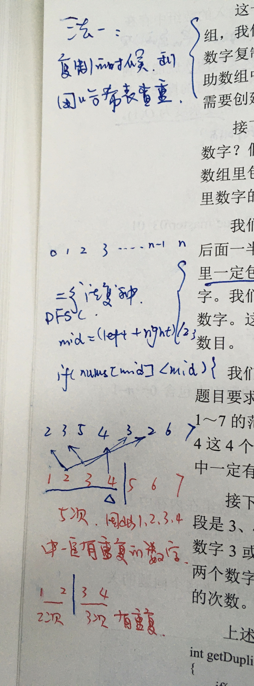

<!--
 * @Date: 2022-01-12 11:32:28
 * @Author: bFeng
-->
题目:
在一个长度为n+1的数组里的所有数字都在1~n的范围内，所以数组中至少有一个数字是重复的。请找出数组中任意一个重复的数字，但是不能修改输入的数组。例如，如果输入长度为8的数组{2,3,5,4,3,2,6,7}，那么对应的输出是重复的数字2或者3。  




```
class Solution {// 二分法
public:
int duplicate(vector<int>& numbers) {
    // write code here
    if(numbers.empty()) return -1;
    int start=1; int end=numbers.size()-1;
    while(start<=end){
        int mid = start + ((end-start)>>1);
        int cnt = countRange(start, mid, numbers);
        
        if(start == end){
            if(cnt > 1) return start;
            else break;
        }

        if(cnt > (mid-start+1)) end = mid;
        else start = mid + 1;
    }
    return -1;
}
private:
// 以index划分区间，并统计
int countRange(int start, int end, std::vector<int>& numbers){
    if(numbers.empty()) return 0;
    int cnt = 0;
    for(int i=0; i<numbers.size(); i++){
        if(numbers[i]>=start && numbers[i]<=end){
            cnt++;
        }
    }
    return cnt;
}
};
```