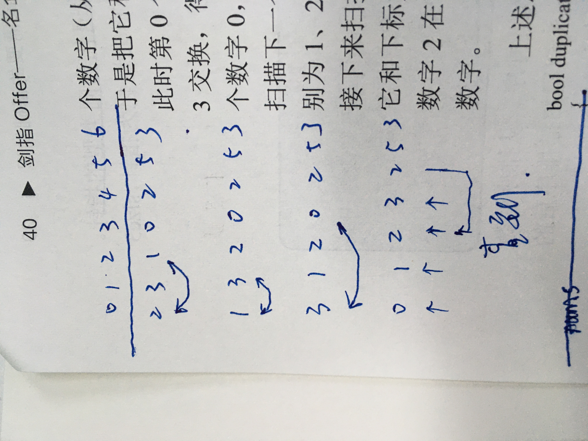

<!--
 * @Date: 2022-01-11 21:26:20
 * @Author: bFeng
-->
JZ3 数组中重复的数字  
 
知识点  ：数组  
描述  ：在一个长度为n的数组里的所有数字都在0到n-1的范围内。 数组中某些数字是重复的，但不知道有几个数字是重复的。也不知道每个数字重复几次。请找出数组中任意一个重复的数字。 例如，如果输入长度为7的数组[2,3,1,0,2,5,3]，那么对应的输出是2或者3。存在不合法的输入的话输出-1  

数据范围：  0<= n <= 100  
进阶：时间复杂度O(n)，空间复杂度O(n)  
示例1  
输入：  
[2,3,1,0,2,5,3]  

返回值：  
2

说明：
2或3都是对的

-----------------



------------------

```c
class Solution { // 排序查重方法
public:
    int duplicate(vector<int>& numbers) {
        // write code here
        if(numbers.empty()) return -1;
        sort(numbers.begin(), numbers.end(), [&](const auto& a,const auto& b){
            return a<b;
        });
        for(int i=1; i<numbers.size(); i++){
            if(numbers[i] == numbers[i-1]) return numbers[i];
        }
        return -1;
    }
};

class Solution { // 其他数据结构辅助set
public:
    int duplicate(vector<int>& numbers) {
        // write code here
        if(numbers.empty()) return -1;
        std::set<int> num_set;
        for(int i=0; i<numbers.size(); i++){
            if(num_set.find(numbers[i]) != num_set.end()){
                return numbers[i];
            }else{
                num_set.insert(numbers[i]);
            }
        }
        return -1;
    }
};

class Solution {// 哈希表方法
public:
    int duplicate(vector<int>& numbers) {
        // write code here
        if(numbers.empty()) return -1;
        int count[10001] = {0};
        for(const auto& num : numbers){
            count[num]++;
        }
        for(int i=0; i<sizeof(count)/sizeof(int); i++){
            if(count[i]>1) {
                return i;
            }
        }
        return -1;
    }
};

class Solution {// 一边排序，一边查重
public:
    int duplicate(vector<int>& numbers) {
        // write code here
        if(numbers.empty()) return -1;
        for(int i=0; i<numbers.size(); i++){
            while(numbers[i] != i){
                if (numbers[i] == numbers[numbers[i]])
                    return numbers[i];
                int tmp = numbers[i];
                numbers[i] = numbers[tmp];
                numbers[tmp] = tmp;
            }
        }
        return -1;
    }
};
```
