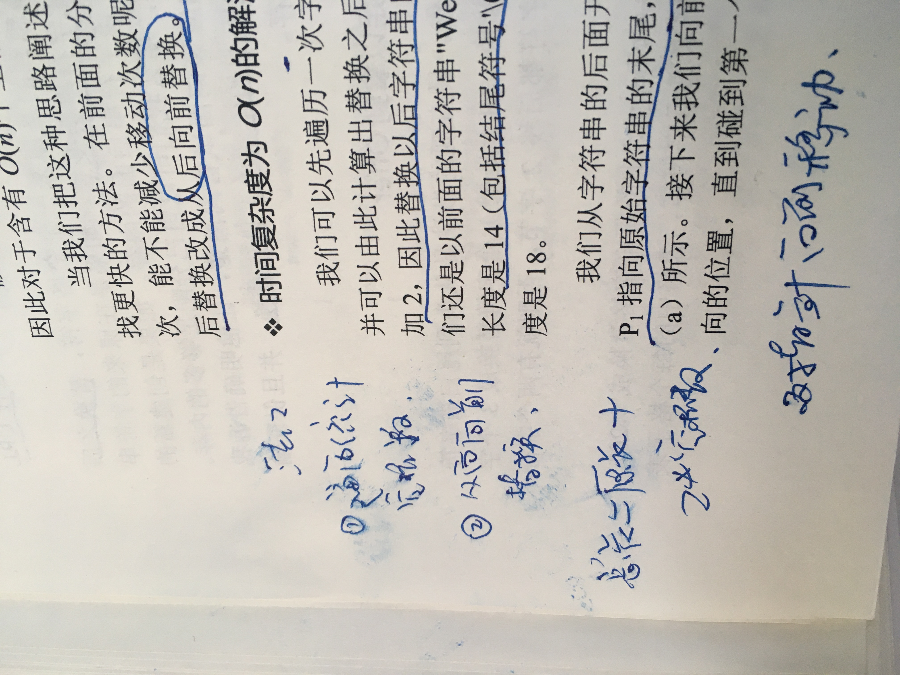
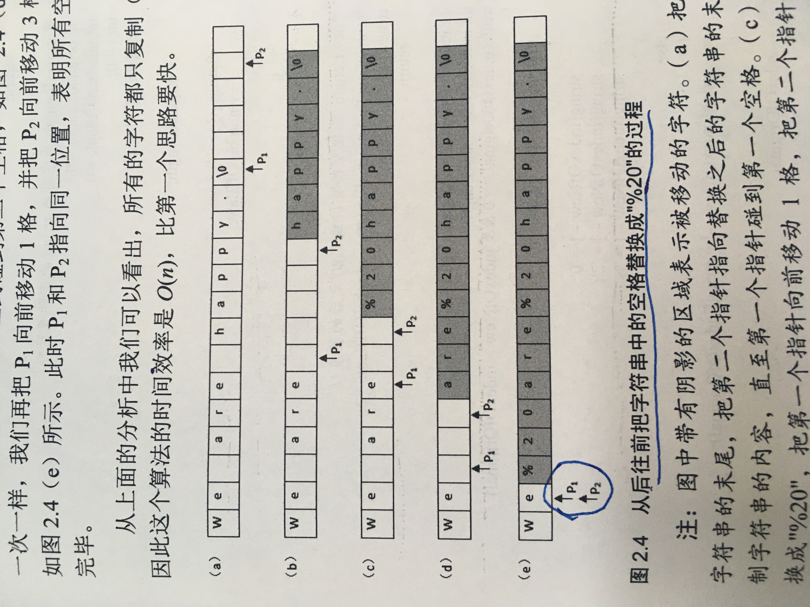

<!--
 * @Date: 2022-03-02 16:55:55
 * @Author: bFeng
-->
请实现一个函数，把字符串 s 中的每个空格替换成"%20"。

 

示例 1：

输入：s = "We are happy."  
输出："We%20are%20happy."  
 

限制：

0 <= s 的长度 <= 10000






- [string 的一些函数参考](https://zh.cppreference.com/w/cpp/string/basic_string)

```c
class Solution {
public:
    string replaceSpace(string s) {
        if(s == "") return s;
        int len = 0, count_space = 0;
        while(s[len] != '\0') {
            if(s[len] == ' ') {
                count_space ++;
            }
            len ++;
        }
        // len ++;  注意这里不++ 就没有统计 '/0' 因此后面索引不用 -1
        int new_len = len + 2 * count_space;
        s.resize(new_len);
        int p1 = len, p2 = new_len;//索引不用 -1
        while(p1 >= 0) {
            if(s[p1] == ' ') {
                s[p2--] = '0';
                s[p2--] = '2';
                s[p2--] = '%';
            } else {
                s[p2--] = s[p1];
            }    
            p1 --;
        }
        return s;
    }
};
```