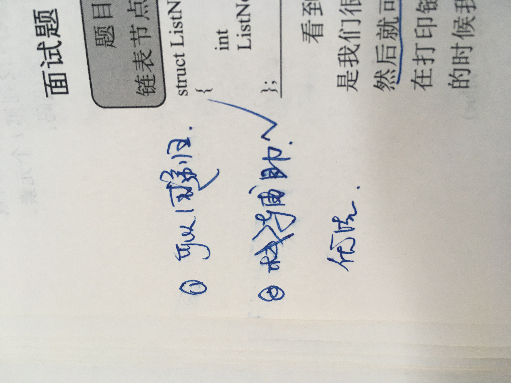

<!--
 * @Date: 2022-03-02 17:15:18
 * @Author: bFeng
-->
输入一个链表的头节点，从尾到头反过来返回每个节点的值（用数组返回）。

 

示例 1：

输入：head = [1,3,2]  
输出：[2,3,1]
 

限制：

0 <= 链表长度 <= 10000




```c
/**
 * Definition for singly-linked list.
 * struct ListNode {
 *     int val;
 *     ListNode *next;
 *     ListNode(int x) : val(x), next(NULL) {}
 * };
 */
class Solution {
public:
    vector<int> reversePrint(ListNode* head) {
        std::vector<int> res;
        if (head == nullptr) return res;

        std::stack<ListNode*> node_ptr_stack;
        ListNode* p = head;
        while( p != nullptr) {
            node_ptr_stack.push(p);
            p = p->next;
        }
        while(!node_ptr_stack.empty()) {
            res.push_back(node_ptr_stack.top()->val);
            node_ptr_stack.pop();
        }
        return res;
    }
};
```