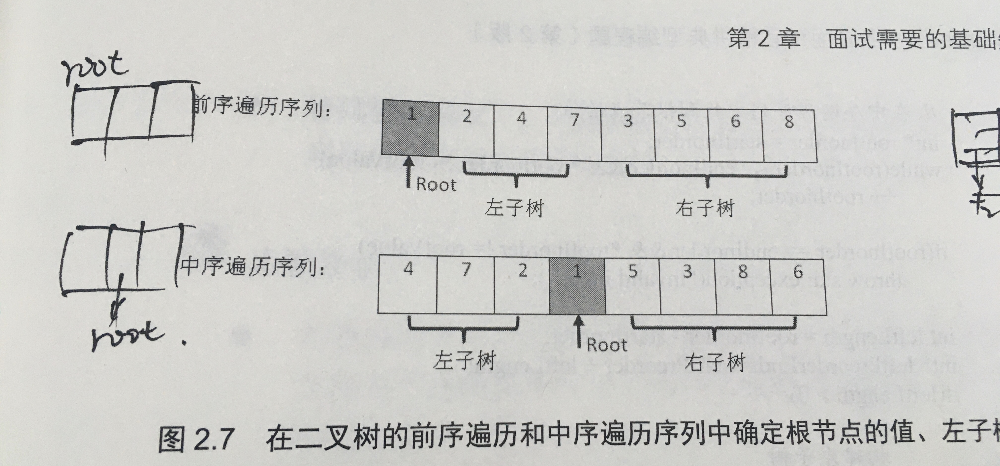
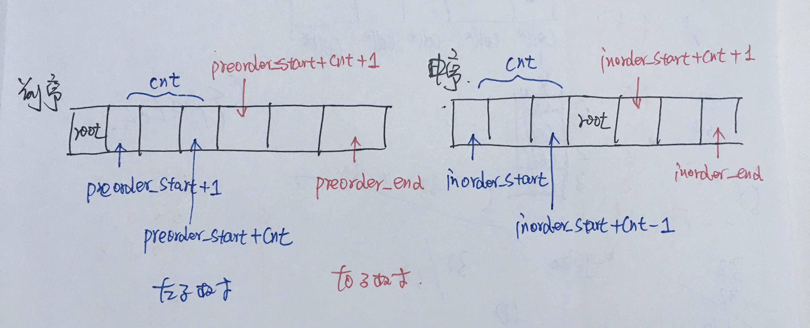

<!--
 * @Date: 2022-03-02 18:42:19
 * @Author: bFeng
-->
输入某二叉树的前序遍历和中序遍历的结果，请构建该二叉树并返回其根节点。

假设输入的前序遍历和中序遍历的结果中都不含重复的数字。

 

示例 1:


Input: preorder = [3,9,20,15,7], inorder = [9,3,15,20,7]  
Output: [3,9,20,null,null,15,7]  


示例 2:  

Input: preorder = [-1], inorder = [-1]  
Output: [-1]  
 

限制：  

0 <= 节点个数 <= 5000  

 



- 自己实现方式 DFS
```c
/**
 * Definition for a binary tree node.
 * struct TreeNode {
 *     int val;
 *     TreeNode *left;
 *     TreeNode *right;
 *     TreeNode(int x) : val(x), left(NULL), right(NULL) {}
 * };
 */
class Solution {
public:
    TreeNode* buildTree(vector<int>& preorder, vector<int>& inorder) {
        if(preorder.empty() || inorder.empty()) {
            return nullptr;
        }
        return build_tree_dfs(preorder, inorder);
    }

private:
    TreeNode* build_tree_dfs(vector<int>& preorder, vector<int>& inorder) {
        if(preorder.empty() || inorder.empty()) {
            return nullptr;
        }
        if (preorder.size() == 1 && inorder.size() == 1) {
            return new TreeNode(preorder[0]);
        }

        int root_val = preorder[0];
        std::vector<int> preorder_left, inorder_left, 
                         preorder_right, inorder_right;
        bool boundary_flag = false;
        int boundary_count = 0;
        for(const auto& val : inorder) {
            if(val == root_val) {
                boundary_flag = true;
                continue;
            }
            if(!boundary_flag) {
                inorder_left.push_back(val);
                boundary_count ++;
            }else if(boundary_flag){
                inorder_right.push_back(val);
            }
        }

        for(int i = 1; i < preorder.size(); i++) {
            if (i <= boundary_count) {
                preorder_left.push_back(preorder[i]);
            } else {
                preorder_right.push_back(preorder[i]);
            }
        }

        TreeNode* left = build_tree_dfs(preorder_left, inorder_left);
        TreeNode* right = build_tree_dfs(preorder_right, inorder_right);
        return new TreeNode(root_val, left, right);
    }

};
```
只需一个 new：

```c
class Solution {
public:
    TreeNode* buildTree(vector<int>& preorder, vector<int>& inorder) {
        if(preorder.empty() || inorder.empty()) {
            return nullptr;
        }
        return build_tree_dfs(preorder, inorder);
    }

private:
    TreeNode* build_tree_dfs(vector<int>& preorder, vector<int>& inorder) {
        if(preorder.empty() ) {
            return nullptr;
        }
        // if (preorder.size() == 1 && inorder.size() == 1) {
        //     return new TreeNode(preorder[0]);
        // }
        int root_val = preorder[0];
        TreeNode* root = new TreeNode(root_val);
        std::vector<int> preorder_left, inorder_left, 
                         preorder_right, inorder_right;
        bool boundary_flag = false;
        int boundary_count = 0;
        for(const auto& val : inorder) {
            if(val == root_val) {
                boundary_flag = true;
                continue;
            }
            if(!boundary_flag) {
                inorder_left.push_back(val);
                boundary_count ++;
            }else if(boundary_flag){
                inorder_right.push_back(val);
            }
        }

        for(int i = 1; i < preorder.size(); i++) {
            if (i <= boundary_count) {
                preorder_left.push_back(preorder[i]);
            } else {
                preorder_right.push_back(preorder[i]);
            }
        }

        root->left = build_tree_dfs(preorder_left, inorder_left);
        root->right = build_tree_dfs(preorder_right, inorder_right);
        return root;
    }

};
```


- 改进: 使用下标进行索引，减少内存消耗




```c
/**
 * Definition for a binary tree node.
 * struct TreeNode {
 *     int val;
 *     TreeNode *left;
 *     TreeNode *right;
 *     TreeNode(int x) : val(x), left(NULL), right(NULL) {}
 * };
 */
class Solution {
public:
    TreeNode* buildTree(vector<int>& preorder, vector<int>& inorder) {
        if(preorder.empty() || inorder.empty()) {
            return nullptr;
        }
        return build_tree_dfs(preorder, 0, preorder.size()-1, inorder, 0, inorder.size()-1);
    }

private:
    TreeNode* build_tree_dfs(vector<int>& preorder, int preorder_start, int preorder_end,
                             vector<int>& inorder, int inorder_start, int inorder_end) {
        if(preorder_start > preorder_end) {
            return nullptr;
        }
       
        TreeNode* root = new TreeNode(preorder[preorder_start]);// 前序的第一个数是根节点
        int cnt = 0;                                            // 统计左子树元素个数
        for (int i = inorder_start; i <= inorder_end; i++) {    // 在后序遍中找到根节点
            if (inorder[i] == preorder[preorder_start]) {
            cnt = i - inorder_start;
            break;
            }
        }
        
        root->left = build_tree_dfs(preorder, preorder_start+1, preorder_start+cnt,
                                    inorder, inorder_start, inorder_start+cnt-1);
        root->right = build_tree_dfs(preorder, preorder_start+cnt+1, preorder_end,
                                     inorder, inorder_start+cnt+1, inorder_end);
        
        return root;
    }

};
```
