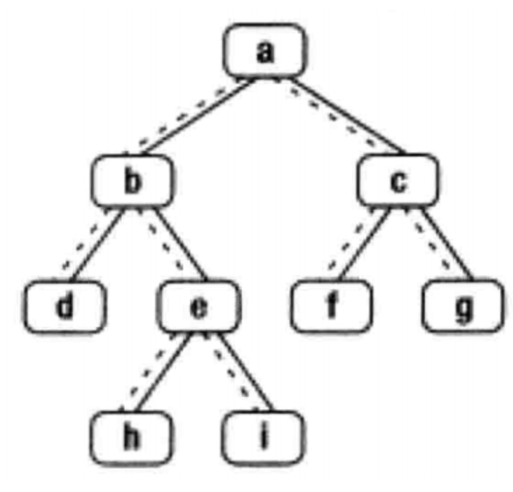
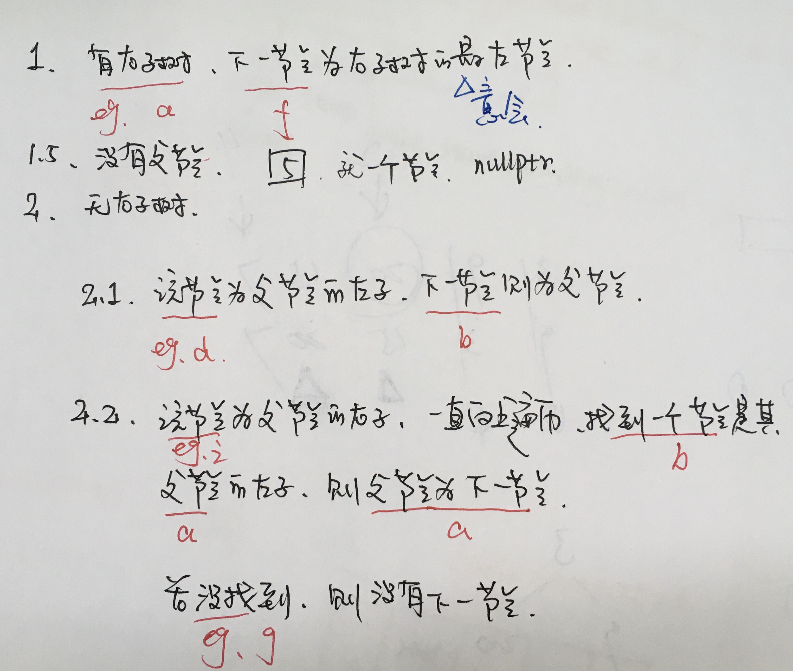
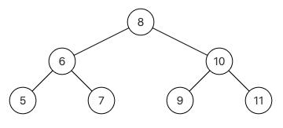

<!--
 * @Date: 2022-03-03 09:03:35
 * @Author: bFeng
-->
描述  
给定一个二叉树其中的一个结点，请找出中序遍历顺序的下一个结点并且返回。注意，树中的结点不仅包含左右子结点，同时包含指向父结点的next指针。下图为一棵有9个节点的二叉树。树中从父节点指向子节点的指针用实线表示，从子节点指向父节点的用虚线表示  


  
示例:  
输入:{8,6,10,5,7,9,11},8  
返回:9  
解析:这个组装传入的子树根节点，其实就是整颗树，中序遍历{5,6,7,8,9,10,11}，根节点8的下一个节点就是9，应该返回{9,10,11}，后台只打印子树的下一个节点，所以只会打印9，如下图，其实都有指向左右孩子的指针，还有指向父节点的指针，下图没有画出来  



数据范围：节点数满足 1≤n≤50 1≤n≤50  ，节点上的值满足 1≤val≤100 1≤val≤100 


要求：空间复杂度 O(1) O(1)  ，时间复杂度 O(n) O(n)   
输入描述：  输入分为2段，第一段是整体的二叉树，第二段是给定二叉树节点的值，后台会将这2个参数组装为一个二叉树局部的子树传入到函数GetNext里面，用户得到的输入只有一个子树根节点

返回值描述： 返回传入的子树根节点的下一个节点，后台会打印输出这个节点  


示例1  
输入：  {8,6,10,5,7,9,11},8  
返回值： 
9  


示例2  
输入：  {8,6,10,5,7,9,11},6  
返回值：  7  


示例3  
输入：  {1,2,#,#,3,#,4},4  
返回值： 1


示例4  
输入：  {5},5  
返回值： "null"


```c
/*
struct TreeLinkNode {
    int val;
    struct TreeLinkNode *left;
    struct TreeLinkNode *right;
    struct TreeLinkNode *next;
    TreeLinkNode(int x) :val(x), left(NULL), right(NULL), next(NULL) {
        
    }
};
*/
class Solution {
public:
    TreeLinkNode* GetNext(TreeLinkNode* pNode) {
        if(pNode == nullptr) return nullptr;
        
        // 1.有右子树
        if(pNode->right) {
            // right_child
            TreeLinkNode* next_node = pNode->right;
            while(next_node->left != nullptr) {
                next_node = next_node->left;
            }
            return next_node;
        }
        // 2.没有父节点
        if(!pNode->next) {
            return nullptr;
        }
        // 3.无右子树
        // 3.1.该节点为父节点的左子
        if(pNode->next->left == pNode) {
            return pNode->next;
        }
        
        // 3.2.该节点为父节点的右子
        if(pNode->next->right == pNode) {
            TreeLinkNode* next_node = pNode->next;
            while(next_node->next) {
                if(next_node == next_node->next->left) {
                    return next_node->next;
                }
                next_node = next_node->next;
            }
        }
        
        return nullptr;
    }
};
```