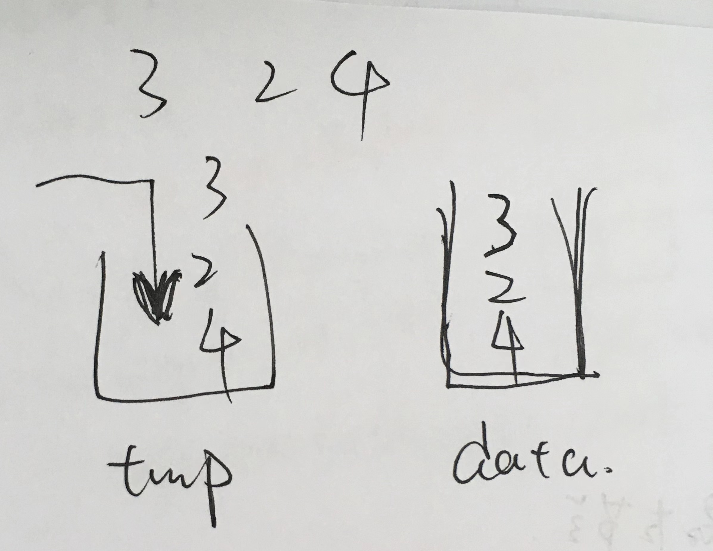

<!--
 * @Date: 2022-03-03 10:11:42
 * @Author: bFeng
-->
用两个栈实现一个队列。队列的声明如下，请实现它的两个函数 appendTail 和 deleteHead ，分别完成在队列尾部插入整数和在队列头部删除整数的功能。(若队列中没有元素，deleteHead 操作返回 -1 )  

 

示例 1：  
输入：  
["CQueue","appendTail","deleteHead","deleteHead"]  
[[],[3],[],[]]  
输出：[null,null,3,-1]  


示例 2：  
输入：  
["CQueue","deleteHead","appendTail","appendTail","deleteHead","deleteHead"]  
[[],[],[5],[2],[],[]]  
输出：[null,-1,null,null,5,2]  





```c
class CQueue {
public:
    CQueue() {

    }
    
    void appendTail(int value) {
        data_.push(value);
    }
    
    int deleteHead() {
        if (data_.empty()) {
            return -1;
        }
        while(!data_.empty()) {
            tmp_.push(data_.top());
            data_.pop();
        }
        int res = tmp_.top();
        tmp_.pop();

        while(!tmp_.empty()) {
            data_.push(tmp_.top());
            tmp_.pop();
        }
        return res;
    }
private:
    std::stack<int> data_;
    std::stack<int> tmp_;
};
```