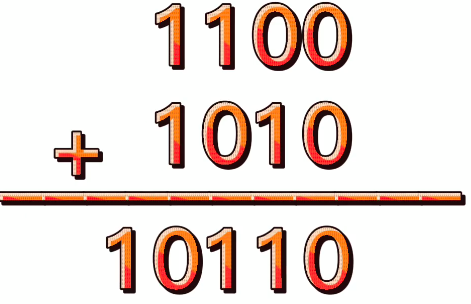
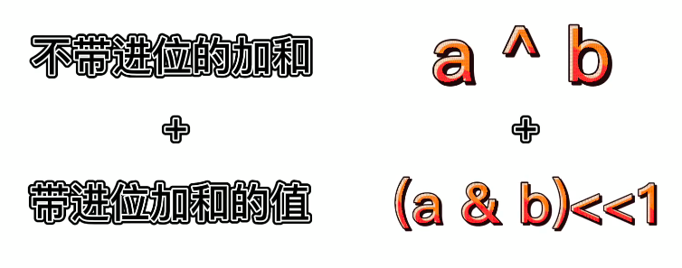
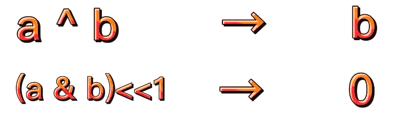
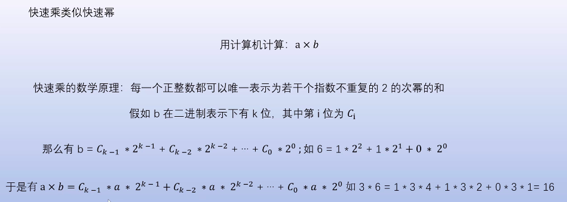
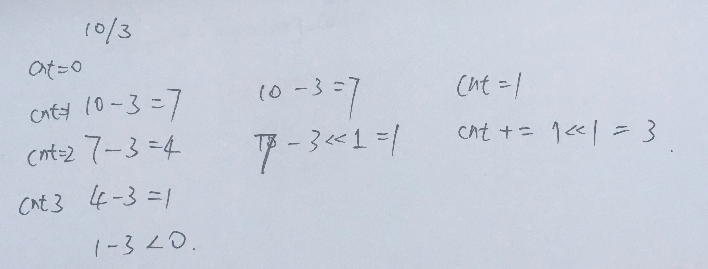
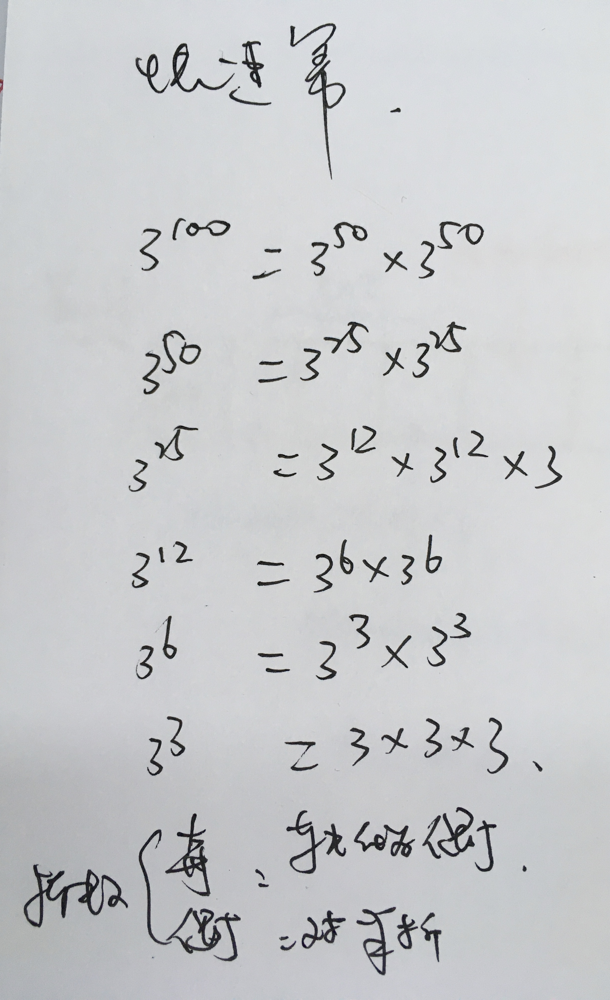
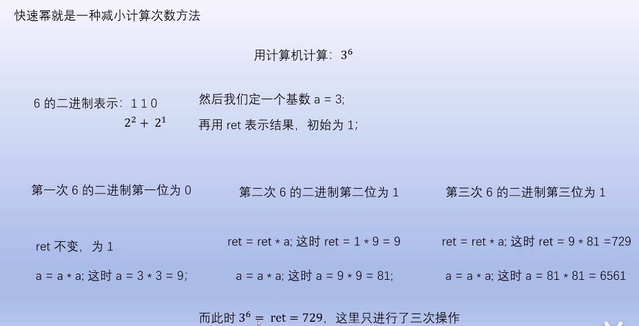
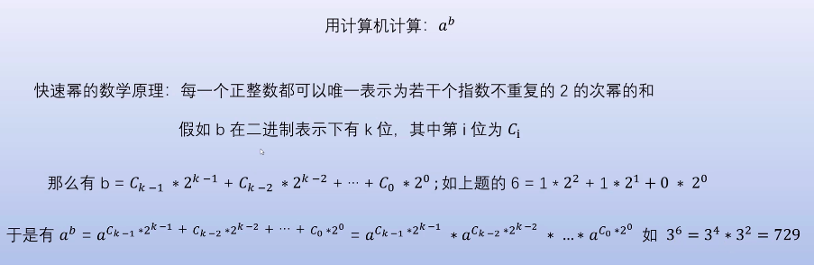

<!--
 * @Date: 2022-03-03 17:00:06
 * @Author: bFeng
-->


##  1.两整数之和  
a+b可以转换为 「不带进位的加法运算」+ 「带进位的加法运算」


不带进位：  


带进位：  

  
  


使用递归运算，递归出口：



```
- a=0,  a^b + (a&b)<<1 = 0^b + 0 = b
- b=0,  a^b + (a&b)<<1 = a^0 + 0 = a
- 所以出口可以直接定义为 
  b == 0; return a; 
  b != 0; return a^b + (a&b)<<1;
```


```c
int getSum(int a, int b) {
  return b == 0 ? a : getSum(a^b, (unsigned int)(a&b)<<1);
}
```
非递归版本
```c
class Solution {
 public:
  int add(int a, int b) {
    //因为不允许用+号，所以求出异或部分和进位部分依然不能用+
    //号，所以只能循环到没有进位为止
    while (b != 0) {
      //保存进位值，下次循环用
      int c = (unsigned int)(a & b) << 1;  // C++中负数不支持左移位，因为结果是不定的
      //保存不进位值，下次循环用，
      a ^= b;
      //如果还有进位，再循环，如果没有，则直接输出没有进位部分即可。
      b = c;
    }
    return a;
  }
};
```

##  2.乘法


a×b看成十进制下的a×二进制下的b，把b按照二进制下的位拆开，用加法代替乘法

```c
class Solution {
public:
    void mul(int&ans,long long a,long long b){
        if(b==0) return; // 终止递归
        if(b&1) ans+=a;  // 选中
        mul(ans,a+a,b>>1);
    }
    int multiply(int A, int B) {
        int ans=0;
        mul(ans,A,B);
        return ans;
    }
};
```




```c
class Solution {
public:
  void multiply(int A, int B) {
    int ret = 0;
    while (b) {
      if (b & 1) {
        ret = ret + a;
      }
      a *= 2;
      b >>= 1;
    }
  }
};
```

- $a \times b=C_{k-1} * a+2^{k-1}+C_{k-2} * a * 2^{k-2}+\cdots+C_{0}*a*2^{0}$
- $3 * 6=1 * 3 * 4+1 * 3 * 2+0 * 3 * 1=18$

**Solution.multiply(3, 6):  6个3相加**
- $(6)_2 = 110$  
- a = 3, b = 6
- ret = 0


人为理解的逻辑顺序:

1. 乘数$2^0$ , b & 1 = 0 (未选中): 计算 $a*2^0 = 3*1 = 1$
2. 乘数$2^1$ , b & 1 = 1 (选中):  计算$a*2^1 = 3*2 = 6$; $ret = ret + 6 = 6$
3. 乘数$2^2$ , b & 1 = 1 (选中):  计算$a*2^2 = 3*4 = 12$; $ret = ret + 12 = 18$
4. 乘数$2^3$ , b & 1 = 0 (未选中): 计算$a*2^3$;

计算 a 时，可以使用迭代：

0. $a = a * 2^0 = a = 3$
1. 乘数$2^0$ , b & 1 = 0 (未选中): --- , 计算 $a*2^1$ --> $a = a*2 = 6$
2. 乘数$2^1$ , b & 1 = 1 (选中): $ret=ret+a=0+6=6$, 计算$a*2^2$--> $a = a*2 = 12$
3. 乘数$2^2$ , b & 1 = 1 (选中): $ret=ret+a=6+12=18$, 计算$a*2^3$--> $a = a*2 = 24$
4. 乘数$2^3$ , b & 1 = 0 (退出循环)


##  3.两数相除  
给定两个整数，被除数 dividend 和除数 divisor。将两数相除，要求不使用乘法、除法和 mod 运算符。

返回被除数 dividend 除以除数 divisor 得到的商。

整数除法的结果应当截去（truncate）其小数部分，例如：truncate(8.345) = 8 以及 truncate(-2.7335) = -2

 

示例 1:  
输入: dividend = 10, divisor = 3  
输出: 3  
解释: 10/3 = truncate(3.33333..) = truncate(3) = 3  


示例 2:  
输入: dividend = 7, divisor = -3  
输出: -2  
解释: 7/-3 = truncate(-2.33333..) = -2  
 

提示：

被除数和除数均为 32 位有符号整数。   
除数不为 0。  
假设我们的环境只能存储 32 位有符号整数，其数值范围是 [−2^31,  2^31 − 1]。本题中，如果除法结果溢出，则返回 2^31 − 1。


思路：  


```c
class Solution {
public:
    int divide(int dividend, int divisor) {
        // 最高位 0代表正数，1代表负数
        int sign = ((dividend ^ divisor) >> 31 & 0x1 == 1) ? -1 : 1;
        // 转换为 long 防止越界
        long dividend_long = abs((long)dividend);
        long divisor_long = abs((long)divisor);
        long cnt = 0;
        while(dividend_long >= divisor_long) {
            long i = 1;
            long tmp = divisor_long;
            while(dividend_long >= tmp) {
                dividend_long -= tmp;
                cnt += i; //统计作差的次数
                i <<= 1;      //步长加倍
                tmp <<= 1;
            }
        }

        cnt *= sign; // 加上符号位
        if(cnt > INT_MAX || cnt < INT_MIN) { // 检查是否越界
            return INT_MAX;
        }
        return (int)cnt;
    }
};
```


##  4.Pow(x, n)

- [参考](https://www.bilibili.com/video/BV1i44y1q7ck?from=search&seid=3443053821312317981&spm_id_from=333.337.0.0)

实现 pow(x, n) ，即计算 x 的 n 次幂函数（即，xn ）。


内存爆炸

```c
class Solution {
public:
    double myPow(double x, int n) {
        // 最高位 0代表正数，1代表负数
        int sign = (n >> 31 & 0x1 == 1) ? 1 : 0;
        if(sign == 1) {
            n = abs(n);
            x = 1.0/x;
        }
        return myPow_internal(x, n);
    }
private:
    double myPow_internal(double x, int n) {
        if(n==1) return x;
        return x * myPow(x, n-1);
    }
};
```


暴力法，超时

```c
class Solution {
public:
    double myPow(double x, int n) {
        // 最高位 0代表正数，1代表负数
        int sign = (n >> 31 & 0x1 == 1) ? 1 : 0;
        if(sign == 1) {
            n = abs(n);
            x = 1.0/x;
        }
        double res = 1;
        while(n--){
            res *= x;
        }
        return res;
    }
};
```


快速幂-1



```c
class Solution {
public:
    double myPow(double x, int n) {
        if(n==0 || x==1) {
            return 1;
        }
        if(n < 0) {
            n = abs(n);
            x = 1.0/x;
        }
        return myPow_internal(x,n);
    }
private:
    double myPow_internal(double x, int n) {
        if(n==1) return x;
        if(n & 1) { // 奇数
            double half_val = myPow_internal(x, n/2);
            return half_val * half_val * x;
        } else {
            double half_val = myPow_internal(x, n/2);
            return half_val * half_val;
        }
    }
};
```


快速幂-2




```c
class Solution {
 public:
  double myPow(double x, int n) {
    if (n >= 0)
      return myPow_internal(x, (long long)n);
    else
      return 1.0 / myPow_internal(x, -(long long)n);
  }

 private:
  double myPow_internal(double a, long long n) {
    double res = 1.0;
    while (n) {
      // 判断 n 二进制最右一位是否为 1
      if (n & 1) {
        res *= a;
      }
      a *= a;
      // n 右移一位
      n >>= 1;
    }
    return res;
  }
};
```

- 指数：$\mathrm{b}=C_{k-1} * 2^{k-1}+C_{k-2} * 2^{k-2}+\cdots+C_{0} * 2^{0}$
- $6=1 * 2^{2}+1 * 2^{1}+0 * 2^{0}$
- $a^{b}=a^{C_{k-1} * 2^{k-1}}+C_{k-2} * 2^{k-2}+\cdots+C_{0} * 2^{0}=a^{C_{k-1} * 2^{k-1}} * a^{C_{k-2} * 2^{k-2}} * \ldots * a^{C_{0} * 2^{0}}$
- $3^{6}=3^{4} * 3^{2}=729$

**Solution.myPow(3, 6):  6个3相乘**
- $(6)_2 = 110$  
- a = 3, b = 6
- ret = 1


人为理解的逻辑顺序:

1. 指数$2^0$ , b & 1 = 0 (未选中): 计算 $a^{2^0} = 3^1 = 3$
2. 指数$2^1$ , b & 1 = 1 (选中):  计算$a^{2^1} = 3^2 = 9$; $ret = ret * 9 = 9$
3. 指数$2^2$ , b & 1 = 1 (选中):  计算$a^{2^2} = 3^4 = 81$; $ret = ret * 81 = 729$
4. 指数$2^3$ , b & 1 = 0 (未选中): 计算$a^{2^3}$;

计算 a 时，可以使用迭代：

0. $a = a ^ {2^0} = a^1 = 3$
1. 指数$2^0$ , b & 1 = 0 (未选中): --- , 计算 $a^{2^1}$ --> $a = a^2 = 9$
2. 指数$2^1$ , b & 1 = 1 (选中): $ret=ret*a=1*9=9$, 计算$a^{2^2}$--> $a = a^2 = 81$
3. 指数$2^2$ , b & 1 = 1 (选中): $ret=ret*a=81*9=729$, 计算$a^{2^3}$--> $a = a^2 = 6561$
4. 指数$2^3$ , b & 1 = 0 (退出循环)


- [阅读](https://blog.csdn.net/qq_43827595/article/details/106157681)


##  7.mySqrt


- 二分法


```c
class Solution {
public:
  int mySqrt(int x) {
      if(x==0) return 0;
      if(x==1) return 1;
      int left = 0, right = x, res = -1;
      while(left <= right) {
          int mid = left + 0.5 * (right - left);
          if((long long)mid*mid <= x) {
            res = mid;
            left = mid + 1;  
          } else {
            right = mid - 1;
          }
      }
      return (int)res;
  }
};
```

##  8.maximum

找出两个数字a和b中最大的那一个。不得使用if-else或其他比较运算符。

max = (a + b + abs(a - b)) / 2

```c
class Solution {
public:
  int maximum(int a, int b) {
    long diff = abs((long)a - (long)b);
    return (long)((long)a + (long)b + diff) / 2;
  }
};
```

##  9.反转两次的数字

反转 一个整数意味着倒置它的所有位。

例如，反转 2021 得到 1202 。反转 12300 得到 321 ，不保留前导零 。给你一个整数 num ，反转 num 得到 reversed1 ，接着反转 reversed1 得到 reversed2 。如果 reversed2 等于 num ，返回 true ；否则，返回 false 。


```c
class Solution {
public:
    bool isSameAfterReversals(int num) {
        if(num == 0) return true;
        if(num % 10 == 0) return false;
        return true;
    }
};
```

```c
class Solution {
public:
    bool isSameAfterReversals(int num) {
        return num == 0 || num % 10 != 0;
    }
};
```