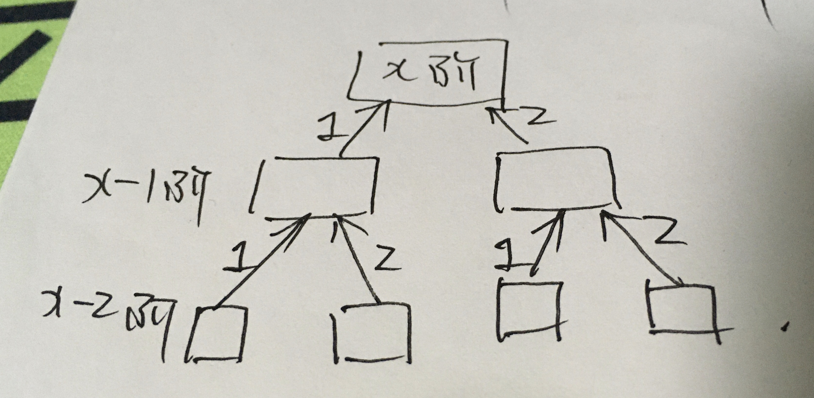

<!--
 * @Date: 2022-03-04 16:27:20
 * @Author: bFeng
-->


##  1.搜索旋转排序数组

递归，实现复杂了

```c
class Solution {
public:
    int search(vector<int>& nums, int target) {
        int res;
        recursion(nums, target, 0, nums.size()-1, res);
        return res;
    }

private:

    bool recursion(std::vector<int>& nums,
                   int& target,
                   int left, int right, int& mid){// mid 为引用只是保存结果的作用
        if(left == right){
            if(nums[left] == target){
                mid = left;
                return true;
            }else{
                mid = -1;
                return false;
            }
        }

        mid = left + (right-left)/2;
        if(target == nums[mid]) return true;

        if(nums[left] <= nums[mid] ){// 左部分有序 
            if(target<nums[mid] && target>=nums[left]){//且 目标值在区间里面
                // 在有序区间里使用二分查找
                return binSearch(nums, target, left, mid - 1, mid);
            }else{// 目标值在右边无序里面
                return recursion(nums, target, mid+1, right, mid);
            }
        }else{// 右部分有序
            if(target>nums[mid] && target<=nums[right]){//且 目标值在区间里面
                // 在有序区间里使用二分查找
                return binSearch(nums, target, mid + 1, right, mid);
            }else{// 目标值在左边无序里面
                return recursion(nums, target, left, mid-1, mid);
            }
        }
        mid = -1;
        return false;
    } 

    bool binSearch(std::vector<int>& nums, int& target, int left, 
                   int right, int& mid){// mid只是传结果出去
        while(left <= right){
            mid = left + (right-left)/2;
            if(target == nums[mid]) return true;
            if(target < nums[mid]){
                right = mid - 1;
            }else if(target > nums[mid]){
                left = mid + 1;
            }
        }
        // while 没找到 mid = -1
        mid = -1;
        return false;
    }
};
```

##  2.搜索旋转排序数组II


同样使用二分法

```c
class Solution {
public:
    bool search(vector<int>& nums, int target) {
        int left = 0;
        int right = nums.size() - 1;

        while(left <= right){
            int mid = left + (right-left)/2;
            if(nums[mid] == target) return true;
            if(nums[left] == nums[right] && 
               nums[left] == nums[mid]) {
              left ++, right --;
              continue;
            }
            if(nums[left] <= nums[mid]){// 左边有序 右边无序
                // target 在有序序列中
                if(target>=nums[left] && target<nums[mid]){
                    right = mid - 1;
                }else{// target 在右边无序列中
                    left = mid + 1;
                }
            }else{// 左边无序 右边有序
                // target 在有序序列中
                if(target<=nums[right] && target>nums[mid]){
                    left = mid + 1;
                }else{// target 在右边无序列中
                    right = mid - 1;
                }
            }
        }
        return false;
    }
};
```

##  3.寻找旋转排序数组中的最小值


```c
class Solution {
public:
    int findMin(vector<int>& nums) {
      int left = 0, right = nums.size()-1;
      int min = nums[0]; // 记录最小值
      while(left <= right) {
        int mid = left + (right - left) / 2;
        if(nums[left] <= nums[mid]) { // 左边有序
          min = nums[left] < min ? nums[left] : min;
          left = mid + 1;
        } else { // 右边有序
          min = nums[mid] < min ? nums[mid] : min;
          right = mid - 1;
        }
      }
      return min;
    }
};
```

 - [阅读](https://leetcode-cn.com/problems/find-minimum-in-rotated-sorted-array/solution/xun-zhao-xuan-zhuan-pai-xu-shu-zu-zhong-5irwp/)

## 4.爬楼梯



```c
class Solution {
public:
    int climbStairs(int n) {
        int p = 0, q = 0, r = 1;
        for (int i = 1; i <= n; ++i) {
            p = q; 
            q = r; 
            r = p + q;
        }
        return r;
    }
};
```


##  5.斐波那契数

先简单递归实现吧

```c
class Solution {
public:
    int fib(int n) {
      if (n == 0) return 0;
      if (n == 1) return 1;
      return fib(n-1) + fib(n-2);
    }
};
```

##  6.第 N 个泰波那契数


同样使用递归简单实现
```c
class Solution {
public:
    int tribonacci(int n) {
      if(n == 0) return 0;
      if (n == 1 || n == 2) return 1;
      return tribonacci(n-1) + tribonacci(n-2) + tribonacci(n-3);
    }
};
```
递归实现超时，改为自上而下的计算避免重复计算

```c
class Solution {
public:
int tribonacci(int n) {
  if (n == 0) return 0;
  if (n == 1 || n == 2) return 1;
  int a = 0, b = 1, c = 1;
  for (int i = 3; i <= n; i++) {
      int d = a + b + c;
      a = b;
      b = c;
      c = d;
  }
  return c;
}
};
```

##  7.差的绝对值为 K 的数对数目


##  8.猜数字

##  9.拿硬币

##  10.山峰数组的顶部


