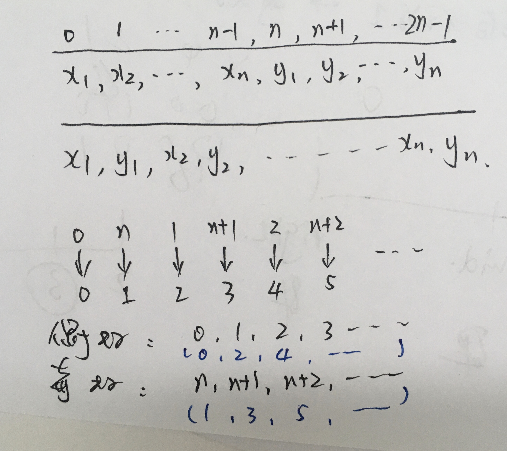

##  1.重新排列数组

- [1470-重新排列数组](https://leetcode-cn.com/problems/shuffle-the-array/)



和教练博客中的函数头不同：

```c
class Solution {
public:
    vector<int> shuffle(vector<int>& nums, int n) {
      std::vector<int> res(nums.size());
      for(int i = 0; i < nums.size(); ++i) {
        if(i & 1) { // 新索引为奇数
          res[i] = nums[n + i/2];
        } else {    // 新索引为偶数
          res[i] = nums[i/2];
        }
      }
      return res;
    }
};
```

教练：

```c
/**
Note: The returned array must be malloced, assume caller calls free().  // (1)
 */
int* shuffle(int* nums, int numsSize, int n, int* returnSize)           // (2)
    int i;
    int *ret = (int *)malloc( sizeof(int) * numsSize );                 // (3)
    for(i = 0; i < numsSize; ++i) {                                     // (4)
        if(i & 1) {
            ret[i] = nums[n + i/2];
        }else {
            ret[i] = nums[(i+1)/2];
        }
    }
    *returnSize = numsSize;                                             // (5)
    return ret;                                                         // (6)
}
```


##  2.数组串联

- [1929-数组串联](https://leetcode-cn.com/problems/concatenation-of-array/)

同样和教练的函数头不一样。

```c
class Solution {
public:
    vector<int> getConcatenation(vector<int>& nums) {
      std::vector<int> res;
      
      for (int i = 0; i < nums.size(); ++i) 
        res.push_back(nums[i]);
      for (int i = 0; i < nums.size(); ++i) 
        res.push_back(nums[i]);

      return res;      
    }
};
```

```c
class Solution {
public:
    vector<int> getConcatenation(vector<int>& nums) {
      int n = nums.size();
      std::vector<int> res(2*n);

      for (int i = 0; i < n; ++i) {
        res[i] = nums[i];
        res[i + n] = nums[i];
      }

      return res;      
    }
};
```

英雄：

```/**
 * Note: The returned array must be malloced, assume caller calls free().
 */
int* getConcatenation(int* nums, int numsSize, int* returnSize){
    int i;
    int *ret = (int *)malloc(2*numsSize*sizeof(int)); // (1)
    for(i = 0; i < numsSize; ++i) {
        ret[i+numsSize] = ret[i] = nums[i];           // (2)
    }
    *returnSize = 2 * numsSize;                       // (3) 
    return ret;
}
```


##  3.基于排列构建数组

- [1920. 基于排列构建数组](https://leetcode-cn.com/problems/build-array-from-permutation/)

同样和教练的函数头不一样。


```c
class Solution {
public:
    vector<int> buildArray(vector<int>& nums) {
      std::vector<int> res(nums.size());
      for(int i = 0; i < nums.size(); ++i) {
        res[i] = nums[nums[i]];
      }
      return res;
    }
};
```

英雄：

```c
/**
 * Note: The returned array must be malloced, assume caller calls free().
 */
int* buildArray(int* nums, int numsSize, int* returnSize){
    int i;
    int *ret = (int *)malloc( sizeof(int) * numsSize );
    for(i = 0; i < numsSize; ++i) {
        ret[i] =  nums[  nums[i] ];           // (1)
    }
    *returnSize = numsSize;
    return ret;
}

```

##  4.一维数组的动态和

- [1480. 一维数组的动态和](https://leetcode-cn.com/problems/running-sum-of-1d-array/)

同样和教练的函数头不一样。


```c
class Solution {
public:
    vector<int> runningSum(vector<int>& nums) {
      std::vector<int> res(nums.size());
      for(int i = 0; i < nums.size(); ++i) {
        int tmp = 0;
        for(int j = 0; j <= i; ++j) {
          tmp += nums[j];
        }
        res[i] = tmp;
      }
      return res;
    }
};
```

迭代思维：

```c
class Solution {
public:
    vector<int> runningSum(vector<int>& nums) {
      std::vector<int> res(nums.size());
      res[0] = nums[0];
      for(int i = 1; i < nums.size(); ++i) {
        res[i] = res[i-1] + nums[i];
      }
      return res;
    }
};
```

如果允许改变传入参数的话：

```c
class Solution {
public:
    vector<int> runningSum(vector<int>& nums) {
        int n = nums.size();
        for (int i = 1; i < n; i++) {
            nums[i] += nums[i - 1];
        }
        return nums;
    }
};
```

英雄：

```c
/**
 * Note: The returned array must be malloced, assume caller calls free().
 */
int* runningSum(int* nums, int numsSize, int* returnSize){
    int i;
    int *ret = (int *)malloc( numsSize * sizeof(int) );
    for(i = 0; i < numsSize; ++i) {    // (1)
        ret[i] = nums[i];
        if(i) {
            ret[i] += ret[i-1];                      
        }
    }
    *returnSize = numsSize;
    return ret;
}

```

##  5.剑指 Offer 58 - II. 左旋转字符串

- [剑指 Offer 58 - II. 左旋转字符串](https://leetcode-cn.com/problems/zuo-xuan-zhuan-zi-fu-chuan-lcof/)

同样和教练的函数头不一样。


```c
class Solution {
public:
    string reverseLeftWords(string s, int n) {
      std::string res;
      res = s.substr(n, s.size()-1);
      res += s.substr(0, n);
      return res+'\0';
    }
};
```


英雄：

```c
char* reverseLeftWords(char* s, int k){
    int i;
    int n = strlen(s);
    char *ret = (char *)malloc( (n + 1) * sizeof(char) );    // (1)
    for(i = 0; i < n; ++i) {
        ret[i] = s[(i + k) % n];                             // (2)
    }
    ret[n] = '\0';                                           // (3)
    return ret;
}
```

##  6.IP 地址无效化


- [1108. IP 地址无效化](https://leetcode-cn.com/problems/defanging-an-ip-address/)


同样和教练的函数头不一样。


原地替换

```c
class Solution {
public:
    string defangIPaddr(string address) {
      int cnt_dot = 0;
      for(const auto& bit : address) {
        if (bit == '.') {
          cnt_dot ++;
        }
      }
      int p1 = address.size();
      int p2 = p1 + 2*cnt_dot;
      address.resize(p2);
      while (p1 < p2) {
        if(address[p1] == '.') {
          address[p2--] = ']';
          address[p2--] = '.';
          address[p2--] = '[';
          p1--;
        } else {
          address[p2--] = address[p1--];
        }
      }
      return address;
    }
};
```


##  7.替换空格


- [剑指 Offer 05. 替换空格](https://leetcode-cn.com/problems/ti-huan-kong-ge-lcof/)

和上一题一模一样

```c
class Solution {
public:
    string replaceSpace(string s) {
      int cnt_space = 0;
      for(const auto& bit : s) {
        if (bit == ' ') {
          cnt_space ++;
        }
      }
      int p1 = s.size();
      int p2 = p1 + 2*cnt_space;
      s.resize(p2);
      while (p1 < p2) {
        if(s[p1] == ' ') {
          s[p2--] = '0';
          s[p2--] = '2';
          s[p2--] = '%';
          p1--;
        } else {
          s[p2--] = s[p1--];
        }
      }
      return s;
    }
};
```


##  8.有多少小于当前数字的数字

-[1365. 有多少小于当前数字的数字](https://leetcode-cn.com/problems/how-many-numbers-are-smaller-than-the-current-number/)

```c
class Solution {
public:
    vector<int> smallerNumbersThanCurrent(vector<int>& nums) {
      std::vector<int> res(nums.size(), 0);
      for(int i = 0; i < nums.size(); ++i) {
        for (int j = 0; j < nums.size(); ++j) {
          if (j == i) continue;
          if (nums[j] < nums[i]) {
            res[i] ++;
          }
        }
      }
      return res;
    }
};
```


##  9.打印从1到最大的n位数


- [剑指 Offer 17. 打印从1到最大的n位数](https://leetcode-cn.com/problems/da-yin-cong-1dao-zui-da-de-nwei-shu-lcof/)

```c
class Solution {
public:
    vector<int> printNumbers(int n) {
      std::vector<int> res(pow(10,n)-1);
      for(int i = 0; i < res.size(); i++) {
        res[i] = i + 1;
      }
      return res;
    }
};
```

##  10.按既定顺序创建目标数组

- [1389. 按既定顺序创建目标数组](https://leetcode-cn.com/problems/create-target-array-in-the-given-order/)

```c
class Solution {
public:
    vector<int> createTargetArray(vector<int>& nums, vector<int>& index) {
        std::vector<int> res;
        if(nums.size() != index.size()) return res;
        // res.resize(nums.size());
        //  auto it = res.begin();
        for (int i = 0; i < nums.size(); ++i) {
          res.insert(res.begin() + index[i], nums[i]);
        }

        return res;
    }
};
```


##  11.总结

直到做完，才发现，英雄选择的语言是 `c`, 我选择的语言是 `c++`, 难怪函数头不一样，淦。