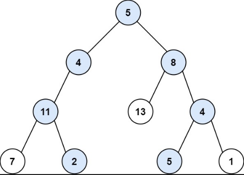
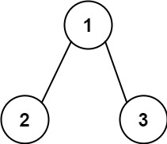
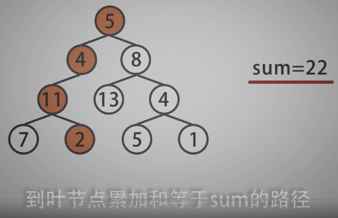
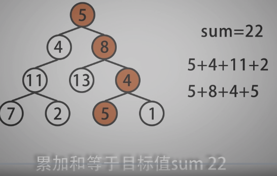
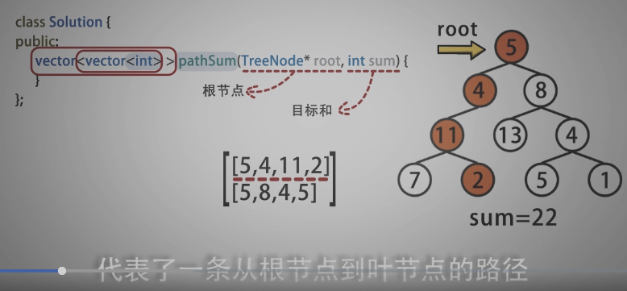
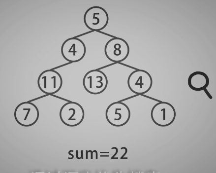
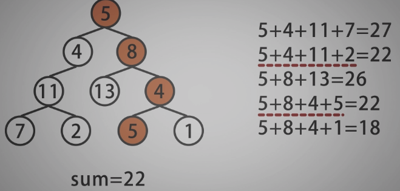
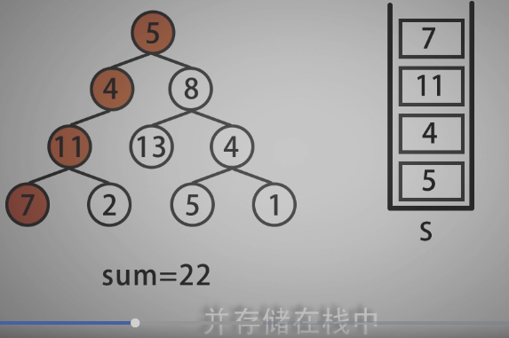
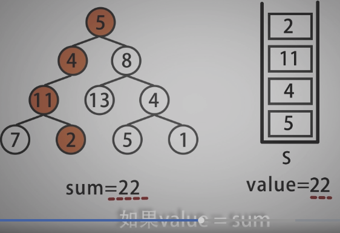

<!--
 * @Date: 2021-12-29 16:38:26
 * @Author: bFeng
-->


路径总和 II  
Category	Difficulty	Likes	Dislikes  
algorithms	Medium (62.79%)	641	-  
Tags  
tree | depth-first-search  

Companies 
bloomberg  

给你二叉树的根节点 root 和一个整数目标和 targetSum ，找出所有 从根节点到叶子节点 路径总和等于给定目标和的路径。  

叶子节点 是指没有子节点的节点。  

 

示例 1：  


输入：root = [5,4,8,11,null,13,4,7,2,null,null,5,1], targetSum = 22  
输出：\[[5,4,11,2],[5,8,4,5]]  


示例 2：  


输入：root = [1,2,3], targetSum = 5  
输出：[]  


示例 3：  

输入：root = [1,2], targetSum = 0  
输出：[]
 

提示：

树中节点总数在范围 [0, 5000] 内  
-1000 <= Node.val <= 1000  
-1000 <= targetSum <= 1000  
Discussion | Solution  

-----------------------------------

- 虽然是二叉树的题目，用到的也是递归的思想




 












---------------------------------

```c

/*
 * @lc app=leetcode.cn id=113 lang=cpp
 *
 * [113] 路径总和 II
 */

// @lc code=start
/**
 * Definition for a binary tree node.
 * struct TreeNode {
 *     int val;
 *     TreeNode *left;
 *     TreeNode *right;
 *     TreeNode() : val(0), left(nullptr), right(nullptr) {}
 *     TreeNode(int x) : val(x), left(nullptr), right(nullptr) {}
 *     TreeNode(int x, TreeNode *left, TreeNode *right) : val(x), left(left), right(right) {}
 * };
 */
 //-----------------自己尝试：未通过-----------------------------
class Solution {
public:
    vector<vector<int>> pathSum(TreeNode* root, int targetSum) {
        std::vector<std::vector<int>> path;
        if(root == nullptr) return path;
        std::stack<int> path_stack;//用栈好像在复制的时候是浅拷贝
        int path_cost = 0;
        DFS(root, path_cost, path_stack, path, targetSum);
        return path;
    }


private:
    void DFS(TreeNode* root,// 节点
             int& path_cost,// 顾名思义
             std::stack<int>& path_stack,// 记录一条path
             std::vector<std::vector<int>>& path,// 总的path
             int& tar){

        path_cost += root->val;
        path_stack.push(root->val);
        if(root->left){
            DFS(root->left, path_cost, path_stack, path, tar);
        }
        if(root->right){
            DFS(root->right, path_cost, path_stack, path, tar);
        }

        if(root->left == nullptr && root->right == nullptr && path_cost == tar){
            std::vector<int> tmp;
            std::stack<int> backup_stack = path_stack;
            while(path_stack.empty()){
                tmp.insert(tmp.begin(), path_stack.top());
                path_stack.pop();
            }
            path.push_back(tmp);
            path_stack = backup_stack;
            return;
        }
        path_cost -= root->val;
        path_stack.pop();
    }
};
// @lc code=end

//-------------参考实现-------------------------

class Solution {
public:
    vector<vector<int>> pathSum(TreeNode* root, int targetSum) {
        std::vector<std::vector<int>> path;
        if(root == nullptr) return path;
        std::vector<int> path_stack;// 模拟栈的操作
        int path_cost = 0;
        DFS(root, path_cost, path_stack, path, targetSum);
        return path;
    }

private:
    void DFS(TreeNode* root,// 当前节点
             int& path_cost,// 顾名思义
             std::vector<int>& path_stack,// 记录一条path
             std::vector<std::vector<int>>& path,// 总的path
             int& tar){// 目标和
        if(!root) return;// 传入的是空指针，说明到底了！
        path_cost += root->val;
        path_stack.push_back(root->val);
        if(root->left == nullptr && root->right == nullptr && path_cost == tar){
            path.push_back(path_stack);
        }

        if(root->left){
            DFS(root->left, path_cost, path_stack, path, tar);
        }
        if(root->right){
            DFS(root->right, path_cost, path_stack, path, tar);
        }

        path_cost -= root->val;// 回溯，恢复
        path_stack.pop_back();
    }
};


```