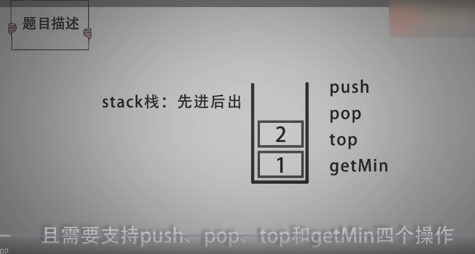
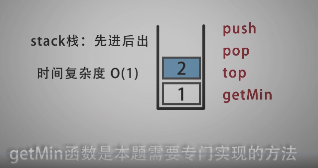
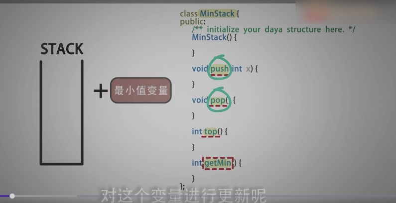
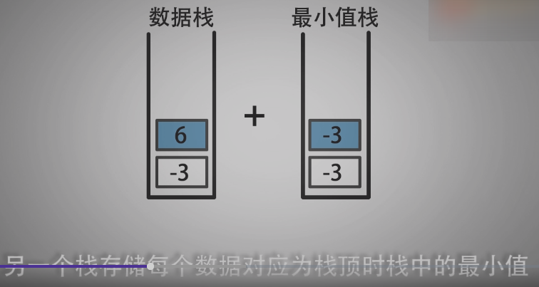

<!--
 * @Date: 2021-12-24 15:39:33
 * @Author: bFeng
-->
最小栈
Category	Difficulty	Likes	Dislikes
algorithms	Easy (57.52%)	1120	-
Tags
Companies
设计一个支持 push ，pop ，top 操作，并能在常数时间内检索到最小元素的栈。

push(x) —— 将元素 x 推入栈中。
pop() —— 删除栈顶的元素。
top() —— 获取栈顶元素。
getMin() —— 检索栈中的最小元素。
 

示例:

输入：
["MinStack","push","push","push","getMin","pop","top","getMin"]
[[],[-2],[0],[-3],[],[],[],[]]

输出：
[null,null,null,null,-3,null,0,-2]

解释：
MinStack minStack = new MinStack();
minStack.push(-2);
minStack.push(0);
minStack.push(-3);
minStack.getMin();   --> 返回 -3.
minStack.pop();
minStack.top();      --> 返回 0.
minStack.getMin();   --> 返回 -2.
 

提示：

pop、top 和 getMin 操作总是在 非空栈 上调用。
Discussion | Solution

-----------------------

- 栈 + 变量 min 进行实现








--------------------




```c
/*
 * @Date: 2021-12-24 15:38:47
 * @Author: bFeng
 */
/*
 * @lc app=leetcode.cn id=155 lang=cpp
 *
 * [155] 最小栈
 */

// @lc code=start
// 栈 + 变量 min_
class MinStack {
public:
    MinStack() {

    }
    
    void push(int val) {
        if(data_.empty()){
            min_ = val;
        }
        if(min_ > val){
            min_ = val;
        }
        data_.push(val);
    }
    
    void pop() {
        if(data_.top() == min_){
            data_.pop();
            std::stack<int> tmp_stack;

            while( !data_.empty() ){ //把剩下的倒出来
                tmp_stack.push( data_.top());
                data_.pop();
            }

            while ( !tmp_stack.empty() ){ //再调用自己的函数，装回去
                this->push(tmp_stack.top());
                tmp_stack.pop();
            }
        }else{
            data_.pop();
        }
    }
    
    int top() {
        return data_.top();
    }
    
    int getMin() {
        return min_;
    }
private:
    std::stack<int> data_;
    int min_ ;
};


// 栈 + 栈 min_
class MinStack {
public:
    MinStack() {

    }
    
    void push(int val) {
        data_.push(val);
        if(!min_.empty() && val > min_.top()){
            val = min_.top();
        }
        min_.push(val);//如果min_为空就直接添加进去
    }
    
    void pop() {
        data_.pop();
        min_.pop();
    }
    
    int top() {
        return data_.top();
    }
    
    int getMin() {
        return min_.top();
    }
private:
    std::stack<int> data_;
    std::stack<int> min_;
};


/**
 * Your MinStack object will be instantiated and called as such:
 * MinStack* obj = new MinStack();
 * obj->push(val);
 * obj->pop();
 * int param_3 = obj->top();
 * int param_4 = obj->getMin();
 */
// @lc code=end


```