<!--
 * @Date: 2021-12-24 11:17:32
 * @Author: bFeng
-->
用栈实现队列
Category	Difficulty	Likes	Dislikes
algorithms	Easy (68.97%)	523	-
Tags
Companies
请你仅使用两个栈实现先入先出队列。队列应当支持一般队列支持的所有操作（push、pop、peek、empty）：

实现 MyQueue 类：

void push(int x) 将元素 x 推到队列的末尾
int pop() 从队列的开头移除并返回元素
int peek() 返回队列开头的元素
boolean empty() 如果队列为空，返回 true ；否则，返回 false
 

说明：

你只能使用标准的栈操作 —— 也就是只有 push to top, peek/pop from top, size, 和 is empty 操作是合法的。
你所使用的语言也许不支持栈。你可以使用 list 或者 deque（双端队列）来模拟一个栈，只要是标准的栈操作即可。
 

进阶：

你能否实现每个操作均摊时间复杂度为 O(1) 的队列？换句话说，执行 n 个操作的总时间复杂度为 O(n) ，即使其中一个操作可能花费较长时间。
 

示例：

输入：
["MyQueue", "push", "push", "peek", "pop", "empty"]
[[], [1], [2], [], [], []]
输出：
[null, null, null, 1, 1, false]

解释：
MyQueue myQueue = new MyQueue();
myQueue.push(1); // queue is: [1]
myQueue.push(2); // queue is: [1, 2] (leftmost is front of the queue)
myQueue.peek(); // return 1
myQueue.pop(); // return 1, queue is [2]
myQueue.empty(); // return false
 

提示：

1 <= x <= 9
最多调用 100 次 push、pop、peek 和 empty
假设所有操作都是有效的 （例如，一个空的队列不会调用 pop 或者 peek 操作）
Discussion | Solution

Code Now


- 临时栈法

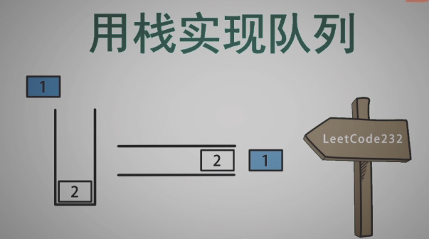

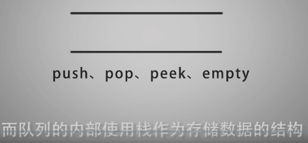

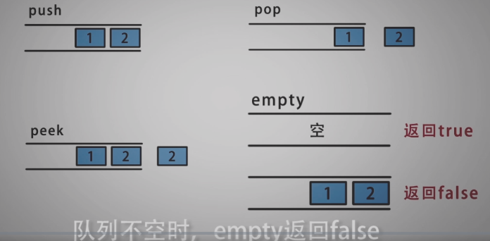

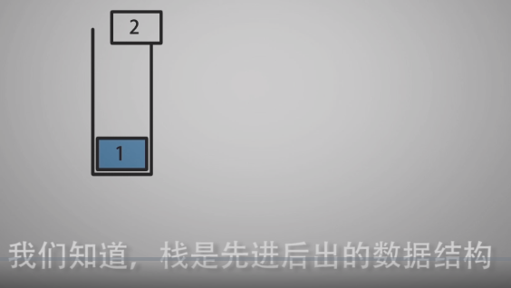

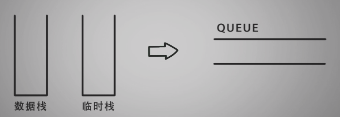

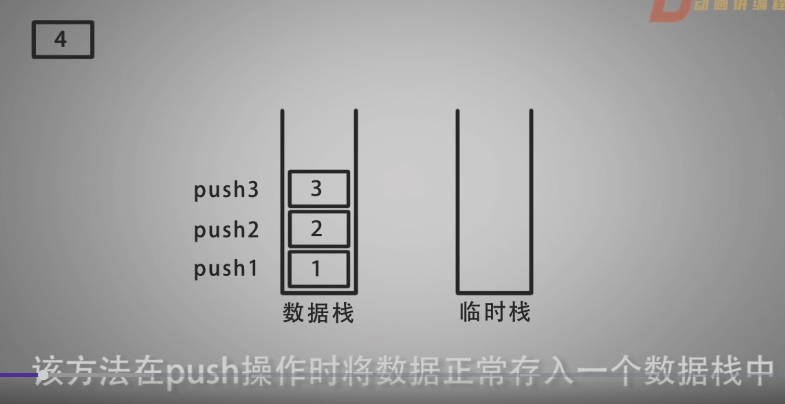

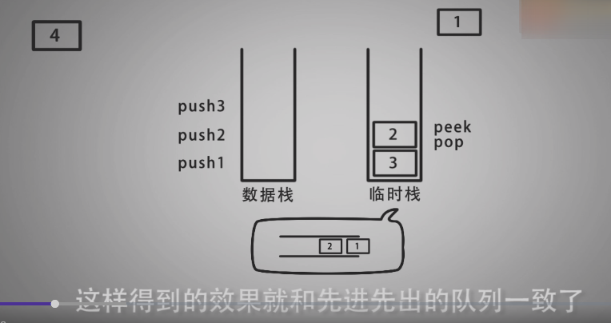

------------------------------------

- 双栈法


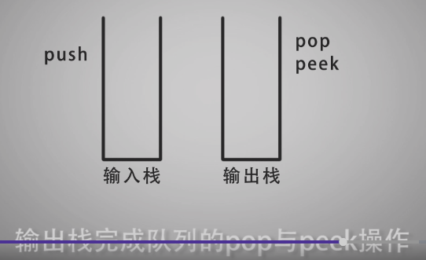

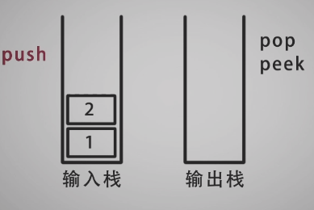

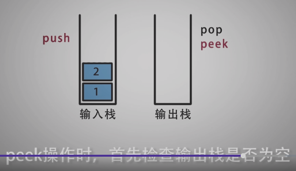

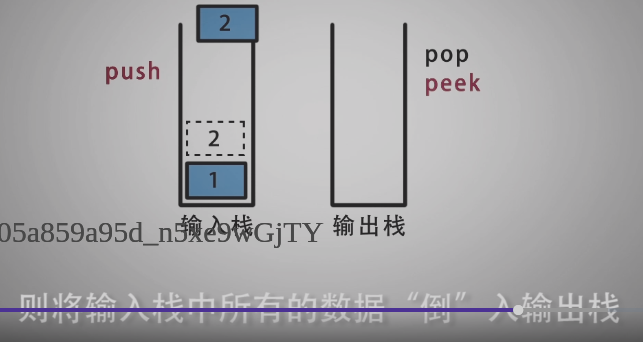


```c
/*
 * @Date: 2021-12-24 11:17:48
 * @Author: bFeng
 */
/*
 * @lc app=leetcode.cn id=232 lang=cpp
 *
 * [232] 用栈实现队列
 */

// @lc code=start
//  method 1: 临时栈法
class MyQueue {
public:
    MyQueue() {
        // data_stack_.clear();
        // tmp_stack_.clear();
    }
    
    void push(int x) {
        data_stack_.push(x);
    }
    
    int pop() {
        // 照理来说应该判断一下
        // if(data_stack_.empty()){
        //     return ;
        // }

        int res;
        while(!data_stack_.empty()){
            tmp_stack_.push( data_stack_.top() );//top只读
            data_stack_.pop();//pop只出
        }

        res = tmp_stack_.top();
        tmp_stack_.pop();

        while(!tmp_stack_.empty()){
            data_stack_.push( tmp_stack_.top() );
            tmp_stack_.pop();
        }
        return res;
    }
    
    int peek() {
        // if(data_stack_.empty()){
        //     return ;
        // }

        int res;
        while(!data_stack_.empty()){
            tmp_stack_.push( data_stack_.top() );
            data_stack_.pop();
        }

        res = tmp_stack_.top();

        while(!tmp_stack_.empty()){
            data_stack_.push( tmp_stack_.top() );
            tmp_stack_.pop();
        }
        return res;
    }
    
    bool empty() {
        return data_stack_.empty();
    }
private:
    std::stack<int> data_stack_;
    std::stack<int> tmp_stack_;
};

/**
 * Your MyQueue object will be instantiated and called as such:
 * MyQueue* obj = new MyQueue();
 * obj->push(x);
 * int param_2 = obj->pop();
 * int param_3 = obj->peek();
 * bool param_4 = obj->empty();
 */
// @lc code=end


```