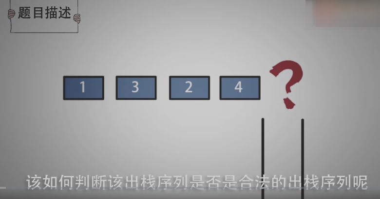
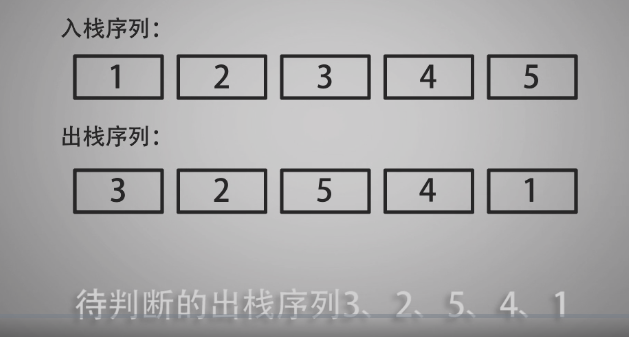
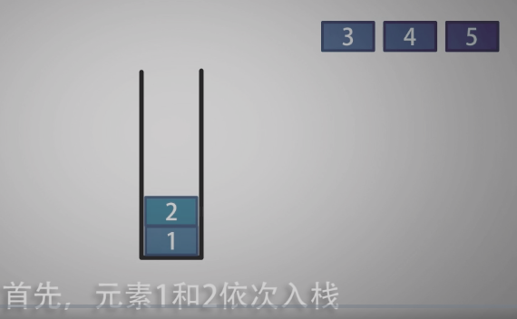
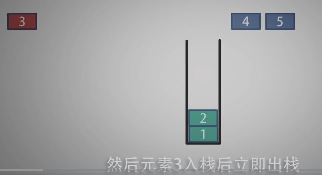
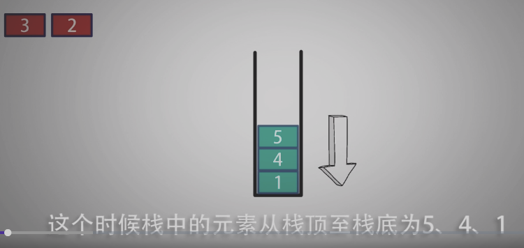
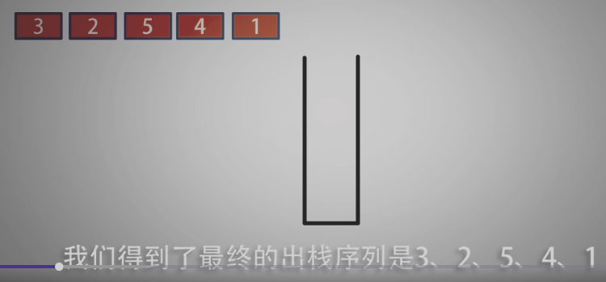
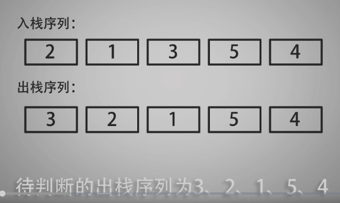
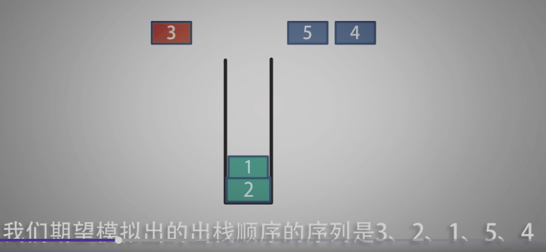
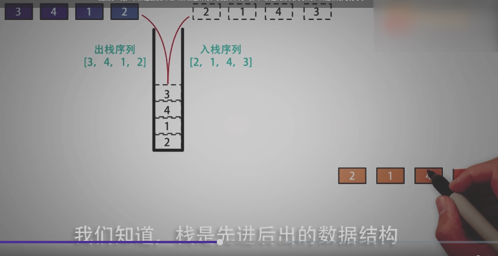
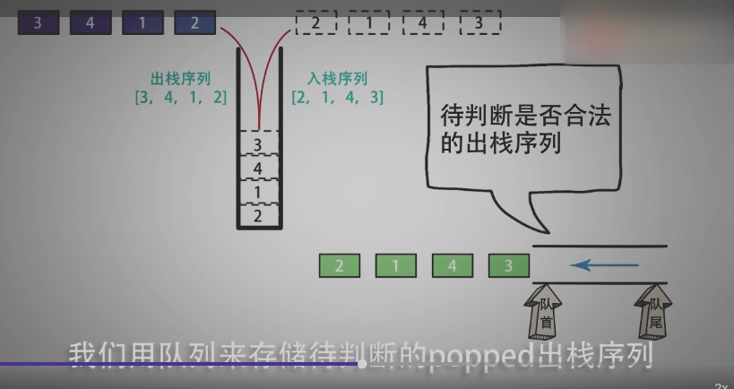

<!--
 * @Date: 2021-12-24 23:56:09
 * @Author: bFeng
-->
验证栈序列
Category	Difficulty	Likes	Dislikes
algorithms	Medium (62.78%)	213	-
Tags
Companies
给定 pushed 和 popped 两个序列，每个序列中的 值都不重复，只有当它们可能是在最初空栈上进行的推入 push 和弹出 pop 操作序列的结果时，返回 true；否则，返回 false 。

 

示例 1：

输入：pushed = [1,2,3,4,5], popped = [4,5,3,2,1]
输出：true
解释：我们可以按以下顺序执行：
push(1), push(2), push(3), push(4), pop() -> 4,
push(5), pop() -> 5, pop() -> 3, pop() -> 2, pop() -> 1
示例 2：

输入：pushed = [1,2,3,4,5], popped = [4,3,5,1,2]
输出：false
解释：1 不能在 2 之前弹出。
 

提示：

1 <= pushed.length <= 1000
0 <= pushed[i] <= 1000
pushed 的所有元素 互不相同
popped.length == pushed.length
popped 是 pushed 的一个排列
Discussion | Solution

--------------------------------


- 栈 +  队列  进行解题






























-----------------------
```c
/*
 * @Date: 2021-12-24 23:55:17
 * @Author: bFeng
 */
/*
 * @lc app=leetcode.cn id=946 lang=cpp
 *
 * [946] 验证栈序列
 */

// @lc code=start
class Solution {
public:
    bool validateStackSequences(vector<int>& pushed, vector<int>& popped) {
        std::stack<int> data_stack;
        std::queue<int> data_queue;

        for(const auto& itr : popped){
            data_queue.push(itr);
        }

        for(auto& itr : pushed){
            data_stack.push(itr);
            // 特别注意 pop之前一定要判断是否为空 不然会段错误
            while(!data_stack.empty()&&!data_queue.empty() &&data_queue.front() == data_stack.top()){
                data_stack.pop();
                data_queue.pop();
            }
        }

        if( data_queue.empty() && data_stack.empty() ){
            return true;
        }
        return false;

    }
};
// @lc code=end


```