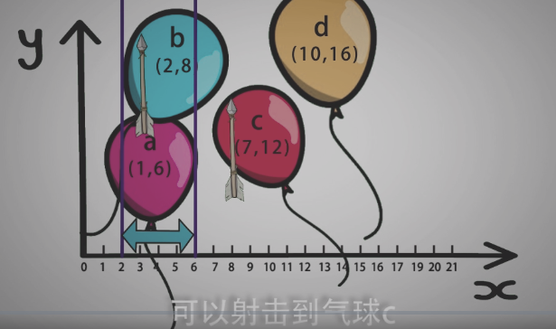
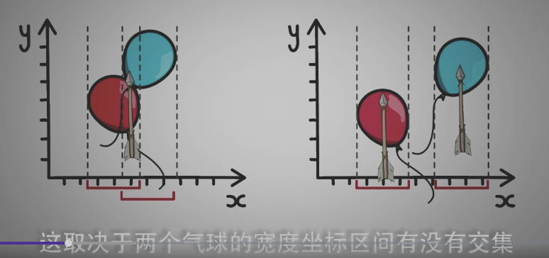
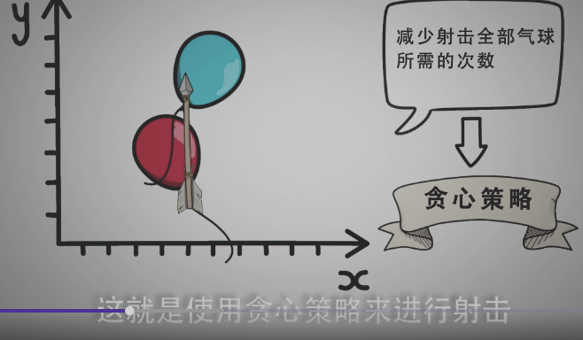
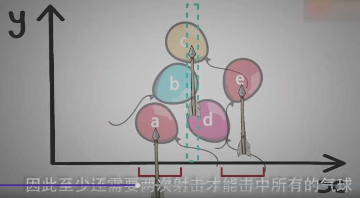
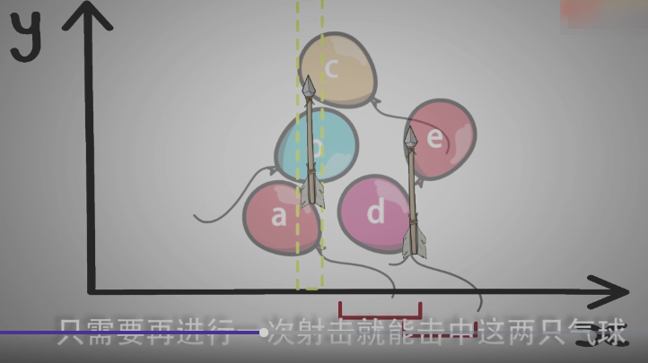
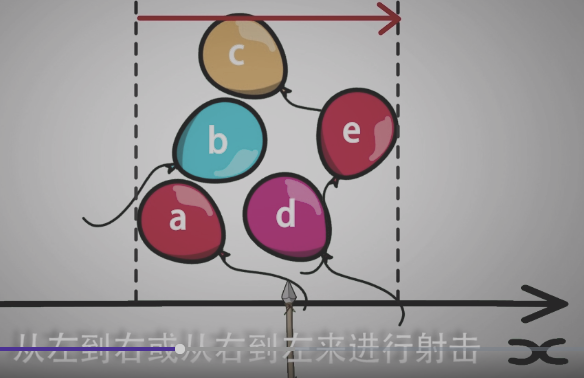
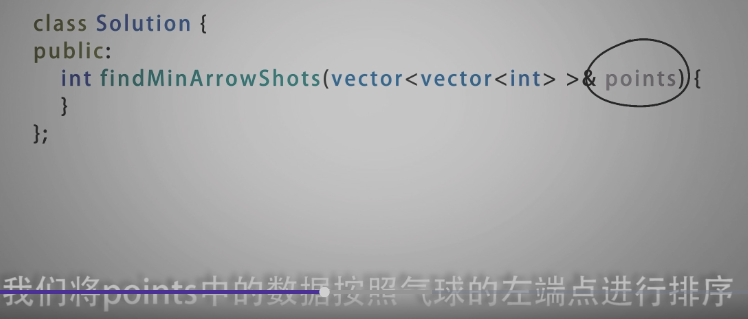
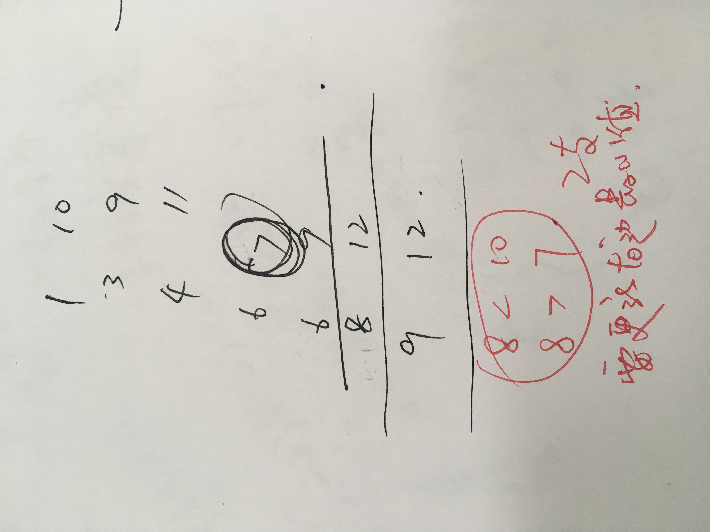
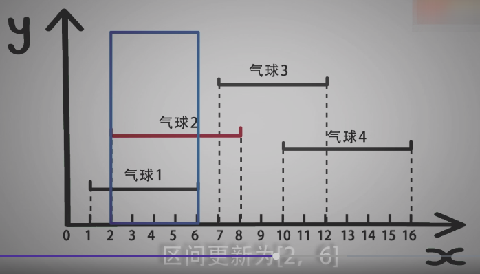

<!--
 * @Date: 2021-12-27 00:05:04
 * @Author: bFeng
-->
用最少数量的箭引爆气球
Category	Difficulty	Likes	Dislikes
algorithms	Medium (50.78%)	496	-
Tags
Companies
在二维空间中有许多球形的气球。对于每个气球，提供的输入是水平方向上，气球直径的开始和结束坐标。由于它是水平的，所以纵坐标并不重要，因此只要知道开始和结束的横坐标就足够了。开始坐标总是小于结束坐标。

一支弓箭可以沿着 x 轴从不同点完全垂直地射出。在坐标 x 处射出一支箭，若有一个气球的直径的开始和结束坐标为 xstart，xend， 且满足  xstart ≤ x ≤ xend，则该气球会被引爆。可以射出的弓箭的数量没有限制。 弓箭一旦被射出之后，可以无限地前进。我们想找到使得所有气球全部被引爆，所需的弓箭的最小数量。

给你一个数组 points ，其中 points [i] = [xstart,xend] ，返回引爆所有气球所必须射出的最小弓箭数。

 
示例 1：

输入：points = [[10,16],[2,8],[1,6],[7,12]]
输出：2
解释：对于该样例，x = 6 可以射爆 [2,8],[1,6] 两个气球，以及 x = 11 射爆另外两个气球
示例 2：

输入：points = [[1,2],[3,4],[5,6],[7,8]]
输出：4
示例 3：

输入：points = [[1,2],[2,3],[3,4],[4,5]]
输出：2
示例 4：

输入：points = [[1,2]]
输出：1
示例 5：

输入：points = [[2,3],[2,3]]
输出：1
 

提示：

1 <= points.length <= 104
points[i].length == 2
-231 <= xstart < xend <= 231 - 1
Discussion | Solution

----------------------------------




















```c
/*
 * @Date: 2021-12-27 00:04:33
 * @Author: bFeng
 */
/*
 * @lc app=leetcode.cn id=452 lang=cpp
 *
 * [452] 用最少数量的箭引爆气球
 */

// @lc code=start

// 按左端点进行排序
class Solution {
public:
    int findMinArrowShots(vector<vector<int>>& points) {
        if(points.empty()) return 0;
        // 排序时需要注意，右坐标相等的情况
        sort(points.begin(), points.end(), [&](const auto& a, const auto& b){
            if(a[0] == b[0]){
                return a[1] < b[1];
            }
            return a[0] < b[0];
        });

        std::vector<int> left;
        std::vector<int> right;
        for(const auto& itr : points){
            left.push_back(itr[0]);
            right.push_back(itr[1]);
        }

        int left_idx = 0;
        int right_idx = 0;
        int res = 1;//由于最后跳出while循环的那个区间统计不到，所以从1开始
        int min_right = right[right_idx];
        while(left_idx<points.size() && right_idx<points.size()){
            if(min_right > right[right_idx]){//注意是和右边最小的那个值比较，想象一下，公有部分
                min_right = right[right_idx];
            }
            // if(left[left_idx] <= right[right_idx]){
            if(left[left_idx] <= min_right){//小于这个区间段的最小值
                left_idx ++;
                right_idx ++;
                continue;
            }
            res ++;
            min_right = right[right_idx];//新的一个区间段，注意更新min_right
        }
        return res;
    }
};
// @lc code=end


// 通过维护射击区间进行计算
class Solution {
public:
    int findMinArrowShots(std::vector<std::vector<int>>& points) {
        if(points.empty()) return 0;
        // 排序时需要注意，右坐标相等的情况
        sort(points.begin(), points.end(), [&](const auto& a, const auto& b){
            if(a[0] == b[0]){
                return a[1] < b[1];
            }
            return a[0] < b[0];
        });

        // 维护射击的范围，夹在中间
        int shoot_range[2] = {points[0][0], points[0][1]};

        int res = 1;
        for(const auto& pt : points ){
            if(pt[0] > shoot_range[0]){//更新射击范围左边界
                shoot_range[0] = pt[0];
            }
            if(pt[1] < shoot_range[1]){//更新射击范围右边界
                shoot_range[1] = pt[1];
            }
            if(shoot_range[0] <= shoot_range[1]){//判断射击范围是否合法
                continue;
            }
            res ++;
            shoot_range[0] = pt[0];//重启射击范围
            shoot_range[1] = pt[1];
        }
        return res;
    }

};


```