<!--
 * @Date: 2021-12-28 11:21:35
 * @Author: bFeng
-->
子集
Category	Difficulty	Likes	Dislikes
algorithms	Medium (80.22%)	1428	-
Tags
Companies
给你一个整数数组 nums ，数组中的元素 互不相同 。返回该数组所有可能的子集（幂集）。

解集 不能 包含重复的子集。你可以按 任意顺序 返回解集。

 

示例 1：

输入：nums = [1,2,3]
输出：[[],[1],[2],[1,2],[3],[1,3],[2,3],[1,2,3]]
示例 2：

输入：nums = [0]
输出：[[],[0]]
 

提示：

1 <= nums.length <= 10
-10 <= nums[i] <= 10
nums 中的所有元素 互不相同
Discussion | Solution

------------------------------

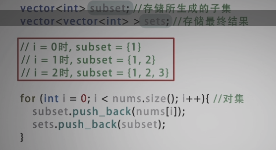

- 循环算法： 例如集合 [1,2,3]，他的子集可以通过是否选 [1] ，是否选 [2]， 是否选 [3] 进行产生。三个不同元素组成的集合有 $2^3 = 8$  种可能。 $n$ 各元素则有 $2^n$ 个子集。


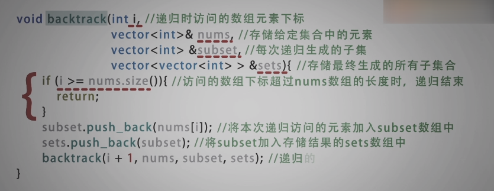

- 递归算法：和循环算法一样，只能生成 [1], [1,2], [1,2,3]


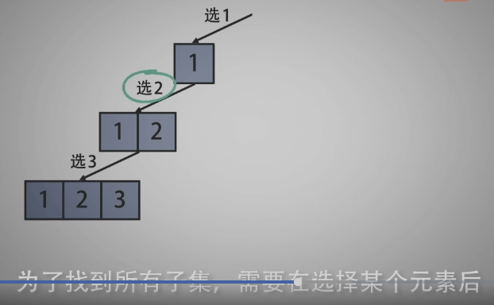

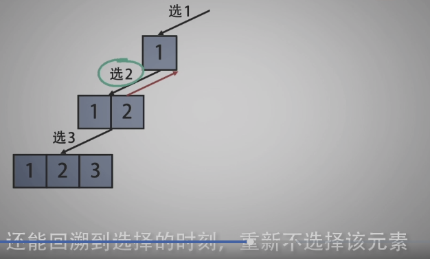

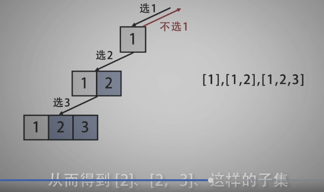

- 回溯算法：生成全部子集

---------------------------------------------

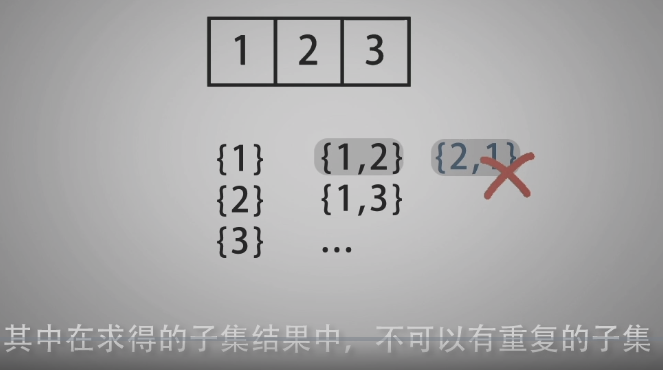

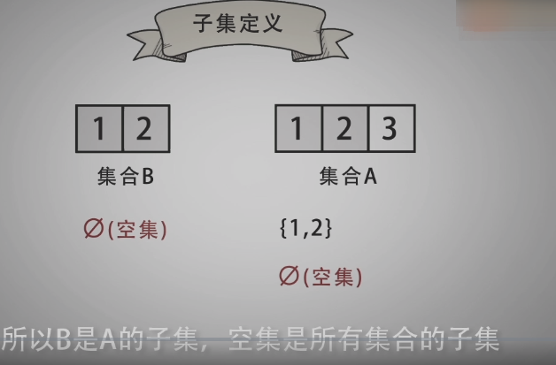

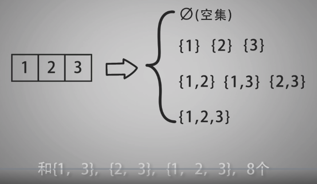

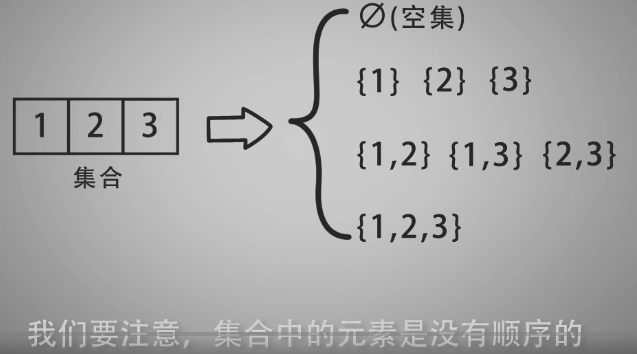

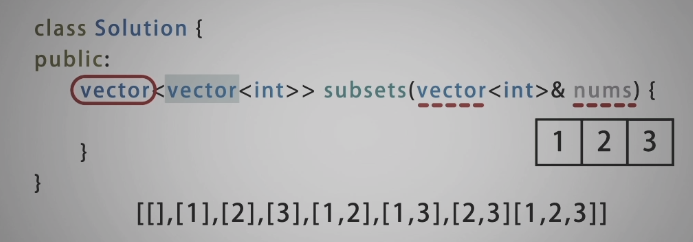

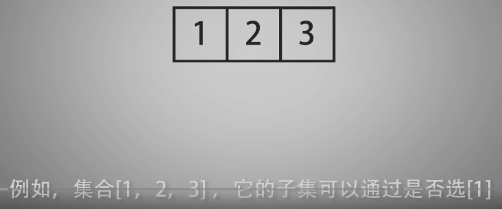

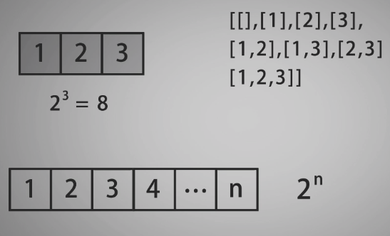

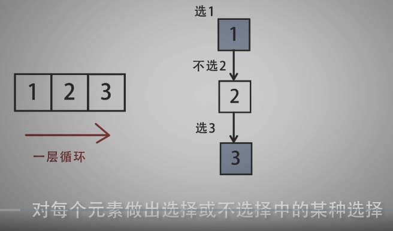

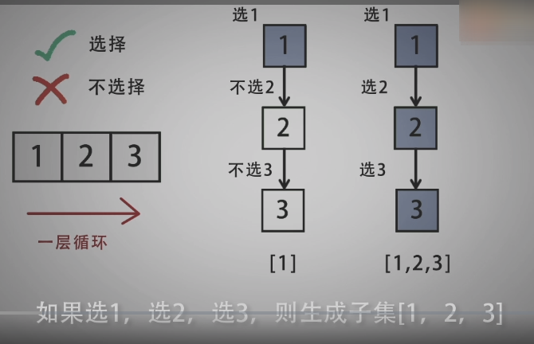

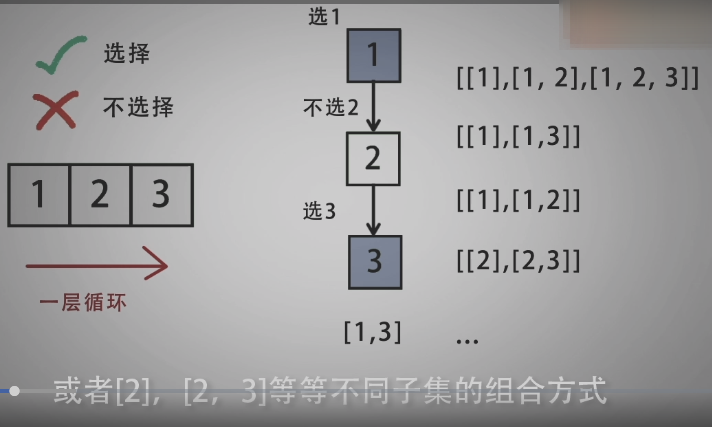

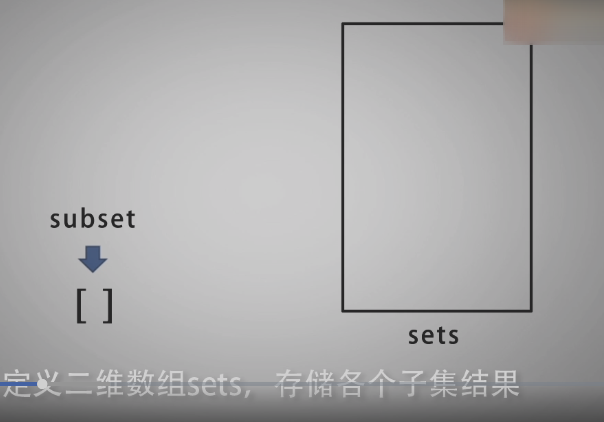

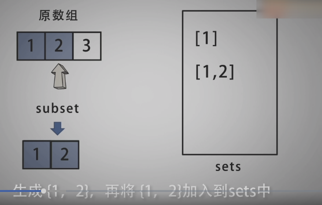

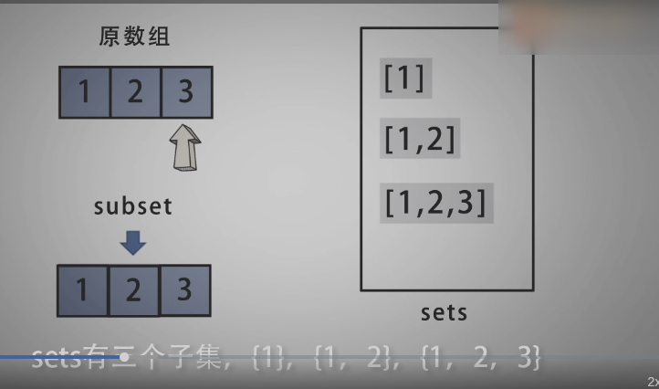

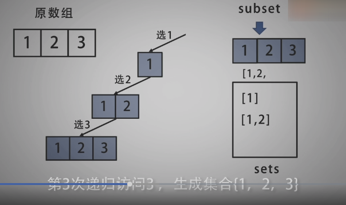


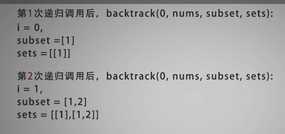


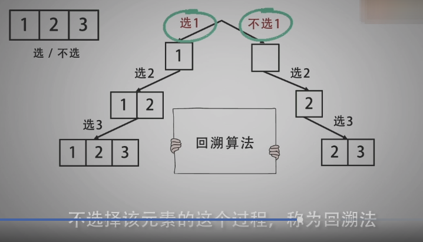

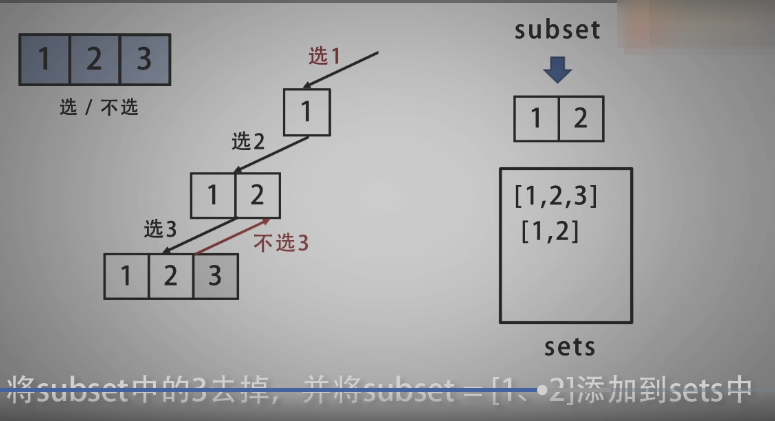

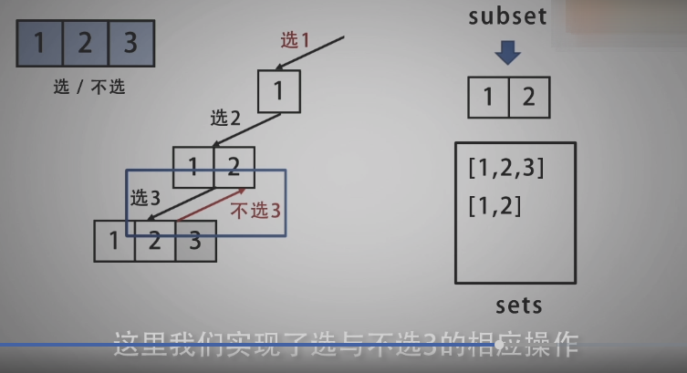

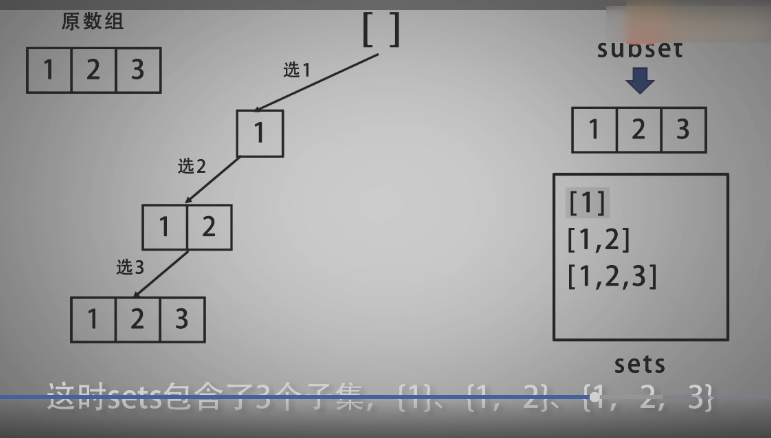

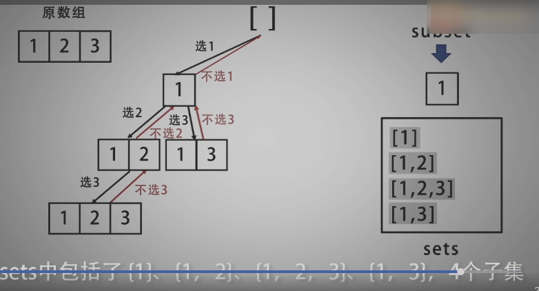

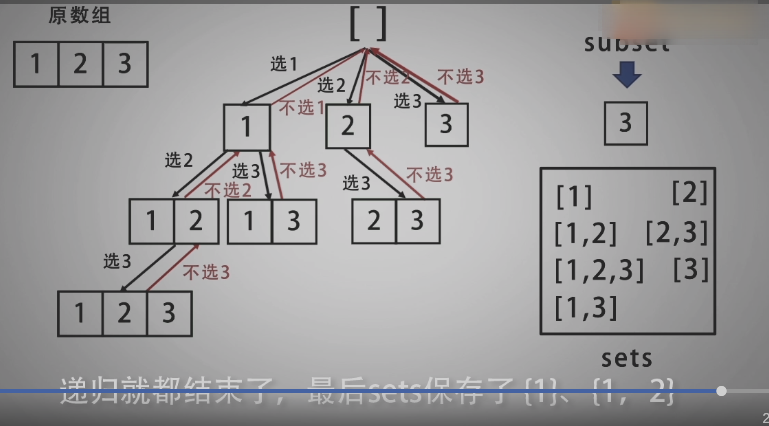

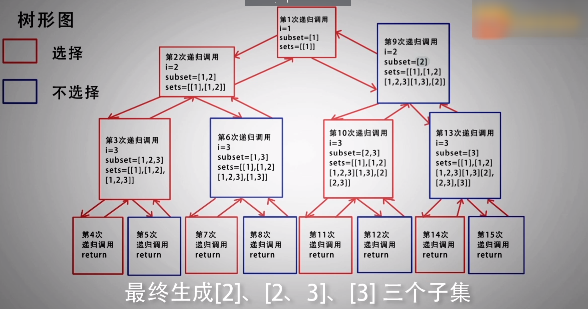

------------------------------------

```c
/*
 * @Date: 2021-12-28 11:50:53
 * @Author: bFeng
 */
/*
 * @lc app=leetcode.cn id=78 lang=cpp
 *
 * [78] 子集
 */
//  
// @lc code=start
class Solution {
public:
    vector<vector<int>> subsets(vector<int>& nums) {
        std::vector<int> subset;
        std::vector<std::vector<int>> set;
        set.push_back(subset);// 空集情况
        backtrack(0, nums, subset, set);//回溯算法
        return set;
    }
private:
    void backtrack(int i,
                   std::vector<int>& nums,
                   std::vector<int>& subset,
                   std::vector<std::vector<int>>& set){
        if(i >= nums.size()) return;// 递归结束
        // 选择第 i 个元素的情况下，进行后面元素的递归选择
        subset.push_back(nums[i]);// 理解：这里是推入的一个数
        set.push_back(subset);
        backtrack(i+1, nums, subset, set);//递归
        // 第一次递归回溯到这里后，再次进行操作
        // 取消选择第 i 个元素，再次进行递归
        subset.pop_back(); // 从subset中剔除第 i 个元素的选择
        backtrack(i+1, nums, subset, set);
    }
};
// @lc code=end


```