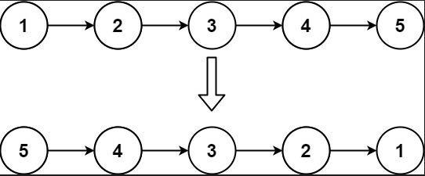
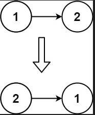
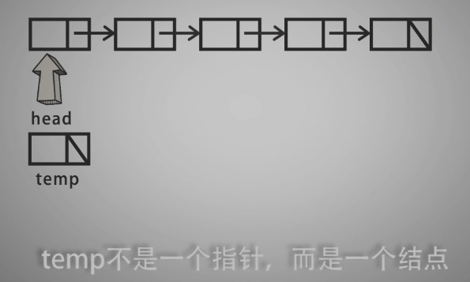
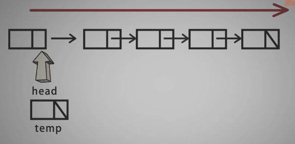
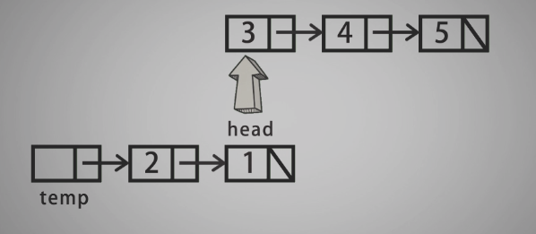
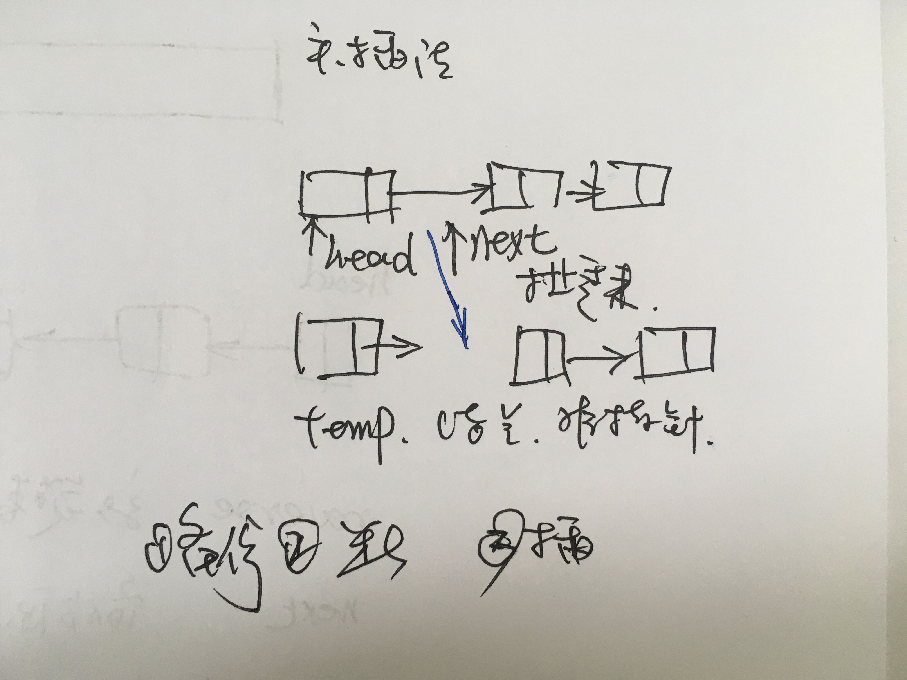
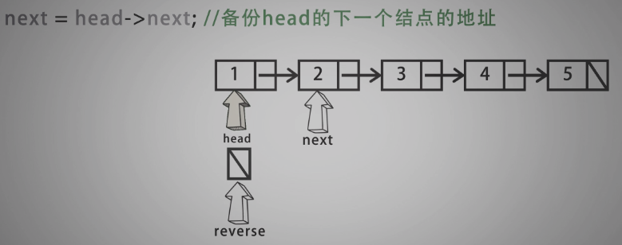
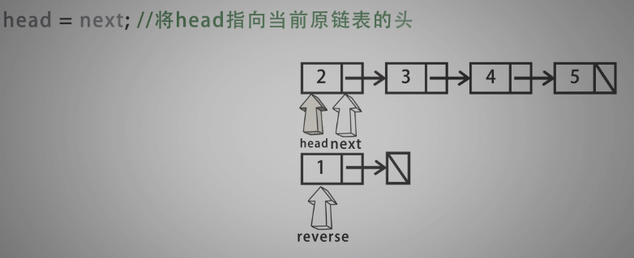
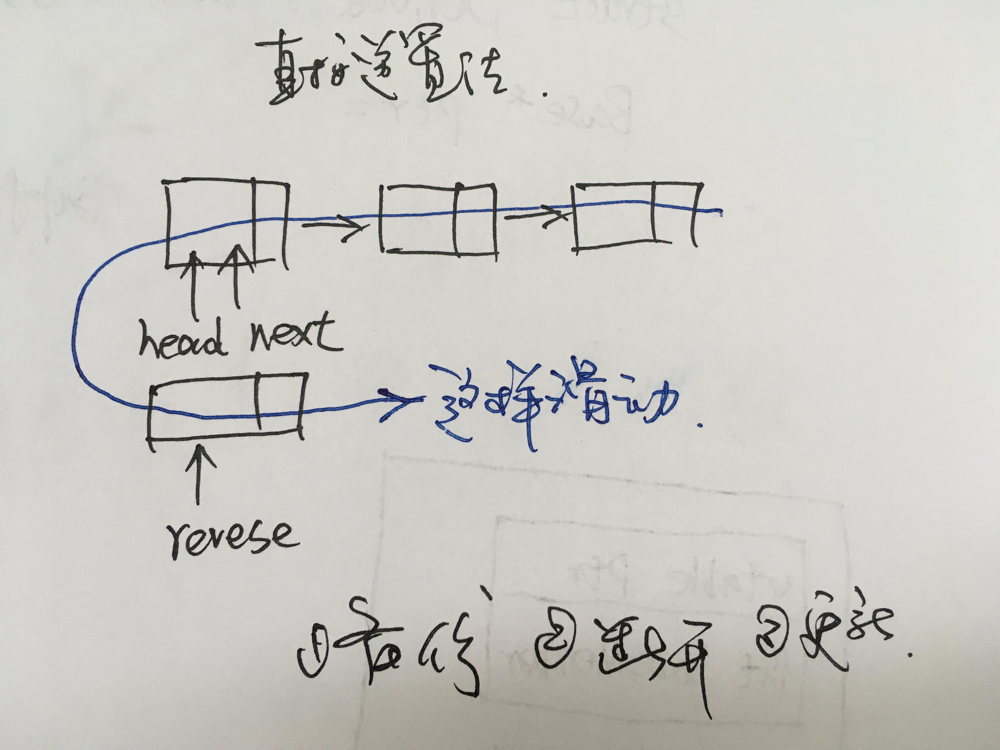

# 206-链表逆序

给你单链表的头节点 head ，请你反转链表，并返回反转后的链表。
 

示例 1：



输入：head = [1,2,3,4,5]
输出：[5,4,3,2,1]
示例 2：




输入：head = [1,2]
输出：[2,1]
示例 3：

输入：head = []
输出：[]
 

提示：

链表中节点的数目范围是 [0, 5000]
-5000 <= Node.val <= 5000


- 头插法


  


  








- 直接逆序法











```c
/*
 * @Date: 2021-12-22 09:59:14
 * @Author: bFeng
 */
/*
 * @lc app=leetcode.cn id=206 lang=cpp
 *
 * [206] 反转链表
 */

// @lc code=start
/**
 * Definition for singly-linked list.
 * struct ListNode {
 *     int val;
 *     ListNode *next;
 *     ListNode() : val(0), next(nullptr) {}
 *     ListNode(int x) : val(x), next(nullptr) {}
 *     ListNode(int x, ListNode *next) : val(x), next(next) {}
 * };
 */

class Solution {
public:
    ListNode* reverseList(ListNode* head) {//直接逆序法
        if(head == nullptr){
            return nullptr;
        }
        ListNode* reverse = nullptr;
        ListNode* next = nullptr;
        while(head != nullptr){
            next = head->next;
            head->next = reverse;
            reverse = head;
            head = next;
        }
        return reverse;
    }
};


class Solution {
public:
    ListNode* reverseList(ListNode* head) {//头插法
        if(head == nullptr){
            return nullptr;
        }
        ListNode tmp = ListNode();
        ListNode* next = nullptr;
        while(head != nullptr){
            next = head->next;
            head->next = tmp.next;
            tmp.next = head;
            head = next;
        }
        return tmp.next;//注意返回的是next
    }
};
// @lc code=end


```
