<!--
 * @Date: 2021-12-22 19:09:20
 * @Author: bFeng
-->
分隔链表
Category	Difficulty	Likes	Dislikes
algorithms	Medium (63.25%)	498	-
Tags
Companies
给你一个链表的头节点 head 和一个特定值 x ，请你对链表进行分隔，使得所有 小于 x 的节点都出现在 大于或等于 x 的节点之前。

你应当 保留 两个分区中每个节点的初始相对位置。

 

示例 1：


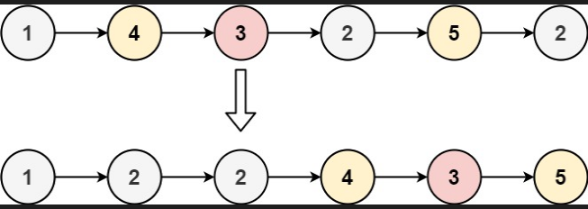

输入：head = [1,4,3,2,5,2], x = 3
输出：[1,2,2,4,3,5]
示例 2：

输入：head = [2,1], x = 2
输出：[1,2]
 

提示：

链表中节点的数目在范围 [0, 200] 内
-100 <= Node.val <= 100
-200 <= x <= 200
Discussion | Solution

Code Now


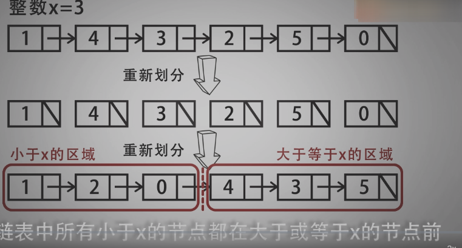


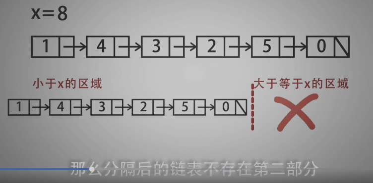


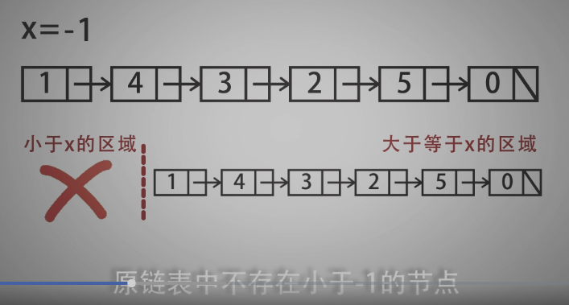


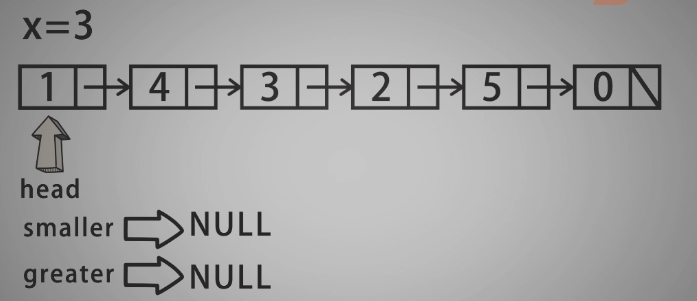


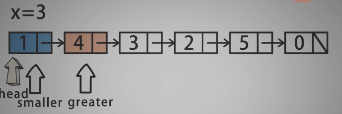


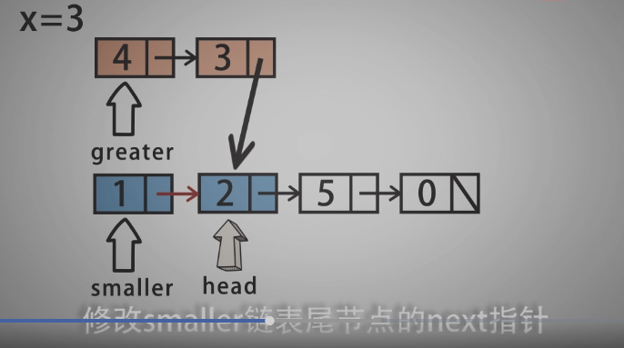


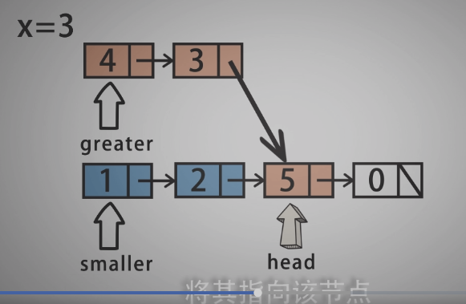


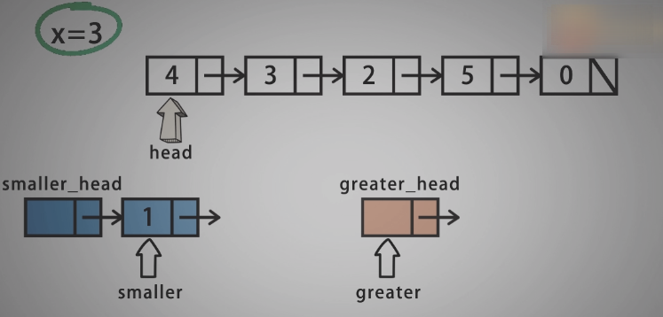


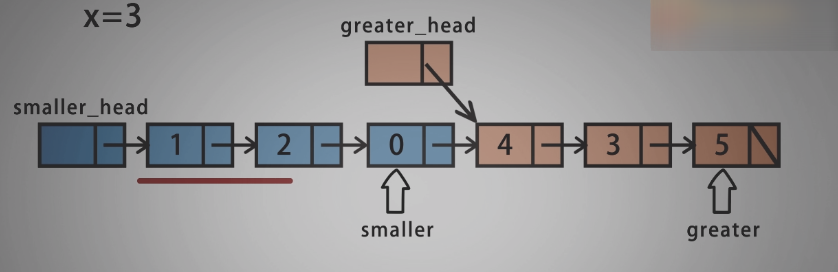


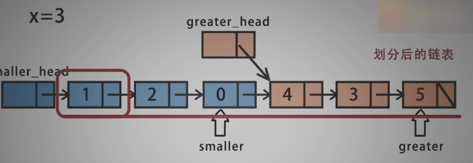


```c

/*
 * @lc app=leetcode.cn id=86 lang=cpp
 *
 * [86] 分隔链表
 */

// @lc code=start
/**
 * Definition for singly-linked list.
 * struct ListNode {
 *     int val;
 *     ListNode *next;
 *     ListNode() : val(0), next(nullptr) {}
 *     ListNode(int x) : val(x), next(nullptr) {}
 *     ListNode(int x, ListNode *next) : val(x), next(next) {}
 * };
 */
class Solution {
public: //[1,4,3,2,5,2]
    ListNode* partition(ListNode* head, int x) {
        ListNode smaller = ListNode();
        ListNode greater = ListNode();
        ListNode* st = &smaller;
        ListNode* gt = &greater;

        while(head){
            // 为什么非得备份？
            ListNode* backup = head->next;
            if(head->val < x){
                st->next = head;
                st = st->next;
                // head = head->next;
            }else{
                gt->next = head;
                gt = gt->next;
                // head = head->next;
            }
            head->next = nullptr;
            head = backup;
        }
        st->next = greater.next;
        return smaller.next;
    }
};


class Solution {
public: //[1,4,3,2,5,2]
    ListNode* partition(ListNode* head, int x) {
        ListNode smaller = ListNode();
        ListNode greater = ListNode();
        ListNode* st = &smaller;
        ListNode* gt = &greater;

        while(head){
            // 为什么非得备份？
            // ListNode* backup = head->next;
            if(head->val < x){
                st->next = head;
                st = st->next;
                head = head->next;
            }else{
                gt->next = head;
                gt = gt->next;
                head = head->next;
            }
            // head->next = nullptr;
            // head = backup;
        }
        gt->next = nullptr;//如果不考虑备份的方式，则需要注意最后一个节点的next要置空
        st->next = greater.next;
        return smaller.next;
    }
};

```